<!--

author:   André Dietrich
email:    LiaScript@web.de
date:     06/03/2025
version:  30.0.1
language: en
narrator: UK English Female

repository: https://github.com/LiaScript/docs

logo:     img/logo.png

comment:  This document shall provide an entire compendium and course on the
          development of Open-courSes with [LiaScript](https://LiaScript.github.io).
          As the language and the systems grows, also this document will be updated.
          Feel free to fork or copy it, translations are very welcome...

script:   https://cdn.jsdelivr.net/chartist.js/latest/chartist.min.js
          https://felixhao28.github.io/JSCPP/dist/JSCPP.es5.min.js

link:     https://cdn.jsdelivr.net/chartist.js/latest/chartist.min.css

link:     https://cdnjs.cloudflare.com/ajax/libs/animate.css/4.1.1/animate.min.css

import:   https://raw.githubusercontent.com/liaTemplates/ABCjs/main/README.md

link:     https://fonts.googleapis.com/css2?family=Noto+Sans+Egyptian+Hieroglyphs
          https://fonts.googleapis.com/css2?family=Noto+Sans+Ogham

font:     Noto Sans Egyptian Hieroglyphs, Noto Sans Ogham
-->


# LiaScript


> To see this document as an interactive LiaScript rendered version, click on the
> following link/badge:
>
> [](https://liascript.github.io/course/?https://raw.githubusercontent.com/liaScript/docs/master/README.md)
>
> If you need help, feel free to ask us any questions in the chat:
>
> [](https://gitter.im/LiaScript/community?utm_source=badge&utm_medium=badge&utm_campaign=pr-badge)


                            --{{0}}--
With LiaScript, we tried to implement an extended
[Markdown](https://en.wikipedia.org/wiki/Markdown) format that should enable
everyone to create, share, adapt, translate or correct online courses without
the need of being a web-developer. We believe that a language-based approach,
instead of a tooling-centered one, provides more flexibility, freedom of
creativity, and sustainability. Therefore we tried to develop a simplistic syntax
that extends the static Markdown with quizzes, animations, spoken text,
automated visualization [ASCII-art](https://en.wikipedia.org/wiki/ASCII_art) and
much more. Everything has been woven around Markdown, so that the content can
still be read and interpreted with any kind of editor or Markdown-interpreter.


**What is LiaScript?**

* a Markdown dialect for interactive courses and data-driven publishing,
* everything is implemented in Elm/JavaScript and runs directly within the
  browser (online),
* the interpreter itself is also a reader, which allows for storing documents as
  well as the progress,
* courses can also be taken offline, since the interpreter is also a progressive
  web app (PWA), that allows to store documents and progress directly within
  the browser (locally),
* everything is private, we do not store any data about the courses nor the
  users and their progress


                            --{{1}}--
There are a couple of problems that we currently see in the creation of
[Open educational resources (OER)](https://en.wikipedia.org/wiki/Open_educational_resources).
One of them is isolation, that means people, who want to create content, are
seldom connected via the applied technologies, instead, they are separated by
platforms, authoring tools and used core technologies (programming languages).
Furthermore, it is not possible to simply grab an educational website/project
and to adapt its content for another audience. Additionally, it seems to be
nearly impossible for people without a technical background to simply set up a
small course. Thus, they stuck with Word, PowerPoint, and PDF, since they
provide a simple continuation of the static formats people have used before the
computer-era.
"_If I want to publish content for the computer, I want my audience to dive in, experiment, simulate, play with the content... but not only read._"

                              {{1}}
********************************************************************************

**Goals**

* Simplicity: with a human-centered markup-language, anyone should be enabled to
  create and modify content.
* Interactive: the browser is the next operating systems and although content
  with LiaScript is developed within a "static" markup-language it should not be
  presented that way.
* Extendability: everything that is not part of LiaScript shall be embeddable
  and importable.
* Durability: platforms go down, the development of proprietary software/formats
  is discontinued, but LiaScript is not hosted on one platform (it can be
  hosted everywhere) and even without the LiaScript interpreter the content is
  still readable and interpretable with every editor; you could even print or
  engrave it on stone or clay. Furthermore, if you use some kind of versioning
  system (e.g. [git](https://en.wikipedia.org/wiki/Git)) you can refer to any
  previous version of your course.

********************************************************************************

                           --{{2}}--
Imagine a world where everyone would have the same access to high quality
educational content for free. Imagine all kind of schoolbooks, technical or
scientific literature could become open-courSe projects and more interactive,
with collaborating teachers and students. Everything that is required is a
simple text-editor and a web-browser.

                             {{2}}


## Tools

                           --{{0}}--
As already mentioned all you need to work with LiaScript is an text-editor, but
it can be useful to apply one of the following tools. At least we apply them to
see the result of a change within the course document immediately. You will see,
that the development of online-courses will speed up, especially if there is no
need for memorizing complex point and click sequences.

> "_Let the editor be your canvas and the keyboard your brush._"

### Editing


                           --{{0}}--
There are currently 2 plugins for the [Atom Editor](https://atom.io) and
[Visual-Studio-Code](https://code.visualstudio.com/Download) available, which
are intended to ease and simplify the development of online courses with
LiaScript. Additionally you can use the LiveEditor, an entirely browser based application.


0. [LiveEditor](https://liascript.github.io/LiveEditor): Fully functional online editor, that looks like CodiMD, but is entirely browser based. With support for uploading images and videos and collaborative editing.

1. [Atom](https://atom.io): This is the free and open and official
   [GitHub](https://github.com) editor, with lots of plugins for various use
   cases.

   1. [liascript-preview](https://github.com/andre-dietrich/liascript-preview):
      Is a tiny previewer that, if it was toggled ( `Alt+L` ), updates the view
      on your course each time you save your document.
   2. [liascript-snippets](https://github.com/andre-dietrich/liascript-snippets):
      If you start typing `lia` in your Markdown document you switch on a fuzzy
      search, that contains a lot of LiaScript help, examples, and snippets.

   Detailed installation instructions can be found [here](https://liascript.github.io/blog/install-atom-with-liascript/).

2. [Visual-Studio-Code](https://code.visualstudio.com/Download): This is
   Microsoft's free popular editor with various plugins and extensions.

   1. [liascript-preview](https://marketplace.visualstudio.com/items?itemName=LiaScript.liascript-preview):
      Is a tiny previewer that, if it was toggled ( `Alt+L` ), updates the view
      on your course each time you save your document.
   2. [liascript-snippets](https://marketplace.visualstudio.com/items?itemName=LiaScript.liascript-snippets):
      If you start typing `lia` in your Markdown document you switch on a fuzzy
      search, that contains a lot of LiaScript help, examples, and snippets.

   Detailed installation instructions can be found [here](https://liascript.github.io/blog/install-visual-studio-code-with-liascript/).

3. [Visual-Studio-Web](https://github.dev):

   !?[GitHub web-based Editor](https://www.youtube.com/watch?v=-VBolTxLSeU)

   Using the GitHub builtin Web editor, you can install the following extension to preview your course while editing:

   [liascript-preview-web](https://marketplace.visualstudio.com/items?itemName=LiaScript.liascript-preview-web)


                             {{1}}
********************************************************************************

**LiaScript-DevServer:**

                           --{{1}}--
If you are used to another editor, you can also start a LiaScript development
server locally. It works like the plugin for Atom and updates your course within
your browser on every save, but this can also be used to monitor multiple
projects. And you can also use it for testing purposes, as if you would deploy
your projects.


Get the project from:

* npmjs: https://www.npmjs.com/package/@liascript/devserver
* GitHub: https://github.com/LiaScript/LiaScript-DevServer

********************************************************************************


                             {{2}}
********************************************************************************

**CodiLIA:**

                           --{{2}}--
If you prefer to work with multiple authors simultaneously, then you should give
[CodiLIA](https://github.com/liascript/codilia) a try. It is a fork of the
collaborative editor
[CodiMD/HedgeDoc](https://github.com/hedgedoc/hedgedoc/tree/master), but instead
of a Markdown preview, you will have a LiaScript preview, and you can
immediately publish your courses.

Project: https://github.com/liascript/codilia

!?[CodiLIA deploy to Heroku](https://www.youtube.com/watch?v=AERiykLvcoQ "**Movie:** A HowTo deploy CodiLIA server to Heroku for free.")

********************************************************************************

### Projects

                           --{{0}}--
The easiest way of importing a LiaScript into another website or
[Learning Management System (LMS)](https://en.wikipedia.org/wiki/Learning_management_system)
such as
[Moodle](https://en.wikipedia.org/wiki/Moodle),
[ILIAS](https://en.wikipedia.org/wiki/ILIAS), or
[OPAL](https://de.wikipedia.org/wiki/OPAL_%28Lernplattform%29), is via importing
an external website or if possible via an
[`iframe`](https://en.wikipedia.org/wiki/HTML_element#Frames).

!?[LiaScript embed into OPAL](https://www.youtube.com/watch?v=c97m2guiAeA "Movie: Screencast of a LiaScript course that is hosted via CodiLIA and imported as an external resource into OPAL.")


                             {{1}}
********************************************************************************

**LiaScript-Exporter:**

                           --{{1}}--
However, there might be cases where you want to store the progress within the
LMS. We therefore have developed an experimental exporter, which allows to bundle
your entire project as an
[SCORM](https://en.wikipedia.org/wiki/Sharable_Content_Object_Reference_Model)
compliant zip-file that can be imported into most common LMS. Other formats than
SCORM can be added too, simply write us a mail or create an issue, if you
require another one.

* npmjs: https://www.npmjs.com/package/@liascript/exporter
* GitHub: https://github.com/liascript/liascript-exporter

********************************************************************************


                             {{2}}
********************************************************************************

**Preview-Lia:**

                           --{{2}}--
If you want to refer to your own courses or to foreign ones on your personal
website or blog, you can make use of our "preview web component". This creates
preview cards, which are updated at client-side, so that there is no need to
manually update all information whenever there is a change in the course. Simply
add the `script` tag as depicted in the code-snippet and link to your courses
via the tag `preview-lia`.

``` html
<html>
  <head>
    <script type="text/javascript" src="https://liascript.github.io/course/preview-lia.js"></script>
  </head>
  <body>
    ...
    <preview-lia src="https://raw.githubusercontent.com/liaScript/docs/master/README.md">
    </preview-lia>

    <preview-lia src="https://liascript.github.io/course/?https://raw.githubusercontent.com/liaScript/docs/master/README.md">
    </preview-lia>

    ...
  </body>
</html>
```

> For more information visit the blog entry:
> [Markdown just got a new preview tag](https://liascript.github.io/blog/markdown-just-got-a-new-preview-tag)
>
> _However, you can also use this to refer to your personal GitHub projects._

********************************************************************************


                           --{{3}}--
LiaScript was originally developed for supporting programming courses for
embedded systems. You can see an example of the previous eLab remote laboratory
installation.

                             {{3}}
!?[eLab demonstrator](https://www.youtube.com/watch?v=bICfKRyKTwE "**Movie:** A review on the historical eLab system, the predecessor to LiaScript.")

                           --{{4}}--
Now it is the opposite, our main focus lays in the development of the Markup
language, but parts of the old systems can still be used. Especially if you want
to teach programming in (_Java_, _C_, _C++_, _C#_, _Mono_, _Go_ and _Python_).
The CodeRunner is an open-source project that enables remote compiling and
execution of code. We apply it to teach procedural and object-oriented
programming. You can either host your own server or use our free herokuapp:

       {{4}}
> **CodeRunner:**
>
> * GitHub: https://github.com/liascript/CodeRunner
>
> * Try the interactive LiaScript version at:
>
>   https://liascript.github.io/course/?https://github.com/liascript/CodeRunner
>
> * Or if you want to import this functionality into your course, then add the
>   following statement into the main header of your LiaScript course:
>
>   `import: https://raw.githubusercontent.com/LiaScript/CodeRunner/master/README.md`


### Publishing

                           --{{0}}--
By now you should have a basic idea of what you can do with LiaScript, but
probably not how you can publish your courses. The best way is actually to use
[GitHub](https://github.com), this way no prior versions of your course get
lost, and you give others (you can even invite them) the opportunity to
contribute to your project.

                           --{{1}}--
No further hosting is required, no further compilation step, the JavaScript
interpreter of LiaScript does everything else directly within the browser at
client-side.

                           --{{2}}--
As you can see from the _example_, it is also possible to refer to a specific
slide. You only have to add a `#` with the number of the slide, or you can add
the name of the specific slide as well.

                           --{{3}}--
You can also add additional tags to your project to make it discoverable. We
currently use three distinct categories: `liascript` to mark it to be related to
the projects, while the others `liascript-course` and `liascript-template` are
used to distinguish the projects into courses or extension, which can be added
to courses.

                           --{{4}}--
The same way you can also refer to courses that you have put into your
[DropBox](https://en.wikipedia.org/wiki/Dropbox_%28service%29),
[ownCloud](https://en.wikipedia.org/wiki/OwnCloud),
[NextCloud](https://en.wikipedia.org/wiki/Nextcloud), or if you have access to
some old-fashioned web-space then you can also store all of your files there. You
only have to make them publicly available and to refer to the raw or in other
words, the text document. All other sources are loaded relative to this URL.

0. Create a free account at https://github.com
1. Refer to your projects as via a URL parameter:

   `https://LiaScript.github.io/course/?YOUR_RAW_COURSE_URL.md`

2. Example with reference to a specific slide:

   https://liascript.github.io/course/?https://raw.githubusercontent.com/liaScript/docs/master/README.md#5

3. Make your document discoverable by adding the tags `liascript` and or
   `liascript-course`, `liascript-template` to make it appear in one of the
   following GitHub topics:

   - general: https://github.com/topics/liascript
   - free courses: https://github.com/topics/liascript-course
   - extensions: https://github.com/topics/liascript-template

   _More information on tagging projects can be found [here](https://docs.github.com/en/repositories/managing-your-repositorys-settings-and-features/customizing-your-repository/classifying-your-repository-with-topics)._

4. Use other ways of hosting repositories as well (e.g.
   [DropBox](https://en.wikipedia.org/wiki/Dropbox_%28service%29),
   [ownCloud](https://en.wikipedia.org/wiki/OwnCloud),
   [NextCloud](https://en.wikipedia.org/wiki/Nextcloud)).

#### LiaBooks

                           --{{0}}--
However, we have no idea who is using LiaScript elsewhere, so it might be hard
to find some resources online. From time to time we translate open-books into
LiaScript and make them more interactive. You can see some of our the
experiments at the following URL and use them as a source of inspiration:

https://github.com/LiaBooks

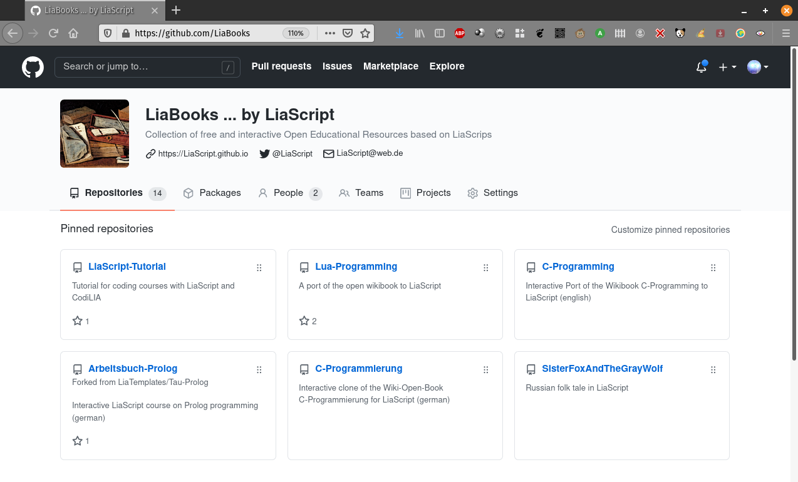

> __Full overview on courses via the topic `liascript-course`:__
>
> https://github.com/topics/liascript-course


#### LiaTemplates

                           --{{0}}--
If you tried out CodeRunner, you will have probably noticed that you can reuse
functionality from different courses, simply by using the keyword `import:`
within the main definition of your LiaScript document. Such a functionality is
defined with the help of macros. We will dive deeper into this feature at the
end of this document, but if you are interested you can inspect some of our
templates, which shall provide self-explaining courses of how to embed and use
the implemented macros.

https://github.com/LiaTemplates

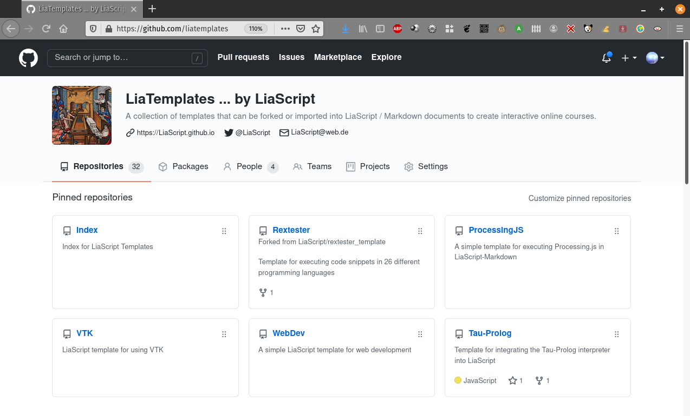

> __Full overview on extensions via the topic `liascript-template`:__
>
> https://github.com/topics/liascript-template

## Markdown-Syntax

                          --{{0}}--
This section is intended to give a brief overview on the basic Markdown syntax
elements. The only difference to common Markdown at this point is, that you can
define meta-information such as author, language, voice, etc. within a
HTML-comment at the beginning of every document. We will describe all of these
elements in more detail in [section: Macros](#macros). All of these `macros`
start with a single word, which is followed by a colon. If you require more
space, like for `comment:` or `link:` you can use multiple lines, but every
following line has to start with an indentation.

Initial LIA-comment-tag for basic definitions:

``` XML
<!--

author:   Andre Dietrich

email:    LiaScript@web.de

version:  0.0.1

language: en

narrator: US English Female

comment:  Write a short abstract of your course, that
          might contain multiple lines and sentences.

script:   https://javascript_resourse_url

script:   https://another_javascript_resourse_url

link:     https://some_css_stuff
          https://and_some_more_css
-->
```


                          --{{1}}--
The meta-information from your document is later shown within the
information-section as well as within the home-section.

                            {{1}}
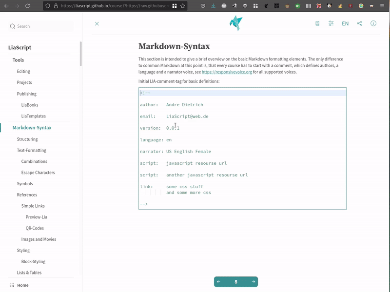


                          --{{2}}--
If you already know Markdown, then you can skip most of the content in this
section. However, there are some slight differences that will be marked with a
trailing star at the section title.

            {{2}}
<!-- style="font-size: 2em" -->
> Something might be different 💫


### Structuring

                          --{{0}}--
A course is structured as any other Markdown document with starting hash-tags,
whereby the number of hash-tags is used to define the hierarchy of your
document.

<!-- class="translate"-->
```markdown
# Main Title

 ...

## Section Title 1

 ...

### Subsection Title

 ...
## Section Title 2
```

                          --{{1}}--
Every section is presented separately. In contrast to most Markdown-parsers,
LiaScript applies a two step-approach. Sections are parsed at first, which means
that the parsers searches for patterns as depicted below. Parsing the content of
a section is quite time-consuming, that is why the section-content gets only
analyzed, if this specific section should be displayed to the user. However,
this happens only at the first appearance, afterwards the resulting view is
restored from a local cache.

                            {{1}}
**Preprocessing pattern:** `## foo bar`

#### Semantic Correct HTML

                          --{{0}}--
As mentioned earlier, the preprocessor searches for patterns `## header` at the beginning of a line to identify sections.
However, there might be cases where you want to have multiple different sections on one slide, with different headers.
[Semantic HTML](https://en.wikipedia.org/wiki/Semantic_HTML) can help us to deal with this, especially the two [HTML5](https://en.wikipedia.org/wiki/HTML_5) tags [`section`](https://developer.mozilla.org/en-US/docs/Web/HTML/Element/section) and [`article`](https://developer.mozilla.org/en-US/docs/Web/HTML/Element/article).

``` markdown
# Slide-Title

<section>
## Section-Title

...
</section>

<article>
## Article-Title

...
</article>
```

                          --{{1}}--
LiaScript will identify these HTML-tags and the content, such that the content within cannot be used as a separator.
If you use these two semantic tags, your content is grouped in semantic correct way, which improves the readability if screen-readers are used or keyboard navigation is used.

                          --{{2}}--
When to use which tag might be philosophical question.
We can say, if you just want to structure your content with different sub-headers, then use `<section>`.
If your content represents a self-contained document, then use `<article>`.
However, the visually presented result will be the same, such that you could also
use a `<div>` to structure your content.

<section>
##### Section-Title

> The `<section>` HTML element represents a generic standalone section of a document, which doesn't have a more specific semantic element to represent it.
> Sections should always have a heading, with very few exceptions.
>
> Source: https://developer.mozilla.org/en-US/docs/Web/HTML/Element/section

</section>


<article>
##### Article-Title

> The `<article>` HTML element represents a self-contained composition in a document, page, application, or site, which is intended to be independently distributable or reusable (e.g., in syndication).
> Examples include: a forum post, a magazine or newspaper article, or a blog entry, a product card, a user-submitted comment, an interactive widget or gadget, or any other independent item of content.
>
> Source: https://developer.mozilla.org/en-US/docs/Web/HTML/Element/article

</article>

#### Sub-Titles 💫

                          --{{0}}--
There might be some cases, where you want to add further headings quickly. We therefore
apply the following syntax with underlining "equal signs" or "dashes". In
common Markdown, this alternative syntax is applied to define level-1 and
level-2 headings. We use it to create headings that are one level `=` or two
levels `-` below the main heading. However, these subsections will not be part
of the table of contents, and since their interpretation is slightly different
to common Markdown, you should use the method presented in the previous section.

<!-- class="translate"-->
```markdown
...

## Section Title

Local Subsection
================

Local Sub-SubSection
--------------------
```

### Content blocks

                          --{{0}}--
How would you separate paragraphs or other content elements from each other, if
you only have a type-writer? The easiest way is a spatial separation, and in
Markdown this is done via an empty line. Thus, whenever you have blocks such as
paragraphs, enumerations, or tables, it is common practice to separate them via
a newline. This makes it easier for you to edit and structure your course, and
it prevents the interpreter from too much work.

<!-- class="translate"-->
``` markdown
This is a paragraph that consist only of one line.

Here comes another paragraph
with multiple lines.
And multiple sentences.
```

### Text-Formatting 💫


                            --{{0}}--
How does text-highlighting work in a text file and thus within a paragraph?
Well, Markdown defines some basic characters that can be used to surround a word
or a collection of words. We tried to use the GitHub flavored Markdown style for
simple formatting, thus simply use multiple asterisks or underscores to mark
certain parts of a text.

* `*italic*` -> *italic*<!-- class="notranslate"-->
* `**bold**` -> **bold**<!-- class="notranslate"-->
* `***bold and italic ***` -> ***bold and italic ***<!-- class="notranslate"-->
* `_also italic_` -> _also italic_<!-- class="notranslate"-->
* `__also bold__` -> __also bold__<!-- class="notranslate"-->
* `___also bold and italic___` -> ___also bold and italic___<!-- class="notranslate"-->
* `~strike~` -> ~strike~<!-- class="notranslate"-->


                          --{{1}}--
We define some additions to common Markdown, such as underline and superscript,
which can be defined with the following syntax:

                            {{1}}
* `~~underline~~` -> ~~underline~~<!-- class="notranslate"-->
* `~~~strike and underline~~~` -> ~~~strike and underline~~~<!-- class="notranslate"-->
* `^superscript^` -> ^superscript^<!-- class="notranslate"-->


#### Combinations

                          --{{0}}--
As you can see from the examples, you can combine and nest all elements freely.


* `**bold _bold italic_**` -> **bold _bold italic_**<!-- class="notranslate"-->
* `**~bold strike~ ~~bold underline~~**` -> **~bold strike~ ~~bold underline~~**<!-- class="notranslate"-->
* `*~italic strike~ ~~italic underline~~*` -> *~italic strike~ ~~italic underline~~*<!-- class="notranslate"-->

#### Typography

                          --{{0}}--
It is now possible within a LiaScript Markdown to apply sequences of dashes for typography. A sequence of dashes is now translated into:

1. single dash `-` --> Hyphen or minus sign -
2. double dash `--` --> En dash --
3. triple dash `---` --> Em dash ---

                          --{{1}}--
An Ellipsis is indicated by a sequence of three dots:

                            {{1}}
`...` will be translated to the Unicode symbol ...

##### Quotes

                          --{{0}}--
Additionally single and double quotes are translated into their typographical counterparts, based on the defined [`language`](#language) in the header of the course.
German, French, English or Welsh will be translated into different Unicode symbols.

<!-- style="font-size: 20px" -->
`"That's a 'magic' shoe."` --> “That’s a ‘magic’ shoe.”

Applied quote translation as defined here: https://en.wikipedia.org/wiki/Quotation_mark

                          --{{1}}--
If you want o use the original characters, you will have to escape them, as shown also in the [next section](#escape-characters):

      {{1}}
`\"` --> \"\
`\'` --> \'

                            {{2}}
<section>

                          --{{2}}--
As an alternative you can still use the quote tag `<q>` for double quotations.
This will still use the language definition for that document, but you can also overwrite this per markdown block or quote:

``` markdown
<q>That's a 'magic' shoe.</q>\
<q lang="de">Das ist ein magischer Schuh.</q>

---

<!-- lang="fr" -->
Et voici un autre example: <q>C'est une chaussure magique.</q>
```

<q>That's a 'magic' shoe.</q>\
<q lang="de">Das ist ein magischer Schuh.</q>

---

<!-- lang="fr" -->
Et voici un autre example: <q>C'est une chaussure magique.</q>

</section>

#### Escape Characters

                          --{{0}}--
If you want to use asterisks, hash-tags, or other syntax elements within your
document without applying their functionality, then you can escape or in other
words indicate them with a starting backslash. If you want to escape a
backslash, you will have to write two subsequent backslashes. But you do not
have to use it, if there is only one asterisk within a line, this will be
interpreted as a single character. So you will have to apply this kind of
escaping only to prevent misunderstandings between you and the interpreter.


``` markdown
\*, \~, \_, \#, \{, \}, \[, \], \|, \`, \$, \@, \\, \<, \>, \", \'
```

**Result:** \*, \~, \_, \#, \{, \}, \[, \], \|, \`, \$, \@, \\, \<, \>, \", \'

### Symbols & Unicode 💫

                          --{{0}}--
One thing that we missed in standard Markdown, was an implementation for arrows.
The verbatim text shows, how arrows are defined in our Markdown implementation with
their result on the right.

`->` ->, `->>` ->>, `>->` >->, `<-` <-, `<-<` <-<,
`<<-` <<-, `<->` <->, `=>` =>, `<=` <=, `<=>` <=>

`-->` -->, `<--` <--, `<-->` <-->, `==>` ==>, `<==` <==, `<==>` <==>

`~>` ~>, `<~` <~

                          --{{1}}--
But you can also use some basic smileys. We will try to extend this partial
support in the future.

                            {{1}}
`:-)` :-), `;-)` ;-), `:-D` :-D, `:-O` :-O, `:-(` :-(, `:-|` :-|,
`:-/` :-/, `:-P` :-P, `:-*` :-*, `:')` :'), `:'(` :'(

                          --{{2}}--
However, since LiaScript accepts
[Unicode](https://en.wikipedia.org/wiki/Unicode), you can also copy and paste
any kind of character including [emojis](https://emojipedia.org).


### References

> The next section shows how external resources can be referenced and integrated.


#### Simple Links

                          --{{0}}--
There are two ways of adding links to a Markdown document, either by inlining
the URL directly or you can name it (as shown in listing 2), by applying the
typical brackets and parenthesis notation, the optional information is put in
double quotes at the end of the URL. This optional information is used as a
title attribute, and it is shown, when the user hovers the link with the mouse.


1. Example of an URL-link -> http://goo.gl/fGXNvu

   text-formatting can be applied also `*** http://goo.gl/fGXNvu ***` ->
   *** http://goo.gl/fGXNvu ***

2. Naming the link (`[title](http://goo.gl/fGXNvu "optional info")`) ->
   [title](http://goo.gl/fGXNvu "optional info")

3. For internal navigation you can refer to the slide number or to title with
   a starting `#`

   * `[next slide](#18)` -> [next slide](#18)
   * `[next slide](#preview-lia-💫)` -> [next slide](#preview-lia-💫)
   * If your internal link includes parentheses or other characters, you can
     also use percent-encoding. An opening parentheses would then be written as
     `%28` and a closing one as `%29`.

     For more information visit:
     https://developer.mozilla.org/en-US/docs/Glossary/percent-encoding

##### Preview-Lia 💫

                          --{{0}}--
LiaScript has an advanced preview link, that will load the remote course and
parse the meta-information such as title, version, comment, logo, email, tags,
form your main HTML-comment at the top of your document. To do this, you will
have to use `[preview-lia]` as the title of your link, which is followed by the
raw URL of your course document.


`[preview-lia](https://raw.githubusercontent.com/LiaScript/docs/master/README.md)`

[preview-lia](https://raw.githubusercontent.com/LiaScript/docs/master/README.md)


                          --{{1}}--
You can use this technique also to create previews for other courses on your
personal website or for other GitHub projects, as it was described in section
[Projects](#projects). For more information follow the link:

{{1}} https://liascript.github.io/blog/markdown-just-got-a-new-preview-tag/


##### QR-Codes 💫

                          --{{0}}--
Sometimes it might be required to have both, a link and a visual representation
of it as an __QR-Codes__. Similar to previews, you simply name your link
`qr-code`:


* Syntax: `[qr-code](https://LiaScript.github.io)`
* Example:

  [qr-code](https://LiaScript.github.io)

                          --{{1}}--
You can add further information to your link by adding a title. Markdown is also
allowed within the link title. In case of an image or media link, the title will
be used as a subtitle and displayed accordingly.

                            {{1}}
* Syntax: `[qr-code](https://LiaScript.github.io "Checkout the LiaScript website or the __[blog](https://liascript.github.io/blog/)__")`
* Example:

  [qr-code](https://LiaScript.github.io "Checkout the LiaScript website or the __[blog](https://liascript.github.io/blog/)__")


##### eMail & Telephone 💫

      --{{0}}--
These are two additional link types that you can also use within the `<a>` tag, but LiaScript supports them natively.

        {{1}}
* __mailto:__

  `[Write me a Mail](mailto:LiaScript@web.de)` --> [Write me a Mail](mailto:LiaScript@web.de)

  `[LiaScript\@web.de](mailto:LiaScript@web.de)` --> [LiaScript\@web.de](mailto:LiaScript@web.de)

      --{{1}}--
  The `mailto` link type does not need to be explained.
  On most modern systems, clicking on such a link will open your email client and insert the email address after the colon directly into the recipient address field.
  Since the __\@__ symbol is used for [macro](#macro) calls, this has to be escaped at the moment.

        {{2}}
* __tel:__

  `[Call me](tel:+49-12345-67890)` --> [Call me](tel:+49-12345-67890)

  `[+49-12345-67890](tel:+49-12345-67890)` --> [+49-12345-67890](tel:+49-12345-67890)

      --{{2}}--
  The `tel` link type is lesser known and has been introduced for mobile phones.
  Clicking on such a link will trigger the dial dialog, allowing you to call the pre-set number without any need for copy and paste.


#### Images 💫

                          --{{0}}--
Images are defined similar to links, but they are indicated with a starting
exclamation mark.

                          --{{1}}--
The name of the link or the alt-text is not wasted, since it is not displayed
anymore. Instead, it is displayed, if the image cannot be loaded for some
reasons, and it is used by screen readers to give visually impaired people a
hint, of what will be visible on the image. So please, don't leave it empty.

                          --{{2}}--
The URL can be either relative to your Markdown document or it can be absolute,
which means it is pointing to an external resource.

                          --{{3}}--
The optional title in LiaScript is not only used as a title attribute, instead
it is used as a real sub-title for all media links.

<!-- style="font-size: 1.4em" -->
**Image-notation: !\[{1}{`alt-text`}\]({2}{url} {3}{"optional sub-title"})**

                            {{2}}
* relative URL: ``

  

* absolute URL: ``

  


                          --{{4}}--
Note, that LiaScript is smart enough to scale your images to the optimal size.
If your image is smaller than the current maximal applicable width, it is shown
in full size. If it is larger, than it is scaled to fit in width and also in
height. You can further click on all images to open them as modal and if the
image is quite large, such as Leonardo's painting, then you can also zoom and
inspect it, by hovering with the mouse or thumb.

                         --{{5}}--
Additionally, if you start a paragraph with an image, LiaScript expects it to be
a floating object, which is depicted with a maximal size of 50% of your
view-port, if it is not smaller than that.

                           {{5}}
********************************************************************************

``` markdown

Lorem ipsum dolor sit amet, consectetur adipisicing elit, ...

```

---

 Lorem ipsum dolor
sit amet, consectetur adipisicing elit, sed do eiusmod tempor incididunt ut
labore et dolore magna aliqua. Ut enim ad minim veniam, quis nostrud
exercitation ullamco laboris nisi ut aliquip ex ea commodo consequat. Duis aute
irure dolor in reprehenderit in voluptate velit esse cillum dolore eu fugiat
nulla pariatur. Excepteur sint occaecat cupidatat non proident, sunt in culpa
qui officia deserunt mollit anim id est laborum. Lorem ipsum dolor sit amet,
consectetur adipisicing elit, sed do eiusmod tempor incididunt ut labore et
dolore magna aliqua. Ut enim ad minim veniam, quis nostrud exercitation ullamco
laboris nisi ut aliquip ex ea commodo consequat.


********************************************************************************

##### Galleries 💫

                          --{{0}}--
How would you interpret a paragraph full of images? We thought that the only
reasonable depiction of this could be a gallery.

``` markdown
  


```

                          --{{1}}--
And we like this idea... You can click on every image and inspect it also with
the zooming feature.

                            {{1}}


#### Audio 💫

                          --{{0}}--
If an exclamation mark indicates visual content, why not using a question mark
to indicate auditive content. (From our perspective it resembles an ear.)
Everything is similar to images and the URLs can be either relative or absolute.

* Syntax: `?[a horse](https://www.w3schools.com/html/horse.mp3 "hear a horse")`
* Example:

  ?[a horse](https://www.w3schools.com/html/horse.mp3 "hear a horse")


                          --{{1}}--
Additionally, you can also directly reference music from the
[SoundCloud](https://Soundcloud.com) website or from
[Music.YouTube](https://music.youtube.com). The associated song will be
automatically embedded for you.

                            {{1}}
* Syntax: `?[soundcloud](https://soundcloud.com/glennmorrison/beethoven-moonlight-sonata)`
* Example:

  ?[soundcloud](https://soundcloud.com/glennmorrison/beethoven-moonlight-sonata)


#### Movies 💫

                          --{{0}}--
Images are marked with a starting exclamation mark before the link, audio by a
starting question mark and movies are made of images and sound, that is why you
combine both marks `!?`. Defining resources this way shows at least the links
correctly in other Markdown parsers or on GitHub. There is baked-in support for
[YouTube](https://YouTube.com), [Vimeo](https://Vimeo.com),
[PeerTube](https://peertube.tv), [DailyMotion](https://www.dailymotion.com) and
[TeacherTube](https://TeacherTube.com), which means that you only have to
include the link and the resource will be embedded appropriately.

**Movie-notation: `!?[alt-text](movie-url)`**

- YouTube: `!?[The Future of Programming](https://www.youtube.com/watch?v=8pTEmbeENF4)`

  !?[The Future of Programming](https://www.youtube.com/watch?v=8pTEmbeENF4)

- relative path: `!?[Something about math](vid/math.mp4)`

  !?[Something about math](vid/math.mp4)

- > # List of supported Video Platforms
  >
  > * [DailyMotion](https://www.dailymotion.com)
  > * [PeerTube](https://peertube.tv)
  > * [TeacherTube](https://TeacherTube.com)
  > * [Video TU-Freiberg](https://video.tu-freiberg.de)
  > * [Vimeo](https://Vimeo.com)
  > * [YouTube](https://YouTube.com)


                          --{{1}}--
If you required more control over your video, such as autoplay, muted,
start-time, and probably also size and colors, the you can also apply custom
styling rules, then you should take a look at the following section:

                            {{1}}
[Customizing-Multimedia](#Customizing-Multimedia)


#### So what is left?? 💫

                          --{{0}}--
If it is something else that you want to embed something else from another
website, then you should try out the link syntax with two starting question
marks. This means, LiaScript will try to use the [oEmbed](https://oembed.com)
service, which is offered by a couple of websites. If this succeeds, this will
embed only a specific part. If it fails, then LiaScript will at least try to
embed the website via an `iframe`.

Examples:

* [SketchFab](https://sketchfab.com): `??[ear model](https://sketchfab.com/3d-models/ear-anatomy-468e2039bde34a3fabb9e90bff9cd56b)`

  ??[ear model](https://sketchfab.com/3d-models/ear-anatomy-468e2039bde34a3fabb9e90bff9cd56b)

* [StoryMaps](https://storymaps.arcgis.com): `??[presentation](https://storymaps.arcgis.com/stories/583f8b48a857442cb8d27411c93a9664)`

  ??[presentation](https://storymaps.arcgis.com/stories/583f8b48a857442cb8d27411c93a9664)

* [CircuitJS](https://www.falstad.com/circuit): `  ??[Simulation: Non-inverting Amplifier](https://www.falstad.com/circuit/circuitjs.html?startCircuit=amp-noninvert.txt)`

  ??[Simulation: Non-inverting Amplifier](https://www.falstad.com/circuit/circuitjs.html?startCircuit=amp-noninvert.txt)


##### Galleries \#2 💫

                          --{{0}}--
What you have seen previously with images is also possible with any kind of
multimedia link. Simply put everything into one paragraph and LiaScript will
automatically generate a gallery for you:

``` markdown
 ?[audio](url) !?[movie](url)
??[something else](url)
??[something else](url)
```


?[a horse](https://www.w3schools.com/html/horse.mp3 "hear a horse")
!?[Fun with Tables](https://www.youtube.com/watch?v=Y_7q9T5jYHo)
??[VTK VolumeContour](https://kitware.github.io/vtk-js/examples/VolumeContour/index.html)
??[Circuit simulation](https://www.falstad.com/circuit/circuitjs.html?startCircuit=majority.txt)
??[Bust of Nefertiti](https://sketchfab.com/3d-models/bust-of-nefertiti-foia-results-8c60faca6152405e9d35784efa8b9aa1)


## Markdown-Blocks

                          --{{0}}--
So far we had introduced Markdown only on a tiny level, which means, by now you
should know how to emphasize words and phrases within a paragraph, how to add
images and how you can use references to point to internal or external
resources. But, all we did so far is to work with **paragraphs**. But as pointed
out in the quote below, Markdown can do even more.

> ... Markdown’s syntax is comprised entirely of punctuation characters, which
> punctuation characters have been carefully chosen so as to look like what
> they mean. E.g., asterisks around a word actually look like \*emphasis\*.
> Markdown lists look like, well, lists. Even blockquotes look like quoted
> passages of text, assuming you’ve ever used email.
>
> -- Markdown philosophy by
> [John Gruber](https://daringfireball.net/projects/markdown/syntax#philosophy)

                          --{{1}}--
Within the following part we will learn how to deal with Markdown blocks and
how to format your content to define the following elements:

<!-- --{{1}}--
list, blockquotes, tables, custom HTML, horizontal rules and dealing with
code-blocks.
 -->

       {{1}}
1. Lists
2. Blockquotes
3. Tables
4. HTML
5. Code-Snippets
6. Horizontal rules

### Lists

                          --{{0}}--
The GitHub-flavored Markdown supports two types of lists, ordered and unordered
ones, and so does LiaScript. If you every used a typewriter then the following
syntax for lists would look natural to you. The only thing that matters here is
the correct indentation.

> **Use spaces for correct indentation!** Tabs are allowed too, but might be
> confusing, since editors tend to use varying lengths from 2 to 4 spaces to
> display them...

#### Unordered Lists

                          --{{0}}--
To define an unordered list, starting asterisks `*`, pluses `+`, and dashes `-`
can be used and mixed. If one point has more than one line, you can also use
multiple lines to define paragraphs. All other Markdown elements, you will get
to know, can be included in the same way.

**Markdown-Syntax:**

<!-- class="translate"-->
``` markdown
* alpha
+ **beta**
- gamma
  and delta

  new Paragraph

  - and another
  - important list

- epsilon
```

                          --{{1}}--
As you can see from the result, you can apply all Markdown styling elements
freely. The starting characters will be interpreted equally, thus it makes no
difference, if you use asterisks, pluses and dashes. To improve the readability
of your document, we would recommend to stick with one format for every level.
Starting with asterisks on the first level and dashes within the second level,
etc.

                            {{1}}
********************************************************************************

**Result:**

* alpha
+ **beta**
- gamma
  and delta

  new Paragraph

  - and another
  - important list

- epsilon

********************************************************************************

                           {{2}}
> __Note:__
> At the moment it is required to separate blocks by at least one empty line.
> The following example will be interpreted as a single paragraph:
>
> ``` markdown
> * this is one single
>   - paragraph with a dash.
> ```
>
> Whereby the following will result in a bullet point with another one nested
>
> ``` markdown
> * separate paragraph
>
>   - and this is a separate sub listing
> ```


#### Ordered Lists 💫

                          --{{0}}--

Ordered lists start with a number and a dot. As you can see from the example,
the numbering is important. In contrast to the GitHub flavored Markdown or the
original Markdown, where the list below would result in **two** separate lists,
and the numbering for every list would start at 1, ignoring your numbering
order. With the LiaScript interpretation you can separate your lists, add more
explanations in between, or use animations to make certain parts appear or
disappear.


**Markdown-Syntax:**

<!-- class="translate"-->
``` markdown
0. alpha
1. **beta**

Something else ...

3. * gamma
   * delta
   * and epsilon
2. probably zeta
```

**Result:**

0. alpha
1. **beta**

Something else ...

3. * gamma
   * delta
   * and epsilon
2. probably zeta


### Blockquotes

                          --{{0}}--
If you, from time to time, reply to emails, than the following notation will
look quite familiar to you. To make use of quoted text, simply start a line with
a `>` greater than character.

**Markdown-Syntax:**

<!-- class="translate"-->
``` md
> This was said some time ago ...
>
>> This was said even longer ago,
> > I guess ...
>
> * aleph
> * beth
```

                          --{{1}}--
As you can see from the example, all Markdown elements can be used within a
blockquote and vice versa. Everything you have learned so far can be easily
combined, it could also be a gallery or an embedded object...


                            {{1}}
********************************************************************************

**Result:**

> This was said some time ago ...
>
>> This was said even longer ago,
> > I guess ...
>
> * aleph
> * beth

********************************************************************************

#### Citations 💫

                          --{{0}}--
Blockquotes are often used for citations, and so do we. You can use the
following pattern to mark a blockquote as a citation. Simply use two paragraphs
within a blockquote and start the second one with two dashes `--`.

**LiaScript-Syntax:**

<!-- class="translate"-->
```
> “Live as if you were to die tomorrow.
> Learn as if you were to live forever.”
>
> -- Mahatma Gandhi
```

                          --{{1}}--
The resulting blockquote looks slightly different. Furthermore, the paragraph
followed by dashes is put into and HTML `cite`-tag.

             {{1}}
> “Live as if you were to die tomorrow.
> Learn as if you were to live forever.”
>
> -- Mahatma Gandhi


                          --{{2}}--
You can use this syntax, with starting dashes, everywhere within a LiaScript
document and your corresponding paragraph it will be rendered within a
`cite`-tag. But, at this time it will only affect the representation of
blockquotes. We are not sure yet, how this can also be applied to images,
tables, lists, etc.

             {{2}}
<!-- class="translate"-->
``` md
lorem ipsum ....

-- Some more citations
```

### Tables

                          --{{0}}--
Tables, _as we hope_, are easy to interpret and to create. Simply use horizontal
rules to separate cells. The header is always defined by the first line, while
the second line is used to separate the table header from the body visually and
to define the column alignment.


**Markdown-format:**

<!-- class="translate"-->
``` markdown
| Tables               |      Are      |  Cool |
| -------------------- |:-------------:| -----:|
| *** columns 3 is *** | right-aligned | $1600 |
| ** column 2 is **    |   centered    |   $12 |
| * zebra stripes *    |   are neat    |    $1 |
```

                          --{{1}}--
As you can see in the result, you can sort tables, by clicking onto the icon
that appears on the right of every header cell. A table will then be either
sorted ascending, descending, or not sorted, which means your initial row order
will be restored.

                            {{1}}
********************************************************************************

**Result:**

| Tables               |      Are      |  Cool |
| -------------------- |:-------------:| -----:|
| *** columns 3 is *** | right-aligned | $1600 |
| ** column 2 is **    |   centered    |   $12 |
| * zebra stripes *    |   are neat    |    $1 |

********************************************************************************

                          --{{2}}--
The position of the colon defines whether a column should be centered, aligned
to the left or to the right. By default, if you do not use colons, all columns
are aligned to the left.


          {{2}}
* centered --> `:---:`
* right --> `---:`
* left --> `:---` or `---` (default)


#### Tables <--> Data (Demo) 💫

                          --{{0}}--
But why stopping here? A table, in many cases, is just a representation of a
dataset. If so, why not simply visualizing it accordingly and plot a graph,
display a chart or a map, or whatever fits the most for your data. At the moment
we apply simple rules to identify the nature of your dataset and thus choose a
visual representation.

> For more details have a look at section [Fun With Tables](#fun-with-tables),
> which provides and extensive overview onto all supported representation
> schemes.

                          --{{1}}--
The easiest and probably most obvious representation of a simple plot, would be
the following. A header with some names and columns that contain numbers. The
first column is interpreted as the main column and thus defines the <var>x</var>
values, the rest is up to you. A cell is then only associated with a number, if
the first "word", _sequence of characters separated by a space_, can be parsed
as a number. The `0km` within this example gets ignored. So if you want certain
values to be ignored, simply attach something directly to the number, or add a
character in front of it.


          {{1}}
``` md
| x's |  some y's  |                  dist |
| --- |:----------:| ---------------------:|
| 1   |    1 \$    |                 16 km |
| 2.2 |    2 \$    |                 12 km |
| 3.3 |    5 \$    |                  1 km |
| 4   | -12.333 \$ | 0km _will be ignored_ |
```

                          --{{2}}--
LiaScript identifies this pattern and automatically adds a button above the
table, which allows to switch between the table and the "line chart"
representation. You can modify the chart interactively and even download the
resulting image.

          {{2}}
<!-- class="notranslate"-->
| x's |  some y's  |                  dist |
| --- |:----------:| ---------------------:|
| 1   |    1 \$    |                 16 km |
| 2.2 |    2 \$    |                 12 km |
| 3.3 |    5 \$    |                  1 km |
| 4   | -12.333 \$ | 0km _will be ignored_ |


                            --{{3}}--
A function cannot possess different <var>y</var>-values for one
<var>x</var>-value, thus, if you have two or more equal <var>x</var>-values, the
resulting plot will be a scatter plot.

           {{3}}
``` markdown
| x's |  some y's  |  dist |
| --- |:----------:| -----:|
| 1   |    1 \$    | 16 km |
| 2.2 |    2 \$    | 12 km |
| 3.3 |    5 \$    |  1 km |
| 4   | -12.333 \$ | -5 km |
| 4   |            |     1 |
```

           {{3}}
<!-- class="notranslate"-->
| x's |  some y's  |  dist |
| --- |:----------:| -----:|
| 1   |    1 \$    | 16 km |
| 2.2 |    2 \$    | 12 km |
| 3.3 |    5 \$    |  1 km |
| 4   | -12.333 \$ | -5 km |
| 4   |            |     1 |


                                   --{{4}}--
Last but not least _bar-charts_. If the first column contains at least one cell,
that cannot be parsed as a number while the others do have, then this table gets
interpreted as a bar-chart. The first column thus defines your set of groups. It
is now also possible to sort your table according to different columns, and to
see this ordering also within the bar-chart representation.


                               {{4}}
```markdown
| Animal          | weight in kg | Lifespan years | Mitogen |
| --------------- | ------------:| --------------:| -------:|
| Mouse           |        0.028 |             02 |      95 |
| Flying squirrel |        0.085 |             15 |      50 |
| Brown bat       |        0.020 |             30 |      10 |
| Sheep           |           90 |             12 |      95 |
| Human           |           68 |             70 |      10 |
```

                               {{4}}
<!-- class="notranslate"-->
| Animal          | weight in kg | Lifespan years | Mitogen |
| --------------- | ------------:| --------------:| -------:|
| Mouse           |        0.028 |             02 |      95 |
| Flying squirrel |        0.085 |             15 |      50 |
| Brown bat       |        0.020 |             30 |      10 |
| Sheep           |           90 |             12 |      95 |
| Human           |           68 |             70 |      10 |


                          --{{5}}--
As mentioned earlier, this is only a brief introduction into this topic. So
check out section [Fun With Tables](#fun-with-tables) for a complete overview.

#### Editing

                          --{{0}}--
Editing tables might seem tedious, but actually it is not. There is a huge
number of plugins for different editors that you can use, which do the
formatting for you. You can use them to quickly navigate through your cells, and
some even allow sorting.


**Editors: Plugins**

* Atom: [markdown-table-editor](https://atom.io/packages/markdown-table-editor)
* VS-Code: [Markdown Table](https://marketplace.visualstudio.com/items?itemName=TakumiI.markdowntable)
* Obsidian: [Advanced Tables](https://github.com/tgrosinger/advanced-tables-obsidian)


### HTML

                          --{{0}}--
You can also use plain HTML in your Markdown, if you miss something. It will
mostly work pretty good, but it should be used with caution, since some
interpreters apply different rules. Some interpret everything within an HTML tag
as HTML, while others allow mixing. Thus, HTML can contain Markdown, which
contains HTML, which contains... By the way, LiaScript allows mixing. Thus, keep
in mind that newlines and indentation are still relevant.

**Markdown-Syntax:**

<!-- class="translate"-->
``` html
<div style="color: green">

Test <q>**bold**</q> and <b>HTML bold</b> works also inline


</div>
```

                          --{{1}}--
The result shows how the inline-CSS is applied to all nested Markdown elements.
However, if you want to apply some styling to your document, LiaScript supports
another minimal invasive way of doing that. We will describe this in detail in
section [Styling](#styling).

                            {{1}}
********************************************************************************

**Result:**

<div style="color: green">

Test <q>**bold**</q> and <b>HTML bold</b> works also inline


</div>

> See the following list for an complete overview onto all HTML elements:
>
> [HTML Element Reference](https://www.w3schools.com/tags/default.asp)

********************************************************************************


                          --{{2}}--
If you use custom HTML instead of Markdown, then no styling will be applied. You
can of course create more complex content or tables, this way you can apply your
own styling to all elements.

                            {{2}}
[CSS-Reference](https://www.w3schools.com/CSSref/default.asp)

                          --{{3}}--
If you want to, you can also copy the generated LiaScript structure and use our
classes. Most Browsers include an inspector, which can be used to interactively
inspect the entire DOM-tree.

                            {{3}}
Open Inspector: <kdb>Ctrl+Shift+i</kdb> or <kdb>Ctrl+Shift+k</kdb>

                            {{3}}
!?[Inspecting the DOM](https://www.youtube.com/watch?v=Gk6BljF60RI)

                          --{{4}}--
But, you can also import your own styles within the main document comment by
using the `link` definition. We will explain this in more details within the
macro section [link](#link).

                            {{4}}
``` md
<!--
...
link: file.css
...
-->

# Main Title
```

#### Details & Summary

                          --{{0}}--
The `details` and `summary` tags are standard HTML tags and GitHub also supports
their usage with Markdown. These tags offer a neat way to define something what
is nowadays called accordion. Thus, your user can click on the summary text to
make the body of the `details`-tag appear.

**Syntax:**

<!-- class="notranslate"-->
``` md
<details>

<summary>**Honest Textbook ads (click to enlarge)**</summary>

!?[If High School and College Textbooks Were Honest - Honest Ads](https://www.youtube.com/watch?v=lhSjYT7pWkw)

</details>
```

**Result:**

<details>

<summary>**Honest Textbook ads (click to enlarge)**</summary>

!?[If High School and College Textbooks Were Honest - Honest Ads](https://www.youtube.com/watch?v=lhSjYT7pWkw)

</details>

#### `<lia-keep>` 💫

                          --{{0}}--
If you want to embed more complex HTML, and only HTML, without taking care about
indentation and formatting, then should use the `lia-keep` tag to surround your
code.

``` html
<lia-keep>
  <style>
    table, th, td {
      border: 1px solid black;
      width: 250px; height: 40px;
      text-align: center;
    }
  </style>

  <table style="margin: 1em">
    <tr>
      <th>**Header 1**</th>
      <th>**Header 2**</th>
    </tr>
    <tr>
      <td>Cell 1</td>
      <td rowspan="2">Cell 2</td>
    </tr>
    <tr>
      <td>Cell 3</td>
    </tr>
  </table>
</lia-keep>
```

                          --{{1}}--
As it is demonstrated in the result, everything within this tag will be treated
as HTML only, no Markdown parsing will be applied and indentation will be
checked.

                            {{1}}
********************************************************************************

**Result:**

<lia-keep>
  <style>
    table, th, td {
      border: 1px solid black;
      width: 250px;
      height: 40px;
      text-align: center;
    }
  </style>

  <table style="margin: 1em">
    <tr>
      <th>**Header 1**</th>
      <th>**Header 2**</th>
    </tr>
    <tr>
      <td>Cell 1</td>
      <td rowspan="2">Cell 2</td>
    </tr>
    <tr>
      <td>Cell 3</td>
    </tr>
  </table>

</lia-keep>


********************************************************************************

                          --{{2}}--

This way, you could for example also import even more complex HTML-tables,
pictures with multiple sources for different screen-sizes, and more.
_With great power comes great responsibility._  Thus, you will also be
responsible for your styling.


### Code

                          --{{0}}--
In Markdown, you can use a sequence of at least three subsequent backticks `\``
to indicate a code-block that should not be treated as Markdown, but instead
contains some kind of code for which syntax-highlighting should be used, if
possible. The first word after the backticks is used as an indicator, for which
kind of syntax-highlighting should be applied.

```` md
``` python
import time
# Quick, count to ten!
for i in range(10):
    # (but not *too* quick)
    time.sleep(0.5)
    print(i)
```
````

                          --{{1}}--
In case you are wondering, how to embed a code-block into a code-block with
backticks? Three backticks are the minimum, thus you can surround your Markdown
code-block example with a sequence of 4 or more backticks. If you start with
four backticks, LiaScript will parse everything as code until it reaches a
matching number of backticks.

        {{1}}
``` python
import time
# Quick, count to ten!
for i in range(10):
  # (but not *too* quick)
  time.sleep(0.5)
  print(i)
```

                          --{{2}}--
However, we are still in the Markdown world with static code visualization.
LiaScript has also support for interactive programming, thus all of your
code-snippet can be made executable and editable. This will be described in more
detail in section [Interactive Coding](#interactive-coding).

#### Differences to Markdown 💫

                          --{{0}}--
Markdown also supports adding code by using tilde `~` characters instead of
backticks. This is at the moment not supported by LiaScript, but might be added
in the future.

``` md
~~~ javascript
var a = "b"
~~~
```

                          --{{1}}--
Additionally, it is also possible in standard Markdown to use indentation with
at least 4 spaces to mark a block or a line as code. In LiaScript this is
treated differently. You can use indentation to keep your document readable. The
two indicators for text-to-speech in the example are treated equally by
LiaScript, but another Markdown interpreter will interpret the second example as
a single paragraph, while the indicator in the first example will be treated as
code, and thus be easier to read with any other Markdown interpreter (including
the representation on GitHub).


                            {{1}}
<!-- class="translate"-->
``` md
This is not code ...

    Any kind of text with a 4 space
    indentation will be treated as code
    in Markdown ...

                --{{1}}--
This text will be spoken out loud in LiaScript.

--{{2}}--
This text will be spoken out loud too.
```


#### Projects 💫

                          --{{0}}--
If you want to bundle a couple of code-blocks into something that mirrors a
project, you can achieve this with the following syntax. All code-blocks are
simply attached to each other, in order to indicate a grouping. If you separate
them at least by one newline, they will be treated separately. This will be
pretty neat, if we introduce the concept of interactive code-blocks.


```` md
``` js     -EvalScript.js
let who = data.first_name + " " + data.last_name;

if(data.online) {
  who + " is online"; }
else {
  who + " is NOT online"; }
```
``` json    +Data.json
{
  "first_name" :  "Sammy",
  "last_name"  :  "Shark",
  "online"     :  true
}
```
````

                          --{{1}}--
You can define optional names within the head of your code-block. The starting
plus `+` and minus `-` symbols are used to indicate, if the resulting
code-blocks should be visible or hidden. However, you can change this, by
clicking onto the resulting title-bar to either maximize or minimize the
code-block.

                            {{1}}
``` js     -EvalScript.js
let who = data.first_name + " " + data.last_name;

if(data.online) {
  who + " is online"; }
else {
  who + " is NOT online"; }
```
``` json    +Data.json
{
  "first_name" :  "Sammy",
  "last_name"  :  "Shark",
  "online"     :  true
}
```

                          --{{2}}--
If you do not add a plus or a minus as a prefix to your file, the plus is used
as default.


#### Supported Languages 💫

                          --{{0}}--
In most cases you can simply add the name of the language or the common filename
ending into the head of a code snippet. Most Markdown interpreters will use
[highlight.js](https://highlightjs.org) for language rendering, since we require
also an editor with syntax highlighting capabilities, we use
[ace](https://ace.c9.io). Thus, the language support might differ to other
systems. We therefore apply a mapping, so that you can still use all
[highlight.js](https://highlightjs.org) short-codes but also those of
[ace](https://ace.c9.io).

Overview: https://github.com/LiaScript/docs/blob/master/Code.md


### JavaScript 💫

                                 --{{0}}--
In contrast to common Markdown parsers or viewers, LiaScript allows you to include and execute JavaScript code.
When combined with HTML elements, you are free to integrate whatever functionality you desire.

                                 --{{1}}--
The last statement of your script also defines the result that will be shown, but only if it is not `undefined`.
You can also use `console.log` to log the script activities.
As the examples below show, you can combine your scripts with LiaScript animations, so they will only be executed in the right fragment/context.
However, you can do much more with scripts.

                                  {{1}}
> Checkout Section [JavaScript](#JavaScript-or-JS-Components) for more information!

``` html
Do some internal calculation <script> 99 * 88  </script>, the next script
contains an error <script> 99 * a </script>.

                                  {{2}}
<script>
    // Initialize a Line chart in the container with the ID chart
    new Chartist.Line('#chart', {
        labels: [1, 2, 3, 4],
        series: [[100, 120, 180, 200]]
    });

    console.debug("loaded #chart") // or undefined
</script>
<div class="ct-chart ct-golden-section" id="chart"></div>
```

Do some internal calculation <script> 99 * 88  </script>, the next script
contains an error: <script> 99 * a </script>.

                                {{2-3}}
<script>
// Initialize a Line chart in the container with the ID chart1
new Chartist.Line('#chart1', {
  labels: [1, 2, 3, 4],
  series: [[100, 120, 180, 200]]
});

console.debug("loaded #chart1")
</script>
<div class="ct-chart ct-golden-section" id="chart1"></div>


                                {{3}}
<script>
// Initialize a Line chart in the container with the ID chart2
new Chartist.Line('#chart2', {
  labels: [1, 2, 3, 4],
  series: [[-100, 120, 180, 20]]
});

console.debug("loaded #chart2")
</script>
<div class="ct-chart ct-golden-section" id="chart2"></div>


    --{{4}}--
When discussing events, whether past, present, or future, your course may quickly become outdated.
This is where scripts, as an initial building block, can shine. Using basic datetime calculations ensures precise determination of when events have occurred or will occur.
Rather than relying solely on your calculations, users have the opportunity to inspect and validate your code by double-clicking on the highlighted script result.
Even more, it is possible to modify the code, enabling them to double-check your findings and experiment with the results.


      {{4}}
``` markdown
Russia started its invasion of Ukraine
<script format="relativetime" unit="day">
// Define the start date of the invasion
const invasionStartDate = new Date('2022-02-24');

// Get the current date
const currentDate = new Date();

// Calculate the difference in milliseconds
const differenceInMs = currentDate - invasionStartDate;

// Convert milliseconds to days
const differenceInDays = differenceInMs / (1000 * 60 * 60 * 24);

// Calculate the number of full days
const daysSinceInvasion = Math.floor(differenceInDays);

-daysSinceInvasion
</script>.
```

      {{4}}
Russia started its invasion of Ukraine
<script format="relativetime" unit="day" run-once>
// Define the start date of the invasion
const invasionStartDate = new Date('2022-02-24');

// Get the current date
const currentDate = new Date();

// Calculate the difference in milliseconds
const differenceInMs = currentDate - invasionStartDate;

// Convert milliseconds to days
const differenceInDays = differenceInMs / (1000 * 60 * 60 * 24);

// Calculate the number of full days
const daysSinceInvasion = Math.floor(differenceInDays);

-daysSinceInvasion
</script>.

     --{{5}}--
We combined scripts with the [Internationalization API](#Internationalization-API), which enables appropriate formatting of outputs.
The days output is not hardcoded in our code.
If we change the locale to another language, such as in the following example, the result will be optimized for the Russian language.
Furthermore, by using the embedded Google Translator functions, the locale will be automatically set according to the selected language.


     {{5}}
<section>

```` markdown
Россия начала вторжение в Украину
<script format="relativetime" unit="day" locale="ru">
// Define the start date of the invasion
const invasionStartDate = new Date('2022-02-24');
...
````

Россия начала вторжение в Украину
<script format="relativetime" unit="day" locale="ru">
// Define the start date of the invasion
const invasionStartDate = new Date('2022-02-24');

// Get the current date
const currentDate = new Date();

// Calculate the difference in milliseconds
const differenceInMs = currentDate - invasionStartDate;

// Convert milliseconds to days
const differenceInDays = differenceInMs / (1000 * 60 * 60 * 24);

// Calculate the number of full days
const daysSinceInvasion = Math.floor(differenceInDays);

-daysSinceInvasion
</script>.

</section>

    --{{6}}--
Now, imagine that instead of performing simple calculations, a script could access any kind of real-world data and output it as either HTML or LiaScript.
What's more, picture scripts being directly combined with input fields, and a change in one script triggering the execution of another.
All of this is possible in LiaScript.
We have re-imagined the usage of scripts as interactive powerhouses, and we will delve into the details in chapter [JavaScript or JS-Components](#JavaScript-or-JS-Components).

      {{6}}
<section>

``` markdown
longitude: <script default="13.33125" input="range" output="longitude">@input</script>

latitude: <script default="50.92558" input="range" output="latitude">@input</script>

<script run-once="true" style="display: block">
  fetch("https://api.open-meteo.com/v1/forecast?latitude=@input(`latitude`)&longitude=@input(`longitude`)&hourly=temperature_2m")
    .then(response => response.json())
    .then(data => {
      let table = "<!-- data-show data-type='line' data-title='Open-Meteo Weather API' -->\n"

      table += "| Time | Temperature |\n"
      table += "| ---- | ----------- |\n"

      for (let i=0; i < data.hourly.time.length; i++) {
        table += "| " + data.hourly.time[i] + " | " + data.hourly.temperature_2m[i] + " |\n"
      }
      send.lia("LIASCRIPT: "+table) }
    )
    .catch(e => {
      send.lia("ups, something went wrong")
    })
  "waiting for the weather"
</script>
```

---

longitude: <script default="13.33125" input="range" output="longitude">@input</script>

latitude: <script default="50.92558" input="range" output="latitude">@input</script>

<script run-once="true" style="display: block">
  fetch("https://api.open-meteo.com/v1/forecast?latitude=@input(`latitude`)&longitude=@input(`longitude`)&hourly=temperature_2m")
    .then(response => response.json())
    .then(data => {
      let table = "<!-- data-show data-type='line' data-title='Open-Meteo weather API' -->\n"

      table += "| Time | Temperature |\n"
      table += "| ---- | ----------- |\n"

      for (let i=0; i < data.hourly.time.length; i++) {
        table += "| " + data.hourly.time[i] + " | " + data.hourly.temperature_2m[i] + " |\n"
      }
      send.lia("LIASCRIPT: "+table) }
    )
    .catch(e => {
      send.lia("ups, something went wrong")
    })
  "LIA: wait"
</script>

</section>


### Horizontal rules 💫

                          --{{0}}--
At the moment it is possible to insert horizontal rules by adding lines with at
least 3 dashes, longer sequences of dashes are allowed too. Common Markdown also
allows to define such rules with asterisks `*`, but this is used in LiaScript to
group blocks, as we will described later...

**Markdown-Syntax:**

<!-- class="translate"-->
``` markdown
some paragraph

---

something else

----------------
```

**Result:**

some paragraph

---

something else

----------------


## Custom Styling


                 <!-- style="color: red" -->
                          --{{0}}--
In order to support a nearly equal experience for all Markdown interpreters you
should stick with the basic Markdown notation or use simple HTML-tags as much as
possible, for example if you want to change the color of a sentence or a word.

                          --{{1}}--
However, LiaScript allows you also to inject attributes into all Markdown blocks
and inline elements by attaching an HTML-comment to that specific object. If the
content of this HTML-comment can be parsed as HTML-attributes, then these
settings will be applied to the element attached.

                           {{1-2}}
``` markdown
<!--
style="color: red;" id = "elementID" class="foo bar"
-->
```


                            {{2}}
********************************************************************************

**Further resources:**

                         --{{2}}--
The following resources will give you a full overview onto the most common HTML
attributes and onto styling elements. It might be pretty overwhelming at first
glance, what is possible, but you will see, that with some basic elements you
can already achieve a lot. And when it comes to HTML and styling, you can find
examples for pretty much everything on your preferred search-engine, e.g.
[ecosia](https://www.ecosia.org).


* **HTML attributes:**

  > Checkout the following link to get a full overview onto all HTML attributes,
  > which you can also apply in LiaScript:
  > [w3schools: HTML Attribute Reference](https://www.w3schools.com/tags/ref_attributes.asp)

* **Styling with CSS:**

  > In most cases inline-styling will be applied, the following website covers
  > all CSS-Syntax elements, which then can be used simply by attaching comments
  > in the following way:
  >
  > `<!-- style="color: red; font-size: 20px;" -->`
  >
  > [w3schools CSS-Tutorial](https://www.w3schools.com/Css/css_syntax.asp)
  >
  > !?[Basic Inline Styling - CSS](https://www.youtube.com/watch?v=jH_WY-sQ8Lg)

********************************************************************************


### Block-Styling

                            --{{0}}--
So what is actually a block in LiaScript or Markdown? Basically it is everything
that is separated by a newline, such as a paragraph, a table, a code-block or a
list. But it can also be a block of multiple blocks, such as a list, which may
consist of different bullet points, where every bullet point can be a list of
multiple blocks by itself.

* **Blocks:**

  * [tables](#Tables)
  * [paragraphs](#content-blocks)
  * [lists (ordered/unordered)](#lists)
  * [blockquotes](#blockquotes)
  * [horizontal rules](#horizontal-rules-💫)
  * [HTML-blocks](#HTML) (if standing alone)

* **LiaScript-Extensions:**

  * [comments](#narrator)
  * [citations](#citations-💫)
  * [effects](#effects)
  * [quizzes](#quizzes)
  * [surveys](#surveys)
  * [tables](#fun-with-tables)
  * [ASCII-Art](#ascii-art) & [Charts](#charts)
  * [executable code-blocks and projects](#Syntax-highlighting)


                          --{{1}}--
Settings for entire blocks can be set with a **starting** comment that includes
all required HTML-attributes and can even contain animation settings. This can
also be used to highlight specific elements of your slides.

                            {{1}}
********************************************************************************

**LiaScript-Syntax:**

``` markdown
<!-- class = "animated rollIn" style = "animation-delay: 3s; color: purple" -->
The whole text-block should appear in purple color and with a wobbling effect.
Which is a **bad** example, please use it with caution ...

```

**Result: (be patient)**

<!-- class = "animated rollIn" style = "animation-delay: 3s; color: purple" -->
The whole text-block should appear in purple color and with a wobbling effect.
Which is a **bad** example, please use it with caution ...

********************************************************************************


                          --{{2}}--
Additionally, this method can be used to overwrite some aspects of all Markdown
element. The example shows how you can change the background color for a certain
element. This comes quite handy, if you want to emphasize further some parts of
your document.

                            {{2}}
********************************************************************************

``` markdown
<!-- style="background-color: tomato;"-->
> **Warning**
>
> You have to be aware, that this does not affect the
> font-color (dark/light mode). Try to use  pastel
> colors, or overwrite the color manually with:
>
> `color: white;`
```

<!-- style="background-color: tomato;"-->
> **Warning**
>
> You have to be aware, that this does not affect the
> font-color (dark/light mode). Try to use  pastel
> colors, or overwrite the color manually with:
>
> `color: white;`

********************************************************************************

                          --{{3}}--
The following example depicts the interconnection of nested block-elements. For
the entire table and also for all other blocks, it is possible to set the
properties for width, font-color and font size, which will be applied onto every
cell. And every cell can overwrite these values simply by adding a style-comment
as the first element. These settings are even preserved, if you reorder the
table.

                            {{3}}
********************************************************************************

``` markdown
               <!-- style="width: 50%; min-width: 400px; color: red; font-size:20px" -->
| <!-- style="background: azure"--> Header 1 | <!-- style="background: brown"--> Header 2        |
|:------------------------------------------ |:------------------------------------------------- |
| <!-- style="background: coral"--> Item 1   | <!-- style="background: rgb(12,12,111)"--> Item 2 |
| <!-- style="background: cyan" --> Item 3   | <!-- style="background: #b88608"--> Item 4        |
```

**Result**

                <!-- style="width: 50%; min-width: 400px; color: red; font-size:20px" -->
| <!-- style="background: azure"--> Header 1 | <!-- style="background: brown"--> Header 2        |
|:------------------------------------------ |:------------------------------------------------- |
| <!-- style="background: coral"--> Item 1   | <!-- style="background: rgb(12,12,111)"--> Item 2 |
| <!-- style="background: cyan" --> Item 3   | <!-- style="background: #b88608"--> Item 4        |

********************************************************************************


                          --{{4}}--
There are some special (internal) formats for changing the appearance of
code-blocks and how to deal with tables. These topics will be handled
separately.


### Inline-Styling

                          --{{0}}--
So what are inline elements? These are basically all the tiny parts, such as
single words, bold-text, links, inline-code, but also images and videos. In
contrast to blocks where you attach the comment to front, inline elements can be
modified by attaching a comment to the end. That's it ...

**LiaScript-Syntax:**

``` markdown
This **is an important**<!-- style="color: red" --> part
of the text<!-- style="color: green; font-size: 10rem;" -->.


<!--
style = "width: 300px;
         border: 10px solid;"
class = "animated infinite bounce"
-->

Some blurry and black-and-white video:

!?[movie](https://www.youtube.com/watch?v=8pTEmbeENF4)<!--
style = "filter: blur(2px); grayscale(80%);"
-->
```

                          --{{1}}--
As you can see from the results, the entire bold text is treated as one block,
whereby in the second case only the single word "text" gets modified.

                            {{1}}
********************************************************************************

**Result:**

This **is an important**<!-- style="color: red" --> part
of the text<!-- style="color: green; font-size: 10rem;" -->.

<!--
style = "width: 300px;
         border: 10px solid;"
class = "animated infinite bounce"
-->

Some blurry and black-and-white video:

!?[movie](https://www.youtube.com/watch?v=8pTEmbeENF4)<!--
style = "filter: blur(2px) grayscale(80%);"
-->

********************************************************************************

                          --{{2}}--
CSS is a pretty powerful tool and by using HTML-comments to tweak your Markdown,
you can still read the document with any ordinary Markdown interpreter that
simply ignores these comments.

### Images and Styling

                          --{{0}}--
Styling images might happen quite often. However, you have to be aware of the
fact, that the modal view functionality is only possible if LiaScript is in
total control of the image. Thus, it will handle the optimal scaling for you and
adds a click-event to switch to the modal view.

```markdown


<!-- usemap="#workmap" -->

<map name="workmap">
  <area shape="rect" coords="34,44,270,350" title="Computer" onclick="alert('You clicked the Computer')" >
  <area shape="rect" coords="290,172,333,250" title="Phone" href="#12">
  <area shape="circle" coords="337,300,44" title="Cup of coffee" href="#Projects">
</map>
```

                          --{{1}}--
Thus, if you click onto the first image, you will be able to inspect it in more
detail. If you click onto the second image, then a map associated with this
image  is in charge of it, which handles click-events differently.

                            {{1}}
********************************************************************************

**Result**


<!-- usemap="#workmap" -->

<map name="workmap">
  <area shape="rect" coords="34,44,270,350" title="Computer" onclick="alert('Computer')" >
  <area shape="rect" coords="290,172,333,250" title="Phone" href="#12">
  <area shape="circle" coords="337,300,44" title="Cup of coffee" href="#Projects">
</map>

> -- The example for the map was taken from
> [w3schools](https://www.w3schools.com/tags/tag_map.asp).

********************************************************************************

### What else can you do

                         --{{0}}--
The following examples present some useful application of combining attribute
injection into LiaScript components.


#### Hiding Content

                          --{{0}}--
There might be use cases where you either want to show some parts only on GitHub
and provide and alternative view at LiaScript. As it was shortly introduced in
the sections before, you can add comments to the start of every block to add
additional attributes. These attributes can also be used as a trigger to hide or
show content.

``` markdown
<!-- style="display:block" -->
<div style="display:none">

Visible only in LiaScript, but not on GitHub.

</div>

-----------------------------------------------

<!-- style="display:none" -->
<div style="display:block" id="fooBar">

Not visible in LiaScript, but on GitHub!

</div>
```

                          --{{1}}--
The attributes within the comment will overwrite the attributes within the
block. Thus, if there would be more stuff within style, this will be overwritten
too, but other attributes like `id` that are not contained within the comment
won't be affected...

#### Customizing Multimedia

                          --{{0}}--
As you have seen previously sizing videos and applying CSS filters is easy.
However, there might also be the case that you want to start a video from some
special point or to play it automatically, when it appears.


                          --{{1}}--
If the video is yours, then you can use the following attributes `autoplay` and
`muted` to control the behavior and the additional fragment `#t=4,12` attached
to the URL of the video, will tell the browser where to start and where to stop
the video. The stop-parameter should be optional.


                            {{1}}
``` markdown
!?[Something about math](vid/math.mp4#t=4,12)<!--
autoplay="true"
muted="true"
-->
```


                          --{{2}}--
The resulting video starts immediately at second 4 and stops at second 10, and
of course it will be muted.

                 {{2}}
!?[Something about math](vid/math.mp4#t=4,10)<!--
autoplay="true"
muted="true" -->


##### Platform Diversity

                          --{{0}}--
However, if you are referencing other resource on platforms such as
[YouTube](https://youtube.com), [Vimeo](https://vimeo.com),
[DailyMotion](https://dailymotion.com), [PeerTube](https://peertube.tv) or
[TeacherTube](https://teachertube.com) you can achieve something similar, but in
a slightly different way. These settings have to be added to the URL of your
resource and different platforms might have different capabilities.


                          --{{1}}--
In most cases, you can use something like `&autoplay=1`, `&muted=true` or
`&mute=false` as it is depicted below:

                            {{1}}
`!?[Multimedia](url/...?autoplay=1&mute=1&start=1895&end=1905)`


                          --{{2}}--
But, different platforms support different functionalities. Here is a link list
of the different possible settings. For [PeerTube](https://peertube.tv) and
[TeacherTube](https://teachertube.com) we could not find any settings so far.


                            {{2}}
********************************************************************************

**URL Parameters:**

* [DailyMotion](http://embedcodedailymotion.blogspot.com/2016/05/dailymotion-embed-generator-tdborder.html)
* [Vimeo](https://vimeo.zendesk.com/hc/en-us/articles/360001494447-Using-Player-Parameters)
* [YouTube](https://developers.google.com/youtube/player_parameters)
* PeerTube
* TeacherTube

********************************************************************************


## Math & Formulas

                 --{{0}}--
The following will not work on [GitHub](https://github.com), but most
Markdown-interpreters do support formulas with a
[LaTeX](https://en.wikipedia.org/wiki/LaTeX)-like syntax. As it is common in
many Markdown dialects, such as in
[Pandoc-Markdown](https://pandoc.org/MANUAL.html#math), you can apply dollar
signs to surround a "math"-environment. Everything within the dollar signs
belongs to the formula only, there is currently no nesting of other HTML or
LiaScript/Markdown allowed.


              --{{1}}--
Use single dollar signs to define an inline formula, which will be treated as an
ordinary text element.

                          {{1}}
Inline math-mode `$ \frac{a}{\sum{b+i}} $` -> $ \frac{a}{\sum{b+i}} $<!-- class="notranslate"-->


             --{{2}}--
Use double dollar signs to indicate a formula-block. This way you can also use
multiple lines to define a formula or a set of formulas that will furthermore
be displayed larger.


                          {{2}}
<section>

Multi-line math-mode can be applied by double dollars `$$ formula $$`

<!-- class="notranslate" -->
$$
  \frac{a}{\sum{b+i}}
$$

</section>


                           --{{3}}--
Currently, we apply the [KaTeX](http://katex.org) library for typesetting. If you
are already familiar with [LaTeX](https://en.wikipedia.org/wiki/LaTeX) or
[MathJAX](https://www.mathjax.org), as another alternative library, then you can
start immediately to define formulas. If not, then check out some of the
following resources.

         {{3}}
* via KaTeX: http://katex.org

* Supported functions:

  https://katex.org/docs/supported.html

* Alphabetically sorted features:

  https://katex.org/docs/support_table.html

* Detexify: get the appropriate command by drawing symbols

  http://detexify.kirelabs.org/classify.html


                 --{{4}}--
Sometimes it might be tedious to find the right, command for the intended
symbol, if you can draw it, then you should give
[detexify](http://detexify.kirelabs.org/classify.html) a try.


### Formula Playground
<!--

@runFormula: <script>console.html(`<lia-formula formula="@'input" displayMode="true"></lia-formula>`);"LIA: stop"</script>

-->

                          --{{0}}--
Alignment is a typical use case for formulas. The code below, shows how this can
be achieved by using ampersands, which are used as an anchor for the center of a
formula.

<!-- class="notranslate"-->
```latex
\begin{split}
  a &=b+c \\
    &=e+f \\
    &=g+h+i+j\\
a+b+&c+d=12\\
\end{split}
```
@runFormula


                          --{{1}}--
If you want to number your formulas, we recommend using the `\tag` command to
add or overwrite the reference number. Automatic numbering does not work well at
the moment, since the formulas are rendered within a
[web component](https://en.wikipedia.org/wiki/Web_Components), and it does
conflict with the LiaScript idea of animation, which we describe in a later part
of this series.


      {{1}}
<!-- class="notranslate"-->
```latex
\tag{33}
\begin{equation}
 a =b+c
\end{equation}
```
@runFormula


                          --{{2}}--
And finally it is possible to add some styling, but with
[KaTeX](https://katex.org/docs/supported.html#html)-functionalities, this
includes some basic styling, with the same inline CSS, as we had described it in
section [Custom Styling](#custom-styling). (Can you spot the strange looking
german character [_Eszett_](https://en.wikipedia.org/wiki/%C3%9F).) And you can
mark elements as links with `\href` and add images with the command
`\includegraphics`.


      {{2}}
<!-- class="notranslate"-->
```latex
\begin{Bmatrix}
   a & b & c & d & e & f \\
   g & h & i & j & k & l \\
   m & n & o & p & q & r \\
   s & t & u & v & w & x \\
   y & z & ä & ö & ü &
   \htmlStyle{color: red; font-size: 26px}{ß}
\end{Bmatrix}
\\
\href{https://katex.org/docs/supported.html#html}{\KaTeX HTML support}
\\
\includegraphics[height=0.8em, totalheight=0.9em, width=0.9em, alt=KA logo]{https://katex.org/img/khan-academy.png}
```
@runFormula

### Formula-Macros
<!--
formula:  foo  {x^2}
formula:  \bar  {#1^2}
-->

                 --{{0}}--
Additionally, you can define custom macros, as it is supported by [KaTeX](https://katex.org).
However, there are currently two options to define macros, which can be either local or global.


       {{1}}
<section>

#### Local

      --{{1}}--
Local macros can be defined directly within the formula environment.
Even if you use something like `\gdef`, which stands for global define, these macros will only affect the local formula.
The reason for this is, that in contrast to other Markdown renderers, LiaScript will only parse and display the current slide/section.
A global definition on slide 100 will not affect the formulas on slide 12.

Documentation: [KaTeX-Macros](https://katex.org/docs/supported.html#macros)

`$ \def\foo{x^2} \foo + \foo $` --> $ \def\foo{x^2} \foo + \foo $

`$ \gdef\bar#1{#1^2} \bar{y} + \bar{y} $` --> $ \gdef\bar#1{#1^2} \bar{y} + \bar{y} $

</section>


    {{2}}
<section>

#### Global

    --{{2}}--
However, if you want to define a custom set of macros and reuse them within all of your formulas, you will have to define them within the main comment of your document.
Use the `formula` macro, whereby the first word defines the macro name (the starting backslash is optional) and the remainder is used as the body.
All of these macros are then passed to every formula while rendering, see therefore the comments at:

[KaTeX rendering options](https://katex.org/docs/options.html)


``` markdown
<!--
author: ...

formula:  foo   {x^2}
formula:  \bar  {#1^2}

-->

# Main

$ \foo + \foo $

$ \bar{y} + \bar{y} $
```

`$ \foo + \foo $` --> $ \foo + \foo $

`$ \bar{y} + \bar{y} $` --> $ \bar{y} + \bar{y} $

</section>


    {{3}}
<section>

#### Changing

    --{{3}}--
Additionally, it is possible to overwrite global formulas or define new ones per slide.
In the example below, the new formula definition for `foo` will be used, while `bar` remains as it is.
However, if you switch to another slide, the previously global definition of `foo` is used again.


``` markdown
...

## Subsection
<!--
formula: \foo  {y^3}
-->

$ \bar{\foo} + \bar{\foo} $

```

</section>


    {{4}}
<section>

#### Mixing global and local

    --{{4}}--
Unfortunately, it is currently not possible to use both types of macros within one formula.
If there are local macro definitions, then no global macros are passed.
Thus, the following formula will result in an error, since the global `\bar` is not defined.
Passing macros as rendering options and defining local ones currently result in KaTeX errors.

`$ \def\foo{x^2} \bar{\foo} + \bar{\foo} $` $ --> \def\foo{x^2} \bar{\foo} + \bar{\foo} $

</section>


### Chemical Formulas

    --{{0}}--
LiaScript now supports rendering chemical formulas using KaTeX!
With this update, you can include chemical equations in your slides using the `mhchem` macros.

    --{{1}}--
To display chemical equations, simply wrap your formula using the `\ce{...}` command. For example:

      {{1}}
``` latex
$\ce{CO2 + C -> 2 CO}$
```

    --{{2}}--
This will render as:

      {{2}}
$\ce{CO2 + C -> 2 CO}$

      {{3}}
> For further details on the syntax and additional features provided by `mhchem`, please refer to the [official mhchem documentation](https://mhchem.github.io/MathJax-mhchem/).


## Footnotes

                            --{{0}}--
Before moving on to the LiaScript specific features, such as quizzes, surveys,
animations, ASCII-art, etc., we would like present a last feature that is common
to many Markdown dialects and these are footnotes. So, what are footnotes in
general and when to use them.

                            {{0-1}}
>     {{|> UK English Male}}
> Footnotes are notes at the foot of the page while endnotes are collected under
> a separate heading at the end of a chapter, volume, or entire work. Unlike
> footnotes, endnotes have the advantage of not affecting the layout of the main
> text, but may cause inconvenience to readers who have to move back and forth
> between the main text and the endnotes.
>
> -- [Wikipedia](https://en.wikipedia.org/wiki/Note_%28typography%29)


                          --{{1}}--
In LiaScript a "section", which is defined by a header and a body, resembles a
page. Thus, the body might contain a couple of footnote-marks, while the actual
footnotes have to be defined at the end of the body. Other Markdown interpreters
might define a more "wide-spread" usage of footnotes, but in LiaScript this is
not possible at the moment. We parse/interpret only one section at a time and
not the entire document. So keep this in mind when using footnotes.


                            {{1}}
``` markdown
### header 3

body

body

body

footnotes

## ...
```

### Standard-Footnotes

                          --{{0}}--
The standard way of creating footnotes is to attach a marker to important
elements within your sections. A marker is defined by brackets with a starting
`^`. Then you can insert numbers, symbols and words.

               <!-- class="translate"-->
``` markdown
Something[^1] important[^2] about[^🦶] notes.
```

                          --{{1}}--
At the end of your body, you simply add a list with all indented remarks you
want to add. This list starts with your markers, that are followed by a colon.
Your notes or footnote-bodies can consist of multiple paragraphs and all other
block-elements that you have mentioned so far, but they have to be indented with
at least 2 spaces.

                            {{1}}
                <!-- class="translate"-->
``` markdown
[^1]: **Something** and **anything** are concepts of existence in ontology,
  contrasting with the concept of nothing. Both are used to describe the
  understanding that what exists is not nothing without needing to address the
  existence of everything. The philosopher, David Lewis, has pointed out that
  these are necessarily vague terms, asserting that "ontological ...

  -- [Wikipedia](https://en.wikipedia.org/wiki/Something_%28concept%29)

[^2]:> It is **important** to mention that anything can be added to a footnote
  > also some piece of code, images, videos, etc.
  >
  > ??[How to Use Footnotes](https://www.youtube.com/watch?v=Gg6vXoHO95I)

[^🦶]: Actually you are not forced to use numbers, you can use any kind of
       symbol or even words too.

       _But, please be concise._
```

                          --{{2}}--
By clicking onto the footnote, all of your comments will be shown in a modal
view in all view-modes. If you are in "textbook" mode, then these footnotes
are additionally displayed at the very end of the current "page".


                            {{2}}
********************************************************************************

**Result:**

Something[^1] important[^2] about[^🦶] notes.

********************************************************************************

[^1]: **Something** and **anything** are concepts of existence in ontology,
  contrasting with the concept of nothing. Both are used to describe the
  understanding that what exists is not nothing without needing to address the
  existence of everything. The philosopher, David Lewis, has pointed out that
  these are necessarily vague terms, asserting that "ontological ...

  -- [Wikipedia](https://en.wikipedia.org/wiki/Something_%28concept%29)

[^2]:> It is **important** to mention that anything can be added to a footnote
  > also some piece of code, images, videos, etc.
  >
  > ??[How to Use Footnotes](https://www.youtube.com/watch?v=Gg6vXoHO95I)

[^🦶]: Actually you are not forced to use numbers, you can use any kind of
       symbol or even words too.

       _But, please stick to one explicit format._

### Inline-Footnotes

                          --{{0}}--
The following idea of defining inline-footnotes was borrowed from LaTeX. If you
want to add only some text without further Markdown-syntax then you can add this
in parentheses to your footnote-mark. In this case it is not necessary to add a
more sophisticated explanation to the end of the sections.


`Inline Footnote [^x](__explanation__ in one line)` => Inline Footnote[^x](__explanation__ in one line)

## State

                          --{{0}}--
Some words about state. The LiaScript runtime-environment preserves the internal
state of the following elements, depending on where you execute your courses and
depending on the version.

* [Tasks](#tasks)
* [Quizzes](#quizzes)
* [Surveys](#surveys)
* Code
* `(<script>)`


                          --{{1}}--
LiaScript currently runs in three different environments. You can either share
and read courses via the [project website](https://LiaScript.github.io/course/),
generate
[SCORM-packages](https://en.wikipedia.org/wiki/Sharable_Content_Object_Reference_Model),
which can be uploaded to an LMS, or create self-containing websites.


                            {{1}}
1. **LiaScript PWA**

                          --{{2}}--
   If you share your course via the website, then all the courses and the
   current course states are preserved within the Browser database
   [IndexedDB](https://developer.mozilla.org/en-US/docs/Web/API/IndexedDB_API)
   locally. **All of the states?** Well ... the internal state of the previous
   components is only preserved, if your course has a version greater than or
   equal to `1.0.0`. The default version is `0.0.1`, which means that the course
   is in _development mode_, and thus the structure of your course might change
   every time. If a user reloads the course, then all states are cleared.

   - Where: https://LiaScript.github.io/course/
   - Source: [liascript/src/typescript/connectors/Browser](https://github.com/LiaScript/LiaScript/tree/development/src/typescript/connectors/Browser)

2. **SCORM 1.2**

                          --{{3}}--
   [SCORM](https://en.wikipedia.org/wiki/Sharable_Content_Object_Reference_Model)
   stands for Sharable Content Object Reference Model and allows you to store
   the course state directly within every LMS that has support for SCORM 1.2.
   For this case you have to use our
   [exporter](https://github.com/LiaScript/LiaScript-Exporter), which translates
   your course into a "SCORM-compliant" zip-file. You can check if your LMS has
   support for SCORM, by visiting our LMS-overview.

   - Where: https://github.com/LiaScript/LiaScript-Exporter#scorm12
   - Source: [liascript/src/typescript/connectors/SCORM1.2](https://github.com/LiaScript/LiaScript/tree/development/src/typescript/connectors/SCORM1.2)
   - Does your LMS support SCORM 1.2:
     [LMS-Overview](https://github.com/LiaScript/LiaScript-Exporter#lms-support-list)

3. **Base**

                          --{{4}}--
   You can also use our
   [exporter-tool](https://github.com/LiaScript/LiaScript-Exporter) to create
   single websites of your course. But, this "base" does only support to store
   user-settings, such as style, mode, etc. This "base-connector" is also used
   for the live-server and editors. If you are a developer and want to extend
   the LiaScript support to store state within your backend, then this is the
   right place to look at. This module provides an abstract class, to which all
   stateful data is sent. You can simply inherit from this class and implement
   the access to your system.

   - Where: https://github.com/LiaScript/LiaScript-Exporter#web
   - Source: [liascript/src/typescript/connectors/Base](https://github.com/LiaScript/LiaScript/tree/development/src/typescript/connectors/Base)

                          --{{5}}--
For more information on versioning and how to use it, check out section
[`version`](#version) within the [macros](#macros) section. But for now, it is
okay to know, that you can adapt, restructure and share your courses freely, if
you are in dev-mode. If your course is ready to be launched, use versioning to
preserve the state of your users.

## Tasks

                          --{{0}}--
Before we show you how to create quizzes, we would like to introduce **tasks**,
which were also a source of inspiration for us, for developing a similar syntax
for quizzes and surveys. The GitHub flavored Markdown offers a very intuitive
way of creating check-lists or task-lists.

<!-- class="translate" -->
``` markdown
**Which topics did you master so far?**

- [ ] Biology
- [ ] Chemistry
- [ ] Computer Science
- [X] Something about LiaScript
```

                          --{{1}}--
It is basically a list where the brackets are used to symbolize check-boxes and
by using an upper- or lowercase x, it is possible to mark a checkbox as checked.
In LiaScript however, it is possible for the user to manipulate these states,
and they will be preserved if your document is in version 1 or greater.

                            {{1}}
********************************************************************************

**Which topics did you master so far?**

- [ ] Biology
- [ ] Chemistry
- [ ] Computer Science
- [X] Something about LiaScript

********************************************************************************

### Tasks and Scripting

                          --{{0}}--
In case you are wondering where the **"Script"** in LiaScript comes from? We
wanted to make documents more interactive, by embedding native support for
scripting. Coding will become an essential skill in the future so why not using
it to directly extend the native capabilities of static documents and its
elements. Scripts can either be executed separately or they can be attached to
tasks, quizzes, surveys, and code-snippets.

                          --{{1}}--
The example might look a bit weird for the moment, but it is only meant as a
demonstration. You can use scripting in LiaScript, if you want to, but it is not
required. Thus, whenever you change the state of the task-list, then the script
below gets executed and the `@input`-macro will be substituted by current input.
`output="tasks"` says, that the result is published under the topic "tasks",
thus, every script that contains an `@input(\`tasks\`)` will be executed
afterwards as well with the changed input. Task-lists simply produces and array
with boolean values.

                            {{1}}
<!-- class="translate" -->
``` markdown
**What do you want to learn today?**

- [X] Biology
- [ ] Chemistry
<script output="tasks">"@input"</script>

<script style="width: 100%">
try {
  let task = @input(`tasks`) // interpret the output="tasks"

  if(task[0]) {
    send.liascript(`## Biology

Hey, great, you want to learn something about Biology.

* resource 1
* resource 2

The input from the tasks above was: [${task}]`)
  } else send.clear()
} catch(e) { }
</script>
```

                          --{{2}}--
Depending on the input scripts can generate different results, it is even
possible to return LiaScript code, which will be analyzed and rendered
dynamically. If an empty string or undefined gets returned, then the script will
not be visible to the user. We will describe all Lia-Scripting capabilities and
features in more detail in a later [chapter](#javaScript-or-js-components).


                            {{2}}
********************************************************************************

**What do you want to learn today?**

- [X] Biology
- [ ] Chemistry
<script output="tasks">"@input"</script>


<script style="width: 100%">
try {
  let task = @input(`tasks`)

  if(task[0]) {
    send.liascript(`## Biology

Hey, great, you want to learn something about Biology.

* resource 1
* resource 2

The input from the tasks above was: [${task}]`
    )
  } else send.clear()
} catch(e) { }
</script>


<script style="width: 100%">
try {
  let task = @input(`tasks`)

  if(task[1]) {
    send.liascript(`## Chemistry

Hey, great, you want to learn something about Chemistry.

The input from the tasks above was: [${task}]

...`)
  } else send.clear()
} catch(e) { }
</script>

********************************************************************************


                          --{{3}}--
If we are talking about embedding scripts, that perform some kind of
calculation, data analysis, etc. Why shouldn't this be visible to the user as
well? We all know what can happen when you cannot get access to primary data and
the code that was used to analyze it. In LiaScript you can inspect these
highlighted elements with rounded corners, which represent the result of a
script, simply by double-clicking or double-tabbing. The user can manipulate
them and observe the results, simply by changing the code. If the editor is
closed, then the code gets reevaluated.

                            {{3}}
> Europe's entire austerity policy after the debt crisis was based on wrong
> conclusions drawn from incorrect data and false calculations from a
> **single Excel spreadsheet**.
>
> https://en.wikipedia.org/wiki/Growth_in_a_Time_of_Debt

                          --{{4}}--
But, this is enough for the moment, let us continue with quizzes...

## Quizzes

                          --{{0}}--
Quizzes are an essential element of every online course, which allow students to
reflect and test their knowledge. As mentioned before, we used the
GitHub-flavored Markdown notation for tasks as an inspiration for quizzes.

                          --{{1}}--
Long story short, everything that is related to quizzes is defined as a
combination of brackets with brackets or parentheses.

    {{1-2}}
- `[[   ]]`
- `[(   )]`

                          --{{2}}--
LiaScript currently supports 6 different types of quizzes and one, so-called
generic type, which can be used to created custom quizzes of any kind.


                            {{2-3}}
1. Multiple-Choice: `[[X|x| ]] ...`
2. Single-Choice:   `[(X|x| )] ...`
3. Matrix: as a combination of multiple- and single-choice quizzes
3. Text-Quiz: `[[solution]]`
4. Selection-Quiz: `[[ opt. 1 | opt. 2 | (solution opt.) ]]`
5. Gap-Text everything: Use selection- and text-quizzes within Markdown-blocks
0. "Generic": `[[!]]`


                          --{{3}}--
Additionally, it is possible to tweak every quiz with additional features, such
as hints, a resolution that is presented if the users solves the quiz by their
own or clicks onto the "show solution" button. And finally, as you have seen it
with tasks, you can attach scripts to each quiz in order to implement more
sophisticated quizzes or simply to log the output.

                            {{3}}
1. Hints: `[[?]]`
2. Solutions: some arbitrary Markdown content
3. Associated scripts: to be executed, when the user clicks onto the
   "check"-button

### Quiz Types

                          --{{0}}--
Within the following section we will introduce the 6 types of quizzes, which are
currently supported by LiaScript. Additionally, you have to know that users
cannot fail, by default it is possible to retry a quiz until it is solved, or
the user clicks onto the resolve button. The only thing that is counted is the
number of trials.


<div style="width:100%;height:0;padding-bottom:68%;position:relative;"><iframe src="https://giphy.com/embed/pKEufUXBqsLi8" width="100%" height="100%" style="position:absolute" frameBorder="0" class="giphy-embed" allowFullScreen></iframe></div><p><a href="https://giphy.com/gifs/the-simpsons-poochie-pKEufUXBqsLi8">via GIPHY</a></p>


                          --{{1}}--
If testing knowledge becomes something deeply personal, without any limitation
on the number of trials, why should anyone cheat at all. In this sense,
LiaScript is meant to be a language for learning and education instead of
assessment. But, if you want to, you can also tweak this by using scripts 😉.


#### 1. Multiple-Choice

                           --{{0}}--
A multiple-choice quiz can also be interpreted as a task list with a predefined
solution. Thus, the only thing that has to be done, is to surround your "ASCII"
checkboxes with additional brackets, which are followed by a line of
Markdown/LiaScript.

<!-- class="translate"-->
``` markdown
- [[ ]] Empty means not checked
- [[X]] Uppercase `X` means checked ...
- [[x]] ... and lowercase `x` too ...
- [[ ]] **as defined in the first line** ...
```

                          --{{1}}--
As you can see from the example it does not matter, whether you use lowercase or
uppercase `X` to mark a checked element.

                            {{1}}
********************************************************************************

**Result:**

- [[ ]] Empty means not checked
- [[X]] Uppercase `X` means checked ...
- [[x]] ... and lowercase `x` too ...
- [[ ]] **as defined in the first line** ...

********************************************************************************

                          --{{2}}--
The starting dashes for quizzes are also optional, you can omit them and GitHub
and other Markdown renderer will present a single paragraph. Or, you can also
use an indentation of at least 4 spaces, which will be presented by other
interpreters as code. However, all the following representations will be
interpreted by LiaScript as the same quiz.


                            {{2}}
<!-- class="translate"-->
``` markdown
Without starting dashes (paragraph):

[[ ]] Empty means not checked
[[X]] Uppercase `X` means checked ...
[[x]] ... and lowercase `x` too ...
[[ ]] **as defined in the first line** ...

With indentation of at least 4 spaces (code):

    [[ ]] Empty means not checked
    [[X]] Uppercase `X` means checked ...
    [[x]] ... and lowercase `x` too ...
    [[ ]] **as defined in the first line** ...
```

#### 2. Single-Choice

                          --{{0}}--
If brackets are used to define checkboxes, why not using parentheses to indicate
radio-buttons. In contrast to multiple-choice quizzes only one option can be
selected.

<!-- class="translate"-->
``` markdown
- [( )] Not selected
- [(X)] **This one has to be selected**
- [( )] ~~Do not select this one ...~~
```

                          --{{1}}--
You can also omit the starting dashes and/or use indentation as with
multiple-choice quizzes and use upper- or lowercase `X` to indicate the
solution.

                            {{1}}
********************************************************************************

**Result:**

- [( )] Not selected
- [(X)] **This one has to be selected**
- [( )] ~~Do not select this one ...~~

********************************************************************************

                          --{{2}}--
However, you can also define multiple possible solutions a user might select
only one option, but multiple might be correct.

                            {{2}}
<!-- class="translate"-->
``` markdown
What is the correct spelling of H(D)D?

    [(X)] hard (**disk**) drive
    [( )] hard (**desk**) drive
    [(x)] hard (**disc**) drive
```

                            {{3}}
********************************************************************************

**Result:**

What is the correct spelling of H(D)D?

    [(X)] hard (**disk**) drive
    [( )] hard (**desk**) drive
    [(x)] hard (**disc**) drive

********************************************************************************

                          --{{3}}--
Thus, if the user selects the first or the last option, the quiz will be marked
as solved, or if the user clicks onto the "show solution" button, both options
will be presented.


                            {{4}}
> ## How to create a true/false quiz?
>
>                        --{{4}}--
> Using single-choice quizzes, it is also possible to define something simple as
> a True or False quiz.
>
> <!-- class="translate"-->
> ``` markdown
> Do you know an easier way of creating quizzes?
>
>     [( )] Yes
>     [(X)] No
> ```
>
> **Result:**
>
> Do you know an easier way of creating quizzes?
>
>     [( )] Yes
>     [(X)] No


#### 3. Matrix-Quiz

                          --{{0}}--
You can also combine multiple single- and multiple-choice quizzes into one
larger matrix-quiz. The "vector" quizzes are now simply defined as rows, whereby
you have to define a custom header, which represent the solution options. It
makes no real difference if you use parentheses or brackets within the header
line, use brackets if you want to insert parenthesis and vice versa.


                            {{0}}
<!-- class="translate"-->
``` markdown
- [[male (der)] (female [die]) [neuter (das)]]
- [    [X]           [ ]             [ ]     ]  Mann - German for man
- [    ( )           (X)             ( )     ]  Frau - German for woman
```

                          --{{1}}--
However, within the quiz-body, which is contains the quiz-vectors as rows, the
brackets and parenthesis make a difference. The first row gets presented as
multiple-choice with checkboxes, while the second line defines a single-choice
with radio buttons.

                            {{1}}
********************************************************************************

Man or woman is obvious, but you guess the remaining German grammatical genders?

    [[male (der<!-- class="notranslate"-->)]   (female [die<!-- class="notranslate"-->])   [neuter (das<!-- class="notranslate"-->)]]
    [    [X]           [ ]             [ ]     ]  Mann<!-- class="notranslate"--> - German for man
    [    ( )           (X)             ( )     ]  Frau<!-- class="notranslate"--> - German for woman
    [    [X]           [ ]             [ ]     ]  Junge<!-- class="notranslate"--> - German for boy
    [    ( )           ( )             (X)     ]  Mädchen<!-- class="notranslate"--> - German for girl
    [    [X]           [X]             [ ]     ]  Paprika<!-- class="notranslate"--> - German for bell pepper
    [    (X)           (X)             (X)     ]  Joghurt<!-- class="notranslate"--> - German for yogurt

********************************************************************************

                            {{2}}
> **Fun fact:**
>
>                         --{{2}}--
> The number of elements within a row does not necessarily have to match the
> number of elements within the head. Although it might be rendered strangely,
> this does not cause an error. You as a course designer can see, that there
> might have a mistake occurred, but maybe you use it with a purpose.
>
> <!-- class="translate"-->
> ``` markdown
> [[option 1] [option 2]]
> [   [X]                     ] only with option 1
> [   [ ]        [X]          ] with two options
> [   [X]        [ ]       [X]] with three options
> ```
>
> [[option 1] [option 2]]
> [   [X]                     ] only with option 1
> [   [ ]        [X]          ] with two options
> [   [X]        [ ]       [X]] with three options

#### 4. Text-Quiz

                          --{{0}}--
A simple text-input quiz is defined only by two brackets that contain the
solution string. For these simple kind of quizzes, it is currently not allowed
to add a starting dash, but you can use optional indentation. The reason for
this is, that in the future we would like to extend the usage of text- and
selection-quizzes to be used everywhere, within paragraphs or tables to from
clozes.

<!-- class="translate"-->
``` markdown
What did the fish say when he swam into the wall?

    [[dam]]
```

                            {{1}}
********************************************************************************
**Result:**

What did the fish say when he swam into the wall?

    [[dam]]

********************************************************************************

                          --{{1}}--
The user input will be compared with your solution-string, and if and only if
they are equal the quiz will be labelled as solved. For different reasons it
might  be necessary to clean up the input, in order to deal with different types
of spelling, uppercase and lowercase, etc. Fort this purpose scripts can be
associated to a quiz, see therefore section
[Quizzes and Scripting](#Quizzes-and-Scripting).


#### 5. Selection-Quiz

                          --{{0}}--
Finally, a selection-quiz is a collection of LiaScript/Markdown options that are
separated by vertical bars `|`. The solution is defined by the option or options
that are surrounded by parenthesis. An option can be any kind of LiaScript
inline element and since vertical bars `|` are used as separators, you can
simplify the readability by using newlines.

<!-- class="translate"-->
``` markdown
What is the derivative function of $f(x) = x^6$?

[[ $f'(x) = 6$ | ( $f'(x) = 6x^5$ ) | $f'(x) = 5x^6$ ]]

Can be also written as:

    [[  $f'(x) = 6$
    | ( $f'(x) = 6x^5$ )
    |   $f'(x) = 5x^6$
    | ( **This will be counted as correct too...** )
    ]]
```

                          --{{1}}--
This type of quiz allows you to have multiple correct options and starting
dashes are not supported yet, due to their future usage as native input elements
for clozes. And you can use indentation, such as it is possible for all quizzes.


                            {{1}}
********************************************************************************

**Result:**

What is the derivative function of $f(x) = x^6$?

[[ $f'(x) = 6$<!-- class="notranslate"-->
| ( $f'(x) = 6x^5$<!-- class="notranslate"--> )
| $f'(x) = 5x^6$<!-- class="notranslate"--> ]]


Can be also written as:

    [[  $f'(x) = 6$<!-- class="notranslate"-->
    | ( $f'(x) = 6x^5$<!-- class="notranslate"-->  )
    |   $f'(x) = 5x^6$<!-- class="notranslate"-->
    | ( **This will be counted as correct too...** )
    ]]

********************************************************************************


#### 6. Gap-Text Extreme

                     --{{0}}--
Internally we call this type a multi-quiz, it allows to freely use text- and selection quizzes within all other kinds of Markdown-blocks to generate more complex test situations.

     {{1}}
<section>

                    --{{1}}--
Lets have a look at the following example, it shows a simple gap text for english learners.
The first thing thing to mention here, is that the text-input pattern is a fully featured LiaScript-Markdown element, thus it can be styled with the Markdown syntax.
Thus, if type in some words or if you click on the resolve button, you will see that the input is styled accordingly.
Additionally, you can see, that the length of an input filed is defined by the length of the text-pattern, this can be used as an secondary styling element, if you want to make all fields to have the same length or make some even longer.


``` markdown
__I (learn) [[  have been learning  ]] English for seven years now.__
But last year I (not / work) [[ was not working ]] hard enough for English,
that's why my marks (not / be) _[[ were not ]]_ really that good then.
As I (pass / want) [[ want to pass ]] my English exam successfully next year,
I (study) ~[[ am going to study ]]~ harder this term.
```

---

__I (learn) [[  have been learning  ]] English for seven years now.__
But last year I (not / work) [[ was not working ]] hard enough for English, that's why my marks (not / be) _[[ were not ]]_ really that good then.
As I (pass / want) [[ want to pass ]] my English exam successfully next year, I (study) ~[[ am going to study ]]~ harder this term.

</section>


     {{2}}
<section>

                    --{{2}}--
Even more than this, you can also embed selections.
Insert the quiz pattern, separate different options with vertical bars and put the correct answer into parentheses.
As you can in the in the example below, selections can contain valid Markdown and also be styled by surrounding them with Markdown syntax.


``` markdown
Wladimir [[ Putin ]] is the richest (still living) dictator
with an estimated fortune of over
__4,500,000,000 [[ (US Dollar 💵) | Euro 💶 | _Rubel 💸_ | Pound 💷 ]]__!
```

---

Wladimir [[ Putin ]] is the richest (still living) dictator
with an estimated fortune of over
__4,500,000,000 [[ (US Dollar 💵) | Euro 💶 | _Rubel 💸_ | Pound 💷 ]]__!
****************************************************

> {{Russian Female |>}}
> 😱 боже мой, боже мой, боже мой ..., for this money an ordinary soldier has to fight in combat for **138.889 years**.
>
> Source: [The Guardian](https://www.theguardian.com/world/2022/jun/20/russian-emails-vladimir-putin-llcinvest)

****************************************************


</section>

##### More!!!

     --{{0}}--
Since text inputs and selections are now a so-called first class member within LiaScript, you can think of creating other kinds of quizzes, by not only using simple paragraphs.
This section shows only some inspirational examples that you can use and extend for your own purpose.

       {{1}}
<section>

###### Base Math

               --{{1}}--
Of course, basic arithmetic is quite simple now ...


```` markdown
``` ascii
.----------.      .----------.
| ⭐       |      |  ⭐ ⭐   |
|      ⭐  |      | ⭐ ⭐ ⭐ |
'----------'      '----------'
```

[[ 2 ]] + [[ 5 ]] = [[ 7 ]]
````

---

<!-- style="max-width: 300px" -->
``` ascii
.----------.      .----------.
| ⭐       |      |  ⭐ ⭐   |
|      ⭐  |      | ⭐ ⭐ ⭐ |
'----------'      '----------'
```

[[ 2 ]] + [[ 5 ]] = [[ 7 ]]

</section>


       {{2}}
<section>

###### Who said this?

      --{{2}}--
But, you can also, like in this example, use a simple selection within a quote to create a quiz?

``` markdown
> “How is education supposed to make me feel smarter?
> Besides, every time I learn something new, it pushes some old stuff out of my brain.
> Remember when I took that home winemaking course, and I forgot how to drive?”
>
> -- By [[ Dieter Nuhr | Nida Mohammad Nadim | (Homer Simpson)]]
```

---

> “How is education supposed to make me feel smarter?
> Besides, every time I learn something new, it pushes some old stuff out of my brain.
> Remember when I took that home winemaking course, and I forgot how to drive?”
>
> -- By [[ Dieter Nuhr: _German comedian_ | Nida Mohammad Nadim: _Afghan minister for higher education_ | (Homer Simpson: _A cartoon character too_)]]

</section>


       {{3}}
<section>

###### Read it aloud

                         --{{3}}--
Later in section [Effects](#effects), you will learn about animations and text to speech output.
Effects in LiaScript are always associated with curly braces.
Adding two curly braces on top of a Markdown block will add a play-button that will read aloud loud the entire block.
Additionally, you can also change the voice, depending on the language you teach.


``` markdown
                    {{English Male |>}}
The film that I saw [[(that)|those|these|then]] night wasn’t very good.
It was all [[ about ]] a man [[ who ]] built a
time machine so he [[ could ]] travel back in time.
It took him ages and ages [[ to ]] build the machine.
```

---

                    {{English Male |>}}
The film that I saw [[ (that)|those|these|then ]] night wasn’t very good.
It was all [[ about ]] a man [[ who ]] built a
time machine so he [[ could ]] travel back in time.
It took him ages and ages [[ to ]] build the machine.

</section>


    {{4}}
<section>

###### Tables

                       --{{4}}--
Of course, you can use a table and add some inputs and create a structured quiz...


``` markdown
German grammar test:

| Verb    |   Person      | Präsens von "werden" | Partizip II    | Infinitiv von haben/sein |
|---------|:-------------:|:--------------------:|:--------------:|:------------------------:|
| gehen   | Ich           |     [[ werde  ]]     | [[ gegangen ]] | [[ sein ]].              |
| sage    | Du            |     [[ wirst  ]]     | [[ gesagt ]]   | [[ haben ]].             |
| machen  | Er / Sie / Es |     [[ wird   ]]     | [[ gemacht ]]  | [[ haben ]].             |
| laufen  | Wir           |     [[ werden ]]     | [[ gelaufen ]] | [[ sein ]].              |
| singen  | Ihr           |     [[ werdet ]]     | [[ gesungen ]] | [[ haben ]].             |
| spielen | Sie           |     [[ werden ]]     | [[ gespielt ]] | [[ haben ]].             |
```

---

German grammar test:

| Verb    |   Person      | Präsens von "werden" | Partizip II    | Infinitiv von haben/sein |
|---------|:-------------:|:--------------------:|:--------------:|:------------------------:|
| gehen   | Ich           |     [[ werde  ]]     | [[ gegangen ]] | [[ sein ]].              |
| sage    | Du            |     [[ wirst  ]]     | [[ gesagt ]]   | [[ haben ]].             |
| machen  | Er / Sie / Es |     [[ wird   ]]     | [[ gemacht ]]  | [[ haben ]].             |
| laufen  | Wir           |     [[ werden ]]     | [[ gelaufen ]] | [[ sein ]].              |
| singen  | Ihr           |     [[ werdet ]]     | [[ gesungen ]] | [[ haben ]].             |
| spielen | Sie           |     [[ werden ]]     | [[ gespielt ]] | [[ haben ]].             |


      {{5}}
<div>

          --{{5}}--
But, since tables are treated as data sets that scream for visualization (for more information checkout section [Fun with Tables](#fun-with-tables)), you can use also this feature to visualize your quiz.
The following two examples are called "know your competitors" ;-) and they are used only for illustration.
Depending on the tabular structure you define and the type of data you provide, LiaScript will try to estimate an appropriate visualization.
For input fields, the value of the solution is used for classification.


``` markdown
<!-- data-title="LMS market share 2022 (North America)" -->
| Brightspace    | Canvas          | Classroom      | Moodle          | Others         | Schoology      |
|:--------------:|:---------------:|:--------------:|:---------------:|:--------------:|:--------------:|
| [[(3 %)|11 %]] | [[13 %|(28 %)]] | [[8 %|(24 %)]] | [[(11 %)|31 %]] | [[2 %|(12 %)]] | [[7 %|(22 %)]] |

---

| LMS | Average cost per month   |
|-----|--------------------------|
| Brightspace | [[13 $|(80 $)]]  |
| Canvas      | [[(10 $)|99 $]]  |
| Classroom   | [[(0 free)|3 $]] |
| Moodle      | [[11 $ |(15 $)]] |
| Schoology   | [[(4 $)|12 $]]   |
```

---

<!-- data-title="LMS market share 2022 (North America)" -->
| Brightspace    | Canvas          | Classroom      | Moodle          | Others         | Schoology      |
|:--------------:|:---------------:|:--------------:|:---------------:|:--------------:|:--------------:|
| [[(3 %)|11 %]] | [[13 %|(28 %)]] | [[8 %|(24 %)]] | [[(11 %)|31 %]] | [[2 %|(12 %)]] | [[7 %|(22 %)]] |

---

| LMS | Average cost per month   |
|-----|--------------------------|
| Brightspace | [[13 $|(80 $)]]  |
| Canvas      | [[(10 $)|99 $]]  |
| Classroom   | [[(0 free)|3 $]] |
| Moodle      | [[11 $ |(15 $)]] |
| Schoology   | [[(4 $)|12 $]]   |

</div>

</section>


        {{6}}
<section>

##### Galleries


              --{{6}}--
Galleries are just a collection of multimedia links.
The text within brackets is used as `alt` or alternative text for an image, if the image cannot be displayed (which is also used by screen readers).
And the additional text within quotes is commonly used for the title attribute, but it LiaScript it is also displayed as a subtitle that can contain valid LiaScript Markdown.
Well, if this is the case, this can be used to contain also input fields, such that the entire gallery is then interpreted as on quiz.

``` markdown
|option 2|option 3]]")

!?[video](https://www.youtube.com/watch?v=... "Subtitle for [[multi-media]]")
```

---

|1641|1641-1642]]")
|1633 - 1637]]")
|1618|1622-1623]]")
!?[BBC Documentary](https://www.youtube.com/watch?v=WcSRtdg9FyM "BBC Documentary: Michael Palin's Quest for Artemisia")

</section>

{{7}}
<section>

##### Last but not Least (ASCII-art)

      --{{7}}--
Checkout what is possible in section [ASCII-Art](#ASCII-Art), but these are basically sketches and drawings based on a few ASCII-characters such as `+`, `|`, `-`, and some more.
To indicate such an image use a standard Markdown code-block and use `ascii` as the language prefix

```` markdown
<!-- data-show-partial-solution -->
``` ascii
                        .----------------------.
                       /                      /|
             .--------+----------------------+ +---------.
            /         |      " [[  24   ]] " |/         /|
  .--------+----------+----------+-----------+---------+ +----------.
 /         |         11          |      "[[   13   ]] "|/          /|
+----------+----------+----------+----------+----------+----------+ +
|      " [[   5   ]] "|          6          |          7          |/
+---------------------+---------------------+---------------------+
```
````

    --{{8}}--
The LiaScript elements have to be placed into quotations, to separate them from the ASCII-art image, which is turned into an SVG image.
To trick the interpreter from applying a single line text-input, we need to add a space before the actual input.

      {{8}}
<!-- data-show-partial-solution -->
``` ascii
                        .----------------------.
                       /                      /|
             .--------+----------------------+ +---------.
            /         |      " [[  24   ]] " |/         /|
  .--------+----------+----------+-----------+---------+ +----------.
 /         |         11          |      "[[   13   ]] "|/          /|
+----------+----------+----------+----------+----------+----------+ +
|      " [[   5   ]] "|          6          |          7          |/
+---------------------+---------------------+---------------------+
```


</section>


#### 0. Generic Quizzes

                          --{{0}}--
Generic quizzes can be used to define any kind of quiz. The course-developer can
define own types of quizzes, whereby the following combination of brackets with
an additional exclamation mark has to be associated with a script.

``` markdown
[[!]]
<script>
  const random = Math.random()

  alert("random value: "+ random)

  random < 0.2
</script>
```

                          --{{1}}--
This script does only generate a random number, outputs the result in an `alert`
and checks if the random value is less than 0.2. And if so, the quiz will be
marked as solved otherwise not. Thus, the last statement has to be `true` in
order to mark a quiz as solved, any other value will be accounted as `false`.

                            {{1}}
    [[!]]
    <script>
      const random = Math.random()

      alert("random value:"+ random)

      random < 0.2
    </script>

                          --{{2}}--
The usage of associated scripts for quizzes will be described in detail in
section [Quizzes and Scripting](#Quizzes-and-Scripting).

#### Notes about Questions

                          --{{0}}--
Not all of the previous examples we have shown were perfect in the sense of
accessibility. Although these quizzes look good "for us", they might not be
perfectly for people that require a screen-reader to go through a course.
However, you can improve your quizzes by asking your question as a paragraph,
which is followed by your quiz. This way LiaScript will associate or label the
quiz with your question.

<!-- class="translate"-->
``` markdown
Ask a question as an ordinary Markdown paragraph,
which is followed by what?

    [[quiz]]
```

                          --{{1}}--
If your question requires more elements, then it is also possible to group it
with supplemental elements by putting it into a single HTML-element such as a
`div`. The `div` will get a unique ID and the question will be labeled with this
ID by using the
[aria-labelledby](https://www.w3.org/TR/wai-aria/#aria-labelledby) attribute.

                            {{1}}
<!-- class="translate"-->
``` markdown
<div>

Ask a question as an ordinary Markdown paragraph,
which is followed by what?

1. important
2. also relevant ...
3. [an image](http://...)

</div>

    [[quiz]]
```

### Tweaks

                          --{{0}}--
All of the following elements can be added to any type of quiz that you have
seen before. This includes and arbitrary number of hints, a more detailed
solution or a custom script that handles the user input.

<div style="width:100%;height:0;padding-bottom:63%;position:relative;"><iframe src="https://giphy.com/embed/qUDenOaWmXImQ" width="100%" height="100%" style="position:absolute" frameBorder="0" class="giphy-embed" allowFullScreen></iframe></div><p><a href="https://giphy.com/gifs/scott-pilgrim-michael-cera-level-up-qUDenOaWmXImQ">via GIPHY</a></p>

#### Hints

                          --{{0}}--
To any type of quiz you can add as many hints as you want, the pattern is simply
two brackets with an additional question mark. If you want to, you can also add
starting dashes to the hints.

<!-- class="translate"-->
``` markdown
What is $37 + 15$?

    [[52]]
    [[?]] the solution is larger than 50
    [[?]] it is less than 55
    [[?]] it should be an even number

This is also a valid quiz ...

[[52]]
- [[?]] the solution is larger than 50
- [[?]] it is less than 55
- [[?]] it should be an even number
```

                          --{{1}}--
The user can reveal these hints, step by step by clicking onto the light bulb or
"show hint" button.

                            {{1}}
********************************************************************************

What is $37 + 15$?

    [[52]]
    [[?]] the solution is larger than 50
    [[?]] it is less than 55
    [[?]] it should be an even number

********************************************************************************


#### Solution


                                   --{{0}}--
And finally, some quizzes might require some more explanations, if they are
solved or not. Therefore, simply use two "lines" that are defined by at least
three asterisks to group your solution. The solution explanation can contain
an arbitrary number of LiaScript elements.

<!-- class="translate"-->
```` markdown
What is $37 + 15$?

[[52]]
[[?]] the solution is larger than 50
[[?]] it is less than 55
[[?]] it should be an even number
***********************************************************************

52 is the correct solution, you get this by adding:

``` ascii
                        .------.
                        |      |
                        |      v
                        |
                        |     (1)
  37           3(7)     |     (3)x          37
+ 15         + 1(5)     |   + (1)x        + 15
---- -->     ------ --> |   ------ -->    ----
  ??           (12)     |     (5)2          52
                |       |                 ====
                '-------'
                  carry
```

??[MS-DOS Math Game](https://archive.org/embed/msdos_Super_Solvers_Teasure_MathStorm_1992)

***********************************************************************
````

                          --{{1}}--
In this case the solution contains an ASCII-art drawing, but it can be anything,
such as a an image, a video, or even something like a small game

                            {{1}}
********************************************************************************
What is $37 + 15$?

[[52]]
[[?]] the solution is larger than 50
[[?]] it is less than 55
[[?]] it should be an even number
******************************************************

52 is the correct solution, you get this by adding:

``` ascii
                        .------.
                        |      |
                        |      v
                        |
                        |     (1)
  37           3(7)     |     (3)x          37
+ 15         + 1(5)     |   + (1)x        + 15
---- -->     ------ --> |   ------ -->    ----
  ??           (12)     |     (5)2          52
                |       |                 ====
                '-------'
                  carry
```

??[MS-DOS Math Game](https://archive.org/embed/msdos_Super_Solvers_Teasure_MathStorm_1992)

*******************************************************

********************************************************************************


#### Randomization

                       --{{0}}--
Currently it is only possible to randomize vector and matrix quizzes, that means that the order of rows can be shuffled.
This happens only ones, when the slide is loaded for the first time, this includes also page reloads.
Just by adding the option `data-randomize` to the comment attached to the head of the quiz.
Other options might be added in the future.

``` markdown
Are the options of the quiz in order?

<!-- data-randomize -->
- [(X)] option 1 (yes)
- [( )] option 2 (no)
- [(X)] option 3 (maybe)
- [( )] option 4 (I don't care)
```

                       --{{1}}--
If you reload the page, the order of the options will change, but not when you go to another slide and come back.


        {{1}}
<div>

Are the options of the quiz in order?

<!-- data-randomize -->
- [(X)] option 1 (yes)
- [( )] option 2 (no)
- [(X)] option 3 (maybe)
- [( )] option 4 (I don't care)

</div>

#### Further Settings

              --{{0}}--
Next to randomization you can also use the following configuration options and also combine them:

                {{1}}
- ##### Maximum Trials `data-max-trials`

              --{{1}}--
  Pass an integer to `data-max-trials` and the quiz will be automatically solved after x wrong trials.

  ``` markdown
  What happens if you check 3 times the wrong answer?

  <!-- data-max-trials="3"-->
  [( )] Absolutely nothing?
  [(X)] The quiz will be solved!
  ```

  ---

  What happens if you check 3 times the wrong answer?

  <!-- data-max-trials="3"-->
  [( )] Absolutely nothing?
  [(X)] The quiz will be solved!

                {{2}}
- ##### Hide and reveal the solve button `data-solution-button`

              --{{2}}--
  You can either use values such as `on|off`, `true|false`, `disable|enable` to show or hide the solution button.
  By default it is always `on`, but it is also possible to pass an integer value to reveal this button at a certain user trial.
  In this case `0` is not interpreted as false, but that it should be immediately visible and `1` only after the first wrong trial.

  ``` markdown
  Can you reveal the solution button?

  <!-- data-solution-button="off" -->
  [( )] YES
  [(X)] NO

  ---

  How many trials are necessary to show the solution button?

  <!-- data-solution-button="3" -->
  [[3]]
  ```

  ---

  Can you reveal the solution button?

  <!-- data-solution-button="off" -->
  [( )] YES
  [(X)] NO

  ---

  How many trials are necessary to show the solution button?

  <!-- data-solution-button="3" -->
  [[3]]

                {{3}}
- ##### Hide and reveal the hint button `data-hint-button`

              --{{3}}--
  This configuration options can be used similarly as the previous one, although there won't be many occasions to disable or enable the hint button when no hints were defined.
  However, you can use the numerical value to show hints only after a certain amount of wrong trials, thus `1` will reveal the button only after the first wrong trial.

  ``` markdown
  How many trials are necessary to show the hints?

  <!-- data-hint-button="2" -->
  [[2]]
  [[?]] The solution is smaller than 3
  [[?]] Try an even number
  ```

  ---

  How many trials are necessary to show the hints?

  <!-- data-hint-button="2" -->
  [[2]]
  [[?]] The solution is smaller than 3
  [[?]] Try an even number

                 {{4}}
- ##### Revealing Partial Solutions `data-show-partial-solution`

               --{{4}}--
  If a quiz might have to many input options and you require a way to separate partially correct answers from wrong ones, then you need to use this attribute.
  It can be applied onto [gap-texts](#6.-gap-text-extreme) and [matrix-quizzes](#3.-matrix-quiz).
  In contrast to a gap-text, which can also contain single selections, in a matrix the entire row will be highlighted as correct or wrong.

  ```` md
  <!-- data-show-partial-solution -->
  ``` ascii
                          .----------------------.
                         /                      /|
               .--------+----------------------+ +---------.
              /         |      " [[  24   ]] " |/         /|
    .--------+----------+----------+-----------+---------+ +----------.
   /         |         11          |      "[[   13   ]] "|/          /|
  +----------+----------+----------+----------+----------+----------+ +
  |      " [[   5   ]] "|          6          |          7          |/
  +---------------------+---------------------+---------------------+
  ```
  ````

  ---

  <!-- data-show-partial-solution -->
  ``` ascii
                          .----------------------.
                         /                      /|
               .--------+----------------------+ +---------.
              /         |      " [[  24   ]] " |/         /|
    .--------+----------+----------+-----------+---------+ +----------.
   /         |         11          |      "[[   13   ]] "|/          /|
  +----------+----------+----------+----------+----------+----------+ +
  |      " [[   5   ]] "|          6          |          7          |/
  +---------------------+---------------------+---------------------+
  ```

                {{5}}
- ##### Scoring a quiz `data-score`

              --{{5}}--
  The result of this setting will not be visible at all, instead it is used to score a quiz, if the course is exported into a SCORM package and uploaded to an LMS.
  Within an export every quiz is rated equally with a value of 1.
  It is possible to pass an integer or float value, e.g. `2`, `2.0`, `2.12345`.

                {{6}}
- ##### Combinations

              --{{6}}--
  And as mentioned earlier, you can freely combine all of these configurations.

  ``` markdown
  You have only two trials, without a solution button ;-)

  <!--
    data-max-trials="2"
    data-solution-button="off"
    data-randomize
  -->
  [( )] Wrong
  [(X)] Right
  ```

  ---

  You have only two trials, without a solution button ;-)

  <!--
    data-max-trials="2"
    data-solution-button="off"
    data-randomize
  -->
  [( )] Wrong
  [(X)] Right

#### Associated Scripts

                          --{{0}}--
The following section contains a list of use-cases and ideas how to use quizzes
and scripts in association to generate a more complex user experience.

<div style="width:100%;height:0;padding-bottom:100%;position:relative;"><iframe src="https://giphy.com/embed/4GaHBQh3f4jBEpbQvP" width="100%" height="100%" style="position:absolute" frameBorder="0" class="giphy-embed" allowFullScreen></iframe></div><p><a href="https://giphy.com/gifs/shecodesio-swipe-up-computer-congratulations-4GaHBQh3f4jBEpbQvP">via GIPHY</a></p>

##### Cleaning up

                          --{{0}}--
If you are using for example the text-quiz, and you want to react to different
ways of spelling or to clean starting and trailing white-spaces. Then you can
attach a script to your quiz. The `@input` is marker that will be substituted by
the current user input. `trim` and `toLowerCase` are  JavaScript
functions/methods that are used to clean the input string. The last statement of
your quiz-script defines if the quiz is marked as solved or not. Only if the
last statement evaluates to `true` it is marked as solved, for any other value
it is simply a failed trial.


``` markdown
What did the fish say when he swam into the wall?

[[dam]]
<script>
let input = "@input".trim().toLowerCase()

input == "dam" || input == "damn"
</script>
```

                          --{{1}}--
Try out the following quiz. You can now enter "damn" or "dam" in different ways,
surrounded by spaces.

                            {{1}}
********************************************************************************

<!-- class="notranslate"-->
What did the fish say when he swam into the wall?

[[dam]]
<script>
let input = "@input".trim().toLowerCase()

input == "dam" || input == "damn"
</script>

********************************************************************************


##### Quiz `@input`s

                          --{{0}}--
`@input` will be replaced by the current state of the quiz that should be
checked. If you are not sure, how the input might look like, you can always
experiment with a simple `alert` that shows the current input.

                            {{1}}
********************************************************************************

---

**Text-quiz:**

                          --{{1}}--
The output or in LiaScript terms the `@input` gets substituted by a string,
without apostrophes. This might look strange since you have to add apostrophes
within the code, but all inputs are substituted without any additional type
formatting, this way they can be used in different ways and even contain peaces
of code.

``` markdown
[[text]]
<script> alert("@input") </script>
```

**Result:**

[[text]]
<script> alert("@input") </script>

********************************************************************************


                            {{2}}
********************************************************************************

---

**Selection-quiz:**

                          --{{2}}--
A selection quiz is defined by a number that represents the current input,
starting from `0`. The initial state is marked with `-1` to indicate that
nothing has been selected so far. In this example `A` would be represented by
`0`, `B` by `1`, `C` by `2` and so on.


``` markdown
[[A|B|C|(D)]]
<script> alert(@input) </script>
```

**Result:**

[[A|B|C|(D)]]
<script> alert(@input) </script>

********************************************************************************


                            {{3}}
********************************************************************************

---

**Multiple-choice:**

                          --{{3}}--
A multiple-choice quiz is represented by an array of ones and zeros, whereby a
`1` means checked and `0` the opposite.

``` markdown
[[X]] A
[[ ]] B
[[X]] C
<script> alert("@input") </script>
```

**Result:**

[[X]] A
[[ ]] B
[[X]] C
<script> alert("@input") </script>

********************************************************************************


                            {{4}}
********************************************************************************

---

**Single-choice:**

                          --{{4}}--
A single-choice quizzes behave similar as selections, the state is represented
by a number, starting from `0`, which represents the first option. A quiz that
has been not touched by the user will return `-1` as input value.

``` markdown
[(X)] 0
[( )] 1
[(X)] 2
<script> alert("@input") </script>
```

**Result:**

[(X)] 0
[( )] 1
[(X)] 2
<script> alert("@input") </script>

********************************************************************************


                            {{5}}
********************************************************************************

---

**Matrix:**

                          --{{5}}--
As matrices are arrays of "vector" quizzes, their input state is represented as
an array of multiple-choice and single-choice states. Thus, a list of lists with
zeros and ones as well as numbers.

``` markdown
Weird, isn't it ;-)

[[male (der)]   (female [die])   [neuter (das)]]
[    [X]           [ ]             [ ]     ]  Mann - German for man
[    ( )           (X)             ( )     ]  Frau - German for woman
[    [X]           [ ]             [ ]     ]  Junge - German for boy
[    ( )           ( )             (X)     ]  Mädchen - German for girl
[    [X]           [X]             [ ]     ]  Paprika - German for bell pepper
[    (X)           (X)             (X)     ]  Joghurt - German for yogurt
<script>alert("@input")</script>
```


**Result:**

[[male (der<!-- class="notranslate"-->)]   (female [die<!-- class="notranslate"-->])   [neuter (das<!-- class="notranslate"-->)]]
[    [X]           [ ]             [ ]     ]  Mann<!-- class="notranslate"--> - German for man
[    ( )           (X)             ( )     ]  Frau<!-- class="notranslate"--> - German for woman
[    [X]           [ ]             [ ]     ]  Junge<!-- class="notranslate"--> - German for boy
[    ( )           ( )             (X)     ]  Mädchen<!-- class="notranslate"--> - German for girl
[    [X]           [X]             [ ]     ]  Paprika<!-- class="notranslate"--> - German for bell pepper
[    (X)           (X)             (X)     ]  Joghurt<!-- class="notranslate"--> - German for yogurt
<script>alert("@input")</script>

********************************************************************************


                            {{6}}
********************************************************************************

---

**Generic:**

                          --{{6}}--
In case of a generic quiz, the developer is responsible for defining and storing
state. Thus, there will be no input. The only case where `@input` gets
substituted by a value, is when the user clicks onto the resolve button. This is
indicated by the input `true`.

``` markdown
[[!]]
<script>alert("@input")</script>
```


[[!]]
<script>alert("@input")</script>

********************************************************************************

##### Async & Errors

                          --{{0}}--
There might be the rare case, where you have to send the user input to an
external service to check them. Scripts in LiaScript can also define
asynchronous code, as it is displayed within the example.

``` markdown
What is $37 + 15$?

[[52]]
<script>
setTimeout(function(){
  alert("your input was: '@input'")
  send.lia("true")
}, 1000)

"LIA: wait"
</script>
```

                          --{{1}}--
In LiaScript, we can use some command strings that trigger a certain behavior,
these are global to all scripts and will be described in more detail in section
[Communication](#communication).


                            {{1}}
- `"LIA: wait"`: mark the script as still running
- `"LIA: stop"`: halt the execution of the script


                          --{{2}}--
Additionally, you can see a function-call within the example. `setTimeout`
triggers the execution of the internally defined function, which performs an
`alert` with the  user input and then sends "true" back to the internal
quiz-event handler. Every script is executed with an additional `send` object
and `send.lia` means send this back to LiaScript. Thus, the result could also be
evaluated by an external service, and this result will then be used to control
the quiz.

                            {{2}}
- `send`: general object to for communicating with the LiaScript internal
  event-handler for a specific entity, for more information see section
  [Communication](#communication)


                          --{{3}}--
Let us extend this example a little bit further. The `send` to `lia` can have
two meanings, one if everything was ok while the second might be the result of
an error. `send.lia` can have three values, the first is the message, the second
one contains more detailed information about the result, which is not required
at the moment, while the last value tells LiaScript if everything was ok or by
using `false` that an error has occurred. The default value is always ok.


                            {{3}}
``` markdown
What is $37 + 15$?

[[52]]
<script>
setTimeout(function(){
  alert("your input was: '@input'")

  if ("@input" === "") {
    // generic error message
    send.lia("You have to fill in something into the input field", [], false)
  } else {
    // this is equal to send.lia("some message", [], true)
    send.lia("true")
  }
}, 1000)

"LIA: wait"
</script>
```

                          --{{4}}--
Thus, if you try out the following example, you will have to wait one second
until the result is evaluated, which in this case always results in a solved
quiz. But, if you do not add any input, then an error message will be displayed.

                            {{4}}
********************************************************************************

**Result:**

What is $37 + 15$?

[[52]]
<script>
setTimeout(function(){
  alert("your input was: '@input'")

  if ("@input" === "") {
    // generic error message
    send.lia("You have to fill in something into the input field", [], false)
  } else {
    // this is equal to send.lia("some message", [], true)
    send.lia("true")
  }
}, 1000)

"LIA: wait"
</script>

********************************************************************************


##### Obfuscate Quizzes

                          --{{0}}--
We would like to note, that this is only one method to obfuscate a quiz, by
using JavaScript, in this case by using the function `btoa`.

``` markdown
[[...]]
<script>
// btoa("solution") == "c29sdXRpb24="
"c29sdXRpb24=" == btoa( "@input".trim().toLowerCase() )
</script>
```

                          --{{1}}--
[`btoa`](https://developer.mozilla.org/en-US/docs/Web/API/btoa) creates a
[Base64](https://developer.mozilla.org/en-US/docs/Glossary/Base64)-encoded ASCII
string, while [`atob`](https://developer.mozilla.org/en-US/docs/Web/API/atob)
does the opposite. You can try out to the following two scripts to encode and
decode different strings.

                            {{1}}
* `btoa`: <script input="text" value="solution" input-always-active modify="false">btoa(`@input`)</script>

  (Beautiful TO Awful)

* `atob`: <script input="text" value="c29sdXRpb24=" input-always-active modify="false">atob(`@input`)</script>

  (Awful TO Beautiful)


                            {{2}}
********************************************************************************

                          --{{2}}--
The result is a quiz, where it is not possible to see the solution immediately,
simply by getting a glimpse onto the raw course document.

**Result:**

[[...]]
<script>
// btoa("solution") == "c29sdXRpb24="
"c29sdXRpb24=" == btoa( "@input".trim().toLowerCase() )
</script>

********************************************************************************

##### Quizzes & Macros
<!--
@customQuiz
[[...]]
<script>
"@0" == btoa( "@input".trim().toLowerCase() )
</script>
@end
-->

                          --{{0}}--
It might look tedious to create these trailing scripts and to add them again and
again to your document, which makes a course harder to maintain and to develop.
However, in LiaScript you can define macros, that can be used to solve
repetitive tasks.

                          --{{1}}--
As depicted in the example, you can define custom macros within an HTML-comment
of a section or within the main comment at the head of every document. Wherever
you write the macro `@customQuiz` within your document, this macro will be
substituted by the content defined in the HTML-comment, which comes between
`@customQuiz` and `@end`. For more information see section [Macros](#macros).

                            {{1}}
``` markdown
##### Quizzes & Macros
<!--

@customQuiz
[[...]]
<script>
"@0" == btoa( "@input".trim().toLowerCase() )
</script>
@end

-->

...

@customQuiz(c29sdXRpb24=)


@customQuiz(NTI=)
```

                          --{{2}}--
You can further parameterize your macros, as you can see in the code, there is
an `@0`, which can be interpreted as a placeholder that shall be substituted by
the first parameter of your macro call.

                          --{{3}}--
That's it, you can add as much as `@customQuiz`-macros and if you do some
changes, you do not have to go through all scripts, but instead you only have to
change one single macro.


                            {{3}}
********************************************************************************

The solution should be "solution":

@customQuiz(c29sdXRpb24=)

What is $37 + 15$?

@customQuiz(NTI=)

********************************************************************************


                           --{{4}}--
By defining macros it is furthermore possible to create LiaScript libraries that
can imported into other courses, see therefore also section [Macros](#macros).


##### Final thoughts on wrong solution

                          --{{0}}--
The quiz for adding two numbers was actually taken from the presentation of Greg
Wilson, and it gives a good example for what scripts can be used for. Instead of
logging and checking if an answer is correct or not, we should use it to assist
students while they are learning and try to identify patterns in wrong answers.

                           {{0-1}}
!?[What Everyone in Tech Should Know About Teaching and Learning](https://www.youtube.com/watch?v=ewXvFQByRqY&start=717s)

                          --{{1}}--
As you have seen it for [tasks](#tasks-and-scripting), the result of a script
can also be published, in this case the topic is defined by the `output`
attribute.


                            {{1}}
``` markdown
What is $37 + 15$?

[[52]]
<script output="quiz:37+15">
  if ("@input" == "52") {
    true
  } else {
    "@input"
  }
</script>
```

                          --{{2}}--
Other scripts can be defined, that are subscribed to the output of the quiz, see
the different `@input` macro. These scripts are executed when the output of the
previous script changes. Every script can be used to identify another pattern,
since students can be wrong for different reasons. We need to identify such
patterns and react properly instead of measuring only fail and success.


                            {{2}}
``` markdown
<script style="display: block">
//   3(7)       (3)7
// + 1(5)     + (1)5       The first and second steps were correct,
// ------ ->  ------  ->   but the student forgot to carry the 1
//   (12)       (4)2       in the 10 digit column.

if ("@input(`quiz:37+15`)" == "42") {
  send.liascript(`## Maybe you forgot to carry...

Checkout the follow video to recap carrying.

!?[Carrying for larger digits](https://www.youtube.com/watch?v=VPsYRPdlIpU)
`)
} else ""
</script>

<script style="display: block">
//   3(7)       (3)7       The first and second steps were also
// + 1(5)     + (1)5       correct, but carrying was not provided
// ------ ->  ------  ->   properly, maybe there is a problem with
//   (12)      (4)12       understanding digit columns...


if ("@input(`quiz:37+15`)" == "412") {
  send.lia(`You are nearly there, there might be a problem with the 10 digit columns...`)
} else ""
</script>
```

                          --{{3}}--
With LiaScript you do not have to come up immediately with a perfect online
course, you can adapt it in little steps and let it increasingly grow.


                            {{3}}
********************************************************************************

What is $37 + 15$? This time you should make the mistakes 42 and 412.

[[52]]
<script output="quiz:37+15">
  if ("@input" == "52") {
    true
  } else {
    "@input"
  }
</script>


<script style="display: block">
//   3(7)       (3)7
// + 1(5)     + (1)5       The first and second steps were correct,
// ------ ->  ------  ->   but the student forgot to carry the 1
//   (12)       (4)2       in the 10 digit column.

if ("@input(`quiz:37+15`)" == "42") {
  send.liascript(`## Maybe you forgot to carry...

Checkout the follow video to recap carrying.

!?[Carrying for larger digits](https://www.youtube.com/watch?v=VPsYRPdlIpU)
`)
} else ""
</script>

<script style="display: block">
//   3(7)       (3)7       The first and second steps were also
// + 1(5)     + (1)5       correct, but carrying was not provided
// ------ ->  ------  ->   properly, maybe there is a problem with
//   (12)      (4)12       understanding digit columns...


if ("@input(`quiz:37+15`)" == "412") {
  send.lia(`You are nearly there, there might be a problem with the 10 digit columns...`)
} else ""
</script>

********************************************************************************


##### Generic++
<!--
@article: <script output="@0" value="select" input="select" options="der|die|das|dem|den|des">
            if("@input(`articles`)" == "true") {
              "@1"
            } else {
              "@input"
            }
          </script>
-->

                          --{{0}}--
Ok, German articles behave strangely. This is a more complex example of a
generic quiz that is connected to multiple scripts with an input, which are
implemented with a single LiaScript macro.

Do you know which German articles belong to which gender in which case?

[[!]]
<script output="articles">
if ("@input" !== "true") {
  "@input(`11`)"=="der"  &&  "@input(`21`)"=="die"  &&  "@input(`31`)"=="das"  &&  "@input(`41`)"=="die" &&
  "@input(`12`)"=="des"  &&  "@input(`22`)"=="der"  &&  "@input(`32`)"=="des"  &&  "@input(`42`)"=="der" &&
  "@input(`13`)"=="dem"  &&  "@input(`23`)"=="der"  &&  "@input(`33`)"=="dem"  &&  "@input(`43`)"=="den" &&
  "@input(`14`)"=="den"  &&  "@input(`24`)"=="die"  &&  "@input(`34`)"=="das"  &&  "@input(`44`)"=="die"
}
</script>

| Case      | Masculine        | Feminine         | Neuter           | Plural           |
| --------- | ---------------- | ---------------- | ---------------- | ---------------- |
| Nominativ | @article(11,der) | @article(21,die) | @article(31,das) | @article(41,die) |
| Genitiv   | @article(12,des) | @article(22,der) | @article(32,des) | @article(42,der) |
| Dativ     | @article(13,dem) | @article(23,der) | @article(33,dem) | @article(43,den) |
| Accusativ | @article(14,den) | @article(24,die) | @article(34,das) | @article(44,die) |


                          --{{1}}--
The following code-block shows how this quiz was actually implemented.

                            {{1}}
``` markdown
##### Generic++
<!--
@article: <script output="@0" value="select" input="select" options="der|die|das|dem|den|des">
            if("@input(`articles`)" == "true") {
              "@1"
            } else {
              "@input"
            }
          </script>
-->

                          --{{0}}--
Ok, German articles behave strangely. This is a more complex example of a
generic quiz that is connected to multiple scripts with an input, which are
implemented with a single LiaScript macro.

Do you know which German articles belong to which gender in which case?

[[!]]
<script output="articles">
if ("@input" !== "true") {
  "@input(`11`)"=="der"  &&  "@input(`21`)"=="die"  &&  "@input(`31`)"=="das"  &&  "@input(`41`)"=="die" &&
  "@input(`12`)"=="des"  &&  "@input(`22`)"=="der"  &&  "@input(`32`)"=="des"  &&  "@input(`42`)"=="der" &&
  "@input(`13`)"=="dem"  &&  "@input(`23`)"=="der"  &&  "@input(`33`)"=="dem"  &&  "@input(`43`)"=="den" &&
  "@input(`14`)"=="den"  &&  "@input(`24`)"=="die"  &&  "@input(`34`)"=="das"  &&  "@input(`44`)"=="die"
}
</script>

| Case      | Masculine        | Feminine         | Neuter           | Plural           |
| --------- | ---------------- | ---------------- | ---------------- | ---------------- |
| Nominativ | @article(11,der) | @article(21,die) | @article(31,das) | @article(41,die) |
| Genitiv   | @article(12,des) | @article(22,der) | @article(32,des) | @article(42,der) |
| Dativ     | @article(13,dem) | @article(23,der) | @article(33,dem) | @article(43,den) |
| Accusativ | @article(14,den) | @article(24,die) | @article(34,das) | @article(44,die) |
```


## Surveys & Classrooms

                               --{{0}}--
A survey or questionnaire from our perspective is a quiz without a predefined solution.
Thus, the syntax is the same to quizzes, but instead of a solution you have to provide options.
If you use the [LiaScript-Exporter](https://www.npmjs.com/package/@liascript/exporter) to generate [SCORM-packages](https://en.wikipedia.org/wiki/Sharable_Content_Object_Reference_Model) of a course, then the state of the quizzes, surveys, and tasks will be stored within the LMS-backend.

<div style="width:100%;height:0;padding-bottom:43%;position:relative;"><iframe src="https://giphy.com/embed/C6JQPEUsZUyVq" width="100%" height="100%" style="position:absolute" frameBorder="0" class="giphy-embed" allowFullScreen></iframe></div><p><a href="https://giphy.com/gifs/james-franco-same-but-different-C6JQPEUsZUyVq">via GIPHY</a></p>

                               --{{1}}--
But, if you are also using [LiaScript](https://LiaScript.github.io) for your live presentations, you can also open a classroom directly from your Browser and create a shared experience, where all the connected peers will get the same and anonymous view.
We will explain the classroom-idea in more detail at the end of this section.

### Text-Inputs

                               --{{0}}--
As already mentioned, the difference to quizzes is, that you have to provide options or placeholders.
In case of a text-input, you have to provide a placeholder, which consists of at least 3 underscores that are separated spaces.


You can have a single text-input by using the following pattern:

<!-- class="translate"-->
``` markdown
**This is a one liner, you can use commas `,` to separate your inputs:**

    [[___]]
```

                                 {{1}}
*******************************************************************************

---

**This is a one-liner, you can use `commas` to separate your inputs:**

    [[___]]

*******************************************************************************


                               --{{1}}--
In this type of survey, you can use commas to separate different phrases or keyword/topics.
Apply this for short comments or reactions only.


                               --{{2}}--
Similar to text-quizzes, use the following syntax to define a text-survey, where
the number of underlines defines the presented line numbers:


                                 {{2}}
<!-- class="translate"-->
``` markdown
Please describe your opinion in a few sentences:

    [[___ ___ ___ ___]]

    [[______   ___   ___   ______]]
```

                               --{{3}}--
Thereby, it does not matter how many spaces you add or how long the underscore lines are, both definitions will result in the same `textarea` input.

                                 {{3}}
*******************************************************************************

---

Please describe your opinion in a few sentences:

    [[___   ___   ___   ___]]

*******************************************************************************


### Single-Choice Vector

                               --{{0}}--
And also this kind of survey is similar to a single choice quiz, but in this case, numbers within parenthesis are used to define some kind of variable
identifier.
That is why they do not have to be in order.

<!-- class="translate"-->
```markdown
Select one option:

    [(1)] option 1
    [(2)] option 2
    [(3)] option 3
    [(0)] option 0
```

                               --{{1}}--
The result will look like the one presented below:

                                 {{1}}
*******************************************************************************

Select one option:

    [(1)] option 1
    [(2)] option 2
    [(3)] option 3
    [(0)] option 0

*******************************************************************************


But, instead of numbers, you can also define more complex option names.
__There is only one difference, the options that start with numbers, will be plotted in the classroom presentation as distributions, whereby not numbers will be presented as categorical values.__

             {{2}}
<!-- class="translate"-->
```markdown
Select one option:

- [(very good)]       I like it very much
- [(good)]            It is ok
- [(bad)]             I don't like it
- [(something else)]  I am not sure
```

As you can see from the example, you can apply different styles for encoding surveys too.
Either you use indentation, so that other Markdown interpreter will show it as code, or you use lists.


                                 {{2}}
*******************************************************************************

Select one option:

- [(very good)]       I like it very much
- [(good)]            It is ok
- [(bad)]             I don't like it
- [(something else)]  I am not sure

*******************************************************************************


### Multi-Choice Vector

                               --{{0}}--
Similar to multi-choice quizzes, you can define multi-choice survey vectors with a number in double square brackets.
But, and this is also possible for all other kinds of surveys, you can define some kind of variable name with a starting colon.

<!-- class="translate"-->
```markdown
What are your favorite colors?

[[red]]         is it red
[[green]]       green
[[blue]]        or blue
[[dark purple]] last chance ;-)
```

                               --{{1}}--
Within a LiaScript classroom, this represents categorical values.

                                 {{1}}
*******************************************************************************

What are your favorite colors?

    [[red]]         is it red
    [[green]]       green
    [[blue]]        or blue
    [[dark purple]] no one likes purple ( last chance ;-) )

*******************************************************************************

                                 --{{2}}--
If you want to turn this into a continuous representation, you have to work with starting numbers.

                                  {{2}}
*******************************************************************************

<!-- class="translate"-->
```markdown
What are your favorite colors?

- [[1 red]]         is it red
- [[2 green]]       green
- [[3 blue]]        or blue
- [[4 dark purple]] last chance ;-)
```

---

What are your favorite colors?

- [[1 red]]         is it red
- [[2 green]]       green
- [[3 blue]]        or blue
- [[4 dark purple]] last chance ;-)

*******************************************************************************

### Single-Choice Matrix

                              --{{0}}--
For defining survey blocks, you only have to have a header row, whose definition is also used by the trailing rows.

__Markdown-format:__

<!-- class="translate"-->
```markdown
What is your opinion about LiaScript?

    [(totally)(agree)(unsure)(maybe not)(disagree)]
    [                                             ] LiaScript is great?
    [                                             ] I would use it to make online **courses**?
    [                                             ] I would use it for online **surveys**?
```

---

__Result:__

What is your opinion about LiaScript?

    [(totally)(agree)(unsure)(maybe not)(disagree)]
    [                                             ] LiaScript is great?
    [                                             ] I would use it to make online **courses**?
    [                                             ] I would use it for online **surveys**?


                               --{{1}}--
And also in this case, again, you can use numbers to display the summary as categorical.

                               --{{2}}--
As depicted below, the brackets `[   ]` do not have to match with the first line.

                                 {{1}}
*******************************************************************************

__Markdown-format:__

<!-- class="translate"-->
```markdown
What is your opinion about LiaScript?

- [(1 totally)(2 agree)(3 unsure)(4 maybe not)(5 disagree)]
- [                ] LiaScript is great?
- [                ] I would use it to make online **courses**?
- [                ] I would use it for online **surveys**?
```

---

__Result:__

What is your opinion about LiaScript?

- [(1 totally)(2 agree)(3 unsure)(4 maybe not)(5 disagree)]
- [                ] LiaScript is great?
- [                ] I would use it to make online **courses**?
- [                ] I would use it for online **surveys**?

*******************************************************************************

### Multi-Choice Matrix

                               --{{0}}--
The multi-choice blocks are self-explanatory and behave exactly as the single-choice blocks from the previous section.

__Markdown-format:__

<!-- class="translate"-->
```markdown
[[1][2][3][4][5][6][7]]
[                     ] question 1 ?
[                     ] question 2 ?
[                     ] question 3 ?
```
---

__Result:__

    [[1][2][3][4][5][6][7]]
    [                     ] question 1 ?
    [                     ] question 2 ?
    [                     ] question 3 ?


### Surveys and Scripting

                               --{{0}}--
As it was done with tasks and quizzes, you can also associate a script to every survey to change its behavior or to send the result to an external service.
By default, you have to provide some input in order to submit the data.
Within the following example, both cases are treated as errors, whether the user just hits the submit button or if only spaces and tabs will be entered.
The script returns `true`, if the input matches your experience.
Otherwise, an error message will be presented to the user, depending on the input length.
If you just return `false`, then no information will be presented to the user.


``` markdown
Please enter some spaces at first:

[[___]]
<script>
  let input = `@input`.trim()

  if (input.length > 4) {
    true
  } else if (input.length == 0) {
    send.lia("Please enter some text", [], false)
  } else {
    send.lia("Please provide some meaningful input", [], false)
  }
</script>
```

---

__Result:__

[[___]]
<script>
  let input = `@input`.trim()

  if (input.length > 4) {
    true
  } else if (input.length == 0) {
    send.lia("Please enter some text", [], false)
  } else {
    send.lia("Please provide some meaningful input", [], false)
  }
</script>

                               --{{1}}--
The input-data for different types of summaries is the same as for quizzes, but you can check the input always manually via [`alert`](https://www.w3schools.com/jsref/met_win_alert.asp) function.
__Note that `console.log` will not work in this case at the moment.__


                                 {{1}}
*******************************************************************************

<!-- class="translate"-->
``` markdown
What are your favorite colors?

[[1 red]]         is it red
[[2 green]]       green
[[3 blue]]        or blue
[[4 dark purple]] last chance ;-)
<script>
  alert(`@input`)
</script>
```

What are your favorite colors?

[[1 red]]         is it red
[[2 green]]       green
[[3 blue]]        or blue
[[4 dark purple]] last chance ;-)
<script>
  alert(`@input`)
</script>

*******************************************************************************

### Classroom Experience

We try to develop a simple classroom experience, light without any centralized authority or server.
Therefore, we currently apply distributed [Web3.0](https://en.wikipedia.org/wiki/Web3) technologies, which synchronize the state of a classroom across multiple connected users/browsers.
At the moment, we can synchronize and visualize quizzes and surveys and display an anonymous overview onto the results.
Additionally every executable code can also be edited in collaborative mode.
Last but not least, the current implementation of a LiaScript classroom offers a chat, that interprets the inputs as LiaScript.
Thus, it is possible to add quizzes, surveys and even code into the chat.

> # What is Synced?
>
> * Quizzes
> * Surveys
> * Executable code

The basic idea is, if you join a room, you bring your data with you, if you leave the room then all of your data will be removed from the global state.
Thus, nothing is stored nothing is logged, and you have the control over your data.
All associated servers run only as relays.
But, chat messages and collaborative changes to a code snippet will remain within the classroom as long as on user is within the room.
If all leave the room, the chat and the collaborative changes are lost...

#### I don't want Classrooms

                               --{{0}}--
You can also disable this feature for your course, simply by adding the command `classroom: disable` or `classroom: false` to your main definition.

``` markdown
<!--
author: ...

classroom: disable
-->

# Title

```

#### Working with Classrooms

                               --{{0}}--
If you are on the LiaScript website and if you have a course started, you can directly switch to the classroom settings by clicking onto the share button.

          {{0-1}}
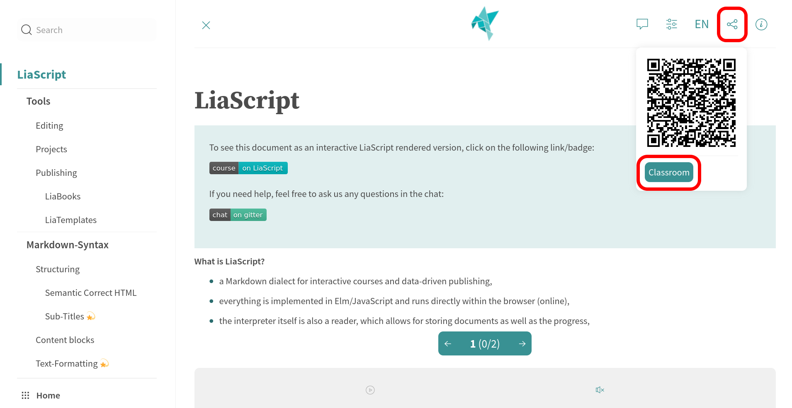


                               --{{1}}--
When you click onto the classroom button, you should be presented with the classroom settings, where you have to choose one backend service.
We would prefer to use [GunDB](https://gun.eco).
Some services like [Beaker](https://beakerbrowser.com) require you to run your course from another browser, or you will have different settings.

          {{1-2}}


                               --{{2}}--
We provide different information for the different services that can be applied.
However, what is similar to all is that you have to define a room name that must be unique.
To help you, you can click onto the circle arrow symbol and a name will be generated randomly for you.
The passwords are optional.

          {{2-3}}
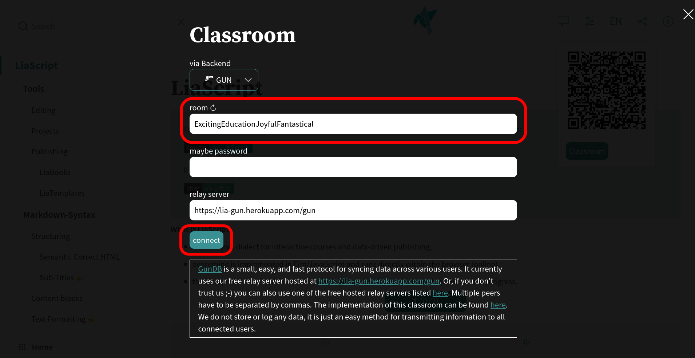


                               --{{3}}--
If you then click onto connect and a connection could be established, the classroom settings will be closed automatically.
Otherwise, an error message should be provided.
If everything worked fine, you will see, at least one user within the classroom and the URL of your course will have changed.
You can now either share the new URL, which contains all required configurations, or you can send the room name and the password and the course-URL separately to your peers.
In this case, they will have to repeat these steps.

          {{3-4}}
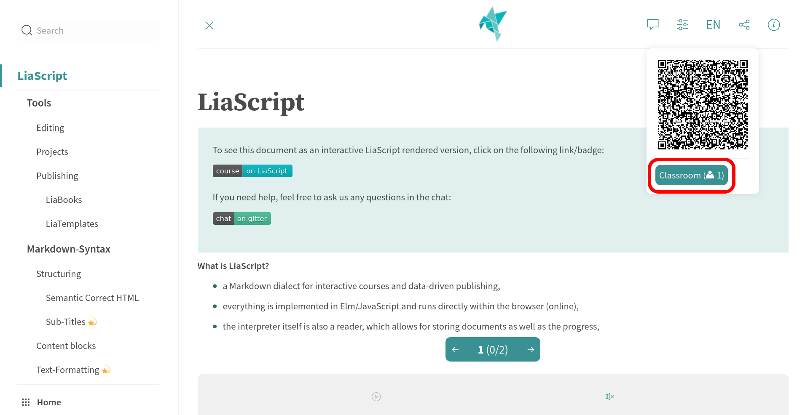


                               --{{4}}--
In order to disconnect, you will have to go to the classroom settings again and click onto the disconnect button.
Again, the URL of the course will change back to the original representation.

           {{4}}
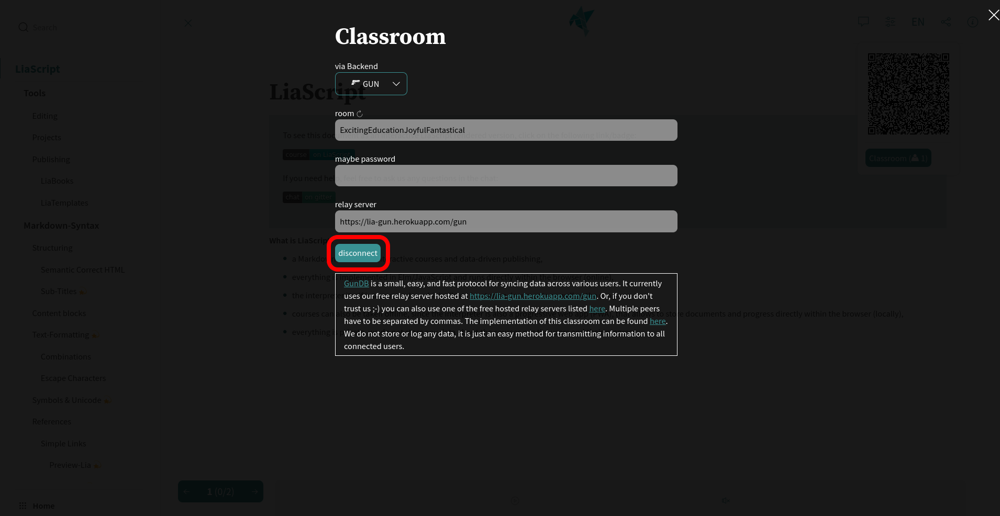

                                 {{3}}
> __Note:__
> You can try this out, if you open LiaScript on different browsers and go back to the quizzes and surveys sections.
> You should experiment a bit with the resulting presentations.
> Additionally, try to disconnect and observe the effect on the connected instances.

#### Classroom Experience

                               --{{0}}--
The following video shows how to open, share, and close a LiaScript classroom.

!?[LiaScript classroom demo](https://www.youtube.com/watch?v=Kjk6OblugXI&autoplay=true)


#### Enabling the Classrooms in any LMS

                               --{{0}}--
If you have exported your course to a [SCORM](https://en.wikipedia.org/wiki/Sharable_Content_Object_Reference_Model) or [IMS](https://www.imsglobal.org/activity/learning-tools-interoperability) package with the [LiaScript-Exporter](https://www.npmjs.com/package/@liascript/exporter) you can also establish classrooms between different users of the same course within a single [LMS](https://en.wikipedia.org/wiki/Learning_management_system) or between different ones, such as [Moodle](https://en.wikipedia.org/wiki/Moodle) or [ILIAS](https://en.wikipedia.org/wiki/ILIAS).

                               --{{1}}--
By default, the classroom-feature is disabled within any exports, but as you can disable it for your course, it is also possible to enable it.
Thus, at first, you have to enable this feature within your course, before you export it.

                                 {{1}}
``` markdown
<!--
...

classroom: enable

-->

# Your Course
```

                               --{{2}}--
Secondly, the classroom name has to be truly unique and surrounded by quotations.
By default, the URL of your Markdown file and the room-name are used to generate a unique ID for the classroom, which prevents collisions between different courses, which accidentally use the same room name.
However, by surrounding the room-name with single or double quotation marks, you instruct [LiaScript](https://liascript.github.io) to use this specific room name and to ignore the course URL.
__All the roommates have to enter exactly the same name for the classroom.__
That's it!

                                 {{2}}
**Room name:** `"This has to be a truly unique name 129281715#123"`


#### Future Classrooms

                               --{{0}}--
As already mentioned, we currently only synchronize quizzes and surveys.
Other elements will be added in the future, such as distributed pair-programming, user roles, asking questions, etc.

                                {{0-1}}
<div style="width:100%;height:0;padding-bottom:62%;position:relative;"><iframe src="https://giphy.com/embed/3otO6zntMrmhpvaYX6" width="100%" height="100%" style="position:absolute" frameBorder="0" class="giphy-embed" allowFullScreen></iframe></div><p><a href="https://giphy.com/gifs/online-education-learning-3otO6zntMrmhpvaYX6">via GIPHY</a></p>


                               --{{1}}--
If you are interested in the implementation stuff, we build classrooms with the help of [CRDTs](https://en.wikipedia.org/wiki/Conflict-free_replicated_data_type) and try to make LiaScript as backend-agnostic as possible.
You can add support for your own systems [here](https://github.com/LiaScript/LiaScript/tree/development/src/typescript/sync).

                                 {{1}}
__Implementation:__
https://github.com/LiaScript/LiaScript/tree/development/src/typescript/sync


## Effects

                               --{{0}}--
There are currently three types of effects that we call:

<!-- --{{0}}--
animations, comments, and playback functions
-->

1. Animations
2. Comments via Text-to-Speech
3. and Playback functions

                               --{{1}}--
All of these elements can be used inline and as block-level elements.
Every effect is defined by two braces:

                                 {{1}}
``` markdown
    --{{1}}--
Spoken comments.

     {{1-2}}
Blocks that appear at animation
step 1 and disappear on step 2.

     {{|>}}
To be read aloud when user clicks
the on the play button...
```

                               --{{2}}--
Animations are only visible, and comments are read aloud in "Presentation" or "Slides" mode.
If you set the mode to "Textbook", then all animations and comments will be displayed on one slide where you have placed them within the document.
In the other two modes, they are revealed step by step with each click.

                                {{3 |>}}
> __You need to balance these features properly so that your course can be read in Textbook mode and used for presentations and more.__


### Animations

                                   --{{0}}--
Animations are defined by two curly braces: one starting and one optional ending number.
They can be associated with single blocks, multiple blocks, and also inline elements.

`{{start-stop?}} | {start-stop?}{inline}`

#### Block Animations


                                   --{{0}}--
Animations can be associated with blocks by adding two curly braces above the block.
We recommend indenting the animation definition by at least 4 spaces.
Other Markdown renderers will highlight this as code, making it easier to read.

<!--  -->
``` markdown
     {{1}}
This is an example for a *single* block animations.

     {{2-3}}
This one will appear on animation step 2 and disappear on 3.

{{4}} This is also ok, but it will look be harder to spot on GitHub.
```

                               --{{2}}--
Use a starting and an ending number, if you want the element to disappear at a certain point.

__Result:__


     {{1}}
This is an example for a *single* block animations.

     {{2-3}}
This one will appear on animation step 2 and disappear on 3.


{{4}} This is also ok, but it will look be harder to spot on GitHub.


#### Multi-Block Animations

                               --{{0}}--
Similarly to quizzes, as described in section [Quiz-Solution](#solution), you can group multiple markdown blocks by lines of asterisks.
Simply add the curly braces with the animation definition above the upper line.

<!-- class="translate" translate="yes" -->
``` markdown
            {{1-2}}
************************************

This is an example...

| that     | contains |
|----------|----------|
| multiple | blocks.  |

************************************


             {{2}}
<section>

As an alternative, you can also use
HTML-tags ...


... to surround multiple blocks.

</section>
```

                               --{{1}}--
Blocks can also have a starting and disappearing number.

                               --{{2}}--
Depending on your preferred style, you can also use HTML tags to group blocks.
These will then be displayed slightly differently on [GitHub](https://github.com).

__Result:__

            {{1-2}}
************************************

This is an example...

| that     | contains |
|----------|----------|
| multiple | blocks.  |

************************************


             {{2}}
<section>

As an alternative, you can also use
HTML-tags ...


... to surround multiple blocks.

</section>


#### Inline Animations

                                   --{{0}}--
Inline effects can be used in nearly all LiaScript elements.
In this case, you will have to unpack the curly braces:
the first pair surrounds the animation definition,
while the second pair contains all inline elements that should appear and/or disappear.


``` markdown
* no effect here
* but in this line {2}{show ***second***}
* as well as this one {1-2}{show ***first*** remove on __second__}
```

* no effect here
* but in this line {2}{show ***second***}
* as well as this one {1-2}{show ***first*** remove on __second__}

<!-- --{{1}}--
Goto animation step 1.
-->

<!-- --{{2}}--
Goto animation step 2.
-->


#### Combinations & Styling

                               --{{0}}--
Animations can also be grouped freely, allowing one multi-block animation to contain multiple block animations, and one block can also contain further inline animations:

``` markdown
<!--
class="animate__animated animate__backInUp"
style="background:#CCC; padding:3rem; min-height: 40vh; border-radius: 3rem"
-->
                 {{1}}
*******************************************

This block contains {2}{multiple} inline animations.
With some
{2-3}{styled}<!-- class="animate__animated animate__flash" -->
elements as well.

<!-- class="animate__animated animate__backInDown" -->
                  {{3}}
!?[Animated paintings](https://www.youtube.com/watch?v=-DDphfCnFQc&autoplay=true)

*******************************************
```


<!--
class="animate__animated animate__backInUp"
style="background:#CCC; padding:3rem; min-height: 40vh; border-radius: 3rem"
-->
                 {{1}}
*******************************************

This block contains {2}{multiple} inline animations.
With some
{2-3}{styled}<!-- class="animate__animated animate__flash" -->
elements as well.

<!-- class="animate__animated animate__backInDown" -->
                  {{3}}
!?[Animated paintings](https://www.youtube.com/watch?v=-DDphfCnFQc&autoplay=true)

*******************************************


                               --{{4}}--
Any kind of CSS can also be added to an animation, as described in the section on [Custom Styling](#custom-styling).
Additionally, we have included an additional CSS stylesheet in the main HTML comment of this document.
This will load [Animate CSS](https://animate.style/#documentation), but you can use any other CSS library or custom styling as well.

                                 {{4}}
*******************************************************************************

__Animate.css documentation:__ https://animate.style


``` markdown
<!--
author: ...

link:   https://cdnjs.cloudflare.com/ajax/libs/animate.css/4.1.1/animate.min.css
-->

# LiaScript
```
*******************************************************************************

### Comments: Text 2 Speech

                               --{{0}}--
The idea of a comment is that they should be associated with animations.
When animation $x$ is revealed, then the comment $x$ is read aloud.
Similar to a PowerPoint presentation, when one element appears and the presenter says something, then clicks and the next element appears and is also commented.
Thus, a comment is a paragraph that is marked by two sets of curly braces, which contain a number, and two dashes around the braces.
If multiple comments have the same number, then they will be replayed in the order of appearance.


``` markdown
          --{{1}}--
This will be spoken out loud.

          --{{2}}--
This will be spoken out loud too,
but at animation step 2.

          --{{2}}--
Don't forget me.

            {{1}}
__I am animation 1 {2}{and 2 too}.__
```

          --{{1}}--
This will be spoken out loud.

          --{{2}}--
This will be spoken out loud too,
but at animation step 2.

          --{{2}}--
Don' forget me.

            {{1}}
__I am animation 1 {2}{and 2 too}.__


                               --{{3}}--
If you change the presentation mode, you will notice that these comments will be displayed in place in "Textbook" mode.
In "Slides" mode, they will also be presented to the user, while they will be hidden in "Presentation" mode.
If you switch off the sound, then this is the mode that can be used for presenting content, while the others can be used for self-studying.

#### Voices & Language
<!--
narrator: UK English Male
@Tanja:   Russian Female
-->

                               --{{0}}--
__But where does the voice come from?__
In LiaScript, within the initial comment, you can use the `language` macro to define the document translation and `narrator` to define the default voice.
Currently, we are using [responsivevoice](https://responsivevoice.org) as a backup solution if your browser does not support text-to-speech.
Otherwise, your default browser and operating system text-to-speech is utilized, which can vary across browsers and systems.
Within the settings, it is possible to switch between the browser and backup TTS.
It is possible to change the `narrator` on different layers: globally within the main comment tag, per slide, and also per comment, by inserting the voice into the comment definition.


1. Backup Speech-Engine: https://responsivevoice.org
2. Default `narrator` must be defined within the initial comment, otherwise `US English Male` is used
3. You can overwrite the default `narrator` per slide, by attaching a comment to the title tag
4. Use `--{{number}}--` to indicate what is spoken and when
5. Use `--{{number voice}}--` to change the voice for this particular comment
6. It is also possible to define custom macros for language definitions
7. You can have multiple comments with the same number, those will be combined, but only the voice of the first one is used
8. See a complete list of all supported voices in section [`narrator`](#narrator)

---

``` markdown
<!--
author:   ...
language: en
narrator: US English Male
-->

# Title

...

#### Voices & Language
<!--
narrator: UK English Female
@Tanja:   Russian Female
-->

                    --{{1}}--
The entire ***Markdown*** paragraph right below the effect definition in double
minus notation is sent to responsivevoice to speak the text out loud in
`Presentation` or `Slides` mode.

                    --{{3 Deutsch Female}}--
Markdown ist eine vereinfachte Auszeichnungssprache, die von John Gruber und
Aaron Swartz entworfen und im Dezember 2004 mit Version 1.0.1 spezifiziert ...

                    --{{4 @Tanja}}--
«Для торжества зла достаточно бездействия хороших людей».
```

---

                    --{{1}}--
The entire ***Markdown*** paragraph right below the effect definition in double
minus notation is sent to responsivevoice to speak the text out loud in
`Presentation` or `Slides` mode.

                    --{{3 Deutsch Female}}--
Markdown ist eine vereinfachte Auszeichnungssprache, die von John Gruber und
Aaron Swartz entworfen und im Dezember 2004 mit Version 1.0.1 spezifiziert ...

                    --{{4 @Tanja}}--
«Для торжества зла достаточно бездействия хороших людей».


#### Hidden Comments

                               --{{0}}--
Sometimes, it might be necessary to add a comment or to read a part aloud to underline a certain point, which might be necessary in the narrated mode but not in the Textbook.
Therefore, it is possible to put your TTS output into simple HTML comments.
This won't be shown to anyone and also not visible on most other Markdown parsers and renderers.

```html
<!-- --{{1}}--
Speak this out, but do not show it to anyone.
-->
```

<!-- --{{1}}--
Speak this out, but do not show it to anyone.
-->


                                 {{1}}
The associated hidden comment to this point will not be visible in Textbook mode!


#### Translations

                               --{{0}}--
If you click on the language settings, you can either click on the element "Translate with Google (experimental)" and select another language.
In this case, a JavaScript library will be injected that implements the translation feature.
As you can see from the example, not all parts will be translated.
Code blocks will not be translated by default, as well as comments that have been marked with another voice than the default.
These comments remain as they are, while LiaScript tries to find an appropriate voice for the new language and gender.

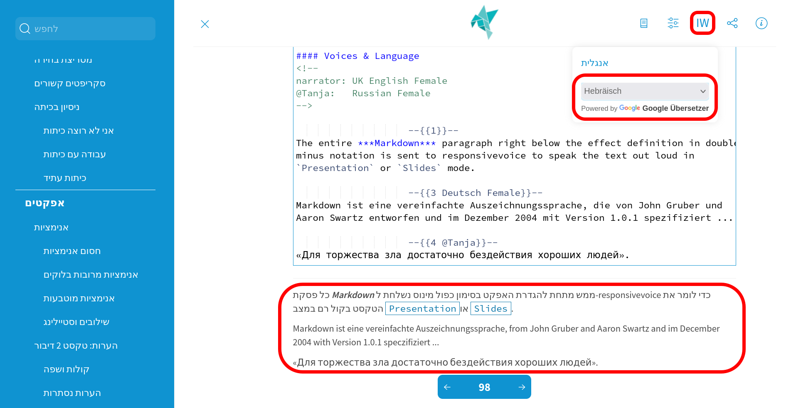

                               --{{1}}--
You can attach specific parameters to the comment that prohibit or enforce translation.
By default, Google will search for the `class` definition `translate` or `notranslate`, but other external browser plugins might also take into account the HTML5 attribute [`translate`](https://www.w3schools.com/tags/att_translate.asp).
So it is always good to use both definitions.


                                 {{1}}
``` markdown
<!-- class="notranslate" translate="no" style="color: red" -->
                    --{{2}}--
I will not be translated!

                    --{{3 Russian Female}}--
«Для торжества зла достаточно бездействия хороших людей».
```

<!-- class="notranslate" translate="no" style="color: red" -->
                    --{{2}}--
I will not be translated!

                    --{{3 Russian Female}}--
«Для торжества зла достаточно бездействия хороших людей».


                               --{{4}}--
You can attach these language attributes to any kind of Markdown block or inline element to control the translation.
Note that code environments and foreign language comments will be tagged automatically with no-translate.


### Comments: Multimedia

    {{|>}}
> At the recent [eLearning Africa Conference 2024 in Kigali, Rwanda](https://liascript.github.io/blog/elearning-africa-2024/), we recognized that relying solely on browser-based text-to-speech output is insufficient for supporting all spoken languages and dialects.
> To enhance personalization and diversify language and content, we have introduced two highly requested types of comments, which complement the existing format. Since LiaScript version 0.15.7, you can now add audio or video recordings to your comments.

#### Audio

    --{{0}}--
To play an audio file during your animation step,
simply attach the multimedia link at the end of
your comment.
?[⏯](recording/audio_1.mp3)

``` markdown
    --{{0}}--
To play an audio file during your animation step,
simply attach the multimedia link at the end of
your comment.
?[⏯](recording/audio_1.mp3)
```

    --{{1}}--
?[⏯](recording/audio_2.mp3)
Or, add it to the front.

      {{1}}
``` markdown
    --{{1}}--
?[⏯](recording/audio_2.mp3)
Or, add it to the front.

    --{{1}}--
?[⏯](recording/audio_3.mp3)
Of course, you can also combine multiple comments.
The playback will occur in the order they appear
in the document.
```

    --{{1}}--
?[⏯](recording/audio_3.mp3)
Of course, you can also combine multiple comments.
The playback will occur in the order they appear
in the document.


#### Video

    --{{0}}--
!?[⏯](recording/video1.webm)
We had a lengthy discussion and brainstorming session on where to add video content so it remains visible without affecting the user experience.
Our solution: let the user decide.
The user can choose where to place the overlaid video and adjust its size based on their screen size, orientation, and resolution.

    --{{1}}--
!?[⏯](recording/video2.webm)
To add short video content, simply include a video link at the beginning or the end of your comment.

      {{1}}
``` markdown
    --{{1}}--
!?[⏯](recording/video2.webm)
To add short video content, simply include a video
link at the beginning or the end of your comment.

    --{{1}}--
As before, you can combine multiple comments, which
will be replayed in sequence.
!?[⏯](recording/video3.webm)
```

    --{{1}}--
As before, you can combine multiple comments, which will be replayed in sequence.
!?[⏯](recording/video3.webm)

### Playback

                               --{{0}}--
Since Text2Speech output is integrated into the LiaScript notation, it can be intentionally used for language learners.
Simply add a stylized play button to the effect definition to indicate what should be spoken out loud.
You can also use different voices.

```Markdown
    {{|>}}
This entire paragraph will be spoken out __LOUD__.

    {{!> Australian Female}}
* But in this case, this can also be combined
* with a couple of
* - different
  - Markdown elements
  - whether it makes sense or not.
```

    {{|>}}
This entire paragraph will be spoken out __LOUD__.

    {{!> Australian Female}}
* But in this case, this can also be combined
* with a couple of
* - different
  - Markdown elements
  - whether it makes sense or not.


#### Playback-Blocks

                               --{{0}}--
And, as introduced for animations, you can also group multiple blocks together.
Simply add as many Markdown blocks between two lines of asterisks, and they will be interpreted as one larger block.


```markdown
<!--style="background: #EEE; padding:2rem"-->
                  {{|>}}
**************************************************
This entire paragraph will be spoken out __LOUD__.

* But in this case, this can also be combined
* with a couple of
* - different
  - Markdown elements
  - whether it makes sense or not.

**************************************************
```

<!--style="background: #EEE; padding:2rem"-->
                  {{|>}}
**************************************************
This entire paragraph will be spoken out __LOUD__.

* But in this case, this can also be combined
* with a couple of
* - different
  - Markdown elements
  - whether it makes sense or not.
**************************************************

                               --{{1}}--
As an __alternative__, you can also use an HTML tag like __`<section>`__ or __`<div>`__ to group blocks.
The LiaScript result will remain the same, but it will be rendered differently on other Markdown interpreters.

#### Playback-Inlines

                               --{{0}}--
Like in the presented example, the exclamation will not interfere with the table definition.
And as presented before, you can also use inlining for Playback elements, as it was used for animations, by simply using two pairs of braces.
Depending on your preferences and the current context, it is also possible to define the stylized play-button with a vertical line or an exclamation mark.
Like in the presented example, the exclamation will not interfere with the table definition.


```Markdown
| English              | German                            | Russian                                 | Arabic male               | Arabic female               |
| -------------------- |:--------------------------------- |:--------------------------------------- |:------------------------- | --------------------------- |
| {!>}{I go}           | {!> Deutsch Male}{ich gehe}       | {!> Russian Male}{я хожу}               | {!> Arabic Male}{أذْهبُ}  |                             |
| {!>}{you go}         | {!> Deutsch Male}{du gehst}       | {!> Russian Male}{ты ходишь}            | {!> Arabic Male}{تذْهبُ}  | {!> Arabic Female}{تذْهبين} |
| {!>}{he/she/it goes} | {!> Deutsch Male}{er/sie/es geht} | {!> Russian Male}{он / она / оно ходит} | {!> Arabic Male}{يذْهبُ}  | {!> Arabic Female}{تذْهبُ}  |
| {!>}{we go}          | {!> Deutsch Male}{wir gehen}      | {!> Russian Male}{мы ходим}             | {!> Arabic Male}{نذْهبُ}  |                             |
| {!>}{you go}         | {!> Deutsch Male}{ihr geht}       | {!> Russian Male}{вы ходите}            | {!> Arabic Male}{تذْهبون} | {!> Arabic Female}{تذْهبْن} |
| {!>}{they go}        | {!> Deutsch Male}{sie gehen}      | {!> Russian Male}{они ходят}            | {!> Arabic Male}{يذْهبون} | {!> Arabic Female}{يذْهبْن} |
```

                               --{{1}}--
The result is displayed within the table; all elements can be played on demand.

                                 {{1}}
| English              | German                            | Russian                                 | Arabic male               | Arabic female               |
| -------------------- |:--------------------------------- |:--------------------------------------- |:------------------------- | --------------------------- |
| {!>}{I go}           | {!> Deutsch Male}{ich gehe}       | {!> Russian Male}{я хожу}               | {!> Arabic Male}{أذْهبُ}  |                             |
| {!>}{you go}         | {!> Deutsch Male}{du gehst}       | {!> Russian Male}{ты ходишь}            | {!> Arabic Male}{تذْهبُ}  | {!> Arabic Female}{تذْهبين} |
| {!>}{he/she/it goes} | {!> Deutsch Male}{er/sie/es geht} | {!> Russian Male}{он / она / оно ходит} | {!> Arabic Male}{يذْهبُ}  | {!> Arabic Female}{تذْهبُ}  |
| {!>}{we go}          | {!> Deutsch Male}{wir gehen}      | {!> Russian Male}{мы ходим}             | {!> Arabic Male}{نذْهبُ}  |                             |
| {!>}{you go}         | {!> Deutsch Male}{ihr geht}       | {!> Russian Male}{вы ходите}            | {!> Arabic Male}{تذْهبون} | {!> Arabic Female}{تذْهبْن} |
| {!>}{they go}        | {!> Deutsch Male}{sie gehen}      | {!> Russian Male}{они ходят}            | {!> Arabic Male}{يذْهبون} | {!> Arabic Female}{يذْهبْن} |


#### Hiding Text
<!--
@play: {!> @0}{<span style="display: inline-block; text-indent: -10000px">@1</span>}
@en: @play(UK English Male,@0)
@de: @play(Deutsch Male,@0)
@ru: @play(Russian Female,@0)
@ar: @play(Arabic @0,@1)
-->

                               --{{0}}--
If you only want to show the play buttons but not the text, it is possible to use some HTML tricks.
The easiest way is to put your text into an HTML element and to remove it from the screen by using a `span` whose content is shifted off the screen.
Simply styling the element with `display: none` will not work, since the TTS function requires the text to be rendered within the DOM, and the translation via Google will not work if the element is not visible.


                               --{{1}}--
But, since it is possible to define custom [Macros](#macros), we can also apply a more elegant way.
We define a set of local macros directly within a comment attached to the current heading.
The `@play` macro has two parameters, one for the voice and the other for the text; the other macros are simply shortcuts for the voice that pass the text as the second parameter to the `@play` macro.
Within the Arabic macro, it is also possible to define the gender of the narrator.

                                 {{1}}
``` Markdown
#### Hiding Text
<!--
@play: {!> @0}{<span style="display: inline-block; text-indent: -10000px">@1</span>}
@en: @play(UK English Male,@0)
@de: @play(Deutsch Male,@0)
@ru: @play(Russian Female,@0)
@ar: @play(Arabic @0,@1)
-->

| go        |         EN          |         DE          |            RU             |      AR male      |      AR female      |
| --------- |:-------------------:|:-------------------:|:-------------------------:|:-----------------:|:-------------------:|
| I         |      @en(I go)      |    @de(ich gehe)    |        @ru(я хожу)        | @ar(Male,أذْهبُ)   |                     |
| you       |     @en(you go)     |    @de(du gehst)    |      @ru(ты ходишь)       | @ar(Male,تذْهبُ)   | @ar(Female,تذْهبين) |
| he/she/it | @en(he/she/it goes) | @de(er/sie/es geht) | @ru(он / она / оно ходит) | @ar(Male,يذْهبُ)   | @ar(Female,تذْهبُ)   |
| we        |     @en(we go)      |   @de(wir gehen)    |       @ru(мы ходим)       | @ar(Male,نذْهبُ)   |                     |
| you       |     @en(you go)     |    @de(ihr geht)    |      @ru(вы ходите)       | @ar(Male,تذْهبون) | @ar(Female,تذْهبْن)  |
| they      |    @en(they go)     |   @de(sie gehen)    |      @ru(они ходят)       | @ar(Male,يذْهبون) | @ar(Female,يذْهبْن)  |

```

                               --{{3}}--
The outcome is a table with playback buttons only, where the text is concealed, and the primary language will be translated while the other languages remain unchanged.


                                 {{3}}
| go        |         EN          |         DE          |            RU             |      AR male      |      AR female      |
| --------- |:-------------------:|:-------------------:|:-------------------------:|:-----------------:|:-------------------:|
| I         |      @en(I go)      |    @de(ich gehe)    |        @ru(я хожу)        | @ar(Male,أذْهبُ)  |                     |
| you       |     @en(you go)     |    @de(du gehst)    |      @ru(ты ходишь)       | @ar(Male,تذْهبُ)  | @ar(Female,تذْهبين) |
| he/she/it | @en(he/she/it goes) | @de(er/sie/es geht) | @ru(он / она / оно ходит) | @ar(Male,يذْهبُ)  | @ar(Female,تذْهبُ)  |
| we        |     @en(we go)      |   @de(wir gehen)    |       @ru(мы ходим)       | @ar(Male,نذْهبُ)  |                     |
| you       |     @en(you go)     |    @de(ihr geht)    |      @ru(вы ходите)       | @ar(Male,تذْهبون) | @ar(Female,تذْهبْن) |
| they      |    @en(they go)     |   @de(sie gehen)    |      @ru(они ходят)       | @ar(Male,يذْهبون) | @ar(Female,يذْهبْن) |

#### Animations to Playback

                               --{{0}}--
Since we are utilizing the double braces notation for playback elements, this can also be combined with animations by adding appearance and disappearance numbers.
Depending on the current state of the animation, this will result in different sentences.


```Markdown
    {{1 |>}}
This is an example where {|> 1-2}{I go} _{|> 2}{I am going}_ to work.
```

                               --{{1}}--
You need to keep in mind that this will function as intended only if the user is not in Textbook mode.
Otherwise, all elements will be read out loud, and nothing will be hidden.

    {{1 |>}}
This is an example where {|> 1-2}{I go} _{|> 2}{I am going}_ to work.


## Fun with Tables

    --{{0}}--
As previously noted, tables serve not only as structural elements within a Markdown document but also as datasets.
In essence, there's minimal distinction between a diagram and a collection of values.


      9 |                                       (* dots)
        |
      y |                              *
      - |
      a |                    *
      x |
      i |          *
      s |
        |*
      0 +------------------------------------
        0            x-axis                 36

    --{{1}}--
The same values can be collected within a list.
By clicking on the small icon above this list, you will obtain the same plot as depicted previously.

      {{1}}
|   x | dots |
| ---:| ----:|
|   0 |    0 |
|  10 |    2 |
|  20 |    4 |
|  30 |    6 |

    --{{2}}--
One of the most significant challenges in science is the scarcity of primary data.
Initiatives like the Open Science Framework (http://osf.io) aim to address this issue by providing a platform where scientists can store and document extensive datasets.
However, rather than relying on external tools to create visualizations, why not directly incorporate and visualize the data?
This would enable others to utilize and examine the data more readily.

    --{{3}}--
Everyone who creates or utilizes data and incorporates it into Markdown is already engaging in some form of configuration.
Leveraging the structural settings of tables or data, we can __automatically visualize data__.
It's rather surprising that Markdown tables have not been treated as datasets before.
The following sections aim to provide a brief overview of various visualization options and how the system determines which one to apply.
Additionally, you have the flexibility to enforce your preferred visualization style.


### `LinePlot`

    --{{0}}--
The following dataset, sourced from https://ourworldindata.org, illustrates government expenditure on education as a percentage of GDP.
The first column represents the x-values, while the subsequent columns denote different categories.

    --{{1}}--
If you click on the image icon again, you'll encounter a more elaborate representation complete with a title and labels.

<!--
data-title="Government expenditure on education"
data-xlabel="year"
data-ylabel="% of GDP"
-->
| Year | Finland |     USA | Germany |   China |
| ---- | -------:| -------:| -------:| -------:|
| 1995 | 6.80942 |         | 4.42079 | 1.84192 |
| 1996 | 6.86052 |         | 4.48319 | 1.85338 |
| 1997 |         |         |         |         |
| 1998 |         |         | 4.45345 | 1.84432 |
| 1999 | 5.86960 |         |         | 1.88803 |
| 2000 | 5.71687 |         |         |         |
| 2001 | 5.84797 |         |         |         |
| 2002 | 6.02477 |         |         |         |
| 2003 | 6.17476 |         |         |         |
| 2004 | 6.16849 |         |         |         |
| 2005 | 6.03605 |         |         |         |
| 2006 | 5.93809 |         | 4.27930 |         |
| 2007 | 5.68608 |         | 4.34302 |         |
| 2008 | 5.84676 |         | 4.40954 |         |
| 2009 | 6.48517 |         | 4.88047 |         |
| 2010 | 6.54070 | 5.42001 | 4.91368 |         |
| 2011 | 6.48200 | 5.22389 | 4.80779 |         |
| 2012 | 7.19254 | 5.19485 | 4.93331 |         |
| 2013 | 7.15848 | 4.94378 | 4.93496 |         |
| 2014 | 7.15155 | 4.98948 | 4.93112 |         |

https://ourworldindata.org/financing-education#all-charts-preview


    --{{2}}--
The rationale behind this functionality is that you can incorporate additional settings, similar to how different Markdown elements are styled, by simply attaching an HTML comment to the beginning of the table.
The type of representation is still automatically determined based on the table structure.
However, you can still add attributes like `data-title`, `data-xlabel`, and `data-ylabel` to adjust the graphical representation. Refer to the section [Attributes](#attributes) for more detailed information.

      {{2}}
``` markdown
<!--
data-title="Government expenditure on education"
data-xlabel="year"
data-ylabel="% of GDP"
-->
| Year | Finland | USA | Germany |   China |
| ---- | -------:| ---:| -------:| -------:|
| 1995 | 6.80942 |     | 4.42079 | 1.84192 |
| 1996 | 6.86052 |     | 4.48319 | 1.85338 |
| ...  |     ... | ... |     ... |     ... |
```

    --{{3}}--
Certainly, you can visualize any type of table that doesn't adhere to the classification of a line or ScatterPlot.
Let's define another type of presentation, such as a bar chart.
If not all values within the first column can be parsed as numbers, they are interpreted as categories.
Additionally, if you change the order of the table, the order of categories in the visualization will also change accordingly.

      {{3}}
``` md
| Animal          | weight in kg | Lifespan years | Mitogen |
| --------------- | ------------:| --------------:| -------:|
| Mouse           |        0.028 |              2 |      95 |
| Flying squirrel |        0.085 |             15 |      50 |
| Brown bat       |        0.020 |             30 |      10 |
| Sheep           |           90 |             12 |      95 |
| Human           |           68 |             70 |      10 |
```

      {{3}}
| Animal          | weight in kg | Lifespan years | Mitogen |
| --------------- | ------------:| --------------:| -------:|
| Mouse           |        0.028 |              2 |      95 |
| Flying squirrel |        0.085 |             15 |      50 |
| Brown bat       |        0.020 |             30 |      10 |
| Sheep           |           90 |             12 |      95 |
| Human           |           68 |             70 |      10 |


### `ScatterPlot`

    --{{0}}--
If your table resembles that of a LinePlot, but the first column contains numbers that appear twice or more times, then this data cannot be interpreted as a "function" in a mathematical sense.
In this case, the data is simply visualized as a ScatterPlot, displaying only the dots without connecting lines.

```
| Random |    I |  II |
| ------:| ----:| ---:|
|    5.0 |  1.0 |   5 |
|    ... |      |     |
|    5.0 | 10.0 |   7 |
|    ... |      |     |
```

| Random |    I |  II |
| ------:| ----:| ---:|
|    5.0 |  1.0 |   5 |
|    6.0 |  1.0 |   4 |
|    7.0 |  1.0 |   5 |
|    8.0 |  1.0 |   5 |
|    9.0 |  1.0 |   4 |
|   10.0 |  1.0 |   5 |
|    5.0 | 10.0 |   7 |
|    6.0 | 10.0 |   8 |
|    7.0 | 10.0 |   7 |
|    8.0 | 10.0 |   7 |
|    9.0 | 10.0 |   8 |
|   10.0 | 10.0 |   7 |


### `BoxPlot`

    --{{0}}--
If you have a dataset presented in a ScatterPlot-like format but wish to utilize this data as primary data for a BoxPlot, you can manually change the type of visualization to a BoxPlot.
This can be achieved by adding the following attribute to the beginning of your table, as demonstrated in the snippet below.
Each column is then treated as a dataset and visualized accordingly.

``` Markdown
<!-- data-type="boxplot" -->
| Random |    I |  II |
| ------:| ----:| ---:|
|    5.0 |  1.0 |   5 |
|    ... |  ... |  .. |
```

<!-- data-type="boxplot" -->
| Random |    I |  II |
| ------:| ----:| ---:|
|    5.0 |  1.0 |   5 |
|    6.0 |  1.0 |   4 |
|    7.0 |  1.0 |   5 |
|    8.0 |  1.0 |   5 |
|    9.0 |  1.0 |   4 |
|   10.0 |  1.0 |   5 |
|    5.0 | 10.0 |   7 |
|    6.0 | 10.0 |   8 |
|    7.0 | 10.0 |   7 |
|    8.0 | 10.0 |   7 |
|    9.0 | 10.0 |   8 |
|   10.0 | 10.0 |   7 |
|        |      |   1 |

### `BarChart`

    --{{0}}--
In contrast to a Line or ScatterPlot, if the first column contains at least one entry that cannot be parsed as a number, it might be represented as a BarChart.
This concept works well with the following example.
If the maximum values of the columns do not differ too much, then the dataset is represented as a BarChart.
However, if the maximum values vary significantly, you might end up seeing only one huge bar, making the other bars indistinguishable from each other.
In such cases, alternative visualizations are chosen.

``` markdown
| Animal          | weight in kg | Lifespan years | Mitogen |
| --------------- | ------------:| --------------:| -------:|
| Mouse           |        0.028 |              2 |      95 |
| Flying squirrel |        0.085 |             15 |      50 |
| Brown bat       |        0.020 |             30 |      10 |
| Sheep           |           90 |             12 |      95 |
| Human           |           68 |             70 |      10 |
```

| Animal          | weight in kg | Lifespan years | Mitogen |
| --------------- | ------------:| --------------:| -------:|
| Mouse           |        0.028 |              2 |      95 |
| Flying squirrel |        0.085 |             15 |      50 |
| Brown bat       |        0.020 |             30 |      10 |
| Sheep           |           90 |             12 |      95 |
| Human           |           68 |             70 |      10 |


### `Radar`

    --{{0}}--
If, for example, humans and sheep are removed from the dataset, then weight in kilograms would not be visible in a BarChart at all. In such a case, a RadarChart is selected.
This type of visualization allows for the analysis of data visually with different "y"-axes, accommodating for the diverse nature of the dataset.

| Animal          | weight in kg | Lifespan years | Mitogen |
| --------------- | ------------:| --------------:| -------:|
| Mouse           |        0.028 |             02 |      95 |
| Flying squirrel |        0.085 |             15 |      50 |
| Brown bat       |        0.020 |             30 |      10 |


### `PieChart`

    --{{0}}--
If you have a table with only one row filled with numbers, it will be automatically presented as a pie chart.
In this representation, the header represents the categories, while the body denotes the quantities associated with each category.


| Classic | Country | Reggae | Hip-Hop | Hard-Rock | Samba |
| -------:| -------:| ------:| -------:| ---------:| -----:|
|      50 |      50 |    100 |     200 |       350 |   250 |


    --{{1}}--
You can utilize the first column to provide additional information about your data.
If the first element of the list body contains text that cannot be directly interpreted as a number, then these two text snippets are used to define the main title and the subtitle of your chart.

      {{1}}
| Music-Style 1994 | Classic | Country | Reggae | Hip-Hop | Hard-Rock | Samba |
|:---------------- | -------:| -------:| ------:| -------:| ---------:| -----:|
| Student rating   |      50 |      50 |    100 |     200 |       350 |   250 |


#### `PieChart`(s)

    --{{0}}--
The default behavior for the table below would be to represent it as a barchart.
However, you can enforce the usage of pie charts simply by adding the attribute `piechart` into the HTML comment directly above the table:


```markdown
<!-- data-type="PieChart" -->
| Music-Style | Classic | Country | Reggae | Hip-Hop | Hard-Rock | Samba |
|:----------- | -------:| -------:| ------:| -------:| ---------:| -----:|
| 1994        |      50 |      50 |    100 |     200 |       350 |   250 |
| ...         |     ... |     ... |    ... |     ... |       ... |   ... |
```

    --{{1}}--
This instruction overrides the default behavior and ensures that the data is visualized as a piechart.
The result looks as follows:

      {{1}}
<!-- data-type="PieChart" -->
| Music-Style | Classic | Country | Reggae | Hip-Hop | Hard-Rock | Samba |
|:----------- | -------:| -------:| ------:| -------:| ---------:| -----:|
| 1994        |      50 |      50 |    100 |     200 |       350 |   250 |
| 2014        |      20 |      30 |    100 |     220 |       400 |   230 |
| demo 2034   |       5 |      12 |     98 |     293 |       345 |    32 |

##### Animating Charts

    --{{0}}--
Since data is parsed at runtime, you can also incorporate animations to dynamically change the values of the chart as you progress through your slides or navigate backward.
However, it's important to consider that this approach may not be suitable for all audiences, especially those who prefer a more traditional textbook-style presentation.

       {{1}}
| Music-Style {1-2}{1994} {2}{2014} |           Classic |           Country | Reggae |             Hip-Hop |           Hard-Rock |               Samba |
|:--------------------------------- | -----------------:| -----------------:| ------:| -------------------:| -------------------:| -------------------:|
| Student rating                    | {1-2}{50} {2}{20} | {1-2}{50} {2}{30} |    100 | {1-2}{200} {2}{220} | {1-2}{350} {2}{400} | {1-2}{250} {2}{230} |

##### Transposing Data

    --{{0}}--
If the previous table was too long and you prefer to condense it into two columns and grow your data vertically, you can use the attribute `data-transpose`, which mirrors your data along an imaginary vertical axis.
This allows you to present your data in a more compact format.


```markdown
<!-- data-transpose -->
| Music-Style {1-2}{1994} {2}{2014} |    Student rating |
|:--------------------------------- | -----------------:|
| Classic                           | {1-2}{50} {2}{20} |
| Country                           | {1-2}{50} {2}{30} |
| ...                               |               ... |
```

    --{{1}}--
The result remains the same as above, but organizing your data in this transposed format might make it easier to handle and interpret.

      {{1}}
<!-- data-transpose -->
| Music-Style {1-2}{1994} {2}{2014} |      Student rating |
|:--------------------------------- | -------------------:|
| Classic                           |   {1-2}{50} {2}{20} |
| Country                           |   {1-2}{50} {2}{30} |
| Reggae                            |                 100 |
| Hip-Hop                           | {1-2}{200} {2}{220} |
| Hard-Rock                         | {1-2}{350} {2}{400} |
| Samba                             | {1-2}{250} {2}{230} |

### `Funnel`

    --{{0}}--
The Funnel is a similar representation to the PieChart, but it is not selected automatically.
If you wish to use the funnel visualization, you'll need to set the `data-type` parameter to "funnel".

``` markdown
<!-- data-type="funnel" -->
| Classic | Country | Reggae | Hip-Hop | Hard-Rock | Samba |
| -------:| -------:| ------:| -------:| ---------:| -----:|
|      50 |      50 |    100 |     200 |       350 |   250 |
```

<!-- data-type="funnel" -->
| Classic | Country | Reggae | Hip-Hop | Hard-Rock | Samba |
| -------:| -------:| ------:| -------:| ---------:| -----:|
|      50 |      50 |    100 |     200 |       350 |   250 |

     --{{1}}--
The process for using effects to generate animated diagrams remains the same as for pie charts.

       {{1}}
<!-- data-type="funnel" data-transpose -->
| Music-Style {1-2}{1994} {2}{2014} |      Student rating |
|:--------------------------------- | -------------------:|
| Classic                           |   {1-2}{50} {2}{20} |
| Country                           |   {1-2}{50} {2}{30} |
| Reggae                            |                 100 |
| Hip-Hop                           | {1-2}{200} {2}{220} |
| Hard-Rock                         | {1-2}{350} {2}{400} |
| Samba                             | {1-2}{250} {2}{230} |


### `Map`

    --{{0}}--
A map visualization is akin to a BarChart in terms of the table structure.
However, if you intend to depict your data on an actual map, you'll need to include a GeoJSON file containing all relevant geographic information about the shapes of your countries, states, cities, etc.
The first column of your table must match the names of the objects in your GeoJSON data, which is attached to your table as follows:

``` markdown
<!-- data-type="map" data-src="https://code.highcharts.com/mapdata/custom/europe.geo.json" -->
| Country                | percent |
| ---------------------- | ------- |
| Albania                | 73.5    |
| Andorra                | 98.9    |
```


<!-- style="height: 600px" data-type="map" data-src="https://code.highcharts.com/mapdata/custom/europe.geo.json" -->
| Country                | percent |
| ---------------------- | ------- |
| Albania                | 73.5    |
| Andorra                | 98.9    |
| Armenia                | 72.4    |
| Austria                | 87.9    |
| Azerbaijan             | 79.8    |
| Belarus                | 79.7    |
| Belgium                | 93.9    |
| Bosnia and Herzegovina | 80.8    |
| Bulgaria               | 66.7    |
| Croatia                | 91.5    |
| Cyprus                 | 84.4    |
| Czech Republic         | 87.7    |
| Denmark                | 97.8    |
| Estonia                | 97.9    |
| Finland                | 94.0    |
| France                 | 92.3    |
| Georgia                | 68.1    |
| Germany                | 96.0    |
| Greece                 | 72.9    |
| Hungary                | 89.0    |
| Iceland                | 99.0    |
| Ireland                | 91.9    |
| Italy                  | 92.5    |
| Latvia                 | 87.1    |
| Liechtenstein          | 98.1    |
| Lithuania              | 90.9    |
| Luxembourg             | 97.8    |
| Macedonia              | 79.2    |
| Malta                  | 83.1    |
| Moldova                | 76.1    |
| Monaco                 | 97.5    |
| Montenegro             | 71.5    |
| Netherlands            | 95.6    |
| Norway                 | 98.4    |
| Poland                 | 78.2    |
| Portugal               | 78.2    |
| Republic of Serbia     | 73.4    |
| Romania                | 73.8    |
| Russia                 | 80.9    |
| San Marino             | 60.2    |
| Slovakia               | 84.9    |
| Slovenia               | 79.9    |
| Spain                  | 92.5    |
| Sweden                 | 96.4    |
| Switzerland            | 93.7    |
| Turkey                 | 83.3    |
| Ukraine                | 93.4    |
| United Kingdom         | 94.9    |
| Vatican City           | 60.1    |

> Currently, there is only support for visualizing one column, but this limitation will be addressed in future updates, allowing for more comprehensive visualizations of multi-column data.


### `HeatMap`

    --{{0}}--
Another type of visualization is a HeatMap, which is utilized when the table header and the first column exclusively contain numerical values, essentially representing coordinates.
However, if you prefer to use categories instead of numerical coordinates, you can enforce the usage of a HeatMap by adding the following comment:

``` markdown
<!--
data-type="heatmap"
data-title="Seattle mean temperature in Fahrenheit"
data-show
-->
| Seattle |  Jan |  Feb |  Mar |  Apr |  May |  ... |
| -------:| ----:| ----:| ----:| ----:| ----:| ----:|
|       0 | 40.7 | 41.5 | 43.6 | 46.6 | 51.4 |  ... |
|       2 |  ... |  ... |  ... |  ... |  ... |  ... |

```

    --{{1}}--
The attribute `data-show` simply displays the diagram by default, rather than using the table as the primary representation.

      {{1}}
<!--
data-type="heatmap"
data-title="Seattle mean temperature in Fahrenheit"
data-show
-->
| Seattle |  Jan |  Feb |  Mar |  Apr |  May |  Jun |  Jul |   Aug |  Sep |  Oct |  Nov |  Dec |
| -------:| ----:| ----:| ----:| ----:| ----:| ----:| ----:| -----:| ----:| ----:| ----:| ----:|
|       0 | 40.7 | 41.5 | 43.6 | 46.6 | 51.4 | 56.0 | 60.5 |  61.2 | 57.0 | 50.1 | 44.1 | 39.6 |
|       2 | 40.2 | 40.7 | 42.7 | 45.3 | 50.0 | 54.4 | 58.5 |  59.2 | 55.4 | 49.2 | 43.5 | 39.3 |
|       4 | 39.7 | 40.0 | 41.9 | 44.4 | 48.9 | 53.2 | 57.0 |  57.7 | 54.2 | 48.6 | 43.1 | 38.9 |
|       6 | 39.6 | 39.5 | 41.3 | 44.2 | 49.5 | 54.2 | 57.8 |  57.4 | 53.6 | 48.2 | 42.8 | 38.7 |
|       8 | 39.6 | 39.9 | 42.9 | 47.1 | 52.7 | 57.3 | 61.3 |  61.1 | 56.7 | 49.5 | 43.1 | 38.7 |
|      10 | 41.3 | 42.7 | 46.4 | 50.7 | 56.4 | 60.9 | 65.2 |  65.4 | 60.9 | 52.8 | 45.5 | 40.4 |
|      12 | 43.8 | 46.0 | 49.5 | 53.8 | 59.6 | 64.3 | 69.4 |  69.8 | 65.1 | 56.0 | 47.8 | 42.6 |
|      14 | 45.1 | 47.7 | 51.3 | 55.9 | 61.9 | 66.9 | 72.6 |  73.2 | 67.7 | 57.8 | 48.8 | 43.6 |
|      16 | 44.5 | 47.5 | 51.4 | 55.9 | 62.3 | 67.5 | 73.9 |  74.3 | 68.2 | 57.4 | 47.8 | 42.6 |
|      18 | 42.6 | 44.7 | 48.7 | 53.8 | 60.3 | 65.9 | 72.3 |  72.2 | 64.6 | 53.9 | 46.0 | 41.2 |
|      20 | 42.0 | 43.3 | 46.4 | 50.2 | 56.0 | 61.4 | 66.9 |  66.6 | 60.7 | 52.3 | 45.2 | 40.7 |
|      22 | 41.4 | 42.5 | 45.0 | 48.3 | 53.5 | 58.2 | 63.2 |  63.5 | 58.7 | 51.1 | 44.5 | 40.1 |

    {{1}}
https://datavizpyr.com/heatmaps-with-seaborn-in-python/

### `Parallel`

    --{{0}}--
A Parallel representation is employed when there are simply too many categories, making a BarChart impractical due to the resulting thin lines.

<!-- data-show -->
| Country                |    GDP growth (%) | Births per woman | Life expectancy at birth (years) | Population ages >= 65 (%) | Pop. ages 15-64 (%) | Pop ages 0-14 (%) | Pop (total) |
| ---------------------- | -----------------:| ----------------:| --------------------------------:| --------------------------:| -------------------:| -----------------:| -----------:|
| Albania                |               7.5 |            1.858 |                 76.6337073170732 |            9.3330694913874 |    66.4522208535245 |  24.2147096550882 |     3143291 |
| Andorra                |  3.57073718591123 |            1.260 |                              NaN |                        NaN |                 NaN |               NaN |     83810.5 |
| Austria                |  2.17880778069679 |            1.414 |                 80.4475609756098 |           17.0078802490015 |    67.7942859199021 |  15.1978338310964 |     8336926 |
| Belarus               | 11.29603925282670 |            1.420 |                 70.6328780487805 |           13.8161084682917 |    71.3440867491758 |  14.8398047825325 |     9680850 |
| Belgium                |  1.00416891576425 |            1.820 |                 80.1095609756098 |           17.2425951179457 |    65.9073170003941 |  16.8500878816601 |    10708433 |
| Bosnia and Herzegovina |  5.41999999999929 |            1.209 |                 75.1063170731708 |           13.7875788575916 |    70.5586044787057 |  15.6538166637027 |     3773100 |
| Bulgaria               |  6.21712220063873 |            1.478 |                 73.3165853658537 |           17.3328904412356 |    69.2610054713067 |  13.4061040874577 |     7623395 |
| Channel Islands        |               NaN |              NaN |                              NaN |                        NaN |                 NaN |               NaN |         NaN |
| Croatia                |  2.35925308110710 |            1.470 |                 75.9121951219512 |           17.1754953634927 |    67.5174504975681 |  15.3070541389392 |     4434000 |
| Czech Republic         |  2.46366103329814 |            1.497 |                 77.2112195121951 |           14.6644147081870 |    71.1889763214880 |  14.1466089703250 |    10424336 |
| Denmark                | -0.86969912719333 |            1.892 |                 78.7004878048781 |           15.9364325701275 |    65.6692750948847 |  18.3942923349878 |     5493621 |
| Estonia                | -5.12891873578752 |            1.661 |                 73.9731707317073 |           16.9573479430650 |    68.0747344729978 |  14.9679175839372 |     1340675 |
| Faroe Islands          |               NaN |              NaN |                              NaN |                        NaN |                 NaN |               NaN |       48511 |
| Finland                |  0.92209645431238 |            1.846 |                 79.7919512195122 |           16.5283868561977 |    66.6427434111131 |  16.8288697326892 |     5313399 |
| France                 |  0.21695181782435 |            1.998 |                 81.5204878048781 |           16.6134150592142 |    64.9880225189894 |  18.3985624217964 |    62277432 |
| Germany                |  0.98801573506542 |            1.376 |                 80.0885365853659 |           19.9652972040776 |    66.3351760329956 |  13.6995267629268 |    82110097 |
| Greece                 |  2.01498162894308 |            1.506 |                 79.9631707317073 |           18.1870521529388 |    67.5883962990861 |  14.2245515479751 |    11237094 |
| Hungary                |  0.59999999999994 |            1.352 |                 74.0090243902439 |           16.0592099507043 |    68.9813743902960 |  14.9594156589996 |    10038188 |
| Iceland                |  0.95512219949856 |            2.140 |                 81.5751219512195 |           11.6851788453979 |    67.3938402627208 |  20.9209808918813 |      317414 |
| Ireland                | -3.03575424255612 |            2.100 |                 79.8568292682927 |           11.1093456408398 |    68.3358023622894 |  20.5548519968708 |     4425675 |
| Isle of Man            |               NaN |              NaN |                              NaN |                        NaN |                 NaN |               NaN |         NaN |
| Italy                  | -1.31844836660481 |            1.414 |                 81.9452097560976 |           20.0909973618083 |    65.7289363852644 |  14.1800662529273 |    59832179 |
| Kosovo                 |               NaN |              NaN |                              NaN |                        NaN |                 NaN |               NaN |         NaN |
| Latvia                 | -4.55213597961080 |            1.453 |                 72.2382926829268 |           17.1863911389844 |    69.0425815911418 |  13.7710272698738 |     2266094 |
| Liechtenstein          |  1.79808929851180 |            1.400 |                 82.6341463414634 |                        NaN |                 NaN |               NaN |       35629 |
| Lithuania              |  2.76144078921502 |            1.470 |                 71.8217073170732 |           15.9677094440150 |    68.7509466357882 |  15.2813439201968 |     3358115 |
| Luxembourg             |  0.03220273485962 |            1.605 |                 80.5246341463415 |           14.0365040657173 |    67.9773784654310 |  17.9861174688517 |      488650 |
| Macedonia              |  4.80000000000011 |            1.438 |                 74.2113170731707 |           11.5845850425847 |    69.9825898844976 |  18.4328250729177 |     2041342 |
| Malta                  |               NaN |              NaN |                              NaN |                        NaN |                 NaN |               NaN |         NaN |
| Moldova                |  7.76484641287229 |            1.495 |                 68.4371463414634 |           11.1369548727738 |    71.6754849214449 |  17.1875602057813 |     3633369 |
| Monaco                 |               NaN |              NaN |                              NaN |                        NaN |                 NaN |               NaN |         NaN |
| Republic of Montenegro |               NaN |              NaN |                              NaN |                        NaN |                 NaN |               NaN |         NaN |
| Netherlands            |  1.99580842581707 |            1.775 |                 80.4007317073171 |           14.7235949405444 |    67.3305328508120 |  17.9458722086436 |    16445593 |
| Norway                 |  1.81507058553292 |            1.960 |                 80.7414634146342 |           14.6455888097593 |    66.2064766744808 |  19.1479345157599 |     4768212 |
| Poland                 |  5.00408460108383 |            1.390 |                 75.5331707317073 |           13.3256480555872 |    71.4634305149354 |  15.2109214294774 |    38125759 |
| Portugal               | -0.03467455605676 |            1.374 |                 79.2497560975610 |           17.5012814880078 |    67.1365409199047 |  15.3621775920875 |    10622413 |
| San Marino             |               NaN |              NaN |                              NaN |                        NaN |                 NaN |               NaN |         NaN |
| Serbia                 |  5.51795169957776 |            1.400 |                 73.6365853658537 |           14.5167655385706 |    67.6335858157006 |  17.8496486457288 |     7350221 |
| Slovakia               |  6.17046824289093 |            1.320 |                 74.8107317073171 |           11.9677699353106 |    72.3868259638361 |  15.6454041008533 |     5406626 |
| Slovenia               |  3.49251997044142 |            1.528 |                 78.9739024390244 |           16.0267556735963 |    70.1117152095851 |  13.8615291168186 |     2021316 |
| Spain                  |  0.85776978982683 |            1.461 |                 81.0880487804878 |           16.9394050582152 |    68.3398363315641 |  14.7207586102207 |    45555716 |
| Sweden                 | -0.40879886604371 |            1.910 |                 81.2371707317073 |           17.7223651519496 |    65.5617228818501 |  16.7159119662004 |     9219637 |
| Switzerland            |  1.89715399119828 |            1.480 |                 82.1617073170732 |           16.6721873799941 |    67.8197089730996 |  15.5081036469063 |     7647675 |
| Ukraine                |  2.09999999999999 |            1.390 |                 68.2514634146342 |           15.9037623084261 |    70.1546462864768 |  13.9415914050970 |    46258200 |
| United Kingdom         |  0.54791121956627 |            1.940 |                 79.9033658536585 |           16.3019124620612 |    66.1561282590033 |  17.5419592789355 |    61406928 |
| Montenegro             |  6.89999999999999 |            1.642 |                 74.0975365853659 |           12.8497239486590 |    67.5957824239814 |  19.5544936273596 |      622344 |
| Isle of Man            |               NaN |              NaN |                              NaN |                        NaN |                 NaN |               NaN |       80543 |
| Romania                |  9.42580218461200 |            1.350 |                 73.3734146341464 |           14.8579664297396 |    69.8993946432444 |  15.2426389270160 |    21513622 |


### `Graph`

    --{{0}}--
If the values in the first column and the header of the table are equal, then the interpreter attempts to interpret the content of the table as an adjacency matrix, which defines a graph.
If these values are symmetrical across the diagonal, then the matrix defines an __undirected graph__.

<!-- data-title="Undirected Graph" -->
| Graph |  A  |  B  |  C  |  D  |  E  |
|:----- |:---:|:---:|:---:|:---:|:---:|
| A     |  0  |  1  |  0  |  1  |  0  |
| B     |  1  |  0  |  0  |  1  |  0  |
| C     |  0  |  0  |  0  |  0  |  0  |
| D     |  1  |  1  |  0  |  0  |  1  |
| E     |  0  |  0  |  0  |  1  |  0  |

    --{{1}}--
In contrast to this, if those values differ, then the result is simply a __directed graph__, where the values define the strength of the connections between nodes.

      {{1}}
<!-- data-title="Directed Graph" -->
| Graph |  A  |  B  |  C  |  D  |  E  |
|:----- |:---:|:---:|:---:|:---:|:---:|
| A     |  0  | 12  |  0  |  1  |  0  |
| B     | -22 |  0  |  0  | 0.4 |  0  |
| C     |  0  |  0  |  0  |  0  |  0  |
| D     |  2  | 12  |  0  |  0  |  1  |
| E     |  0  |  0  |  0  |  2  |  0  |

      {{1}}
> Unfortunately, self-referencing or multigraphs are currently not supported.


#### `Sankey`

    --{{0}}--
A Sankey diagram is a special type of directed graph that is used to visualize the flow of something, such as energy, money, or other resources, typically represented as streams or flows between nodes.

<!-- data-type="sankey" -->
| Sankey |  A  |  B  |  C  |  D  |  E  |
|:------ |:---:|:---:|:---:|:---:|:---:|
| A      |     |  2  |     |     |     |
| B      |  3  |     |     |     |     |
| C      |  1  |  1  |     |     |     |
| D      |     |  1  |  1  |     |     |
| E      |  2  |  1  |  1  |  1  |     |

https://en.wikipedia.org/wiki/Sankey_diagram

### `None`

    --{{0}}--
Simply set `data-type="none"` to prevent any kind of visualization for the corresponding table.

``` markdown
<!-- data-type="none" -->
| Sankey |  A  |  B  |  C  |  D  |  E  |
|:------ |:---:|:---:|:---:|:---:|:---:|
| A      |     |  2  |     |     |     |
| B      |  3  |     |     |     |     |
...
```

<!-- data-type="none" -->
| Sankey |  A  |  B  |  C  |  D  |  E  |
|:------ |:---:|:---:|:---:|:---:|:---:|
| A      |     |  2  |     |     |     |
| B      |  3  |     |     |     |     |
| C      |  1  |  1  |     |     |     |
| D      |     |  1  |  1  |     |     |
| E      |  2  |  1  |  1  |  1  |     |


### Attributes

* __`data-type`__

      --{{0}}--
  You can use the attribute `data-type` to overwrite the automatically identified representation with your desired one.
  The names can be taken from the presented list, and it is not relevant whether you use lower or upper case.
  This approach also enables the use of types that cannot be automatically inferred at the moment, such as Sankey or BoxPlot.
  If you do not want to show tables as diagrams, you can also use `none`, and only the table will be visible.

  * `data-type="bar|barchart"`
  * `data-type="boxplot"`
  * `data-type="funnel"`
  * `data-type="graph"`
  * `data-type="heatmap"`
  * `data-type="line|lineplot"`
  * `data-type="map"`
  * __`data-type="none"`__
  * `data-type="parallel"`
  * `data-type="pie|piechart"`
  * `data-type="radar"`
  * `data-type="sankey"`
  * `data-type="scatter|scatterplot"`

  > __Note:__ The `none` datasets will turn of the first fixed column.
  > For the other cases the table is treated as a dataset and the header and the first column will be fixed while scrolling.

        {{1}}
* __`data-show`__

      --{{1}}--
  Simply add this attribute or set it to true, if you want to visualize your data immediately, without the need to click on the switch button. However, users still retain the ability to switch to the table representation if desired.

  `<!-- data-show -->` or `<!-- data-show="true" -->`

        {{2}}
* __`data-transpose`__:

      --{{2}}--
  Similar to the mathematical sense, set this attribute or set it to true if you want to transpose rows and columns.
  One benefit is that you can, for example, use a PieChart and let your table grow vertically instead of using a horizontal layout.

  `<!-- data-transpose -->` or `<!-- data-transpose="true" -->`

        {{3}}
* __`data-title`__:

      --{{3}}--
  By default, the first cell defines the title of your diagram.
  However, if you prefer larger titles and want to avoid writing gigantic table headers, you can apply this attribute.

  `<!-- data-title="Use whatever title you want to ..." -->`

        {{4}}
* __`data-xlabel`__:

      --{{4}}--
  Similarly, as described above, you can also define the strings for the labels, in this case, for the label for the x-axis.

  `<!-- data-xlabel="Time in minutes" -->`

        {{5}}
* __`data-ylabel`__:

      --{{5}}--
  Or, in this case label for the y-axis.

  `<!-- data-ylabel="Distance in meters" -->`

        {{6}}
* __`data-xlim`__ & __`data-ylim`__:

      --{{6}}--
  The limits are automatically determined, but you can also overwrite them with the following command.

  `<!-- data-xlim="0,12.3" -->`

      --{{6}}--
  The first value is used as the minimum, the second as the maximum value.
  If you skip a number, then the automatically determined value is used.

  `<!-- data-ylim=",12" -->`

        {{7}}
* __`data-src`__:

      --{{7}}--
  Currently, this attribute is used to refer to your GeoJSON data if you use the map representation.
  However, this functionality might change in the future to allow for the loading and visualization of data directly, such as CSV files.
  See sections [Fun with Tables - Map](#map)

  `<!-- data-type="map" data-src="https://..." -->`

      --{{8}}--
  Be careful when utilizing GeoJSON files from external websites, as this may result in CORS (Cross-Origin Resource Sharing) problems.
  It's better to store these files in your own projects and refer to them directly to avoid such issues.

        {{8}}
  https://code.highcharts.com/mapdata/

        {{9}}
* __`data-sortable`__:

  By default a table is sortable by each column.
  This behavior can be turned off or on by using the `data-sortable` parameter.
  Use it as a global parameter per table by placing it into the main comment or turn it on or of within every column.
  The local column parameter will overwrite the global one.

  ```markdown
  <!-- data-sortable="false" -->
  | Header 1 | <!-- data-sortable="true" --> Header 2 |
  | :------- | :------------------------------------- |
  | Item 1   | Item 2                                 |
  | Item 5   | Item 6                                 |
  | Item 9   | Item 10                                |
  | Item 13  | Item 14                                |
  ```

        {{10}}
* __`data-orientation`__:

  Depending on the default setting for a diagram it is possible to switch between `vertical` and `horizontal` orientation.

  ```markdown
  <!-- data-orientation="horizontal" -->
  | Animal          | weight in kg | Lifespan years | Mitogen |
  | --------------- | ------------:| --------------:| -------:|
  | Mouse           |        0.028 |              2 |      95 |
  | Flying squirrel |        0.085 |             15 |      50 |
  | Brown bat       |        0.020 |             30 |      10 |
  | Sheep           |           90 |             12 |      95 |
  | Human           |           68 |             70 |      10 |
  ```

  <!-- data-orientation="horizontal" -->
  | Animal          | weight in kg | Lifespan years | Mitogen |
  | --------------- | ------------:| --------------:| -------:|
  | Mouse           |        0.028 |              2 |      95 |
  | Flying squirrel |        0.085 |             15 |      50 |
  | Brown bat       |        0.020 |             30 |      10 |
  | Sheep           |           90 |             12 |      95 |
  | Human           |           68 |             70 |      10 |

### Custom Diagrams with ECharts

    --{{0}}--
LiaScript utilizes [ECharts](https://echarts.apache.org) for the diagrams and therefore uses a custom HTML tag or web component called `lia-chart`.
You can check out examples at the following site:

https://echarts.apache.org/examples/en/index.html


    --{{1}}--
Using this tag, you can pass your diagram configuration directly as an option in JSON format or as a simple dictionary, which will be evaluated automatically.


      {{1}}
``` html
<lia-chart option="{
  title: { text: 'Two Value-Axes in Polar' },
  polar: { center: ['50%', '54%'] },
  tooltip: { trigger: 'axis',
    axisPointer: { type: 'cross' }
  },
  angleAxis: { type: 'value', startAngle: 0 },
  radiusAxis: { min: 0 },
  series: [{ coordinateSystem: 'polar',
    name: 'line',
    type: 'line',
    showSymbol: false,
    data: (function() {
      const data = [];
      for (let i = 0; i <= 360; i++) {
        let t = (i / 180) * Math.PI;
        let r = Math.sin(2 * t) * Math.cos(2 * t);
        data.push([r, i]);
      }
      return data
    })()
  }],
  animationDuration: 2000
}"></lia-chart>
```

    --{{2}}--
This approach allows you to rebuild nearly every example directly, providing flexibility and ease of customization.

      {{2}}
<lia-chart option="{
  title: { text: 'Two Value-Axes in Polar' },
  polar: { center: ['50%', '54%'] },
  tooltip: { trigger: 'axis',
    axisPointer: { type: 'cross' }
  },
  angleAxis: { type: 'value', startAngle: 0 },
  radiusAxis: { min: 0 },
  series: [{ coordinateSystem: 'polar',
    name: 'line',
    type: 'line',
    showSymbol: false,
    data: (function() {
      const data = [];
      for (let i = 0; i <= 360; i++) {
        let t = (i / 180) * Math.PI;
        let r = Math.sin(2 * t) * Math.cos(2 * t);
        data.push([r, i]);
      }
      return data
    })()
  }],
  animationDuration: 2000
}"></lia-chart>


      {{3}}
<section>

    --{{3}}--
If you require the execution of JavaScript or need more interaction with the diagram, you can also apply `script` tags. For more information on this, refer to section [JavaScript or JS-Components](#JavaScript-or-JS-Components).


$a =$ <script input="range" step="1" min="-1" max="6" value="2"  output="a">@input</script>,
$b =$ <script input="range" step="0.1" min="-10" max="10" value="0"  output="b">@input</script>,
$c =$ <script modify="false" input="range" step="0.1" min="-10" max="10" value="0"  output="c">@input</script>

<script modify="false" run-once style="display: inline-block; width: 100%">
"LIASCRIPT: ### $$f(x) = x^{@input(`a`)} + x * @input(`b`) + @input(`c`)$$"
</script>

<script run-once style="display: inline-block; width: 100%">
function func(x) {
    return Math.pow(x,  @input(`a`)) + @input(`b`) * x + @input(`c`);
}

function generateData() {
    let data = [];
    for (let i = -15; i <= 15; i += 0.01) {
        data.push([i, func(i)]);
    }
    return data;
}

let option = {
    animation: false,
    grid: { top: 40, left: 50, right: 40, bottom: 50 },
    xAxis: {
        name: 'x',
        minorTick: {
            show: true
        },
        splitLine: {
            lineStyle: {
                color: '#999'
            }
        },
        minorSplitLine: {
            show: true,
            lineStyle: {
                color: '#ddd'
            }
        }
    },
    yAxis: {
        name: 'y', min: -10, max: 10,
        minorTick: {
            show: true
        },
        splitLine: {
            lineStyle: {
                color: '#999'
            }
        },
        minorSplitLine: {
            show: true,
            lineStyle: {
                color: '#ddd'
            }
        }
    },
    dataZoom: [{
        show: true,
        type: 'inside',
        filterMode: 'none',
        xAxisIndex: [0],
        startValue: -20,
        endValue: 20
    }, {
        show: true,
        type: 'inside',
        filterMode: 'none',
        yAxisIndex: [0],
        startValue: -20,
        endValue: 20
    }],
    series: [
        {
            type: 'line',
            showSymbol: false,
            clip: true,
            data: generateData()
        }
    ]
}
"HTML: <lia-chart option='" + JSON.stringify(option) + "'></lia-chart>"
</script>

</section>

## ASCII-Art

    --{{0}}--
Based on the [SvgBob project](https://github.com/ivanceras/svgbob) by Ivan Ceras, LiaScript also has support for basic ASCII art drawings.

    --{{1}}--
We had to rebuild the library in Elm.
The project can be found here:

      {{1}}
https://github.com/andre-dietrich/elm-svgbob/

    --{{2}}--
If you want to use it, simply create a new Markdown code block with at least 10 backticks, or use `ascii` as the language indicator.

      {{2}}
```` markdown
``` ascii
+------+   +-----+   +-----+   +-----+
|      |   |     |   |     |   |     |
| Foo  +-->| Bar +---+ Baz |<--+ Moo |
|      |   |     |   |     |   |     |
+------+   +-----+   +--+--+   +-----+
              ^         |
              |         V
.-------------+-----------------------.
| Hello here and there and everywhere |
'-------------------------------------'
```
````

    --{{3}}--
The result will be an SVG image that is scaled according to the full width of the available screen.

      {{3}}
``` ascii
+------+   +-----+   +-----+   +-----+
|      |   |     |   |     |   |     |
| Foo  +-->| Bar +---+ Baz |<--+ Moo |
|      |   |     |   |     |   |     |
+------+   +-----+   +--+--+   +-----+
              ^         |
              |         V
.-------------+-----------------------.
| Hello here and there and everywhere |
'-------------------------------------'
```

### How to Draw things ...

    --{{0}}--
Remember, all you require is a keyboard, so you can use basic characters to draw different shapes.
Unicode is fully supported in LiaScript, which means you can use emojis within your drawings.
Additionally, you can embed LiaScript elements for integrating anything LiaScript related.

<div style="width:100%;height:0;padding-bottom:53%;position:relative;"><iframe src="https://giphy.com/embed/PhN868ip5kXLNhTLC1" width="100%" height="100%" style="position:absolute" frameBorder="0" class="giphy-embed" allowFullScreen></iframe></div><p><a href="https://giphy.com/gifs/running-horse-run-cycle-PhN868ip5kXLNhTLC1">via GIPHY</a></p>

#### 1. Boxes

    --{{0}}--
Depending on the type of characters, you can define different kinds of boxes, triangles, or rectangular shapes. Supported characters for borders include:

__borders:__

* straight: `-`, `_`, `|`
* rounded: `(`, `)`
* diagonal: \, /

      {{1}}
<section>

    --{{1}}--
Additionally, it is possible to define different shapes for the corners. These range from normal, rounded corners to special ones that can be used to represent relations. These shapes are not limited to corners only:

__corners:__

* normal: `+`
* rounded: all of them are actually treated equally, when creating the svg corner. Different representations do only affect the ASCII drawing.

  `.`, `,`, `´`, `'`

* special: filled dot `*`, filled square `#`, empty dot (`o`, `O`)

</section>

    --{{2}}--
Here are some examples for different shapes:

      {{2}}
```` md
``` ascii
+-----+      _____      +-----+      _____       _____
|  0  |     |  1  |     |  2  |     |  3  |     |_ 4 _|
+-----+     |_____|     |_____|     +-----+

.-----.     ._____.     ,-----,     -------     '-----'
|  5  |     |  6  |     |  7  |     |  8  |     |  9  |
'-----'     ,_____,     |_____|     -------     '_____'

o------o    *------*    #------#    O------O    .-----+
|  10  |    |  11  |    |  12  |    |  13  |    |  14 |
o------o    *------*    #------#    O------O    +-----'

 .----+     +----.      .-----.     /\       .------.
(  15 |     | 16  )    (  17   )   /18\     /  19  /
 `----+     +----´      `-----´   /____\   /______/
```
````

    --{{3}}--
And here is their representation as an ASCII art image:

      {{3}}
``` ascii
+-----+      _____      +-----+      _____       _____
|  0  |     |  1  |     |  2  |     |  3  |     |_ 4 _|
+-----+     |_____|     |_____|     +-----+

.-----.     ._____.     ,-----,     -------     '-----'
|  5  |     |  6  |     |  7  |     |  8  |     |  9  |
'-----'     ,_____,     |_____|     -------     '_____'

o------o    *------*    #------#    O------O    .-----+
|  10  |    |  11  |    |  12  |    |  13  |    |  14 |
o------o    *------*    #------#    O------O    +-----'

 .----+     +----.      .-----.     /\       .------.
(  15 |     | 16  )    (  17   )   /18\     /  19  /
 `----+     +----´      `-----´   /____\   /______/
```

#### 2. Arrows & Connectors

    --{{0}}--
Depending on the direction of your arrow, you can use `<` or `>` for left and right, `v` or `V` for down, and `^` or `A` for up.
The other endings (`*`, `#`, `o`, `O`) are direction independent.


```` md
``` ascii
---->   ---->>   ----o   ----O   ----*   ----#

<--->   <<-->>   o---o   O---O   *---*   #---#
_______________________________________
 |     |     |     |     |     |     |
 v     V     #     o     O     *

 ^     A     #     o     O     *
 |     |     |     |     |     |     |
-+-----+-----+-----+-----+-----+-----+-

^     A     #        o     O     *
 \     \     \      /     /     /
  \     \     \    /     /     /
   v     V     #  o     O     *
```
````

    --{{1}}--
The result looks quite nice indeed.
This approach enables you to draw some fancy images and to change them quite easily.
Similar to "toki pona," sometimes a reduced set of features allows you to get directly to the point.

      {{1}}
``` ascii
 ---->   ---->>   ----o   ----O   ----*   ----#

 <--->   <<-->>   o---o   O---O   *---*   #---#
 _______________________________________
  |     |     |     |     |     |     |
  v     V     #     o     O     *

  ^     A     #     o     O     *
  |     |     |     |     |     |     |
 -+-----+-----+-----+-----+-----+-----+-

 ^     A     #        o     O     *
  \     \     \      /     /     /
   \     \     \    /     /     /
    v     V     #  o     O     *
```

    --{{2}}--
You can also use arrows to connect your other drawings, but keep in mind that in some cases, you will have to use the `+` sign to fully attach your lines to another edge.


      {{2}}
```` md
``` ascii
+-----+     +-----+     +-----+     +-----+
|  0  |---->|  1  |     |  2  +---->|  3  |
+-----+     +-----+     +-----+     +-----+

+-----+     +-----+     +-----+     +-----+
|     |     |     |     |     |     |     |
|  4  *-----#  5  |-----+  6  o----->  7  |
|     |     |     |     |     |     |     |
+-----+     +-----+     +-----+     +-----+

      +---#--o---*---<--->---O---.
      |  .-<<---,      .---.      \
      A /      /      /     \      \
      |/      (      V       o      #
      *        \    /         \    /
                `--+           `--*
```
````
    --{{3}}--
The result looks as follows:

      {{3}}
``` ascii
+-----+     +-----+     +-----+     +-----+
|  0  |---->|  1  |     |  2  +---->|  3  |
+-----+     +-----+     +-----+     +-----+

+-----+     +-----+     +-----+     +-----+
|     |     |     |     |     |     |     |
|  4  *-----#  5  |-----+  6  o----->  7  |
|     |     |     |     |     |     |     |
+-----+     +-----+     +-----+     +-----+

      +---#--o---*---<--->---O---.
      |  .-<<---,      .---.      \
      A /      /      /     \      \
      |/      (      V       o      #
      *        \    /         \    /
                `--+           `--*
```

#### 3. More Shapes

    --{{0}}--
Here are some more examples of rounded shapes that can be used in simple drawings:

```` md
``` ascii
                                   /\
+-----+   .-----.    .-----.      /  \
|  1  |   |  2  |   (   3   )    /    \
+-----+   '-----'    '-----'    '------'

  _______            ________      .-------.
 /       \      /\   \       \    /         \
/    5    \    /  \   )   7   )  (     8     )
\         /    \  /  /_______/    \         /
 \_______/      \/                 '-------'

  +----------+
 /            \
+      9       +
 \            /
  +----------+

   .-----------.       .  <-.      .->  .
  (     10      )     (  11  )    (  12  )
   '-----+ ,---'       `->  '      `  <-'
         |/
         '
   _   __   .-.   .--.   .--.--.    .---.
  (_) (__) ( X ) ( 16 ) ( 1( )7 )  ( 1 8 )
            '-'   `--'   `--'--'    `---´

.-----.  .----.   +----+  *----*
 \   /    \    \   \    \  \    \
  \ /      \    \   \    \  \    \
   '        '----'   +----+  O----O
```
````

    --{{1}}--
As you can see, by using parentheses, different rounded shapes can be generated too.

      {{1}}
``` ascii
                                   /\
+-----+   .-----.    .-----.      /  \
|  1  |   |  2  |   (   3   )    /    \
+-----+   '-----'    '-----'    '------'

  _______            ________      .-------.
 /       \      /\   \       \    /         \
/    5    \    /  \   )   7   )  (     8     )
\         /    \  /  /_______/    \         /
 \_______/      \/                 '-------'

  +----------+
 /            \
+      9       +
 \            /
  +----------+

   .-----------.       .  <-.      .->  .
  (     10      )     (  11  )    (  12  )
   '-----+ ,---'       `->  '      `  <-'
         |/
         '
   _   __   .-.   .--.   .--.--.    .---.
  (_) (__) ( X ) ( 16 ) ( 1( )7 )  ( 1 8 )
            '-'   `--'   `--'--'    `---´

.-----.  .----.   +----+  *----*
 \   /    \    \   \    \  \    \
  \ /      \    \   \    \  \    \
   '        '----'   +----+  O----O
```


#### 4. Box Drawing

    --{{0}}--
The Unicode standard defines a set of characters/symbols that were used in the past for drawing user interfaces and menus within the console.
You can use these symbols individually or in combination with the symbols and shapes mentioned above.


```` md
``` ascii
╔════════════════════════════════════[×]═╗       ╭─────╮
║ Fenstertitel                           ║       │     │     ╳
╟──────────────────────────────────────┬─╢       ╵     ╷    ╱ ╲
║ Fensterinhalt                        │▲║       ╰─────╯
║                                      │░║
║                                      │░║       ┌─┬┐  ╔═╦╗  ╓─╥╖  ╒═╤╕
║                                      │░║       │ ││  ║ ║║  ║ ║║  │ ││
║                                      │░║       ├─┼┤  ╠═╬╣  ╟─╫╢  ╞═╪╡
║                                      │█║       └─┴┘  ╚═╩╝  ╙─╨╜  ╘═╧╛
║                                      │░║
║                                      │░║       ┌───────────────────┐
║                                      │░║       │  ╔═══╗ Some Text  │▒
║                                      │░║       │  ╚═╦═╝ in the box │▒
║                                      │░║       ╞═╤══╩══╤═══════════╡▒
║                                      │░║       │ ├──┬──┤           │▒
║                                      │░║       │ └──┴──┘           │▒
║                                      │▼║       └───────────────────┘▒
╚══════════════════════════════════════╧═╝        ▒▒▒▒▒▒▒▒▒▒▒▒▒▒▒▒▒▒▒▒▒
```
````

    --{{1}}--
These Unicode images can also be combined with the previous ASCII art examples, or you can use these box drawing elements to add shadows and more detail to your drawings.

      {{1}}
``` ascii
╔════════════════════════════════════[×]═╗       ╭─────╮
║ Fenstertitel                           ║       │     │     ╳
╟──────────────────────────────────────┬─╢       ╵     ╷    ╱ ╲
║ Fensterinhalt                        │▲║       ╰─────╯
║                                      │░║
║                                      │░║       ┌─┬┐  ╔═╦╗  ╓─╥╖  ╒═╤╕
║                                      │░║       │ ││  ║ ║║  ║ ║║  │ ││
║                                      │░║       ├─┼┤  ╠═╬╣  ╟─╫╢  ╞═╪╡
║                                      │█║       └─┴┘  ╚═╩╝  ╙─╨╜  ╘═╧╛
║                                      │░║
║                                      │░║       ┌───────────────────┐
║                                      │░║       │  ╔═══╗ Some Text  │▒
║                                      │░║       │  ╚═╦═╝ in the box │▒
║                                      │░║       ╞═╤══╩══╤═══════════╡▒
║                                      │░║       │ ├──┬──┤           │▒
║                                      │░║       │ └──┴──┘           │▒
║                                      │▼║       └───────────────────┘▒
╚══════════════════════════════════════╧═╝        ▒▒▒▒▒▒▒▒▒▒▒▒▒▒▒▒▒▒▒▒▒
```

    --{{2}}--
The following table contains a set of characters that can be used via copy and paste to draw various types of boxes:

      {{2}}
|        |  0  |  1  |  2  |  3  |  4  |  5  |  6  |  7  |  8  |  9  |  A  |  B  |  C  |  D  |  E  |  F  |
| ------ |:---:|:---:|:---:|:---:|:---:|:---:|:---:|:---:|:---:|:---:|:---:|:---:|:---:|:---:|:---:|:---:|
| U+250x |  ─  |  ━  |  │  |  ┃  |  ┄  |  ┅  |  ┆  |  ┇  |  ┈  |  ┉  |  ┊  |  ┋  |  ┌  |  ┍  |  ┎  |  ┏  |
| U+251x |  ┐  |  ┑  |  ┒  |  ┓  |  └  |  ┕  |  ┖  |  ┗  |  ┘  |  ┙  |  ┚  |  ┛  |  ├  |  ┝  |  ┞  |  ┟  |
| U+252x |  ┠  |  ┡  |  ┢  |  ┣  |  ┤  |  ┥  |  ┦  |  ┧  |  ┨  |  ┩  |  ┪  |  ┫  |  ┬  |  ┭  |  ┮  |  ┯  |
| U+253x |  ┰  |  ┱  |  ┲  |  ┳  |  ┴  |  ┵  |  ┶  |  ┷  |  ┸  |  ┹  |  ┺  |  ┻  |  ┼  |  ┽  |  ┾  |  ┿  |
| U+254x |  ╀  |  ╁  |  ╂  |  ╃  |  ╄  |  ╅  |  ╆  |  ╇  |  ╈  |  ╉  |  ╊  |  ╋  |  ╌  |  ╍  |  ╎  |  ╏  |
| U+255x |  ═  |  ║  |  ╒  |  ╓  |  ╔  |  ╕  |  ╖  |  ╗  |  ╘  |  ╙  |  ╚  |  ╛  |  ╜  |  ╝  |  ╞  |  ╟  |
| U+256x |  ╠  |  ╡  |  ╢  |  ╣  |  ╤  |  ╥  |  ╦  |  ╧  |  ╨  |  ╩  |  ╪  |  ╫  |  ╬  |  ╭  |  ╮  |  ╯  |
| U+257x |  ╰  |  ╱  |  ╲  |  ╳  |  ╴  |  ╵  |  ╶  |  ╷  |  ╸  |  ╹  |  ╺  |  ╻  |  ╼  |  ╽  |  ╾  |  ╿  |


    --{{3}}--
If you need shadows or different kinds of shadings, you can use some of the following elements:


      {{3}}
|        |  0  |  1  |  2  |  3  |  4  |  5  |  6  |  7  |  8  |  9  |  A  |  B  |  C  |  D  |  E  |  F  |
| ------ |:---:|:---:|:---:|:---:|:---:|:---:|:---:|:---:|:---:|:---:|:---:|:---:|:---:|:---:|:---:|:---:|
| U+258x |  ▀  |  ▁  |  ▂  |  ▃  |  ▄  |  ▅  |  ▆  |  ▇  |  █  |  ▉  |  ▊  |  ▋  |  ▌  |  ▍  |  ▎  |  ▏  |
| U+259x |  ▐  |  ░  |  ▒  |  ▓  |  ▔  |  ▕  |  ▖  |  ▗  |  ▘  |  ▙  |  ▚  |  ▛  |  ▜  |  ▝  |  ▞  |  ▟  |


#### 5. Emojis

    --{{0}}--
Emojis are defined in the Unicode standard as well, which is why you can use any kind of symbols that you use in your day-to-day chat messages.


```` md
``` ascii
😎             👩

Bob            Alice
|    hello      |
+-------------->|
|               |
|  Is it ok?    |
|<- - - - - - - |
Bob            Alice

😎             👩
```
````

---

``` ascii
😎             👩

Bob            Alice
|    hello      |
+-------------->|
|               |
|  Is it ok?    |
|<- - - - - - - |
Bob            Alice

😎             👩
```


    --{{1}}--
You can either install a plugin to your editor for emojis or you can search the net for emojis.
Check out the following links or see section [Unicode Symbols](#Unicode-Symbols) in the [Appendix](#Appendix).

      {{1}}
<section>

* __Sites__

  * Search emojis on: https://emojipedia.org
  * Complete list on Unicode symbols: https://symbl.cc/en/unicode/table/

* __Plugins__

  * VSCode - Ultimate Emoji: https://marketplace.visualstudio.com/items?itemName=rohit-chouhan.ultimate-emoji
  * Atom - autocomplete-emojis: https://liascript.github.io/blog/setting-up-atom/

  * LiaScript-LiveEditor: start typing a colon <kbd>:</kbd> to open the emoji search

    https://LiaScript.github.io/LiveEditor

* __OS Extensions__

  * Ubuntu/Gnome - Emoji Selector: https://extensions.gnome.org/extension/1162/emoji-selector/
  * Windows, use the keyword shortcut <kbd>⊞ Win</kbd> + <kbd>.</kbd> to open the emoji keyboard:

    https://support.microsoft.com/en-us/windows/windows-keyboard-tips-and-tricks-588e0b72-0fff-6d3f-aeee-6e5116097942

  * MacOS, use the shortcut <kbd>Command</kbd> + <kbd>Control</kbd> + <kbd>Spacebar</kbd> to open up the emoji picker:

    https://support.apple.com/guide/mac-help/use-emoji-and-symbols-on-mac-mchlp1560/mac
</section>

### Styling ASCII

    --{{0}}--
As explained in section [Custom Styling](#custom-styling), it is also possible to add custom styles here by attaching an HTML comment to the beginning of an ASCII art image.
This enables you, for example, to center the image, define a maximum width, or change the color of some base SVG elements.

```` md
<!--
style="
  display: block;
  margin-left: auto;
  margin-right: auto;
  max-width: 315px;
  fill: red;
  stroke: green;" -->
``` ascii
                           .--->  F
  A       B     C   D     /
  *-------*-----*---*----*----->  E
           \            ^ \
            v          /   '--->  G
             B --> C -'
```
````

---

<!--
style="
  display: block;
  margin-left: auto;
  margin-right: auto;
  max-width: 315px;
  fill: red;
  stroke: green;" -->
``` ascii
                           .--->  F
  A       B     C   D     /
  *-------*-----*---*----*----->  E
           \            ^ \
            v          /   '--->  G
             B --> C -'
```

### Adding Titles


    --{{0}}--
As shown in section [Code - Projects 💫](#Projects-💫), you can add a title after the language indicator.
This "title" can be a one-liner of Markdown-LiaScript and is displayed directly below the ASCII art image, similar to how it is done for images.

```` markdown
<!--
style="
  display: block;
  max-width: 450px;" -->
``` ascii  Fig.: Working with branches in git checkout the __[git-Workflow](https://about.gitlab.com/topics/version-control/what-is-git-workflow/)__

new feature      .---#---.
                 |       |
development    .-o---o---o----o----o-.
               |                     |
main   *---*-+-*---*---*-------------*----
```
````

<!--
style="
  display: block;
  max-width: 450px;" -->
``` ascii  Fig.: Working with branches in git checkout the __[git-Workflow](https://about.gitlab.com/topics/version-control/what-is-git-workflow/)__

new feature      .---#---.
                 |       |
development    .-o---o---o----o----o-.
               |                     |
main   *---*-+-*---*---*-------------*----
```

### Embedding LiaScripts

    --{{0}}--
And of course, it is also possible to add LiaScript elements into your ASCII art drawing.
This is accomplished by using double quotes `"`, which define something like a verbatim environment.
There are currently two different types of environments: simple one-liner and blocks.

    --{{1}}--
The code example demonstrates three applications for such verbatim LiaScript elements.
Firstly, you can integrate and style a simple one-liner, which is not possible for text otherwise.
Secondly, you can add entire blocks with a subsequent number of quotations that start at the same horizontal x-position.
Lastly, this can also contain executable elements, animations, other inputs, and more.

      {{1}}
````` markdown
```` ascii
 .---------------------------------------.          ╔════════════════════════════════════[×]═╗
 |     https://LiaScript.github.io       |          ║ (3) Interactive JavaScript Console     ║▒
 +---------------------------------------+          ╟──────────────────────────────────────┬─╢▒
 | (1) "_ https://LiaScript.github.io _" |          ║"``` js                              "│▲║▒
 '---------------------------------------'          ║"console.log('hello world')          "│░║▒
                                                    ║"```                                 "│░║▒
                    (2)                             ║"<script>@input</script>             "│░║▒
"* Verbatim blocks start with quotes at the "       ║                                      │░║▒
"  same x position                          "       ║                                      │█║▒
"* The quote with the maximum length defines "      ║                                      │░║▒
"  the width of the block "                         ║                                      │░║▒
"* The number of subsequent quotes gets ignored,"   ║                                      │░║▒
"  LiaScript elements are placed above the      "   ║                                      │▼║▒
"  SVG-image "                                      ╚══════════════════════════════════════╧═╝▒
                                                     ▒▒▒▒▒▒▒▒▒▒▒▒▒▒▒▒▒▒▒▒▒▒▒▒▒▒▒▒▒▒▒▒▒▒▒▒▒▒▒▒▒▒

````
`````

    --{{2}}--
As visible in the generated image, the verbatim elements are not as precisely placed as the normal text.
This might require some adjustment of the positions of the quotations to achieve the desired result.
You can observe that the verbatim elements are overlaid as `foreignObjects` above the SVG images by executing the code example.

      {{2}}
```` ascii
 .---------------------------------------.          ╔════════════════════════════════════[×]═╗
 |     https://LiaScript.github.io       |          ║ (3) Interactive JavaScript Console     ║▒
 +---------------------------------------+          ╟──────────────────────────────────────┬─╢▒
 | (1) "_ https://LiaScript.github.io _" |          ║"``` js                              "│▲║▒
 '---------------------------------------'          ║"console.log('hello world')          "│░║▒
                                                    ║"```                                 "│░║▒
                    (2)                             ║"<script>@input</script>             "│░║▒
"* Verbatim blocks start with quotes at the "       ║                                      │░║▒
"  same x position                          "       ║                                      │█║▒
"* The quote with the maximum length defines "      ║                                      │░║▒
"  the width of the block "                         ║                                      │░║▒
"* The number of subsequent quotes gets ignored,"   ║                                      │░║▒
"  LiaScript elements are placed above the      "   ║                                      │▼║▒
"  SVG-image "                                      ╚══════════════════════════════════════╧═╝▒
                                                     ▒▒▒▒▒▒▒▒▒▒▒▒▒▒▒▒▒▒▒▒▒▒▒▒▒▒▒▒▒▒▒▒▒▒▒▒▒▒▒▒▒▒

````

#### 1. Animations

    --{{0}}--
Such integration of LiaScript into ASCII art can shine when you want to use animations to highlight a certain point.
For example, in the following example, different usages of animations are demonstrated.
The first three are inline animations, where the number is bound to the text. The last example is a block animation where the number is hidden.


```` markdown
``` ascii

 😀                                           😐
  |             "{1}{_How are you?_}"         |
  +------------------------------------------>|
  |           "{2}{**Need to do math**}"      |
  |<------------------------------------------+
  |          "{3}{How difficult can it be?}"  |
  +------------------------------------------>|
  | "                {{4}}                  " |
  | "$$                                     " |
  | " x = \sqrt[3]{ y                       " |
  | "   + \sqrt {y^2 + \bigg( \dfrac{c}{3a} " |
  | "   - \dfrac{b^2}{9a^2} \bigg)^3}}      " |
  | "$$                                     " |
  +<------------------------------------------+
  |                                           |
```
````

---

``` ascii

 😀                                           😐
  |             "{1}{_How are you?_}"         |
  +------------------------------------------>|
  |           "{2}{**Need to do math**}"      |
  |<------------------------------------------+
  |          "{3}{How difficult can it be?}"  |
  +------------------------------------------>|
  | "                {{4}}                  " |
  | "$$                                     " |
  | " x = \sqrt[3]{ y                       " |
  | "   + \sqrt {y^2 + \bigg( \dfrac{c}{3a} " |
  | "   - \dfrac{b^2}{9a^2} \bigg)^3}}      " |
  | "$$                                     " |
  +<------------------------------------------+
  |                                           |
```

#### 2. Animations with TTS

    --{{0}}--
The same animation can also be combined with text-to-speech output by using [comments](#Comments:-Text-2-Speech) or [hidden comments](#Hidden-comments) as shown in the example.
Hidden comments are simply comments that are not shown to the public as normal comments.
They are placed into an HTML comment, and different voices can be added too.


```` markdown
``` ascii

 😀                                           😐
  |             "{1}{_How are you?_}"         |
  +------------------------------------------>|
  |           "{2}{**Need to do math**}"      |
  |<------------------------------------------+
  .                 ...                       .
```

<!-- --{{1}}-- How are you? -->
<!-- --{{2 UK English Female}}-- Need to do some math.-->
<!-- --{{3}}-- How difficult can it be?-->
<!-- --{{4}}-- What the hell! -->
````

``` ascii
|             "{1}{_How are you?_}"         |
+------------------------------------------>|
|           "{2}{**Need to do math**}"      |
|<------------------------------------------+
|          "{3}{How difficult can it be?}"  |
+------------------------------------------>|
| "                {{4}}                  " |
| "$$                                     " |
| " x = \sqrt[3]{ y                       " |
| "   + \sqrt {y^2 + \bigg( \dfrac{c}{3a} " |
| "   - \dfrac{b^2}{9a^2} \bigg)^3}}      " |
| "$$                                     " |
+<------------------------------------------+
|                                           |
```

<!-- --{{1}}-- How are you? -->
<!-- --{{2 UK English Female}}-- Need to do some math.-->
<!-- --{{3}}-- How difficult can it be?-->
<!-- --{{4}}-- What the hell! -->

#### 3. Quizzes

    --{{0}}--
Of course, you can use this in combination with quiz text inputs or selections.
Since every quotation in this example is a separated Markdown block, we need to trick the interpreter from trying to embed a single line text quiz into a gap text element by adding a space before the input.
Together with the `data-show-partial-solution` command, this is an easy way of creating more complex quizzes.

```` md
<!-- data-show-partial-solution -->
``` ascii
                        .----------------------.
                       /                      /|
             .--------+----------------------+ +---------.
            /         |      " [[  24   ]] " |/         /|
  .--------+----------+----------+-----------+---------+ +----------.
 /         |         11          |      "[[   13   ]] "|/          /|
+----------+----------+----------+----------+----------+----------+ +
|      " [[   5   ]] "|          6          |          7          |/
+---------------------+---------------------+---------------------+
```
````

    --{{1}}--
If you try out the following example, correct and incorrect inputs will be highlighted.

      {{1}}
<!-- data-show-partial-solution -->
``` ascii
                        .----------------------.
                       /                      /|
             .--------+----------------------+ +---------.
            /         |      " [[  24   ]] " |/         /|
  .--------+----------+----------+-----------+---------+ +----------.
 /         |         11          |      "[[   13   ]] "|/          /|
+----------+----------+----------+----------+----------+----------+ +
|      " [[   5   ]] "|          6          |          7          |/
+---------------------+---------------------+---------------------+
```


#### 4. Working with Macros
<!--
@image: 
-->

    --{{0}}--
Since the size of a LiaScript element is defined based on the width of the quotation, too long LiaScript definitions, such as an external image URL, might cause some problems.
To solve this, you can define a local macro, in this case `@image`, which is basically only a substitution for the larger image.
This macro can then be used as a placeholder within the verbatim.
For more information on this topic, check out the section [Macros](#macros).


```` markdown
#### 4. Working with Macros
<!--
@image: 
-->

Name the elements in the following image:

<!-- data-show-partial-solution -->
``` ascii
        "                  @image                      "


" [[ (lens) | optic disc ]] "
        *---------------------->


                                               <------"[[  sclera  ]] "


" [[ (retina) | chorid ]] "
        *----------->


                        <----*" [[   optic nerve   ]] "
```
````

    --{{1}}--
The result looks as follows, where the lower quotations are placed above the image.
The size of the image was defined by the space between the quotes and required some manual moving till it fits.
Can you solve it?

    {{1}}
<section>

Name the elements in the following image:

<!-- data-show-partial-solution -->
``` ascii
        "                  @image                      "


" [[ (lens) | optic disc ]] "
        *---------------------->


                                               <------"[[  sclera  ]] "


" [[ (retina) | chorid ]] "
        *----------->


                        <----*" [[   optic nerve   ]] "
```
</section>


## Charts

    --{{0}}--
In many cases, a diagram is only used to present some kind of signal paths, primitive functions, clusters, or point clouds.
While you can still generate images for these tasks, why not apply some basic ASCII art to solve the most common tasks?
Using ASCII art can be a lightweight and versatile way to represent such simple structures, saving time and effort compared to creating and embedding images.


                  Dunning-Krueger-Effect
    100 |   *
        |                                               *
      C |    *                                     *
      o |
      n |  *  *                                 *
      f |
      i |      *
      d |                                   *
      e | *     *
      n |
      c |         *                  *
      e |           *            *
        |*               *
      0 +-----------------------------------------------
         0              Competence                   100


### Line-Plot Basics

    --{{0}}--
As with the previous ASCII art examples, LiaScript has a special notation for simple line plots.
These do not have to be surrounded by a code block; the LiaScript interpreter will detect them automatically based on their shape.
However, it is recommended to add 4 spaces before such an image.
This has the effect that any other Markdown viewer will interpret this as a code block, preserving the spaces and tabs.

Markdown-format:

```text
                                      diagram title
    1.5 |           *
        |                                 (* stars)
      y |        *      *
      - |      *          *
      a |     *             *       *
      x |    *                 *
      i |   *
      s |  *
        | *                              *        *
      0 +------------------------------------------
        2.0              x-axis                100
```

    --{{1}}--
As you can see from the rendered image below, you can add axis names and values, a diagram title, and a legend, which is originally surrounded by parenthesis.
The positions of points are automatically calculated based on the given length of the two axes.


                  {{1}}
                            diagram title
    1.5 |           *                     (* stars)
        |
      y |        *      *
      - |      *          *
      a |     *             *       *
      x |    *                 *
      i |   *
      s |  *
        | *                              *        *
      0 +------------------------------------------
         2.0              x-axis                100


                                --{{2}}--
All diagram titles, labels, and limits are optional. If you do not define limits, then the minimum and maximum values 0 and 1 are used by default.

    {{2}}
<section>

```text
     1 |                   *                       *
       |               *       *               *       *
       |*             *         *             *         *
y-axis | *           *           *           *           *
       |  *         *             *         *             *
       |   *       *               *       *               *
       |       *                       *                      *
    -1 +--------------------------------------------------------
```

---

         1 |                   *                       *
           |               *       *               *       *
           |*             *         *             *         *
    y-axis | *           *           *           *           *
           |  *         *             *         *             *
           |   *       *               *       *               *
           |       *                       *                      *
        -1 +--------------------------------------------------------

</section>

### Multi-Line-Plots

                             --{{0}}--
Next to stars, you can also use any kind of character to define another line, where the character defines the color.
For example, an `r` marks the color red, and an `A` represents the color amber.

LiaScript-format:

```markdown

    | r          *                                    (* stars)
    |    r                     A   A   A   A   A      (r imaginary course)
    |       r *      *       A   A   A   A   A   A    (A big triangles)
    |        * r       *
    |       *      r      *       *
    |      *            r    *
    |     *                 r
    |   *                          r
    | *                              *    r    *
    +-------------------------------------------
```

    --{{1}}--
As you can see in the result, the characters do not only contain color information.
Upper and lowercase characters also define the size of the dots plotted, and even more than this, they define the shape.
For example, with `r` you can think of small round and red dots, while `A` looks like a large triangle.
That is why some lines are rather smoothly interpolated, and the `A`, for example, defines sharp lines.
More on this can be found in section [Shape](#shape).

               {{1}}
    | r          *                                    (* stars)
    |    r                     A   A   A   A   A      (r imaginary course)
    |       r *      *       A   A   A   A   A   A    (A big triangles)
    |        * r       *
    |       *      r      *       *
    |      *            r    *
    |     *                 r
    |   *                          r
    | *                              *    r    *
    +-------------------------------------------


### Dot-Plots

                                 --{{0}}--
If there are more points with the same character for one x-value, then only dots are plotted.
By using upper and lower case characters, you can also define the size and the shape of the dots.

LiaScript-format:

```markdown
    10 |        rrrrrrrrrrrr    x
       |    rrrrrrrrrrrrrrrr
       |  rrrrrrrrrrrrrrrrr  BBBBB
       | rrrrrrrrrrrrrrrr  BBBBBBBB
       |rrrrrrrrrrrrrrr  BBBBBBBBBBB
       |rrrrrrrrrrrrr  BBBBBBBBBBBBB
       |rrrrrrrrrrr  BBBBBBBBBBBBBBB
       | rrrrrrrr  BBBBBBBBBBBBBBBB
       |  rrrrr  BBBBBBBBBBBBBBBBB
       |        BBBBBBBBBBBBBBBB
       |   x    BBBBBBBBBBBBB
       +-----------------------------
         0                           2
```


    10 |        rrrrrrrrrrrr    x
       |    rrrrrrrrrrrrrrrr
       |  rrrrrrrrrrrrrrrrr  BBBBB
       | rrrrrrrrrrrrrrrr  BBBBBBBB
       |rrrrrrrrrrrrrrr  BBBBBBBBBBB
       |rrrrrrrrrrrrr  BBBBBBBBBBBBB
       |rrrrrrrrrrr  BBBBBBBBBBBBBBB
       | rrrrrrrr  BBBBBBBBBBBBBBBB
       |  rrrrr  BBBBBBBBBBBBBBBBB
       |        BBBBBBBBBBBBBBBB
       |   x    BBBBBBBBBBBBB
       +-----------------------------
         0                           2

### Colors

    --{{0}}--
The color codes are somehow defined by the character itself, as seen in the list.
The commonly used `x`, `+`, `*`, `#` stand for black, while `g` indicates green, and we had to use `e` for ebony (brown) since `b` has to be blue.
We hope the color codes mostly make sense.

| char               | color        | hex        |                                 example                                 |
| ------------------ | ------------ | ---------- |:-----------------------------------------------------------------------:|
| `x`, `+`, `*`, `#` | black        | `#1000000` | <div style="background-color:#000000; width: 100%; height: 2rem"></div> |
| `a`                | Amber        | `#FFBF00`  | <div style="background-color:#FFBF00; width: 100%; height: 2rem"></div> |
| `b`                | Blue         | `#0000FF`  | <div style="background-color:#0000FF; width: 100%; height: 2rem"></div> |
| `c`                | Cyan         | `#00FFFF`  | <div style="background-color:#00FFFF; width: 100%; height: 2rem"></div> |
| `d`                | Dark red     | `#8B0000`  | <div style="background-color:#8B0000; width: 100%; height: 2rem"></div> |
| `e`                | Ebony        | `#555D50`  | <div style="background-color:#555D50; width: 100%; height: 2rem"></div> |
| `f`                | Forest green | `#014421`  | <div style="background-color:#014421; width: 100%; height: 2rem"></div> |
| `g`                | Green        | `#008000`  | <div style="background-color:#008000; width: 100%; height: 2rem"></div> |
| `h`                | Heliotrope   | `#DF73FF`  | <div style="background-color:#DF73FF; width: 100%; height: 2rem"></div> |
| `i`                | Indigo       | `#4B0082`  | <div style="background-color:#4B0082; width: 100%; height: 2rem"></div> |
| `j`                | Jade         | `#00A86B`  | <div style="background-color:#00A86B; width: 100%; height: 2rem"></div> |
| `k`                | Kaki         | `#C3B091`  | <div style="background-color:#C3B091; width: 100%; height: 2rem"></div> |
| `l`                | Lime         | `#00FF00`  | <div style="background-color:#00FF00; width: 100%; height: 2rem"></div> |
| `m`                | Mint         | `#3EB489`  | <div style="background-color:#3EB489; width: 100%; height: 2rem"></div> |
| `n`                | browN        | `#88540B`  | <div style="background-color:#88540B; width: 100%; height: 2rem"></div> |
| `o`                | Orange       | `#FF7F00`  | <div style="background-color:#FF7F00; width: 100%; height: 2rem"></div> |
| `p`                | Pink         | `#FFC0CB`  | <div style="background-color:#FFC0CB; width: 100%; height: 2rem"></div> |
| `q`                | Queen blue   | `#436B95`  | <div style="background-color:#436B95; width: 100%; height: 2rem"></div> |
| `r`                | Red          | `#FF0000`  | <div style="background-color:#FF0000; width: 100%; height: 2rem"></div> |
| `s`                | Silver       | `#C0C0C0`  | <div style="background-color:#C0C0C0; width: 100%; height: 2rem"></div> |
| `t`                | Teal         | `#008080`  | <div style="background-color:#008080; width: 100%; height: 2rem"></div> |
| `u`                | Ultramarine  | `#3F00FF`  | <div style="background-color:#3F00FF; width: 100%; height: 2rem"></div> |
| `v`                | Violet       | `#EE82EE`  | <div style="background-color:#EE82EE; width: 100%; height: 2rem"></div> |
| `y`                | Yellow       | `#FFFF00`  | <div style="background-color:#FFFF00; width: 100%; height: 2rem"></div> |
| `w`                | White        | `#FFFFFF`  | <div style="background-color:#FFFFFF; width: 100%; height: 2rem"></div> |
| `z`                | Zomp         | `#39A78E`  | <div style="background-color:#39A78E; width: 100%; height: 2rem"></div> |


### Shapes

    --{{0}}--
The shape of the dot is also defined by the character, as seen in the example below.
`T` stands for triangle, as well as `A`, which also makes a triangular shape.
For the other characters, we had to make some decisions that hopefully make sense.

```text
6 | + * #           A a B b
  | C c D d E e F f G g H h
  | I i J j K k L l M m N n
  | o O P p Q q R r S s T t
  | U u V v W w X x Y y Z z
1 +------------------------
  0                      24
```

    6 | + * #           A a B b
      | C c D d E e F f G g H h
      | I i J j K k L l M m N n
      | o O P p Q q R r S s T t
      | U u V v W w X x Y y Z z
    1 +------------------------
       0                     24


### Line types & Style

    --{{0}}--
As depicted in the line diagrams below, in addition to different colors, lines and dots can have different shapes, whether they are dashed, dotted, smoothed or not.
And as for all other previous elements, you can apply custom styles, classes and modifiers too, by putting them into an HTML comment at the top of the diagram.


```text
    <!-- style="height: 700px" -->
    |   A     A     A     B     B     B     C     C     C
    |A  D  A  D  A  D  B  E  B  E  B  E  C  F  C  F  C  F
    |D  G  D  G  D  G  E  H  E  H  E  H  F  I  F  I  F  I
    |G  J  G  J  G  J  H  K  H  K  H  K  I  L  I  L  I  L
    |J  M  J  M  J  M  K  N  K  N  K  N  L  O  L  O  L  O
    |M  P  M  P  M  P  N  Q  N  Q  N  Q  O  R  O  R  O  R
    |P  S  P  S  P  S  Q  T  Q  T  Q  T  R  U  R  U  R  U
    |S  V  S  V  S  V  T  W  T  W  T  W  U  X  U  X  U  X
    |V  Y  V  Y  V  Y  W  Z  W  Z  W  Z  X  #  X  *  X  *
    |Y     Y     Y     Z     Z     Z     #     #     *
    +----------------------------------------------------
```

    <!-- style="height: 700px" -->
    |   A     A     A     B     B     B     C     C     C
    |A  D  A  D  A  D  B  E  B  E  B  E  C  F  C  F  C  F
    |D  G  D  G  D  G  E  H  E  H  E  H  F  I  F  I  F  I
    |G  J  G  J  G  J  H  K  H  K  H  K  I  L  I  L  I  L
    |J  M  J  M  J  M  K  N  K  N  K  N  L  O  L  O  L  O
    |M  P  M  P  M  P  N  Q  N  Q  N  Q  O  R  O  R  O  R
    |P  S  P  S  P  S  Q  T  Q  T  Q  T  R  U  R  U  R  U
    |S  V  S  V  S  V  T  W  T  W  T  W  U  X  U  X  U  X
    |V  Y  V  Y  V  Y  W  Z  W  Z  W  Z  X  #  X  *  X  *
    |Y     Y     Y     Z     Z     Z     #     #     *
    +----------------------------------------------------


      {{1}}
<section>

---

    --{{1}}--
And here is the same diagram, only for the lower case characters.


```
    <!-- style="height: 700px" -->
    |   a     a     a     b     b     b     c     c     c
    |a  d  a  d  a  d  b  e  b  e  b  e  c  f  c  f  c  f
    |d  g  d  g  d  g  e  h  e  h  e  h  f  i  f  i  f  i
    |g  j  g  j  g  j  h  k  h  k  h  k  i  l  i  l  i  l
    |j  m  j  m  j  m  k  n  k  n  k  n  l  o  l  o  l  o
    |m  p  m  p  m  p  n  q  n  q  n  q  o  r  o  r  o  r
    |p  s  p  s  p  s  q  t  q  t  q  t  r  u  r  u  r  u
    |s  v  s  v  s  v  t  w  t  w  t  w  u  x  u  x  u  x
    |v  y  v  y  v  y  w  z  w  z  w  z  x     x     X
    |y     y     y     z     z     z
    +----------------------------------------------------
```

    <!-- style="height: 700px" -->
    |   a     a     a     b     b     b     c     c     c
    |a  d  a  d  a  d  b  e  b  e  b  e  c  f  c  f  c  f
    |d  g  d  g  d  g  e  h  e  h  e  h  f  i  f  i  f  i
    |g  j  g  j  g  j  h  k  h  k  h  k  i  l  i  l  i  l
    |j  m  j  m  j  m  k  n  k  n  k  n  l  o  l  o  l  o
    |m  p  m  p  m  p  n  q  n  q  n  q  o  r  o  r  o  r
    |p  s  p  s  p  s  q  t  q  t  q  t  r  u  r  u  r  u
    |s  v  s  v  s  v  t  w  t  w  t  w  u  x  u  x  u  x
    |v  y  v  y  v  y  w  z  w  z  w  z  x     x     X
    |y     y     y     z     z     z
    +----------------------------------------------------

</section>

## Interactive Code-Blocks

                               --{{0}}--
In section [Code](#code), we had already introduced how code snippets can be defined in Markdown and LiaScript.
In this part, we will introduce how such code can be made executable and editable.

<div style="width:100%;height:0;padding-bottom:56%;position:relative;"><iframe src="https://giphy.com/embed/zOvBKUUEERdNm" width="100%" height="100%" style="position:absolute" frameBorder="0" class="giphy-embed" allowFullScreen></iframe></div><p><a href="https://giphy.com/gifs/coding-zOvBKUUEERdNm">via GIPHY</a></p>


### Starting simple

    --{{0}}--
Any code snippet can be made interactive by attaching a script tag to the end. The idea is the same as for tasks, quizzes, and surveys.
The `@input` is simply a placeholder that gets replaced by the current user input.

<!--
data-marker="
14 0 14 200 debug;
14 8 14 14 rgba(55,255,100,0.5) text;"
-->
```` markdown
``` javascript
var i=0;
var j=0;
var result = 0;

for(i = 0; i<10; i++) {
    for(j = 0; j<i; j++) {
        result += j;
        console.log("(", i, ",", j, ") result", result)
    }
}
// the last statement defines the return statement
result;
```
<script>@input</script>
````

                               --{{1}}--
If the code is in JavaScript and provides a full and executable example, not only pseudo-code, then it can be directly executed.
Just click on the run button directly below the editor.
The console output will be piped into the local shell that appears below the code snippet.

                                 {{1}}
``` javascript
var i=0;
var j=0;
var result = 0;

for(i = 0; i<10; i++) {
    for(j = 0; j<i; j++) {
        result += j;
        console.log("(", i, ",", j, ") result", result)
    }
}
// the last statement defines the return statement
result;
```
<script>@input</script>


                               --{{2}}--
It is possible to rerun the example, but you can also make changes, such as the number of loops.
When you execute your modified example, a new version will be added to the end of the list.
It is possible to go back and forth between versions, and if a previous version gets modified, this will also append a new version.


### Projects

                --{{0}}--
Multiple different code snippets can be combined to form larger projects too.
It requires writing them in sequence, without empty lines in between.
You can give them names by adding a second parameter after the highlighting definition.
Add a `+` or `-` to the front of your filename to indicate whether it should be visible by default or not.

                --{{1}}--
As previously mentioned, the `@input` macro gets substituted by the input of the editor, but you can also pass a number to indicate which macro should be substituted by which code block (`@input(0)` is equivalent to `@input`).

<!--
data-marker="
0 0 0 200 debug;
0 11 0 33 log text;
8 0 8 200 debug;
8 11 8 33 log text;
17 13 17 22 rgba(55,255,100,0.5) text;
22 8 22 17 rgba(55,255,100,0.5) text;"
-->
```` markdown
``` js     -EvalScript.js
let who = data.first_name + " " + data.last_name;

if(data.online) {
  who + " is online"; }
else {
  who + " is NOT online"; }
```
``` json   +Data.json
{
  "first_name" :  "Sammy",
  "last_name"  :  "Shark",
  "online"     :  true
}
```
<script>
  // insert the JSON dataset into the local variable data
  let data = @input(1);

  // eval the script that uses this dataset, but just
  // inserting the @input, which already contains JS code
  // would be also fine ...
  eval(`@input(0)`);
</script>
````

                               --{{2}}--
The result is a project consisting of two files.
Each file can be edited separately, while the script tag provides only some basic glue code that tells LiaScript what to do with the input.

                                 {{2}}
``` js     -EvalScript.js
let who = data.first_name + " " + data.last_name;

if(data.online) {
  who + " is online"; }
else {
  who + " is NOT online"; }
```
``` json    +Data.json
{
  "first_name" :  "Sammy",
  "last_name"  :  "Shark",
  "online"     :  true
}
```
<script>
  // insert the JSON dataset into the local variable data
  let data = @input(1);

  // eval the script that uses this dataset
  @input
</script>

### Default `@output`

    --{{0}}--
The idea of `@output` is similar to `@input`, and you can use this predefined marker only within the header of the last code block.

<!--
data-marker="
15 0 17 200 debug;
15 9 15 16 rgba(55,255,100,0.5) text" -->
```` markdown
``` js     -EvalScript.js
let who = data.first_name + " " + data.last_name;

if(data.online) {
  who + " is online"; }
else {
  who + " is NOT online"; }
```
``` json    +Data.json
{
  "first_name" :  "Sammy",
  "last_name"  :  "Shark",
  "online"     :  true
}
```
``` text @output
Is Sammy Shark is really online?
```
<script>
  // insert the JSON dataset into the local variable data
  let data = @input(1);

  // eval the script that uses this dataset
  @input
</script>
````

    --{{1}}--
This code block, marked with `@output`, defines the default output and will be shown directly after loading, even if it is not the result of the script evaluation.


      {{1}}
``` js     -EvalScript.js
let who = data.first_name + " " + data.last_name;

if(data.online) {
  who + " is online"; }
else {
  who + " is NOT online"; }
```
``` json    +Data.json
{
  "first_name" :  "Sammy",
  "last_name"  :  "Shark",
  "online"     :  true
}
```
``` text @output
Is Sammy Shark is really online?
```
<script>
  // insert the JSON dataset into the local variable data
  let data = @input(1);

  // eval the script that uses this dataset
  @input
</script>

    --{{2}}--
This is especially handy if you are using an external service for executing code, and your students are running your course offline at the moment.
It's also useful if you want to see this output on other Markdown viewers or on GitHub and refer to the result.


### Loading external Resources
<!--
script:   https://cdn.rawgit.com/davidedc/Algebrite/master/dist/algebrite.bundle-for-browser.js
-->

                               --{{0}}--
If you want to make use of some external functionality, you can also load additional JavaScript modules into LiaScript.
Simply add the `script` command to the main definition of your LiaScript header. For more information on this, take a look at section [`script`](#script) in the [Macros](#macros) chapter.

<!--
data-marker="
3 0 3 200 debug;
3 8 3 93 rgba(55,255,100,0.5) text;"
-->
``` markdown
<!--
author: ...

script: https://cdn.rawgit.com/davidedc/Algebrite/master/dist/algebrite.bundle-for-browser.js
-->

# Title

...
```

                               --{{1}}--
If this library has been loaded, it can be used also directly within the script-tag.
In this case we made use of the Computer-Algebra-System ([Algebrite](http://algebrite.org)), which is used to solve some algebraic equations.

                                 {{1}}
<!--
data-marker="
7 0 7 200 debug;
7 9 7 22 rgba(55,255,100,0.5) text;"
-->
```` markdown
``` matlab
f=sin(t)^4-2*cos(t/2)^3*sin(t)

f=circexp(f)

defint(f,t,0,2*pi)
```
<script> Algebrite.run(`@input`) </script>
````

                               --{{2}}--
The result is a fully functional computer algebra editor where you can experiment and modify equations.


                                 {{2}}
```matlab
f=sin(t)^4-2*cos(t/2)^3*sin(t)

f=circexp(f)

defint(f,t,0,2*pi)
```
<script> Algebrite.run(`@input`) </script>


### Code API

                               --{{0}}--
The easiest way to execute some code, is simply to add a script-tag to the end of your code-block.
But, sometimes an execution takes longer or requires to execute some asynchronous code.
For this purpose, LiaScript offers a simple API and event system that will be explained in more detail.
For simplicity all of the following examples will only contain JavaScript code that gets interpreted just by executing `@input`.

#### `send` - Object

                               --{{0}}--
To every executed piece of code a `send` object is associated, which handles all required communication with that specific code-block or project and the outer world.
Thus, every `send` module does only exists in this particular scope and it offers different methods for different problems.

- __`send.log`__ : output logging information
- __`send.lia`__ : send messages and control commands
- __`send.handle`__ : handler terminal inputs
- __`send.register`__ : register to a global event
- __`send.dispatch`__ : dispatch a global event

                               --{{1}}--
To start with, there is a `log` method, which can be used to send different types of outputs directly to the console.

                                 {{1}}
``` js
/* send.log(type, sep, content)
*
* params:
*  - type: one of the follow strings "debug", "info", "warn", "error", "html", "stream"
*  - sep: a string like separator, mostly for newlines "\n"...
*  - content : represents a list of list
*/

send.log("debug", "", ["This is a debug information"])
send.log("warn", "", ["This is a warning", 12, [1,2,3]])
"fin"
```
<script>@input</script>


                               --{{2}}--
But we provide shortcuts for this, via the internal `console`, which does actually the same.
Nevertheless, `send.log` gives you a little more power when you start to create your own LiaScript libraries and you have to handle multiple outputs.
And as you can see, you can also pass HTML content directly.


                                 {{2}}
``` js
console.debug("these are short hands for send.log('debug' ... ")
console.warn("warn")
console.log("info")
console.error("and red for errors")

console.html("<b>Some more fancy stuff:</b> ")

"fin"
```
<script>@input</script>


#### Return types

    --{{0}}--
As you may have noticed, the last statement of an executed code block also defines the `return` statement.
The output is always interpreted as a string and handled in this way.

``` js
33*33
```
<script>@input</script>


    --{{1}}--
However, there are some results that are treated differently. These are strings that start with `"LIA: "`.
For example, the string `"LIA: stop"` is used to tell the system to simply stop the execution; there will be no further output.
In this case, you can use `console.log` to print the result to the terminal.

      {{1}}
``` js
33*33

"LIA: stop" // if you remove this string the result of the
            // calculation will be visible in the shell
```
<script>@input</script>

    --{{2}}--
If you want to directly send control messages at various stages of the script, you can use `send.lia`, which will also directly output the result in the console.

    --{{3}}--
If the execution of your code may take longer, includes some asynchronous calls, or you need to call an external service, you can indicate this by finishing with the statement `"LIA: wait"`.
This will show arrows that loop forever or until they receive a `"LIA: stop"` signal.

      {{3}}
``` js
setTimeout(function(){
  console.warn("end of execution")

  send.lia("some other output")

  send.lia("LIA: stop") // this stops the execution
}, 3000)


"LIA: wait" // wait until you you send a stop
```
<script>@input</script>

    --{{4}}--
You might wonder why there is a need for `send.lia` if you could also pipe output to the console using `send.log` or the shorthand `console.log`.
As described in the section about error handling, `send.lia` gives you more control not only over the shell but also over the editor.
See section [Error Handling](#Error-Handling) for more details.

    --{{5}}--
The code example below demonstrates how the terminal can be enabled.
Following the previous logic, we only have to define `"LIA: terminal"` as the last statement in order to activate the terminal mode.
This mode will remain active until the user clicks on the stop button (formerly known as the execute button), or a `"LIA: stop"` signal is sent from the script, or the browser is refreshed.

    --{{5}}--
To handle the `input` and the `stop` events from the terminal in the JavaScript world, we have to define handlers, as shown in the code below.
Simply add a function that evaluates or sends your terminal inputs to a foreign server or a websocket, or whatever you want.
Use the stop handler to close a connection or perform other actions if the user clicks on the stop button.

     {{5}}
``` js
send.handle("input", input => {
  try{
    console.log(eval(input))
  } catch (e) {
    console.error(e.message);
  }
})

send.handle("stop", e => { alert("execution stopped") })

function close(){
  send.lia("LIA: stop")
}

"LIA: terminal" // execute the code and
```
<script>@input</script>

    --{{6}}--
A little side note: there is also a function called `console.clear` that clears the console, but it is not triggered by `send.log`.
Instead, this is a shortcut for `send.lia("LIA: clear")`.
These were all the `"LIA: ..."` commands.
In the next section, you will learn how to use the custom-built event system to accomplish even more tasks.

      {{6}}
* `LIA: clear` -> clear the terminal
* `LIA: terminal` -> start the terminal (awaits stop-event)
* `LIA: stop` -> manual stop event
* `LIA: wait` -> waiting for an asynchronous code execution to finish

#### Ping Pong: `register` & `dispatch`

    --{{0}}--
All previous functions were executed only within the scope of a single code block, but sometimes it is necessary to connect with other external events.
For this purpose, the `send` object also contains two further generic functions: `register` and `dispatch`.
Simply use a unique identifier to name an event, followed by a callback function that does whatever you want.
Both callbacks are defined in local scope, but by using `register` and `dispatch`, you can send messages to any code block.
The example below demonstrates how messages are successfully delivered, even if both code blocks are defined on different slides:


``` js
send.register("ping", function(e){
  console.warn("ping", e)
})

send.handle("input", input => {
  send.dispatch("pong", input)
})

"LIA: terminal" // execute the code and
```
<script>@input</script>


``` js
send.register("pong", function(e){
  console.warn("pong", e)
})

send.handle("input", input => {
  send.dispatch("ping", input)
})

"LIA: terminal" // execute the code and
```
<script>@input</script>


    --{{1}}--
Adding script tags to the end of every code block can indeed be tedious and cumbersome, resulting in unnecessary copy and paste in your Markdown.
To alleviate this, LiaScript offers the possibility to define custom macros.
Even more conveniently, you can directly import macros from other courses.
The [Macros](#macros) section describes this issue in more detail.
This feature enables you to streamline your code and make your Markdown files more concise and manageable.


#### Error Handling

    --{{0}}--
As mentioned earlier, `send.lia` can do more than just passing messages to the terminal output.
The editor currently used by LiaScript is [Ace](https://ace.c9.io), which allows marking lines with warnings and errors.
Since there is no name associated with a file (like with the `@input(0)` macro), you have to use a list of lists containing all the necessary information that you want to pass to the editor.
Each list element is associated with a code block, starting from top to bottom.
This method allows you to provide line-specific warnings or errors, enhancing the interactivity and functionality of your code blocks within LiaScript.


``` js
send.lia( "ups, something went wrong",
  [[{ row : 1,
      column : 1,
      text : "insert your error info here",
      type : "error"
    },
    {
      row : 2,
      column : 1,
      text : "some general warnings about this line",
      type : "warning"
    }
  ]],
  false); // use true if the output should appear in "info" mode

"LIA: stop";
```
<script>@input</script>

    --{{1}}--
If this seems too complicated, you can also throw an error by using `LiaError`.
The second parameter is used to define the number of code blocks you are using.
Then, all you need to do is provide detailed information, similar to the previous example, to specify the line numbers and error messages.
This simplifies the process of adding errors to your code blocks in LiaScript.

      {{1}}
``` js
// create a new error with an error message that is
// connected to only one code-block, if you have more,
// increase the number ...
var error = new LiaError("ups something went wrong", 1);

error.add_detail(0, // <- associated code-block
  "insert your error info here",
  "error", 1, 1);

error.add_detail(0, // <- associated code-block
  "some general warnings about this line",
  "warning", 2, 1);


throw(error);
```
<script>@input</script>

### Example: CPP in JavaScript

    --{{0}}--
Teaching other language-basics is also possible, for this example we applied [JSCPP](https://github.com/felixhao28/JSCPP)
to run simple C++ programs:

```cpp
#include <iostream>
using namespace std;

int main() {
    int a = 120;
    int rslt = 0;
    for(int i=1; i<a; ++i) {
        rslt += i;
        cout << "rslt: " << rslt << endl;
    }
    cout << "final result = " << rslt << endl;
    return 0;
}
```
<script>
  var output = "";
  JSCPP.run(`@input`, "", {stdio: {write: s => { output += s }}});
  output;
</script>


### Styling

    --{{0}}--
As for all previous elements, it is also possible to apply some basic styling attributes to the editor.
By default, code snippets that are not executable will not show line numbers, allowing them to be used for pseudo-code.
However, executable blocks will show line numbers, indicating that they can be edited.
You can apply the following attributes to make these definitions explicit.
We have tried to use the common ACE notation for these attributes.
These attributes need to be applied per code block, as demonstrated in the example below:


````` markdown
<!-- data-showGutter="false" -->
```cpp
// some C++ code without line numbers
...
```
<!-- data-readOnly="true" -->
```hpp
// some header-file with lineNumbers,
// that cannot be edited
```
<script>
...// your execution code
</script>
`````


      {{1}}
```` markdown
<!-- data-marker="
0 0 0 100 error screenline;
2 0 4 200 log;
6 12 6 33 rgba(55,255,100,0.5) text"
data-showGutter="true"
data-theme="chaos"
data-readOnly="false" -->
```
this will be red

this is blue ...
until the next
line

and this is rgba(55,255,100,0.5)
```
````

      {{1}}
<!-- data-marker="
0 0 0 100 error screenline;
2 0 4 200 log;
6 12 6 33 rgba(55,255,100,0.5) text"
data-showGutter="true"
data-theme="chaos"
data-readOnly="false" -->
```
this will be red

this is blue ...
until the next
line

and this is rgba(55,255,100,0.5)
```


    {{1}}
__Attributes:__

        {{1}}
* __`data-firstLineNumber`__

      --{{1}}--
  Change the initial line number to any number you prefer.

  default: `data-firstLineNumber="0"`

        {{2}}
* __`data-fontSize`__

      --{{2}}--
  Change the default font-size, which has to be defined with `pt`.

  default: `data-fontSize="12pt"`

        {{3}}
* __`data-readOnly`__

      --{{3}}--
  Whether it is an executable snippet or not, there are different default values, you can either set only `data-readOnly` to make it read-only or pass it a boolean value.

  `data-readOnly="false"`

        {{4}}
* __`data-showGutter`__

      --{{4}}--
  Similar to read-only.

        {{5}}
* __`data-tabSize`__

      --{{5}}--
  This takes an integer to represent the default tab-size replacement.

  default: `data-tabSize="2"`

        {{6}}
* __`data-theme`__

      --{{6}}--
  Your default theme as in your settings is applied, but you can change this to any of the ace-themes:

  e.g.: `Chaos`, `Eclipse`, `Soliarized Light`, ...

       {{7}}
* __`data-marker`__

       --{{7}}--
  Use this to highlight aspects of your code, you have to apply
  the following pattern.

  `data-marker="y1 x1 y2 x2 color type;"`

      --{{8}}--
  You start with a row and column and end with a row and a column.
  Then you can apply one of the predefined colors:

        {{8}}
  `error`, `log`, `warn`, `debug` or `info`

      --{{8}}--
  you can set your own color with the CSS `rgba` function,
  __but do not use spaces in this function__!

      --{{9}}--
  The type is optional, but you can choose between one of the following types.
  If you want more than one marker, then simply separate different marker definitions with a colon.

        {{9}}
  ace-marker types: `text`, (default `fullLine`), `screenLine`


### More Examples

    --{{0}}--
Checkout the following collection on LiaScript templates.
Most of them provide a functionality that is implemented on the basis of editable code-snippets and macros.

https://github.com/topics/liascript-template


## Macros

    --{{0}}--
Macros in LiaScript serve as a means to streamline repetitive or complex tasks by defining text substitutions that can be parameterized.
Anything starting with an `@` symbol can be replaced with a corresponding definition specified in the main header or sub-header of your LiaScript document.
Commonly used macros such as `author`, `logo`, or `comment` provide basic functionality, but there are more possibilities to explore.

``` markdown
<!--
author: someone who wants to create something new

email: your contact-information
-->

# Main Title
```

    --{{1}}--
Exactly, macros serve as placeholders that can be customized with parameters, allowing you to avoid repetitive copy-and-paste actions.
LiaScript automatically recognizes these patterns and replaces them with the defined content.

      {{1}}
`@author` --> @author

### 1. Macro Basics

#### Single Line

    --{{0}}--
There are two types of macros: single-line macros and block macros.
Single-line macros consist of a macro name followed by a colon, with the name starting with a word character.
While the `@` symbol at the beginning is optional, it's recommended for custom macros to enhance readability. These macros return only a single line of output.

``` markdown
<!--
author: someone who wants to create something new

@Single.line: you can add as much content as you
  want to your single-line macro!

  The only thing that is important, is to use
     indentation.

     Not __matter__ how [much](#12) it is.

-->

# Main Title

@Single.line  <-- this will be replaced at compile-time by the text below:

you can add as much content as you want to your single-line macro! The only
thing that is important, is to use indentation. Not __matter__ how [much](#12)
it is.

@author <-- by: someone who wants to create something new
```

    --{{1}}--
By the way, macros are case-sensitive, thus there is a difference between the following ones:

`@author` is not equal to `@Author`.

#### Multi-Line Blocks

    --{{0}}--
Block macros don't have a colon after the macro name and continue parsing until they encounter the `@end` symbol.
They can contain Markdown content, HTML, CSS, or JavaScript, providing greater flexibility in defining custom elements or functionalities.
Block macros also preserve whitespaces and newlines, allowing you to format and structure content more precisely within the macro block.

``` md
<!--
@smile: ;-)

@block
this type of macro preserves the structure.

<h1>
@smile and you can also use macros, that
define other macros
</h2>

| Header 1   | Header 2   | Header 3   |
| :--------- | :--------- | :--------- |
| Item 1     | Item 2     | Item 3     |

<script>alert("hello world")</script>
@end
-->

# Main Title

@block
```

    --{{1}}--
As you can see for `@smile`, macros can also call other macros.

#### Commenting

    --{{0}}--
To comment out single-line macros, you can use `@@` followed by the macro name.
For block macros, you can use `@@@` followed by the macro name.
This is useful for temporarily disabling macros or adding personal notes to your document without affecting its functionality.


``` md
<!--
@@comment: this is a single line macro
  that has been commented out

@@ if you prefer it, comment blocks can
@@ be defined like this
@@ ...

@@@block-comments

start with three @s and go until the
parser reaches ...

@end
-->
```

#### Overwriting Macros

    --{{0}}--
You can define macros within individual sections, which will override any macros with the same name defined in the main header.
This allows for flexibility in customizing macros for specific sections of your document, such as changing the narrator's voice, adjusting authorship details, or any other customizations you may need.

``` markdown
<!--
...
narrator: US English Female

-->

# Main Title

....

#### Some other section
<!--
author: another author for this section
...
narrator: Australian Male

-->


```


#### Passing Parameters

    --{{0}}--
It is also possible to pass parameters to macros, which resembles calling a function in most common programming languages.
Simply invoke a macro with parentheses and place everything you want to pass into the macro within them.
The placement of each parameter within the macro is defined by an `@` followed by a number, such as `@0`, `@1`, up to `@n`.
Just like in most programming languages where counting starts at `0`, in LiaScript, `@0` represents the first parameter.


``` markdown
<!--
@highlight: <b style="color: red">@0</b>
-->

# Main Title

@highlight(I want this text to be read and bold)

```

    --{{1}}--
The following example illustrates how multiple parameters can be passed to a macro: they are simply separated by commas.
However, a challenge arises when attempting to pass a string that contains commas; in such cases, the string must be enclosed in backticks.
Additionally, as depicted, a macro can call or substitute another macro, which can be extremely useful for managing complexity.
You can define simpler macros that call the complex one by setting default values, as described in the [uid](#uid) section.


      {{1}}
``` markdown
<!--
@highlight: <b style="color: @0">@1</b>

@highlight_green: @highlight(green,@0)
-->

@highlight_green(`simply, simply, green`)
```

    --{{2}}--
Last but not least, to continue with basic Markdown syntax, it is also possible to pass multi-line parameters.
This can be achieved by enclosing the multi-line content within a common Markdown code block delimited by three backticks.

      {{2}}
````` markdown
@highlight_green(```please to not use
this in production...

* it is better to write Markdown
* directly
```)
`````

##### Code-Blocks as Parameters

    --{{0}}--
As mentioned previously, it is advised to avoid the approach of passing multi-line parameters into single-line macros, as it can result in unattractive Markdown code on platforms like GitHub or other Markdown interpreters/editors.
However, you can utilize a code block that includes information about syntax highlighting along with a macro defining the title.
The content within the code block is then passed to the macro as the __last__ multi-line parameter.


````` markdown
<!--
link:   https://pannellum.org/css/style.css
        https://cdn.pannellum.org/2.4/pannellum.css

script: https://cdn.pannellum.org/2.4/pannellum.js

@panorama
<div id="panorama_@0" style="width: 100%; height: 400px;"></div>
<script>
  pannellum.viewer('panorama_@0', {
    "type": "equirectangular",
    "panorama": "@1",
    "autoLoad": false,
    "hotSpots": [@2]
});
</script>
@end
-->

# Main title

```json @panorama("0",https://pannellum.org/images/cerro-toco-0.jpg)
{
  "pitch": 14.1,
  "yaw": 1.5,
  "type": "info",
  "text": "Baltimore Museum of Art",
  "URL": "https://artbma.org/"
},
{
  "pitch": -0.9,
  "yaw": 144.4,
  "type": "info",
  "text": "North Charles Street"
}
```
`````

##### Links as Parameters
<!--
@load.java: @load(java,@0)

@load
<script style="display: block" modify="false" run-once="true">
    fetch("@1")
    .then((response) => {
        if (response.ok) {
            response.text()
            .then((text) => {
                send.lia("LIASCRIPT:\n``` @0\n" + text + "\n```")
            })
        } else {
            send.lia("HTML: <span style='color: red'>Something went wrong, could not load <a href='@1'>@1</a></span>")
        }
    })
    "loading: @1"
</script>
@end
-->

    --{{0}}--
There is a third option, which was added to support links.
This means that when LiaScript is executed and you refer to a local reference, this reference needs to be translated into a global one, starting with `https://something.something`.
Another benefit of applying such link parameters is that what you are referencing is still treated as a link by other Markdown interpreters.

`@[macro-call(with,parameters)](AndURLs "ignored")`

    --{{1}}--
As with code-block parameters, the URL is passed as the last parameter, and if this is a relative one, the required protocol and origin are added automatically.

    --{{2}}--
The following example implements a `load` macro that fetches some code examples from the internet and dynamically integrates them into the LiaScript document.
For more information on how to integrate scripts into your document, see section [JavaScript or JS-Components](#JavaScript-or-JS-Components).

      {{2}}
```` md
<!--
@load.java: @load(java,@0)

@load
<script style="display: block" modify="false" run-once="true">
    fetch("@1")
    .then((response) => {
        if (response.ok) {
            response.text()
            .then((text) => {
                send.lia("LIASCRIPT:\n``` @0\n" + text + "\n```")
            })
        } else {
            send.lia("HTML: <span style='color: red'>Something went wrong, could not load <a href='@1'>@1</a></span>")
        }
    })
    "loading: @1"
</script>
@end
-->

# Loading

@load.java(App.java) --> might not work

@[load.java](App.java)

@[load(java)](App.java)

will return an error message

@[load.java](DoesNotExist.java)
````

    --{{3}}--
The result looks as follows.
The link-parameters shall be loaded as expected, the first one probably not and the last one will fail definitely.

      {{3}}
<section>

@load.java(example/App.java) --> might not work

@[load.java](example/App.java)

@[load(java)](example/App.java)

will return an error message

@[load.java](example/DoesNotExist.java)

</section>


    --{{4}}--
You can find this example with more explanation at the following URL:

      {{4}}
https://github.com/LiaPlayground/Custom-code-imports

#### Escaping

    --{{0}}--
In some cases, such as when you need to pass content to a JavaScript string and escape the content of the LiaScript content, which could be a multiline string, you can add a `'` to your macro, for example:

* `@'input` will result in an escaped version of the input string
* `@'input(1)` is the same as above
* `@'1` as a parameter will also get escaped
* similarly to any other `@'macro(with, some, params)`

> But be careful to apply it only once in your macro chain, as multiple escape sequences might result in multiple backslashes (`\\\"`) for special characters.

#### Debugging
<!--
@highlight: <b style="color: red">@0</b>

@red_and_green:
  @highlight(@0) <i style="color: green">@1</i>
-->

    --{{0}}--
Creating macros can be quite difficult, especially when it involves creating and calling nested macros with various parameters.
Defining macros in Atom is somewhat akin to navigating in the dark, as it is not possible to inspect the DOM.
However, you can escape a macro by adding an additional `@`, which outputs a gray and escaped HTML `pre` `code` block.

``` markdown
<!--
@highlight: <b style="color: red">@0</b>

@red_and_green:
  @highlight(@0) <i style="color: green">@1</i>
-->

@@red_and_green(red,`simply, simply, green`)
```

<lia-keep>
<pre style="background:#CCCCCC"><code><b style="color: red">red</b> <i style="color: green">simply, simply, green</i></code></pre></lia-keep>


### 2. Basic Macros

    --{{0}}--
The following macros are special ones that are used by the LiaScript to deal with a couple of convenience functions.


#### __Base settings__

##### `author`

    --{{0}}--
The author information is visible within the information panel as well as on the course-card on the home-screen.
__Use a semicolon to separate multiple authors.__


```md
<!--
author: Your name; Another Author
-->
```

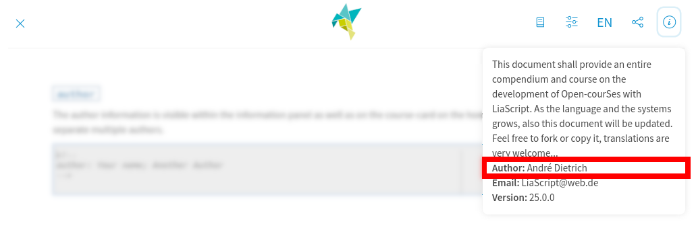

##### `comment`

    --{{0}}--
This information is shown on the course card at the home screen.
It should contain a short and precise description of your course.
This macro will only display one paragraph, even if you define more content.

```md
<!--
comment: Learn something about ...
  even if you insert multiple paragraphs

  there will only be one paragraph
-->
```

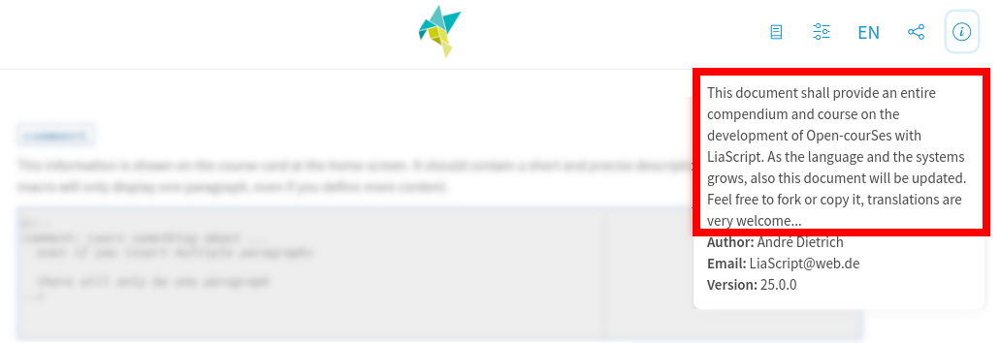

##### `date`

    --{{0}}--
A convenience function that can be used to show the latest update time to the user.
This is also displayed in the information panel.

```md
<!--
date: 08/03/2020
-->
```

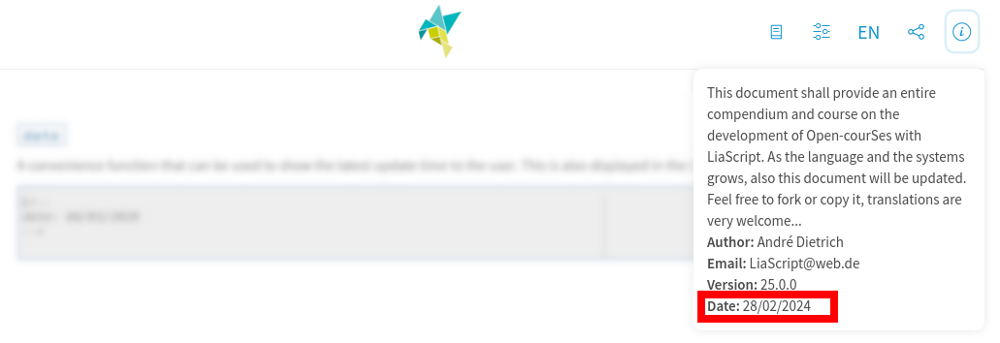

##### `email`

    --{{0}}--
To add contact information that will be displayed in the information panel, you can include it in your LiaScript document.
This contact information can also be overridden for specific sections if needed.

```md
<!--
email: contact@web.de
-->
```

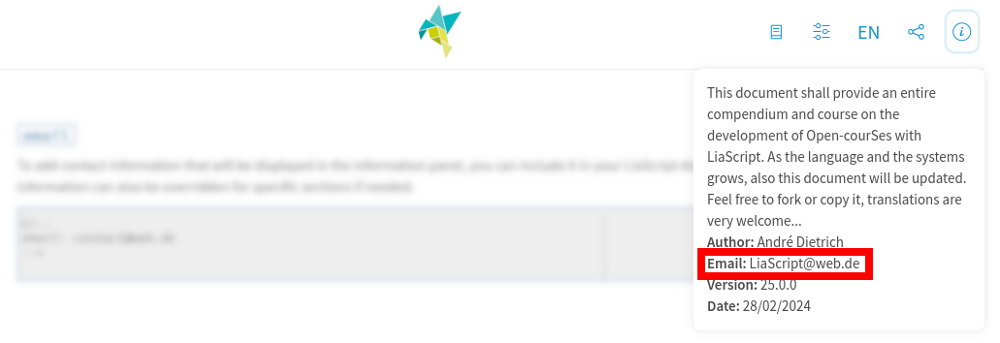

##### `logo`

    --{{0}}--
The logo definition requires a URL of an image, whether absolute or relative.
It is used to define a background image for the course-card at the home-screen.
Additionally, all base information is passed to this visualization too.

```md
<!--
logo: ./pics/logo.png
-->
```

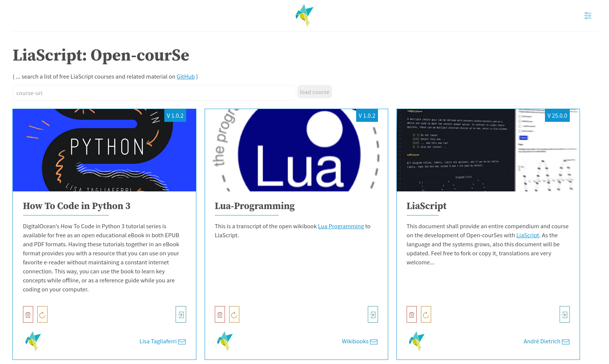


##### `icon`
<!--
icon: https://upload.wikimedia.org/wikipedia/commons/thumb/2/28/Logo_TU_Freiberg.svg/487px-Logo_TU_Freiberg.svg.png
-->

    --{{0}}--
If you want to get rid of our humming-bird icon and insert your own, use this to refer to a relative or absolute image URL.
This can also be used for styling purposes to add to every slide its own icon.

```md
<!--
icon: ./pics/icon.png
-->
```

---

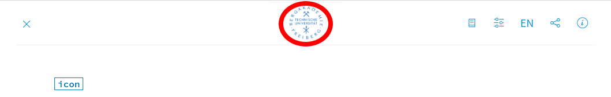

##### `attribute`

    --{{0}}--
Attribution is an important issue.
By using the `attribute` command, you can define the attribution that is shown within the info field within the navigation panel.
Therefore, this macro is the appropriate way to say thank you or to add license information.
These elements also get imported if you import the functionality from another course.
A good attribution might look like the following examples:


```md
<!--
attribute: [AlaSQL](https://alasql.org)
  by [Andrey Gershun](agershun@gmail.com)
  & [Mathias Rangel Wulff](m@rawu.dk)
  is licensed under [MIT](https://opensource.org/licenses/MIT)

attribute: [PapaParse](https://www.papaparse.com)
  by [Matthew Holt](https://twitter.com/mholt6)
  is licensed under [MIT](https://opensource.org/licenses/MIT)
-->
```

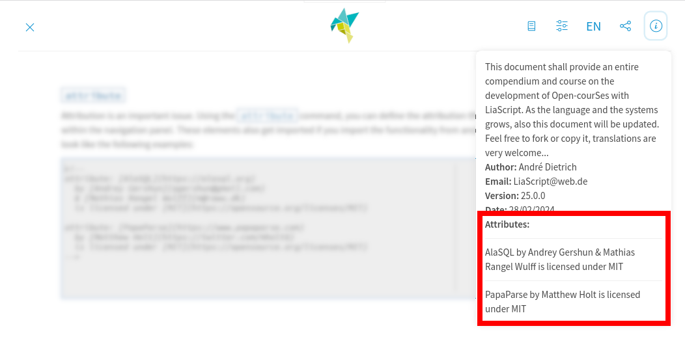

##### `repository`

    --{{0}}--
When you package your course into a SCORM project and upload it to an LMS, the information about the original repository is lost.
However, if you want to attract contributors, you can preserve this source information by adding it to your document's head.
Additionally, LiaScript will automatically attempt to infer the base project from resources on GitHub, GitLab, and previously Dropbox.

```md
<!--
repository: https://github.com/LiaScript/docs
-->
```

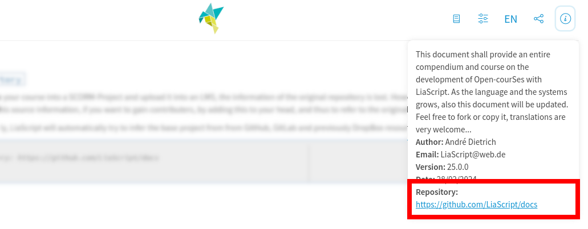

#### __Internationalization__


##### `language`

    --{{0}}--
Set the internationalization of the course.
This will configure basic button information, titles, hints, etc.
This information is also utilized if a user changes the language with the [Google Translator](#Translations).
The currently available languages are defined here:

https://github.com/liaScript/lia-localization

``` md
<!--
@@english
language: en

@@dutch
language: nl

@@french
language: fr

@@german
language: de

...
-->
```

    --{{1}}--
We use language codes for internationalization, similar to top-level domains.

      {{1}}
| language   | code |                                                                              translation |
| ---------- |:----:| ----------------------------------------------------------------------------------------:|
| Amharic    |  am  | [url](https://github.com/LiaScript/lia-localization/blob/master/locale/commands.am.yaml) |
| Arabic     |  ar  | [url](https://github.com/LiaScript/lia-localization/blob/master/locale/commands.ar.yaml) |
| Armenian   |  hy  | [url](https://github.com/LiaScript/lia-localization/blob/master/locale/commands.hy.yaml) |
| Bengali    |  bn  | [url](https://github.com/LiaScript/lia-localization/blob/master/locale/commands.bn.yaml) |
| Bulgarian  |  bg  | [url](https://github.com/LiaScript/lia-localization/blob/master/locale/commands.bg.yaml) |
| Chinese    |  zh  | [url](https://github.com/LiaScript/lia-localization/blob/master/locale/commands.zh.yaml) |
| English    |  en  | [url](https://github.com/LiaScript/lia-localization/blob/master/locale/commands.en.yaml) |
| Dutch      |  nl  | [url](https://github.com/LiaScript/lia-localization/blob/master/locale/commands.nl.yaml) |
| French     |  fr  | [url](https://github.com/LiaScript/lia-localization/blob/master/locale/commands.fr.yaml) |
| German     |  de  | [url](https://github.com/LiaScript/lia-localization/blob/master/locale/commands.de.yaml) |
| Hindi      |  hi  | [url](https://github.com/LiaScript/lia-localization/blob/master/locale/commands.hi.yaml) |
| Italian    |  it  | [url](https://github.com/LiaScript/lia-localization/blob/master/locale/commands.it.yaml) |
| Japanese   |  ja  | [url](https://github.com/LiaScript/lia-localization/blob/master/locale/commands.ja.yaml) |
| Korean     |  ko  | [url](https://github.com/LiaScript/lia-localization/blob/master/locale/commands.ko.yaml) |
| Panjabi    |  pa  | [url](https://github.com/LiaScript/lia-localization/blob/master/locale/commands.pa.yaml) |
| Persian    |  fa  | [url](https://github.com/LiaScript/lia-localization/blob/master/locale/commands.fa.yaml) |
| Portuguese |  pt  | [url](https://github.com/LiaScript/lia-localization/blob/master/locale/commands.pt.yaml) |
| Russian    |  ru  | [url](https://github.com/LiaScript/lia-localization/blob/master/locale/commands.ru.yaml) |
| Spanish    |  es  | [url](https://github.com/LiaScript/lia-localization/blob/master/locale/commands.es.yaml) |
| Suaheli    |  sw  | [url](https://github.com/LiaScript/lia-localization/blob/master/locale/commands.sw.yaml) |
| Taiwanese  |  tw  | [url](https://github.com/LiaScript/lia-localization/blob/master/locale/commands.tw.yaml) |
| Ukrainian  |  ua  | [url](https://github.com/LiaScript/lia-localization/blob/master/locale/commands.ua.yaml) |

##### `narrator`

    --{{0}}--
Set the narrator voice for your course speaker.
The voice is provided by[responsivevoice.org](https://responsivevoice.org), which is free for non-commercial educational content, or directly by your browser.
The list below shows all currently available voices and languages.
As defined in section [Comments: Text to Speech](#Comments:-Text-to-Speech), this value can be set globally, defaults to English, and can be changed per slide and text-to-speech output as well.

```md
<!--
narrator: Afrikaans Male
-->
```

| Female                        | Male                        |
| ----------------------------- | --------------------------- |
| UK English Female             | UK English Male             |
| US English Female             | US English Male             |
|                               | Afrikaans Male              |
|                               | Albanian Male               |
| Arabic Female                 | Arabic Male                 |
|                               | Armenian Male               |
| Australian Female             | Australian Male             |
| Bangla Bangladesh Female      | Bangla Bangladesh Male      |
| Bangla India Female           | Bangla India Male           |
|                               | Bosnian Male                |
| Brazilian Portuguese Female   | Brazilian Portuguese Male   |
|                               | Catalan Male                |
| Chinese Female                | Chinese Male                |
| Chinese (Hong Kong) Female    | Chinese (Hong Kong) Male    |
| Chinese Taiwan Female         | Chinese Taiwan Male         |
|                               | Croatian Male               |
| Czech Female                  | Czech Male                  |
| Danish Female                 | Danish Male                 |
| Deutsch Female                | Deutsch Male                |
| Dutch Female                  | Dutch Male                  |
|                               | Esperanto Male              |
|                               | Estonian Male               |
| Filipino Female               |                             |
| Finnish Female                | Finnish Male                |
| French Canadian Female        | French Canadian Male        |
| French Female                 | French Male                 |
| Greek Female                  | Greek Male                  |
| Hindi Female                  | Hindi Male                  |
| Hungarian Female              | Hungarian Male              |
|                               | Icelandic Male              |
| Indonesian Female             | Indonesian Male             |
| Italian Female                | Italian Male                |
| Japanese Female               | Japanese Male               |
| Korean Female                 | Korean Male                 |
| Latin Female                  | Latin Male                  |
|                               | Latvian Male                |
|                               | Macedonian Male             |
| Moldavian Female              | Moldavian Male              |
|                               | Montenegrin Male            |
| Nepali                        | Nepali                      |
| Norwegian Female              | Norwegian Male              |
| Polish Female                 | Polish Male                 |
| Portuguese Female             | Portuguese Male             |
| Romanian Female               | Romanian Male               |
| Russian Female                | Russian Male                |
|                               | Serbian Male                |
|                               | Serbo-Croatian Male         |
| Sinhala                       | Sinhala                     |
| Slovak Female                 | Slovak Male                 |
| Spanish Female                | Spanish Male                |
| Spanish Latin American Female | Spanish Latin American Male |
|                               | Swahili Male                |
| Swedish Female                | Swedish Male                |
| Tamil Female                  | Tamil Male                  |
| Thai Female                   | Thai Male                   |
| Turkish Female                | Turkish Male                |
| Ukrainian Female              |                             |
| Vietnamese Female             | Vietnamese Male             |
|                               | Welsh Male                  |


    --{{1}}--
LiaScript will attempt to utilize the default browser text-to-speech support, and if your browser does not support it, it will switch to [responsivevoice.org](https://responsivevoice.org).
You can manually switch between these two variants.
__Note that not all voices are supported equally, and the quality may vary between different operating systems and browsers.__

    {{1}}
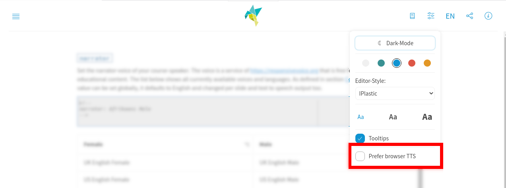

##### `translation`

    --{{0}}--
If you already have translated versions of your course or know where they can be found, use this macro. Simply add the name and the URL.
These links will also be visible within the information panel of your course.

``` md
<!--
translation: Deutsch  translations/German.md
translation: Français translations/French.md
translation: Русский  translations/Russian.md
-->
```

---

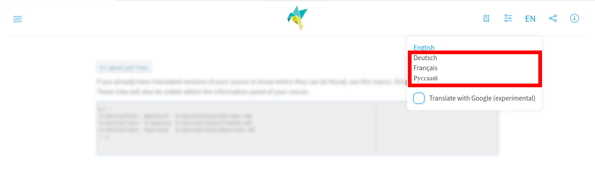


##### `font`

    --{{0}}--
The `font` macro allows you to integrate various fonts for any kind of language, whether dead or alive.
To do this, you need to load the CSS font with the [`link`](#link) command and then insert the font by separating all font names with commas.


```` markdown
<!--
link:     https://fonts.googleapis.com/css2?family=Noto+Sans+Egyptian+Hieroglyphs
          https://fonts.googleapis.com/css2?family=Noto+Sans+Ogham

font:     Noto Sans Egyptian Hieroglyphs, Noto Sans Ogham
-->

# Hieroglyphs

> url: https://fonts.google.com/noto/specimen/Noto+Sans+Egyptian+Hieroglyphs

𓁷 𓏤 𓎟 𓀀 𓁐 𓏥 𓃀 𓈖 𓌱 𓅓 𓎛 𓅱 𓀔 𓈖 𓌱 𓅓 𓎛 𓇋 𓇋 𓏏 𓁐 𓐍 𓂋 𓋴 𓂝 𓎛 𓋩 𓉔 𓊪 𓏛
𓋴 𓐠 𓄿 𓂋 𓏏 𓌗 𓀁 𓌷 𓂝 𓏏 𓏭 𓏛 𓇾 𓏏 𓅓 𓅱 𓀀 𓁐 𓏪 𓃀 𓌢 𓌢 𓈖 𓈖 𓁷 𓏤 𓎟 𓀀 𓁐 𓏥
...

# Ogham

> url: https://fonts.google.com/noto/specimen/Noto+Sans+Ogham

<!-- style="writing-mode: vertical-lr; height: 40vh" -->
᚛ᚌᚔᚚ ᚓ ᚈᚔᚄᚓᚇ ᚔᚅ ᚃᚐᚔᚇᚉᚆᚓ᚜
᚛ᚇᚘᚐ ᚋᚁᚐ ᚌᚐᚄᚉᚓᚇᚐᚉᚆ᚜
...
````

    --{{1}}--
Even if the font is not installed on your system, the browser will correctly load and display it.

      {{1}}
<section>

# Hieroglyphs

𓁷 𓏤 𓎟 𓀀 𓁐 𓏥 𓃀 𓈖 𓌱 𓅓 𓎛 𓅱 𓀔 𓈖 𓌱 𓅓 𓎛 𓇋 𓇋 𓏏 𓁐 𓐍 𓂋 𓋴 𓂝 𓎛 𓋩 𓉔 𓊪 𓏛
𓋴 𓐠 𓄿 𓂋 𓏏 𓌗 𓀁 𓌷 𓂝 𓏏 𓏭 𓏛 𓇾 𓏏 𓅓 𓅱 𓀀 𓁐 𓏪 𓃀 𓌢 𓌢 𓈖 𓈖 𓁷 𓏤 𓎟 𓀀 𓁐 𓏥

# Ogham

<!-- style="writing-mode: vertical-lr; height: 40vh" -->
᚛ᚌᚔᚚ ᚓ ᚈᚔᚄᚓᚇ ᚔᚅ ᚃᚐᚔᚇᚉᚆᚓ᚜
᚛ᚇᚘᚐ ᚋᚁᚐ ᚌᚐᚄᚉᚓᚇᚐᚉᚆ᚜
᚛ᚌᚓᚔᚄ ᚃᚐᚔᚏ ᚐᚏ ᚈᚆᚓᚉᚆᚈ ᚇᚔᚅᚇ ᚃᚐᚔᚇᚉᚆᚔ᚜
᚛ᚉᚓᚅ ᚉᚆᚑᚋᚏᚐᚉ ᚅᚑᚓᚅᚃᚆᚔᚏ ᚇᚑ ᚃᚆᚒᚐᚉᚏᚐ᚜
᚛ᚌᚔᚚ ᚓ ᚈᚔᚄᚓᚇ ᚔᚅ ᚃᚐᚔᚇᚉᚆᚓ᚜
᚛ᚇᚘᚐ ᚋᚁᚐ ᚌᚐᚄᚉᚓᚇᚐᚉᚆ᚜
᚛ᚌᚓᚔᚄ ᚃᚐᚔᚏ ᚐᚏ ᚈᚆᚓᚉᚆᚈ ᚇᚔᚅᚇ ᚃᚐᚔᚇᚉᚆᚔ᚜
᚛ᚉᚓᚅ ᚉᚆᚑᚋᚏᚐᚉ ᚅᚑᚓᚅᚃᚆᚔᚏ ᚇᚑ ᚃᚆᚒᚐᚉᚏᚐ᚜
᚛ᚌᚔᚚ ᚓ ᚈᚔᚄᚓᚇ ᚔᚅ ᚃᚐᚔᚇᚉᚆᚓ᚜
᚛ᚇᚘᚐ ᚋᚁᚐ ᚌᚐᚄᚉᚓᚇᚐᚉᚆ᚜
᚛ᚌᚓᚔᚄ ᚃᚐᚔᚏ ᚐᚏ ᚈᚆᚓᚉᚆᚈ ᚇᚔᚅᚇ ᚃᚐᚔᚇᚉᚆᚔ᚜
᚛ᚉᚓᚅ ᚉᚆᚑᚋᚏᚐᚉ ᚅᚑᚓᚅᚃᚆᚔᚏ ᚇᚑ ᚃᚆᚒᚐᚉᚏᚐ᚜

</section>

    --{{2}}--
Here is a complete guide on loading and experimenting with external fonts in the browser:


      {{2}}
https://liascript.github.io/LiveEditor/?/show/file/https://raw.githubusercontent.com/LiaPlayground/Fonts/main/README.md

#### __`version`__

    --{{0}}--
A very important piece of information is the `version`.
It follows the major.minor.patch notion.
If you are just starting to develop a course, you can leave this out, and you will be in some kind of development version.
As long as you are in major version 0, the course should be parsed every time it is loaded, or if your user is offline, the content will be loaded from the cache.


__Debug Version:__

``` markdown
<!--
version: 0.0.1
...
-->

# Main Title
```

---

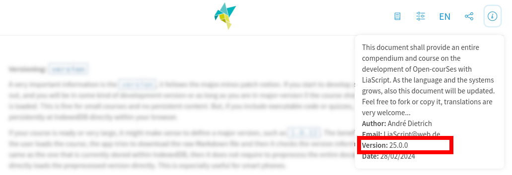

    --{{1}}--
This setup is suitable for small courses without persistent content.
However, if you include executable code or quizzes and want to store this state within the browser's IndexedDB, you will need to switch to a major version of 1.
Therefore, if your course is ready or very large, it might make sense to define a major version, such as `1.0.12`.
The benefit of this is that every time the user loads the course, the app tries to download the raw Markdown file and then checks the version information.
If the version is the same as the one currently stored within IndexedDB, then it does not require preprocessing the entire document again.
Instead, it directly loads the preprocessed version. This is especially useful for smartphones.

      {{1}}
<section>
Release:


``` markdown
<!--
version: 1.0.12
...
-->

# Main Title
```

</section>

    --{{2}}--
__So how to change the version information?__


        {{3}}
* __patch:__ from `1.0.14` to `1.0.15`

      --{{3}}--
  If you're making minor adjustments like fixing typos or updating static content, simply increase the patch element.

        {{4}}
* __minor:__ going from `1.0.15` to `1.1.0`

      --{{4}}--
  If you're adding slides to the end of your document, you can increase the minor version number.

        {{5}}
* __major:__ from `1.1.0` to `2.0.0`

      --{{5}}--
  Major version changes are necessary if you alter the structure of your document, especially by moving quizzes or code.
  Persistent state information is stored within IndexedDB, so moving code or quizzes from one slide to another could potentially disrupt previous states.
  In such cases, major version changes are required, which will result in a new version being stored in IndexedDB, while the old code/state remains available and can be restored.


#### __Loading External Resources__

##### `link`

    --{{0}}--
If you need to load additional CSS files, use the `link` command followed by the URL of your stylesheet.
Some JavaScript imports might also require additional CSS definitions.
Similar to [`import`](#import) or [`script`](#script), you can load multiple files. If you are creating a template and need to pass this information to all other courses that import yours, use `link`.
If you only want to change the appearance of some of your elements, use [`style`](#style).


```md
<!--
link: https://some.css
      ./another.css
-->
```

    --{{1}}--
For more information on how to define custom styles, checkout the following link:

      {{1}}
https://github.com/liaScript/custom-style

##### `script`

    --{{0}}--
Script tags cannot load external JavaScript resources. Instead, use the `script` command in the main header to load external resources.
This works for relative references too.

``` md
<!--
script: https://some.js
  https://another.js
  ...
-->

# Main title

<script>alert("Hello Mom")</script>
```

    --{{1}}--
The execution of [`@onload`](#onload) and all script tags is delayed until all external references have been loaded.

##### `import`

    --{{0}}--
You can import the main macros of other courses simply by using the `import` command, followed by the raw URL of the foreign course.
You can import various different courses, and every URL will be loaded before the course is finally rendered.
Only the definitions in the main header are loaded, including `script`, `link`, macros, `attribute`, and `onload`.

```` md
<!--
import: https://raw.githubusercontent.com/liaTemplates/ABCjs/main/README.md

import: this will import a third url
-->

# Music course

``` abc  @ABCJS.render
X: 1
T: Shche ne Vmerla Ukrayiny ni Slava, ni volya
T: Ukrainian National Anthem
C: trad.
R: march
S: https://www.8notes.com/scores/34640.asp
Z: 2022 John Chambers <jc:trillian.mit.edu>
M: C
L: 1/8
K: F
[|\
"F"[A3F3][AF] ([AF][GE][AF])[BG] | [c3A3][BG] "A7"[A2F2][G2E2^C2] | "Dm"[F2D2][A2F2] "A"[E2^C2][A2C2] | "Dm"[D3D3][E^C] [F2D2]"C"[G2E2] |
...
```
````

---

``` abc  @ABCJS.render
X: 1
T: Shche ne Vmerla Ukrayiny ni Slava, ni volya
T: Ukrainian National Anthem
C: trad.
R: march
S: https://www.8notes.com/scores/34640.asp
Z: 2022 John Chambers <jc:trillian.mit.edu>
M: C
L: 1/8
K: F
[|\
"F"[A3F3][AF] ([AF][GE][AF])[BG] | [c3A3][BG] "A7"[A2F2][G2E2^C2] | "Dm"[F2D2][A2F2] "A"[E2^C2][A2C2] | "Dm"[D3D3][E^C] [F2D2]"C"[G2E2] |
"F"[A3F3][AF] ([AF][GE][AF])[BG] | [c3A3][BG] "A7"[A2F2][G2E2^C2] | "Dm"[F2D2][A2F2] "A"[E2^C2][A2C2] | "Dm"[D4D4] D2z2 |
"A"[E2^C2][E2C2] ([AC][GE][FD])[EC] | ("Dm"[DD3-]EF)[DD] "A"[E2^C2][E2C2] | "Dm"[F2D2][F2D2] "C"[G2E2][G2E2] | "F"[A4F4] [A2F2]z2 |
"A"[E2^C2][E2C2] ([AC][GE][FD])[EC] | ("Dm"[DD3-]EF)[DD] "A"[E2^C2][E2C2] | "Dm"[F2D2][A2F2] "A"[E2^C2][A2C2] | "Dm"[D3D3][E^C] ([FD][GE][AF])[BG] |
|:\
"F"[c3A3][=B^G] [c2A2][A2F2] | "C"[G2E2][G2E2] ([cE][BG]"^A7/C#"[AF])[GE] | "Dm"[F2D2][F2D2] "C"[G2E2][G2C2] | ("F"[A3F3][GE][A2F2])"C7"[B2G2] |
"F"[c3A3][=B^G] [c2A2][A2F2] | "C"[G2E2][G2E2] ([cE][BG]"^A7/C#"[AF])[GE] | "Dm"[F2D2][A2F2] "A"[E2^C2][A2C2] | "Dm"[D4D4] [D2D2]z2 :|
```

---


    --{{1}}--
You can see an overview of all currently supported templates hosted on GitHub.
Each course describes its macros and how to apply them.
Currently, only the content of the imported course gets loaded, so it's not possible to load a course correctly if it references other courses.

     {{1}}
https://github.com/topics/liascript-template


#### __Configuration__

##### `mode`

    --{{0}}--
You can change the default style of your document.
If you prefer a traditional layout without interactive elements, you can set the mode to `Textbook`.
Alternatively, you can opt for an interactive `Presentation` or `Slides` with comments included, to engage your audience with animations.

```md
<!--
mode: Presentation

mode: Slides

mode: Textbook
-->
```

    --{{1}}--
The three modes are accessible via the mode selector button located at the upper right corner of the document.
The default mode is determined by the user settings.

      {{1}}
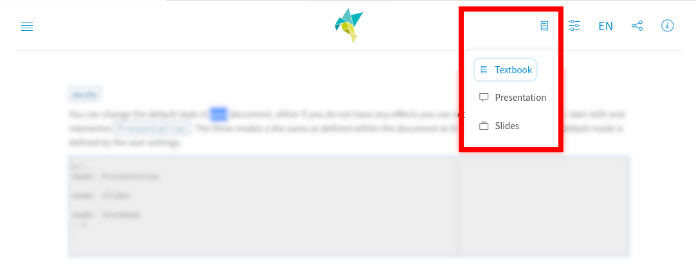

##### `dark`

    --{{0}}--
You can adjust the default appearance of your document, opting for either dark mode or light mode.
It's important to note that this customization will not override the user's preferences.
The default mode is determined by the user settings.


```md
<!--
dark: true

@@ or ...

dark: false
-->
```

---

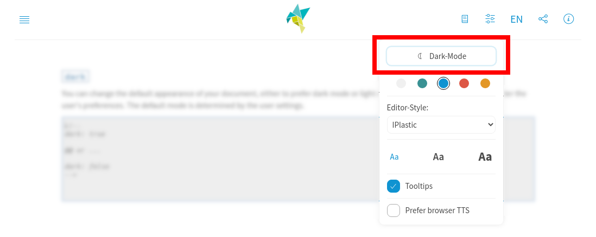


##### `classroom`

    --{{0}}--
If you want to disable the classroom functionality for your course or within your SCORM export.
Then turn the `classroom` feature of, by default it is activated.
For more information on how to open classrooms see section [Classroom Experience](#Classroom-Experience).

```md
<!--
classroom: false
-->
```

---

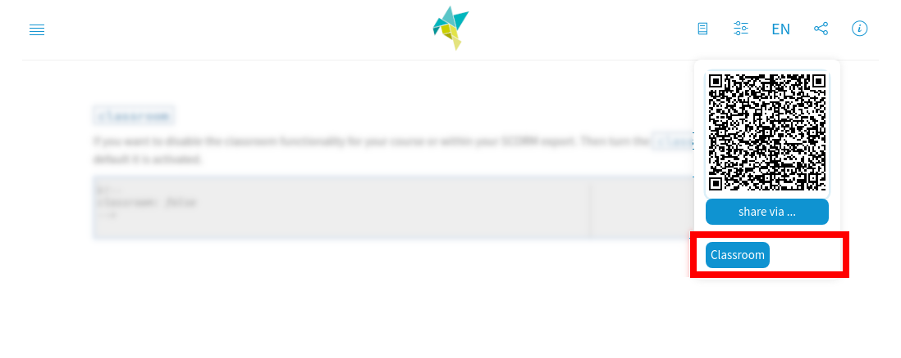


##### `sharing`

    --{{0}}--
To disable sharing, if your browser supports it and to remove the presented QR code, you can turn off this feature with the following command.
By default, it is activated.

```md
<!--
sharing: false
-->
```

---

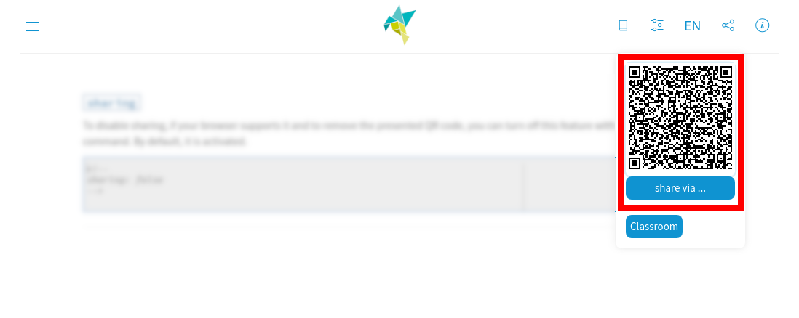

##### `translateWithGoogle`

    --{{0}}--
If you are giving a language course and want to prevent cheating by disabling the auto-translation function offered by Google, then set `translateWithGoogle` to `false`.


```md
<!--
translateWithGoogle: false
-->
```

---

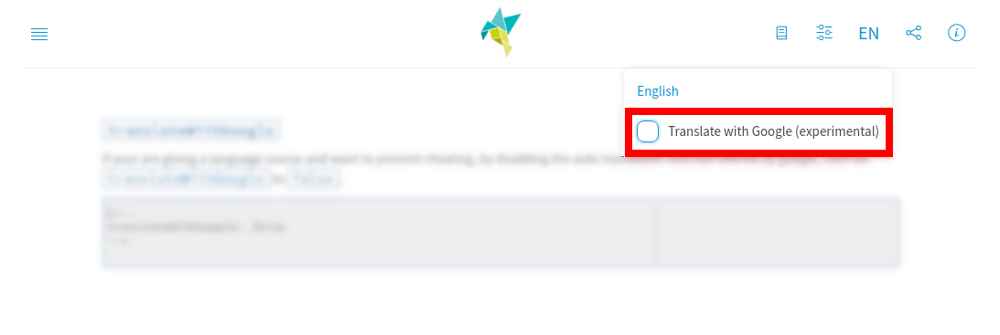


#### __Functional__


##### `onload`

    --{{0}}--
Sometimes it might be necessary to preload some JavaScript code that gets executed before the course is loaded, or you want to define some global functions that can be used everywhere afterward.
`onload` functions similarly to its HTML counterpart and is used to accomplish this task.

``` md
<!--
@onload
// this macro contains some important functions that are loaded
// only once ...

alert("Hello World")
@end
-->
```

##### `style`

    --{{0}}--
In contrast to [`link`](#link) where you refer to external CSS resources, you can also directly insert CSS settings.
These are loaded faster, directly during the parsing process, which reduces glitches, and they are not shared if the document gets imported.
The example adds an animated transition to every slide.

```
<!--
@style

@keyframes zoomIn {
    from {
        transform: scale(0);
        opacity: 0;
        border: 5px solid black;
    }
    to {
        transform: scale(1);
        border: 1px solid black;
        opacity: 1;
    }
}

/* Apply the animation to the main element */
main {
    animation: zoomIn 0.75s ease-in-out;
}

@end
-->

# Course Main Title
```

    --{{1}}--
Headers, colors, and everything LiaScript-related can be modified as well. Try out this example:

      {{1}}
[LiveEditor](https://liascript.github.io/LiveEditor/?/show/code/H4sIAAAAAAAAA71XW3PbxhV+x69Y0w8RYQG8OG5dSr7IkpLSsSPXUqbuaDT2EliSawFYBAuIoh1lHHvSyyS9zLSPnelrHxUnqt340r8A/qN+ZxckRbv1pO1MQQ65u+d+9tywesbzHOeqzseRwP++GPczHgvNHigVdxP20GF4+pmKqyU9ecYT3VdZ3GE64JFYatZXZkCV8kDm4w5rzs96KgtF1mEX0kOmVSRD1ot4sG8Rjsxvrt4loFV/m1nrXzFb0KA1FXDkOA2XraVpNGb5UDCeyJjnUiUklidMRCIWSc7chhNzObV6htWZeqPp//iCZoJr4cnEU0W+QqyviiR0PO+y45xl66rItGA3icuOzMmpO0OpGb5jgJjrBgbDdZlMZC55JB9YTXRe9HzHuRURe6aFMJrubqhA7y0N8zzVnUYjklwHmUxzfyDzIQikaliGjStTnIyPKmihRRaoJIdpfqBiot421I0QXBsx17nIGrc31zZubvpxWHfgjb5MQgbL2GjIc1I7VVrLXiSgL9u9MeXwTpXqsKPbJ4PZiMOtYAtVwEDntB2KKCVuxiFrOUKru7G5zFJreT5OBdwEtvARKMkTPIoYP+Ay4qSIHqosD4pcQ8zZs/B1th+qUeI4v4DAANdJwmBvDK/uTqFzhSs1ySE85LGXwhEWxxuKTDRGcl82pmTe+lDwXA+FyOtMj5OcH5JSQYZTYS2w/l9mugiGjOuO47R8dkPqXDttn5lgFXBp5lBQuaxIqiO7VQmSzfdhivMZ+6ngALEWILNNmzaAdbzpwxY3gHVzERsqojObtt2AazfmA0FandmVZjn3RJFGioc+GRyLUHJfZQNjfkq7hnWhbrQb7Wbjw0j1eHR3KxXJ3c2wCEzQ4uC20LA/EPruDTVQvj4Y1B26lrNs8xCBp4GlHZuanvfwYfPoCAXnGuJrXF0Wj7RCNARREQqmEPMZ68O5RQa/VC5lOlX7AskqDnO/Yma4tQy3boI4z5GuY7ZvorfPeBFKiuVIdKb4zKA7V3YNbO6EnhzAgiTs8WTfBMUnt25srW004vR8o9X80UUfCzJpJrRthG4eQKEDGQqlcbcsGPJkYFM2wqqAoykEEdO5iMb+KSXa3nmocebKriGe6zEajXz4BFVAGDVGPA+GVw4u9brr/Y9ujz/aGW3O1DB6nGe3C6QmXPiBiFEkjVrlX8qTyaPyafm6fFUeT35VHpcvJl9j/ZpNvsDhs/I7HL1i5VPWbjbfZ+W3OPxu8oSVfyr/Zohely9Z+cfJo8mT8hvDiw6WiAi4L3x2XQ0T9mEGNbM6K5+z8g+Q82hK6pR/hXAcTH5ZnpQvfVb+2QC+LZ+XJ0CH+BMQTX5fPpt8VX5fHrPyGyxeEKN/GP2OgfRy8sXksTHiKQmefEWUz2DB5MnkN1DKQLH+HXbPJ19a06AdBP8a/F8B+++GnwPNjsH0JYgeQ9wJw99J+b3hcExemPwWZHTyuDIC0sARxM+B9DUojydf2vy090e3t0M1qnagZCBqsxrFIuS8Cb6FajUNB6pWJi+20WtlMnCcVfReFkRca3aJ1Wy3QaXIVBR1kxozPXkOQSJ5oYg4+lpbryC4IoUmmBYZYqzGqP3sIPhGQwUiShSvF6lgn4plEYWMp6ngGVVdS2HpkTMhG6EeQvuR6vVILyb6fREgz34+lMg+dACOctzjIcqxOOQU0rNabap6bjkEvDB9jHz1+eeoa6bX2tZHBXDFqzOc/xujZdKnfijQ3YuEvDqzvjIULFasmVTz14c8Q311PoECa9vr3a63lpk+E6L7MRSvAaYYPc/9dz43iyiXMF0Y7Jb/ExRRPBtbO9sz+s/eonJdt4KO34K69nearIBnpz/uG//2U2HzN7i581WFcbiI4Z5eVygSKNdmH/fUemFXYetTDE9zW+RJTnAJ4W2UKak7w/Za7Jz3A54Z7+Yir0OPHyJwFp+WufufFfLBA6FtMq2xHcT6pzhyELCYWELMg1SFXbcv9RAxq/kYWYFijcMhgpWbGSxBB0e0jZCrrnvFxsnuLsaBvT3L2AQFJcr6kNLcca4XyG4ehtSPYuo1qZJJrmlrBh1I60z53NnbY1tJNWy67h2oQTOGNvtAZRkSzNL7FQUDxWac5mM7EPAMumUqGfinOJoqZCoI0vS/02yJ1S0fu7uD3Sry8Q1dKeejSI1E6L9B5pi+LjB8mdq2rkLIXzNZZ0rHtD5gdmehoOkBo3xOoJwuh5S7jtJoZ0gUzF7Gs7EZA3qmmoTLdh4w9JYphN67d+8+qOyY6TQarDsdnans3kDmUv9FAUB5sx7GnIbTzFYmOupuWJSWk4iRLR+o1j7RLr131oLeWzaDP8q2iHSH7baWWXuZnV9m7+8t4xxDhhR0vttqNpdZq00/F/GDRoqoOcIryv+mW3tRt2s8m6rW/sGqXTCAi4BVKsF3zqr13OWrMkmLfLVRbdGBQnlgi/GlWpB7VlEsBioKReJphClKeo3JEHDjo9rl1QaILv/npO0ZqQ3iW5m6DyQ9H9tjvj8bqTELinmcUZsKRZ+cmVZkHRMW7L6tEd7mAY9sVPn3tYOpizoh2kfIc+73Zabzuwnea9k5VsPnnD2H9vYYNyf7S+YMfQti6sbdxIIIkA/2uLaCl0ncgHgT/PHWzmkUcrrVDg0Rz7kNYk07hwhrc4VqrIP9No/jcY1usjbTqcYsCL7bt6BKgDG4Qy/JhXCOFi4YWIhAaedhCq3r21sfG1u1oAhEgzQTqsJLNTvgmTTeJTgFF1BoCa/ZQDFv3ZalgHsNqRVksxn5qm2LryQAlxCX7lX0zfo9cDgVb1RXVYaS8cHCW+b0VUDQTB0qFisqf5Qen9paj8v+v7wBO/8E5nwnfA8RAAA= "")

##### `persistent`

    --{{0}}--
LiaScript will destroy all elements when a new slide is opened. As a result, videos and sound stop playing, iframes are purged, etc.
However, some external functionality, such as scripts that modify the DOM, create certain elements, and adapt their behavior, will require their content to persist across slides.
This is why the preservation macro was introduced: to maintain all DOM elements on a slide, even though they are hidden when another slide is opened.

``` markdown
<!--
persistent: true
-->

# No slide will be deleted
```

    --{{1}}--
This can be set globally, but you can also adjust the global setting on a per-slide basis.
By default, this persistence feature is turned off.


      {{1}}
``` markdown
...

## Only this slide will be persistent
<!--
persistent: true
-->

...

# Not this
```

    --{{2}}--
If your extension behaves oddly when you leave and re-enter a slide, trying out this option might be the right choice.


#### __Helper__


##### `uid`

    --{{0}}--
This macro is limited to use within the document and cannot be used within the header.
There are occasions when it becomes necessary to assign unique identifiers for accessing specific HTML nodes without manually naming each one.
In such situations, hidden macros utilizing `@uid` can be quite useful.
When invoked, `@uid` generates a unique identifier each time it is called.


```md
<!--
@eval: @hidden_eval(@uid,@0)

@hidden_eval
<script>
document.getElementById("id_@0").innerHTML = "@1"
</script>

<div id="id_@0"></div>

@end
-->

# Main course

@eval(Hello Mom)

@eval(Hello World)
```

    --{{1}}--
In this example, `@eval` invokes another macro and passes the result of `@uid` as the first parameter.
The input of `@0` serves as the second parameter.
Consequently, `@1` in the second macro call will be replaced with this input.

##### `formula`

    --{{0}}--
This is a helper function that enables the definition of custom macros for [KaTeX](https://katex.org) formulas on both a global and local scale.

> For a comprehensive overview, refer to the section:
>
> [Formula-Macros](#Formula-Macros).

##### `input`

    --{{0}}--
This macro should only be used within script-tags, typically associated with executable code blocks, projects, quizzes, surveys, tasks, and standalone scripts.
It serves as a placeholder for the current user input and may yield different results based on the context.


* __Tasks:__ [Tasks and Scripting](#Tasks-and-Scripting)
* __Quizzes:__ [Quizzes and Scripting](#Quizzes-and-Scripting)
* __Surveys:__ [Surveys and Scripting](#Surveys-and-Scripting)
* __Executable Code:__ [Interactive Code-Blocks](#Starting-simple)
* __Stand alone Scripts:__ [JavaScript or JS-Components](#JavaScript-or-JS-Components)


##### `output`

    --{{0}}--
This macro is specifically intended for use in executable code blocks.
It should be added to the last code block in a project's head section to designate a textual output as the default output for execution.

> For further details, please refer to the section titled:
>
> [Default `@output`](#Default-@output).


## JavaScript or JS-Components

      {{|> UK English Male}}
> As of the time of writing, I strongly believe that the script tag, introduced by Netscape in 1995 (cf. [Wikipedia](https://en.wikipedia.org/wiki/JavaScript#History)), is often misused.
> It remains somewhat outside of HTML, but if it could be embedded as part of the DOM, we wouldn't have to search the DOM for IDs and attempt to manipulate the content of a specific node.
> Much of the work we currently put into the development of Web Components could be achieved more easily by using the script tag in a slightly different manner.

    --{{1}}--
In LiaScript, we now have the capability to insert scripts anywhere and connect them using a simple publish-subscribe mechanism.
This allows us to create even more interactive books and courses. You can add additional calculations throughout your document, and the internal LiaScript event system handles their execution.
This can be viewed as an inverse approach to Jupyter or R Notebooks, where content is structured around code for documentation purposes. Instead, we aim to integrate code as a native element within the content itself.


### Script-Evaluation


    --{{0}}--
To clarify some internals and how LiaScript handles the execution of scripts, let's describe the execution order:


<!--
style="
  display: block;
  margin-left: auto;
  margin-right: auto;
  max-width: 600px;
  fill: red;
  stroke: green;" -->
``` ascii
 +-------------------+
 |     README.md     |
 |                   |
 | ...               |
 |  <script>     +---+
 |    22*22      |  /
 |  </script>    | /
 | ...           |/
 +---------------+
          |
          |" {1}{(parse)} "
          V
 +-------------------+    "{3}{`22*22`}"   +------------------+
 |   "{2}{(ports)}"  +-------------------->|   "JavaScript "  |
 |                   |                     |                  |
 | " LiaScript/Elm " |<--------------------+   "{4}{(eval)}"  |
 +-------------------+    "{5}{`484`}"     +------------------+
```


    --{{1}}--
After parsing the script tag, LiaScript does not execute it directly.
Instead, it is stored internally along with any possible output and connections to other scripts within an execution graph.

    --{{2}}--
Since LiaScript is implemented in Elm and Elm cannot directly execute JavaScript code, LiaScript uses a specific port to communicate with the outside world.

    --{{3}}--
When a script is ready, its code is sent as a string to the outside JavaScript world.
LiaScript controls when and which code gets executed.

    --{{4}}--
The code is then evaluated.

    --{{5}}--
The result is sent back as a string to LiaScript.
This string can be a certain value, HTML code, or even in LiaScript notation, which is then parsed internally again and displayed.


#### Simple scripts & scope

    --{{0}}--
In its essence, a script is an inline element of LiaScript, similar to **bold**, _italic_ text, or inline formulas.
It performs simple calculations and prints its result exactly where the script is defined:

``` markdown
$ \sin(\frac{\pi}{2}) = $ <script>Math.sin(Math.PI / 2)</script>
```

$ \sin(\frac{\pi}{2}) = $ <script>Math.sin(Math.PI / 2)</script>


      {{1}}
<section>

    --{{1}}--
That is the basic idea, nothing more and nothing less.
The final "result" or expression of a script defines its output.
Thus, the script with the alert gets executed, but it does not appear within the document, since `alert` evaluates to `undefined`.
In this case, the script is expected to be hidden, without any visualization within the document.

``` html
<script>
var a = 22**3

alert("Hello Mom")
</script>
```

<script>
var a = 22**3

alert("Hello Mom")
</script>

</section>

      {{2}}
<section>

    --{{2}}--
Such hidden scripts can be useful to trigger only an execution or to perform a certain action for manipulating the DOM or simply some maintenance work.

``` html
<script>
document.getElementById("example").innerHTML = "Did execute"
console.log("executed script")
</script>

<h1 id="example">Not executed</h1>
```

---

<script>
document.getElementById("example").innerHTML = "Did execute"
console.log("executed script")
</script>

<h1 id="example">Not executed</h1>

</section>

      {{3}}
<section>

    --{{3}}--
Every script is executed in its own local scope, which means that the variable `a` defined in the "Hello Mom" example cannot be accessed in another script.
Thus, if an error occurs, the error message is shown as a result of the evaluation.

``` html
<script> a * 33 </script>
```

---

<script> a * 33 </script>

</section>

      {{4}}
<section>

    --{{4}}--
If you wish to exchange information between scripts using variables, you must define them globally.

``` html
<script> window.a = 22 ** 3 </script>

<script> window.a / 2 </script>
```

<script> window.a = 22 ** 3 </script>

<script> window.a / 2 </script>


    --{{5}}--
If you were to reverse the order of the two scripts, dividing `a` by two would still result in the same error message, as scripts are executed sequentially and `a` must be defined first.
Only after revisiting this slide, when both scripts are executed again, will the result of both scripts be correct.
However, LiaScript sends all scripts to JavaScript in order, and while some scripts may execute faster than others, this can lead to race conditions.
Therefore, there is a better approach to updating scripts, as described in section [Connecting Scripts with output](#Connecting-Scripts-with-output).

</section>


#### Combination with Animations

    --{{0}}--
You can combine scripts with LiaScript animations to trigger their execution.
In textbook mode, all scripts will be executed after the slide has been loaded.
In other modes, if a script does not belong to an animation, it will be executed immediately when you open the slide or whenever you visit the slide.

``` html
<script>alert("0")</script>

{{1}} <script>alert("1")</script>

{{2}} <script>alert("2")</script>

{{3}} <script>alert("3")</script>
```

<script>alert("0")</script>

{{1}} <script>alert("1")</script>

{{2}} <script>alert("2")</script>

{{3}} <script>alert("3")</script>


### Asynchronous Execution & API

    --{{0}}--
A script gets executed, but you need to make an asynchronous call to an external API.
How could you handle this?
Well, in this case, LiaScript provides a `send` object for every execution, which can be used to directly communicate with the script state in the Elm world.
By using `send.lia`, you can directly send strings back from every asynchronous execution path.


``` markdown
<script>
setTimeout(function(){
  send.lia("I am ready!")
}, 5000)

"will wait for 5 seconds"
</script>
```

<script>
setTimeout(function(){
  send.lia("I am ready!")
}, 5000)

"will wait for 5 seconds"
</script>


#### Execution State

    --{{0}}--
Every script maintains an internal state.
LiaScript is aware of which scripts have already been executed and which are still in the process of a long calculation.
If a script returns a result or if `send.lia` is called, then the internal execution state is marked as inactive, which will trigger a new execution when the slide is revisited.
Hence, a long-running script will not be restarted until it is finished.
Thus, the previous example was not fully correct.


    --{{1}}--
If you would like to create, for example, a clock or a running counter, every revisit would create a new script that might run forever, and all of these would communicate with the Elm part, resulting in glitches.
However, like in the case of [executable code blocks](#send-object), there are different options that can be used to communicate with the internal representation.
By returning `"LIA: wait"`, the LiaScript script state is informed that although the execution has finished, the process is still running.
Since `send.lia` would mark an internal stop, you can use `send.output` to change the output asynchronously.


      {{1}}
``` markdown
<script>
setInterval(function(){
  i++
  send.output("counting " + i)
}, 1000)

var i = 0

"LIA: wait"
</script>
```

    --{{2}}--
That's it.
This script will run indefinitely, and it will not trigger a new evaluation because LiaScript keeps its internal state marked as active.

      {{2}}
<script>
setInterval(function(){
  i++
  send.output("counting " + i)
}, 1000)

var i = 0
send.wait()
</script>

      {{3}}
<section>

    --{{3}}--
However, you can trigger a stop after a long run by either calling `send.lia` again, which will also alter the result of the script representation, or you can send it a stop command, which is equivalent to sending `"LIA: stop"`.
This stop command does not affect the last representation but only the state.
This script will be started again when the user revisits the slide.

``` html
<script>
var timerId = setInterval(function(){
  i++
  send.output("counting " + i)

  if (i > 10) {
    clearInterval(timerId);
    send.stop()
    // shortcut for send.lia("LIA: stop")
  }
}, 1000)

var i = 0
send.wait() // equal to send.lia("LIA: wait")
</script>
```

<script>
var timerId = setInterval(function(){
  i++
  send.output("counting " + i)

  if (i > 10) {
    clearInterval(timerId);
    send.stop()
    // shortcut for send.lia("LIA: stop")
  }
}, 1000)

var i = 0
send.wait() // equal to send.lia("LIA: wait")
</script>

</section>

    --{{4}}--
In summary, you have three possibilities to send updates from your script: `send.lia` and `send.output`, while the second is used asynchronously and won't stop the active state.
The three additional helper functions are simple shortcuts to inform LiaScript about state changes.


      {{4}}
* `send.lia`
* `send.output`
* `send.wait` --> `"LIA: wait"`
* `send.stop` --> `"LIA: stop"`
* `send.clear` --> `LIA: clear`


### Different Representations

    --{{0}}--
But it is not only possible to send back strings; well, technically it is still the case, but the strings might be represented differently.
LiaScript allows the display of HTML and LiaScript code as well, which is then re-parsed and thus allows for the recreation of nested structures as well.

<div style="width:100%;height:0;padding-bottom:71%;position:relative;"><iframe src="https://giphy.com/embed/fwbZnTftCXVocKzfxR" width="100%" height="100%" style="position:absolute" frameBorder="0" class="giphy-embed" allowFullScreen></iframe></div><p><a href="https://giphy.com/gifs/PLCnext-plcnext-phoenixcontact-plcnexttechnology-fwbZnTftCXVocKzfxR">via GIPHY</a></p>

#### `HTML:`

    --{{0}}--
This first approach does obviously not work.
LiaScript does not parse and interpret the return value on demand, instead, everything is interpreted and displayed as a string:

``` markdown
<script>"<marquee>This text will scroll from right to left</marquee>"</script>
```

<script>"<marquee>This text will scroll from right to left</marquee>"</script>

    --{{1}}--
Instead, we have to start the return string with `HTML:`, followed by whatever HTML code there is.
Yes, we can style a script tag in our case, since it is commonly displayed only as an inline parameter.
Thus, we can change its appearance to let the marquee tag use the full line width, and by using `modify`, we can prevent the user from inspecting the code, which also gets rid of the background.

      {{1}}
<section>

``` markdown
<script
  style="display: block"
  modify="false"
>
"HTML: <marquee>This text will scroll from right to left</marquee>"
</script>
```

<script style="display: block" modify="false">"HTML: <marquee>This text will scroll from right to left</marquee>"</script>

</section>


    --{{2}}--
Of course, the following example could be optimized, but it is used to showcase the fact that it is also possible to mark strings as `HTML` by using `send.lia` or `send.output` for asynchronous tasks as well.
In this case, not only the time is updated, but also the color is set to a random value.


      {{2}}
<section>

``` html
<script>
function randomColor() {
    return '#' + Math.floor(Math.random() * 16777215).toString(16);
}

function getTime() {
  const now = new Date();
  const hours = now.getHours().toString().padStart(2, '0');
  const minutes = now.getMinutes().toString().padStart(2, '0');
  const seconds = now.getSeconds().toString().padStart(2, '0');

  send.output(`HTML:
  <div style="font-size: 6rem;
    letter-spacing: 1rem;
    font-weight: bold;">
    <span style="color: ${randomColor()}; background: white; border-radius: 5px;">${hours}</span> :
    <span style="color: ${randomColor()}; background: white; border-radius: 5px;">${minutes}</span> :
    <span style="color: ${randomColor()}; background: white; border-radius: 5px;">${seconds}</span>
  </div>`)
}

setInterval(getTime, 1000)

send.wait()
</script>
```

<script>
function randomColor() {
    return '#' + Math.floor(Math.random() * 16777215).toString(16);
}

function getTime() {
  const now = new Date();
  const hours = now.getHours().toString().padStart(2, '0');
  const minutes = now.getMinutes().toString().padStart(2, '0');
  const seconds = now.getSeconds().toString().padStart(2, '0');

  send.output(`HTML:
  <div style="font-size: 6rem;
    letter-spacing: 1rem;
    font-weight: bold;">
    <span style="color: ${randomColor()}; background: white; border-radius: 5px;">${hours}</span> :
    <span style="color: ${randomColor()}; background: white; border-radius: 5px;">${minutes}</span> :
    <span style="color: ${randomColor()}; background: white; border-radius: 5px;">${seconds}</span>
  </div>`)
}

setInterval(getTime, 1000)

send.wait()
</script>

</section>


#### `LIASCRIPT:`

    --{{0}}--
Similar to `HTML`, it is also possible to return LiaScript content as a simple string, which is then parsed and its result gets displayed.
In this example, for the formula, the backslash has to be escaped instead of escaping the `\f`, which does not make sense.
The `run-once` option can be set to prevent the script from recalculating and thus re-parsing the result again and again. When this option is set, the execution is done only once, and the result is statically stored within LiaScript.

``` html
<script run-once>"LIASCRIPT: $$\\frac{1}{x} = 0$$"</script>
```

<script run-once>"LIASCRIPT: $$\\frac{1}{x} = 0$$"</script>


    --{{1}}--
On the other hand, this can also contain more complex elements, such as tables, which can be modified and inspected interactively.

      {{1}}
<section>

``` html
<script style="display: block" run-once>
`LIASCRIPT:
<!-- data-show -->
| Animal          | weight in kg | Lifespan years | Mitogen |
| --------------- | ------------:| --------------:| -------:|
| Mouse           |        0.028 |              2 |      95 |
| Flying squirrel |        0.085 |             15 |      50 |
| Brown bat       |        0.020 |             30 |      10 |
| Sheep           |           90 |             12 |      95 |
| Human           |           68 |             70 |      10 |`
</script>
```

<script style="display: block" run-once>
`LIASCRIPT:
<!-- data-show -->
| Animal          | weight in kg | Lifespan years | Mitogen |
| --------------- | ------------:| --------------:| -------:|
| Mouse           |        0.028 |              2 |      95 |
| Flying squirrel |        0.085 |             15 |      50 |
| Brown bat       |        0.020 |             30 |      10 |
| Sheep           |           90 |             12 |      95 |
| Human           |           68 |             70 |      10 |`
</script>

</section>


    --{{2}}--
This way, you could also generate new quizzes randomly, add executable code snippets, and even generate scripts dynamically.
However, in the case of dynamically created LiaScript content, the state of quizzes, code, etc. is not stored permanently within the browser's IndexedDB.
This is only possible for elements that are defined explicitly within the markdown document.

      {{2}}
<section>

``` html
<script style="display: block" modify="false">
// Generate two random numbers between 0 and 40
var a = Math.floor(Math.random() * 41);
var b = Math.floor(Math.random() * 41);

// Ensure b is not greater than a
if (b > a) {
  const temp = a;
  a = b;
  b = temp;
}

`LIASCRIPT: __What is ${a} - ${b} ?__

[[ ${ a - b } ]]`
</script>
```

<script style="display: block" modify="false">
// Generate two random numbers between 0 and 40
var a = Math.floor(Math.random() * 41);
var b = Math.floor(Math.random() * 41);

// Ensure b is not greater than a
if (b > a) {
  const temp = a;
  a = b;
  b = temp;
}

`LIASCRIPT: __What is ${a} - ${b} ?__

[[ ${ a - b } ]]`
</script>

</section>

    --{{3}}--
Just think about the possibilities.
We can not only create courses using AI, as described in the article, but we could also dynamically generate new quizzes, programming tasks, or discuss topics directly in LiaScript.

      {{3}}
> __Act as a Learning Designer — Getting ChatGPT to Generate an Online Module__
>
> Source: https://aneesha.medium.com/act-as-a-learning-designer-getting-chatgpt-to-generate-an-online-module-8a16a2813bd6
>
> -- by Aneesha Bakharia


    --{{4}}--
What is missing too is to interconnect scripts and utilize different input methods to generate different interactive scenarios, as it was done in the initial weather API example.
Here we had also applied the simple `send` object, but the two scripts at the head are connected with an input range and publish their results on a topic defined within the `output` parameter.
On every change, the evaluation of the third script is triggered, and the two `@input` markers are replaced accordingly.

      {{4}}
<section>

``` markdown
longitude: <script default="13.33125" input="range" output="longitude">@input</script>

latitude: <script default="50.92558" input="range" output="latitude">@input</script>

<script run-once="true" style="display: block">
  fetch("https://api.open-meteo.com/v1/forecast?latitude=@input(`latitude`)&longitude=@input(`longitude`)&hourly=temperature_2m")
    .then(response => response.json())
    .then(data => {
      let table = "<!-- data-show data-type='line' data-title='Open-Meteo weather API' -->\n"

      table += "| Time | Temperature |\n"
      table += "| ---- | ----------- |\n"

      for (let i=0; i < data.hourly.time.length; i++) {
        table += "| " + data.hourly.time[i] + " | " + data.hourly.temperature_2m[i] + " |\n"
      }
      send.lia("LIASCRIPT: "+table) }
    )
    .catch(e => {
      send.lia("ups, something went wrong")
    })
  "waiting for the weather"
</script>
```

---

longitude: <script default="13.33125" input="range" output="longitude">@input</script>

latitude: <script default="50.92558" input="range" output="latitude">@input</script>

<script run-once="true" style="display: block">
  fetch("https://api.open-meteo.com/v1/forecast?latitude=@input(`latitude`)&longitude=@input(`longitude`)&hourly=temperature_2m")
    .then(response => response.json())
    .then(data => {
      let table = "<!-- data-show data-type='line' data-title='Open-Meteo weather API' -->\n"

      table += "| Time | Temperature |\n"
      table += "| ---- | ----------- |\n"

      for (let i=0; i < data.hourly.time.length; i++) {
        table += "| " + data.hourly.time[i] + " | " + data.hourly.temperature_2m[i] + " |\n"
      }
      send.lia("LIASCRIPT: "+table) }
    )
    .catch(e => {
      send.lia("ups, something went wrong")
    })
  "LIA: wait"
</script>

</section>

    --{{5}}--
Thus, in the next section, we will introduce the combination of scripts and different input types, and afterwards, the "pub-sub" mechanism used to trigger a reevaluation.


### Input Types

    --{{0}}--
Using only static scripts can be boring. We want to interact with the scripts and pass input values.
In LiaScript, this is achieved through a combination of script tags with input tags.
Simply add the parameter `input` with additional type information to the script tag.

``` html
<script input value="reverse">
let str = "@input"
// the input string gets reversed
str.split("").reverse().join("")
</script>
```


    --{{1}}--
Scripts that are combined with an input are marked by a thin frame.
You can click on them and change the input.
Different inputs produce different outputs and might trigger the execution slightly differently.

      {{1}}
<script input value="reverse">
let str = "@input"
// the input string gets reversed
str.split("").reverse().join("")
</script>

    --{{2}}--
Text inputs are evaluated immediately on every change.
As you can see, after changing the input, such scripts store two states: the input value and the output of the calculation.
Both values might be completely different.


        {{3}}
>     --{{3}}--
> All possible types defined by the HTML5 standard can be used, along with their specific parameters.
> These are automatically passed to the generated input:
>
> https://www.w3schools.com/tags/tag_input.asp


#### `text`

    --{{0}}--
This is also the default input.
It demonstrates the usage of the `@input` macro, which defines the location where the current input value should be placed.
Since the input could be interpreted as a string in `""` or used as part of your code, you have to decide how to treat it.
The attribute `value` is used as the default initial input for your script during the first execution.
If no `value` is defined, then the default input is an empty string.

``` html
<script input="text" value="reverse">
let str = "@input"
// the input string gets reversed
str.split("").reverse().join("")
</script>
```

<script input="text" value="reverse">
let str = "@input"
str.split("").reverse().join("")
</script>

      {{1}}
> For more information about text inputs see:
>
> https://www.w3schools.com/tags/att_input_type_text.asp


#### `button`

    --{{0}}--
The code depicted below will implement a simple clickable button.
As for all other script input combinations, except `submit`, the script execution will also be triggered when the script is loaded, to generate an output and afterwards on every click.


``` html
<script input="button">
alert("click")

"click me"
</script>
```

---

<script input="button">
alert("click")

"click me"
</script>


      {{1}}
> For more information about the button input see:
>
> https://www.w3schools.com/tags/att_input_type_button.asp

#### `submit`

    --{{0}}--
Similar to a `button` input, as described in section [button](#button), but with one intentional difference.
The script of a `submit` input will not be executed when it initially appears; instead, it will only be executed if the user clicks on the button.
Like `button`, `submit` does not have an internal value, only an output, and can be used to activate other scripts.
Therefore, a default value must be defined initially, which also serves as the default output.
This default value is used during parsing; for example, if a table is parsed with some scripts within the cells, then this value is used as a hint to identify the appropriate visualization.


``` html
<script input="submit" default="click me">
alert("click")
Math.random()
</script>
```

<script input="submit" default="click me">
alert("click")
Math.random()
</script>

      {{1}}
> For more information about the submit input see:
>
> https://www.w3schools.com/tags/att_input_type_submit.asp

#### `number`

    --{{0}}--
The number input is similar to text, but only numbers are allowed as input, and you can set additional parameters such as `min`, `max`, and `step`.

``` markdown
<script input="number" value="1" min="0" max="1000000">
let i = @input // direct usage as a number

"Square of " + i + " = " + i * i
</script>
```

<script input="number" value="1" min="0" max="1000000">
let i = @input

"Square of " + i + " = " + i * i
</script>


      {{1}}
> For more information about number inputs see:
>
> https://www.w3schools.com/tags/att_input_type_number.asp


#### `range`

    --{{0}}--
The range input is actually a slider that generates numbers as input, and you can set additional parameters such as `min`, `max`, and `step`.

``` markdown
<script input="number" value="1" min="0" max="1000" step="0.1">
let i = @input // direct usage as a number

"Square of " + i + " = " + i * i
</script>
```

<script input="range" value="0" min="0" max="360" step="0.1">
let i = @input

"Sinus of " + i + " = " + Math.sin(i)
</script>

      {{1}}
> For more information about range inputs see:
>
> https://www.w3schools.com/tags/att_input_type_range.asp


#### `search`

    --{{0}}--
The search input is actually a text input, but unlike regular text inputs, the script associated with it is only executed after the input field loses focus.

``` markdown
<script input="search" value="abcdefg">
let str = "@input"

"reverse of \"" + str + "\" -> " + str.split("").reverse().join("")
</script>
```

<script input="search" value="abcdefg">
let str = "@input"

"reverse of \"" + str + "\" -> " + str.split("").reverse().join("")
</script>

      {{1}}
> For more information about search inputs see:
>
> https://www.w3schools.com/tags/att_input_type_search.asp


#### `password`

    --{{0}}--
The password input is also a text input, but unlike regular text inputs, the input characters are not directly visible.
Similar to the search input, the script associated with it is only executed after the input field loses focus.

``` markdown
<script input="password">
let password = "@input"

if (password == "LiaScript") {
  "You got it!"
} else {
  "please enter the correct password"
}
</script>
```

<script input="password">
let password = "@input"

if (password == "LiaScript") {
  "You got it!"
} else {
  "please enter the correct password"
}
</script>

      {{1}}
> For more information about password inputs see:
>
> https://www.w3schools.com/tags/att_input_type_password.asp


#### `radio`

    --{{0}}--
In contrast to the common usage of radio buttons, which requires the definition of multiple radio inputs, LiaScript achieves the same with the `radio` input type and the definition of the `options` parameter.
All possible options are separated by `|`.
Thus, the user can only select one of the defined options.

``` html
<script
input="radio" value="1"
options="1|2|3|Hello World|true"
>
"Selected option: @input"
</script>
```

<script input="radio" value="1" options="1|2|3|Hello World|true">
"Selected option: @input"
</script>

      {{1}}
> `options` is not a standard HTML parameter, for more information on radio
> inputs see:
>
> https://www.w3schools.com/tags/att_input_type_radio.asp

#### `select`


    --{{0}}--
`select` is not actually an input type, but we added it since it allows performing the same task as radio buttons, but with a representation as a drop-down list.
The usage of `options` and their separation by `|` is similar to radio buttons.

``` html
<script
input="select" value="1"
options="1|2|3|Hello World|true"
>
"Selected option: @input"
</script>
```

<script input="select" value="1" options="1|2|3|Hello World|true">
"Selected option: @input"
</script>

    {{1}}
> `options` is not a standard HTML parameter, for more information on the select tag see:
>
> https://www.w3schools.com/tags/tag_select.asp


#### `checkbox`

    --{{0}}--
Checkboxes, unlike radio buttons or select, allow you to select multiple elements at once or none.
If no options are defined, a checkbox is treated as a single input that switches between true and false, depending on whether the checkbox is checked or not.

``` html
<script input="checkbox" value="true">
"@input"
</script>
```

<script input="checkbox" value="true">
"@input"
</script>


    --{{1}}--
If you define `options`, the current value as well as the result are treated as a list of strings in JSON format.

      {{1}}
<section>

``` html
<script input="checkbox" value='["Ben"]' options="Ben|Jerry|Tom|Hardy" >
@input
</script>
```

<script input="checkbox" value='["Ben"]' options="Ben|Jerry|Tom|Hardy" >
@input
</script>

</section>


    --{{2}}--
This might not be sufficient or readable; therefore, it is also possible to define formats for outputs (see section [Formatting with Intl](#Internationalization-API)).
The `list` format, for example, allows you to add language-specific textual formatting for lists.
If you do not specify locale information, the document language is used as a default.

      {{2}}
<section>

``` html
<script
  input="checkbox"
  value='["Ben", "Jerry", "Tom"]'
  options=" Ben | Jerry | Tom | Hardy "

  format="list" locale="en"
>
  let list = @input

  if (list.length == 0)
    ["no one"]
  else
    list
</script>
```

<script
  input="checkbox"
  value='["Ben", "Jerry", "Tom"]'
  options=" Ben | Jerry | Tom | Hardy "

  format="list" locale="en"
>
  let list = @input

  if (list.length == 0)
    ["no one"]
  else
    list
</script>

</section>

    {{3}}
> For more information about checkbox inputs see:
>
> https://www.w3schools.com/tags/att_input_type_checkbox.asp


#### __Date & Time__


##### `date`

    --{{0}}--
Date offers a datepicker. The normal return value is a string in the format `YYYY-MM-DD` (Year-Month-Day), but it is also possible to customize this output according to language-specific formats.

``` html
<script input="date" value="2020-10-10"
        format="datetime" locale="de">
"@input"
</script>
```

<script input="date" value="2020-10-10" format="datetime" locale="de">
"@input"
</script>


    --{{1}}--
Well, this does not look as good as we would expect it in a nicely written text, so let's change it by using the Internationalization API to a nicely formatted French date:

      {{1}}
<section>

``` html
<script input="date" value="2020-10-10"
        format="datetime" locale="fr"
        dateStyle="full"  timeZone="Australia/Sydney"
>
"@input"
</script>
```

<script input="date" value="2020-10-10"
        format="datetime" locale="fr"
        dateStyle="full"  timeZone="Australia/Sydney"
>
"@input"
</script>

</section>

      {{2}}
> For more information about date inputs see:
>
> https://www.w3schools.com/tags/att_input_type_date.asp


##### `datetime-local`

    --{{0}}--
Datetime-local includes both the date and time.
The standard return format is `YYYY-MM-DDTHH:MM` (Year-Month-DayTHour:Minutes).
The execution is triggered on every change.

``` html
<script input="datetime-local" value="2020-11-20T12:30">
"@input"
</script>
```

<script input="datetime-local" value="2020-11-20T12:30">
"@input"
</script>

    --{{1}}--
And, of course, it is also possible to format time and date in various ways:

      {{1}}
<section>

``` html
<script input="datetime-local"
        value="2020-11-20T12:30"
        format="datetime"
        locale="en"
        dateStyle='full'
        timeStyle='short'>
"@input"
</script>
```

<script input="datetime-local"
        value="2020-11-20T12:30"
        format="datetime"
        dateStyle='full'
        timeStyle='short'>
"@input"
</script>

</section>

      {{2}}
> For more information about datetime-local inputs see:
>
> https://www.w3schools.com/tags/att_input_type_datetime-local.asp


##### `time`

    --{{0}}--
Last but not least, a time picker, which could also be formatted in various ways, not only as a timestamp, but also as a difference in seconds, minutes, or hours.
I leave this to the interested reader to try to find a solution.

``` html
<script input="time" value="11:30">
"@input"
</script>
```

<script input="time" value="11:30">
"@input"
</script>

      {{1}}
> For more information about time inputs see:
>
> https://www.w3schools.com/tags/att_input_type_time.asp


##### `month`

``` html
<script input="month" value="1999-12">
"@input"
</script>
```

<script input="month" value="1999-12">
"@input"
</script>

> For more information about month inputs see:
>
> https://www.w3schools.com/tags/att_input_type_month.asp

##### `week`


``` html
<script input="week" value="2020-W40">
"@input"
</script>
```

<script input="week" value="2020-W40">
"@input"
</script>

> For more information about week inputs see:
>
> https://www.w3schools.com/tags/att_input_type_week.asp


#### `email`

    --{{0}}--
It defines a field for an email address.
The input value is checked, and an info message is presented to ensure a properly formatted email address.

``` html
<script input="email" placeholder="please your Email">
let email = "@input"

if (email) {
  email
} else {
  "email"
}
</script>
```

<script input="email" placeholder="please your Email">
let email = "@input"

if (email) {
  email
} else {
  "email"
}
</script>

      {{1}}
> For more information about email inputs see:
>
> https://www.w3schools.com/tags/att_input_type_email.asp


#### `url`

    --{{0}}--
This input is similar to a search input, as the script execution is triggered only after pressing enter or when the input loses focus.

``` html
<script input="url" value="url">
"@input"
</script>
```

<script input="url" value="url">
"@input"
</script>

      {{1}}
> For more information about url inputs see:
>
> https://www.w3schools.com/tags/att_input_type_url.asp


#### `tel`

    --{{0}}--
An input field for telephone numbers. The script is also only executed after the input, not on every change.

``` html
<script input="tel"
    pattern="[0-9]{3}-[0-9]{2}-[0-9]{3}"
    placeholder="123-45-678"
>
let tel = "@input"

if (tel) {
  tel
} else {
  "tel"
}
</script>
```

<script input="tel" pattern="[0-9]{3}-[0-9]{2}-[0-9]{3}" placeholder="123-45-678">
let tel = "@input"

if (tel) {
  tel
} else {
  "tel"
}
</script>

      {{1}}
> For more information about tel inputs see:
>
> https://www.w3schools.com/tags/att_input_type_tel.asp


#### `hidden`

    --{{0}}--
This type is special, as it does not produce any visible output.
However, as shown in section [Connecting Scripts with `output`](#Connecting-Scripts-with-output), it can be used to hide complex intermediate calculations that might be used by various different elements as input.

``` html
<script input="hidden">
{value: 12, height: "12px", points: 123.12}
</script>
```

#### `color`

    --{{0}}--
Defines a color picker.
The normal return value has the format `#RRGGBB` (red, green, blue).
The numeric values are defined in hexadecimal ranging from `00` to `FF`.

```html
<script input="color" value="#FF0000">
"HTML: <b style='color:@input'>@input</b>"
</script>
```

<script input="color" value="#FF0000">
"HTML: <b style='color:@input'>@input</b>"
</script>

      {{1}}
> For more information about color inputs see:
>
> https://www.w3schools.com/tags/att_input_type_color.asp


#### `textarea`

    --{{0}}--
This is not an input type, but instead the application of the textarea HTML element. This can be used to edit more complex multiline strings.
The script is only executed after the element has lost focus.

``` html
<script input="textarea" value="<span style='font-size: 32px'>hallo</span>" style="width:100%">
`HTML: @input`
</script>
```

<script input="textarea" value="<span style='font-size: 32px'>hallo</span>" style="width:100%">
`HTML: @input`
</script>

      {{1}}
> For more information about textareas see:
>
> https://www.w3schools.com/tags/tag_textarea.asp


#### __Not supported__

Currently not supported input types:

* `file`
* `image`


### Connecting Scripts with `output`

    --{{0}}--
You can use the `output="channel-name"` parameter to define a dedicated channel on which the script publishes its changed outputs.
Other scripts can subscribe to these changes via `input(`channel-name`)`, but the channel name has to be enclosed in Markdown-style backticks, as depicted below.


``` html
<script input="checkbox" value="true" output="P" default="true">
@input
</script>
AND
<script input="checkbox" value="false" output="Q" default="false">
@input
</script>
-->
<script>
@input(`P`) && @input(`Q`)
</script>
```

    --{{1}}--
When a script is executed, `@input` gets replaced by the current value of the script, while input markers with topics are replaced by the actual displayed output from other scripts. Every change in the result of one script causes an update of the script that uses the foreign output.

      {{1}}
<script input="checkbox" value="true" output="P" default="true">
@input
</script>
AND
<script input="checkbox" value="false" output="Q" default="false">
@input
</script>
-->
<script>
@input(`P`) && @input(`Q`)
</script>

    --{{2}}--
Note that formatting is only performed on the displayed representation and does not affect the actual input and output values.

#### `default` & Execution-Graphs

    --{{0}}--
If you connect scripts, ideally the connections should form a directed graph without cycles. However, if desired, you can create cycles that continue until the results no longer change.

``` html
<script input="range" value="1" default="1" output="x">
setTimeout(function(){
  send.lia( @input * @input(`y`) )
}, 1000)

send.wait()
</script>
<-->
<script input="number" value="1" default="1" output="y">
setTimeout(function(){
  send.lia( @input - @input(`x`) )
}, 1000)

send.wait()
</script>
```

    --{{1}}--
The `default` parameter is used to define the default output of this script. Without it, the initial calculation would result in an error due to the circular dependency, as the scripts require the outputs of each other, which cannot be calculated initially.

      {{1}}
<script input="range" value="1" default="1" output="x">
setTimeout(function(){
  send.lia( @input * @input(`y`) )
}, 1000)

send.wait()
</script>
<-->
<script input="number" value="1" default="1" output="y">
setTimeout(function(){
  send.lia( @input - @input(`x`) )
}, 1000)

send.wait()
</script>

      --{{2}}--
To prevent errors, try to define a default output value for your scripts.

#### Simplification with Macros
<!--
sin: <script format="number"
             localeStyle="currency"
             currency="EUR"
             locale="de-DE"
             modify="false"
    > Math.sin(@input(`param1`) + @0) + @input(`param2`) </script>
-->

    --{{0}}--
The following example does not really make sense; it is only used to illustrate some aspects of this approach. There is a recurring and parameterized calculation within the table.
Instead of using multiple scripts, we only had to define one macro that performs some calculation and formatting.
The two other scripts are simple input parameters that have a certain effect on these cells.


``` markdown
#### Simplification with Macros
<!--
sin: <script format="number"
             localeStyle="currency"
             currency="EUR"
             locale="de-DE"
             modify="false"
    > Math.sin(@input(`param1`) + @0) + @input(`param2`) </script>
-->

<script run-once default="0"  output="param1"
input="range" value="2" min="0" max="25" step="0.1" >
@input
</script>

<script run-once default="0" output="param2"
input="range" value="2" min="0" max="25" step="0.1">
@input
</script>

<!-- data-type="barchart" -->
| Header 1 | <script>@input(`param`)</script> |
|:-------- | -------------------------------: |
| 1        |                         @sin(1)  |
| 2        |                         @sin(2)  |
| ...      |                            ....  |
```

    --{{1}}--
Combining scripts with macros reduces a lot of boilerplate and allows for handling complexity more efficiently.
Additionally, these scripts work seamlessly with all other LiaScript elements previously presented, such that updates even affect the diagram representation of the table.
Sorting of columns also works seamlessly.

      {{1}}
<section>

Parameters: <script run-once
        default="0"
        output="param1"
        input="range" value="2" min="0" max="25" step="0.1"
        >
@input
</script>
/
<script run-once
        default="0"
        output="param2"
        input="range" value="1" min="0" max="2" step="0.1"
        >
@input
</script>


<!-- data-type="barchart" -->
| Header  | Some Calculation <script>@input(`param1`)</script> |
|:-------- |--------: |
| 1        | @sin(1)  |
| 2        | @sin(2)  |
| 3        | @sin(3)  |
| 4        | @sin(4)  |
| 5        | @sin(5)  |
| 6        | @sin(6)  |
| 7        | @sin(7)  |
| 8        | @sin(8)  |
| 9        | @sin(9)  |

</section>


      {{2}}
<section>

And of course, we can also directly create and manipulate diagrams with different parameters a:
<script input="range" value="2" output="range">@input</script>
, directly from the document b:
<script input="range" value="50" output="amplitude">@input</script>.
You can double-click on the highlighted elements to inspect and edit its JavaScript code.


<script run-once style="display: inline-block; width: 100%">
function func(x) {
    x /= 10;
    return Math.sin(x) * Math.cos(x * @input(`range`) + 1) * Math.sin(x * 3 + 2) * @input(`amplitude`);
}

function generateData() {
    let data = [];
    for (let i = -200; i <= 200; i += 0.1) {
        data.push([i, func(i)]);
    }
    return data;
}

let option = {
    animation: false,
    grid: {
        top: 40,
        left: 50,
        right: 40,
        bottom: 50
    },
    xAxis: {
        name: 'x',
        minorTick: {
            show: true
        },
        splitLine: {
            lineStyle: {
                color: '#999'
            }
        },
        minorSplitLine: {
            show: true,
            lineStyle: {
                color: '#ddd'
            }
        }
    },
    yAxis: {
        name: 'y',
        min: -100,
        max: 100,
        minorTick: {
            show: true
        },
        splitLine: {
            lineStyle: {
                color: '#999'
            }
        },
        minorSplitLine: {
            show: true,
            lineStyle: {
                color: '#ddd'
            }
        }
    },
    dataZoom: [{
        show: true,
        type: 'inside',
        filterMode: 'none',
        xAxisIndex: [0],
        startValue: -20,
        endValue: 20
    }, {
        show: true,
        type: 'inside',
        filterMode: 'none',
        yAxisIndex: [0],
        startValue: -20,
        endValue: 20
    }],
    series: [
        {
            type: 'line',
            showSymbol: false,
            clip: true,
            data: generateData()
        }
    ]
}

"HTML: <lia-chart option='" + JSON.stringify(option) + "'></lia-chart>"
</script>

</section>

### Further settings

__`value`__

    --{{0}}--
Set the default input value, if it is a number or a string or something else,
depends on the usage of the `@input` macro within the script.


      {{1}}
__`update-on-change`__

    --{{1}}--
As mentioned earlier, every input-field has a specific update handling, `range`,
`number`, `text`, `radio`, `checkbox`, trigger the execution of the script on
every change, while the others are triggered only after the user hits enter or
if the input field loses the focus. However, by using the parameter
`update-on-change` you can change this behavior. It can be switched off or on by passing true or false, if you only pass `update-on-change` true is used as the default:

      {{1}}
* `update-on-change`
* `update-on-change="true"`
* `update-on-change="false"`


      {{2}}
__`input-active`__

    --{{2}}--
Inputs are only visible, if the user clicks on the script representation. If you
pass the parameter `input-active`, then the input will be visible on the first
appearance, but it will be closed if the element loses the focus again.


      {{3}}
__`input-always-active`__

    --{{3}}--
Using this parameter, it is possible to switch on the input-field for ever, it
will not be closed if the focus is lost.


      {{4}}
__`run-once`__

    --{{4}}--
A script will be executed multiple times, if the site is rendered, or if it is
associated to a certain effect number. If the calculation should be executed
only once use this parameter. The result is preserved and displayed on every
appearance.


      {{5}}
__`modify`__

    --{{5}}--
By double-clicking onto a script, you get into edit-mode. The code is displayed
to the user and can be edited and it is executed again if the code-input field
loses the context. By setting `modify="false"` to false, this editing function
is switched of furthermore there is **no gray background** displayed.

      {{5}}
This is a script: <script modify="false">12</script>

     --{{6}}--
Additionally you can use the `modify` parameter reveal only a certain part of your code.
By double-clicking the user can still modify this part, but the rest of the code is hidden.
This feat is especially useful when executing another programming language from a string.

      {{5}}
``` html
<script modify="// pattern\n" type="text/python">
console.log("some hidden functionality")
var a = 12

// pattern
console.log("not hidden functionality", a)
// pattern

console.warn("hidden again")
a
</script>
```

      {{5}}
<script modify="// pattern\n" type="text/python">
console.log("some hidden functionality")
var a = 12

// pattern
console.log("not hidden functionality", a)
// pattern

console.warn("hidden again")
a
</script>

      {{6}}
__`worker`__

    --{{6}}--
If your script involves heavy computation that might impact the overall performance of the course, set this attribute to true.
This will ensure the script is executed in a worker thread.
__Note that when using a worker thread, modifying the DOM is not possible.__

      {{7}}
__`type`__

    --{{7}}--
This parameter is used to define the type of the script, which is used to determine the syntax highlighting and the execution environment.
The default value is `text/javascript`, but you can also use `text/python` or `text/ruby` to execute code in different languages.
Thereby `text/` is optional and can be omitted.
This parameter makes only sense in combination with partial `modify`.

### Internationalization API

    --{{0}}--
By using the `format` parameter you can set a specific kind of visual
formatting. This will be visible to the user, but if you connect different
script with input/output then the original result of an execution will be passed
to the subsequent scripts. The links below show contain all information to the associated formatting all params are directly passed to the formatting function.

    --{{1}}--
Use `locale` to change the type of language/localization. If you do not pass
such a value, then the default document language setting is used as default.

      {{1}}
> There is one difference by using the `style` parameter. `style` is used format
> the output with inline CSS. But some formatting also contain a `style`
> parameter. In order to don't mess up with styles you have to use `localeStyle`
> to set the locale language formatting style ;)

* `format="datetime"`:

  https://developer.mozilla.org/en-US/docs/Web/JavaScript/Reference/Global_Objects/Intl/DateTimeFormat/DateTimeFormat

* `format="number"`:

  https://developer.mozilla.org/en-US/docs/Web/JavaScript/Reference/Global_Objects/Intl/NumberFormat/NumberFormat

* `format="list"`

  https://developer.mozilla.org/en-US/docs/Web/JavaScript/Reference/Global_Objects/Intl/ListFormat/ListFormat

* `format="relativetime"`:

  https://developer.mozilla.org/en-US/docs/Web/JavaScript/Reference/Global_Objects/Intl/RelativeTimeFormat/RelativeTimeFormat

* `format="pluralrules"`:

  https://developer.mozilla.org/en-US/docs/Web/JavaScript/Reference/Global_Objects/Intl/PluralRules/PluralRules


### LIA - global object

Todo


#### Publish subscribe API

    --{{0}}--
Since LiaScript allows for opening Classrooms with a chat that supports LiaScript syntax and synchronizes the states of quizzes and surveys between users, along with support for collaborative editing, we have decided to add a new experimental API.

!?[LiaScript Classroom](https://www.youtube.com/watch?v=Kjk6OblugXI)


    --{{1}}--
This API allows anyone to create new collaborative LiaScript extensions by combining scripts with anything that might be interesting, such as collaborative painting, marking positions on a map, and more.


      {{1}}
``` js
// true if connection to a classroom has been established
LIA.classroom.connected

// creates a callback on a connection
LIA.classroom.on("connect", () => {
    console.log("you are now connected")
})

// callback for the disconnection
LIA.classroom.on("disconnect", () => {
    console.log("you are now disconnected")
})

// publish some data on a topic
LIA.classroom.publish("topic", { data: "Hello World" })

// subscribe to all messages of a topic
const subID = LIA.classroom.subscribe("topic", (message) => {
    console.log("received", message)
})

// do not receive messages anymore
LIA.classroom.unsubscribe(subID)
```

    --{{2}}--
The following code creates an entire waving app, where students can send little raining icons to vote, for example, for a topic. This functionality can be easily put into a template that can be imported into different courses.

      {{2}}
```
<!--
@style
.fall {
  position: absolute;
  top: 0;
  animation: fall 4s linear;
}
@keyframes fall {
  0% { top: 0; }
  100% { top: 100%; }
}
@end

@wave
<script input="button" run-once="true" modify="false">
if (LIA.classroom.connected){
    LIA.classroom.publish("wave", "@0")
}
"@0"
</>
@end
-->

# Waving App

Share your feelings:

<script run-once="true">
LIA.classroom.subscribe("wave", (msg) => {
    const icon = document.createElement("span")
    icon.innerHTML = msg
    icon.classList.add("fall")
    icon.style.left=(Math.random() * 100) + "%"
    icon.style.zIndex = 10000
    document.body.appendChild(icon)
    icon.addEventListener('animationend', function() {
        icon.remove();
    });
})
console.log("subscription")
</script>

<script input="button" run-once="true" modify="false">
if (LIA.classroom.connected){
    LIA.classroom.publish("wave", "👋")
}

"👋"
</script>
@wave(❤️) @wave(👎) @wave(👍) @wave(💀) @wave(❓)
```

    --{{3}}--
Try it out by opening a classroom on multiple browsers!

      {{3}}
[Try it out](https://liascript.github.io/course/?data:text/plain;charset=utf-8;Content-Encoding=gzip;base64,H4sIAAAAAAAAA8VSQW7UMBTd+xQfo6oJdEKQWM1MRlOhSlRqVyCxdpKfGQvHtmxnYKhGYo8oAtYVGw7BeXoBOALfiZqZ9gKs/P39nt/z858/mkzY0oetQpY1Qim4YgDWeBmk0VMQpTeqCzijbjB2CnmshJatGAA954UHJTUKN2M7tnyH28aJFj2MF+ZHcHXHhx01nuf7Vqxjl6ioa8aW78UG2dxXTtoAUtsuFLzsQjCag+v0xOgKCx5chxxaU8tmW3CS8sgXTDaQXJyfZpUS3jtj2qwyWmMVsE6jE4D7p7YrlfTrhEdRfgJ8mfOUrMSVzZ8NJhaDs8lkwdhjeCs2Uq/g1FrGXq+FQ9iazkGDSCGs/JSN3h+YXbD72r4rI7DEUT1p/SqFYgGDVbLuKQFaoIDaVF2LOmSVQxHwTGHcJdxboclyxEdkJum57tWbywvi0HX7g174QvqQibpOYmLqkNcPQaawCUVyKcI6c0LXpk1SeBK/KIWnwI/4Q/zHc13jB5IiSJ73p6PR0tTbTFhL2b1cS1UnkXegSDbONgSMnpBMJ8fjYBHl+ASaTldxRx6GQEaqw9ZsMElnfXtH6y5lMS4T32BWFMsQro18eub+K//bZP39+e1zP1tsKA/HK2KS25tff35/TWHYEeb6oP6yr79/uqtvb36k/wAY2UbHwwMAAA==#1)

    --{{4}}--
Here is the base code that you can try out and modify.
Afterwards, share your course via the DAT-URI options, which allows to encode short courses within the URL.

      {{4}}
[Live Editor Example](https://liascript.github.io/LiveEditor/?/show/code/H4sIAAAAAAAAA8VSQW7UMBTd+xQfo6oJdEKQWM1MRlOhSlRqVyCxdpKfGQvHtmxnYKhGYo8oAtYVGw7BeXoBOALfiZqZ9gKs/P39nt/z858/mkzY0oetQpY1Qim4YgDWeBmk0VMQpTeqCzijbjB2CnmshJatGAA954UHJTUKN2M7tnyH28aJFj2MF+ZHcHXHhx01nuf7Vqxjl6ioa8aW78UG2dxXTtoAUtsuFLzsQjCag+v0xOgKCx5chxxaU8tmW3CS8sgXTDaQXJyfZpUS3jtj2qwyWmMVsE6jE4D7p7YrlfTrhEdRfgJ8mfOUrMSVzZ8NJhaDs8lkwdhjeCs2Uq/g1FrGXq+FQ9iazkGDSCGs/JSN3h+YXbD72r4rI7DEUT1p/SqFYgGDVbLuKQFaoIDaVF2LOmSVQxHwTGHcJdxboclyxEdkJum57tWbywvi0HX7g174QvqQibpOYmLqkNcPQaawCUVyKcI6c0LXpk1SeBK/KIWnwI/4Q/zHc13jB5IiSJ73p6PR0tTbTFhL2b1cS1UnkXegSDbONgSMnpBMJ8fjYBHl+ASaTldxRx6GQEaqw9ZsMElnfXtH6y5lMS4T32BWFMsQro18eub+K//bZP39+e1zP1tsKA/HK2KS25tff35/TWHYEeb6oP6yr79/uqtvb36k/wAY2UbHwwMAAA==)


## Contributors and Credit


{1}{<h2> <a href="https://github.com/andre-dietrich">André Dietrich</a> </h2>} <!-- class = "animated fadeInUpBig" -->

--{{1}}--
Programming paradigm experimenter and creator of LiaScript and SelectScript...


{2}{<h2> <a href="https://github.com/SebastianZug">Sebastian Zug</a> </h2>} <!-- class = "animated fadeInUpBig" -->

--{{2}}--
The mind in the dark and the man behind the eLab-project ...


{3}{<h2> <a href="https://github.com/kfessel">Karl Fessel</a> </h2>} <!-- class = "animated fadeInUpBig" -->

--{{3}}--
Embedded systems developer, creator or arduinoview, and Markdown evangelist ...


{4}{<h2> <a href="https://github.com/stvrhm">Steve Rehm</a> </h2>} <!-- class = "animated fadeInUpBig" -->

    --{{4}}--
CSS & SASS crack and friendly face behind new face of LiaScript ...


## Appendix

### Supported Protocols for Sharing courses

todo

#### IPFS

#### Onion Share

#### Dat - URIs

#### QR-Codes


### Unicode Symbols


|         |  0  |  1  |  2  |  3  |  4  |  5  |  6  |  7  |  8  |  9  |  A  |  B  |  C  |  D  |  E  |  F  |
| ------- |:---:|:---:|:---:|:---:|:---:|:---:|:---:|:---:|:---:|:---:|:---:|:---:|:---:|:---:|:---:|:---:|
| U+1F60x | 😀  | 😁  | 😂  | 😃  | 😄  | 😅  | 😆  | 😇  | 😈  | 😉  | 😊  | 😋  | 😌  | 😍  | 😎  | 😏  |
| U+1F61x | 😐  | 😑  | 😒  | 😓  | 😔  | 😕  | 😖  | 😗  | 😘  | 😙  | 😚  | 😛  | 😜  | 😝  | 😞  | 😟  |
| U+1F62x | 😠  | 😡  | 😢  | 😣  | 😤  | 😥  | 😦  | 😧  | 😨  | 😩  | 😪  | 😫  | 😬  | 😭  | 😮  | 😯  |
| U+1F63x | 😰  | 😱  | 😲  | 😳  | 😴  | 😵  | 😶  | 😷  | 😸  | 😹  | 😺  | 😻  | 😼  | 😽  | 😾  | 😿  |
| U+1F64x | 🙀  | 🙁  | 🙂  | 🙃  | 🙄  | 🙅  | 🙆  | 🙇  | 🙈  | 🙉  | 🙊  | 🙋  | 🙌  | 🙍  | 🙎  | 🙏  |

---

|         |  0  |  1  |  2  |  3  |  4  |  5  |  6  |  7  |  8  |  9  |  A  |  B  |  C  |  D  |  E  |  F  |
| ------- |:---:|:---:|:---:|:---:|:---:|:---:|:---:|:---:|:---:|:---:|:---:|:---:|:---:|:---:|:---:|:---:|
| U+1F4Dx | 📐  | 📑  | 📒  | 📓  | 📔  | 📕  | 📖  | 📗  | 📘  | 📙  | 📚  | 📛  | 📜  | 📝  | 📞  | 📟  |
| U+1F4Ex | 📠  | 📡  | 📢  | 📣  | 📤  | 📥  | 📦  | 📧  | 📨  | 📩  | 📪  | 📫  | 📬  | 📭  | 📮  | 📯  |
| U+1F4Fx | 📰  | 📱  | 📲  | 📳  | 📴  | 📵  | 📶  | 📷  | 📸  | 📹  | 📺  | 📻  | 📼  | 📽️  |     | 📿  |
| U+1F50x | 🔀  | 🔁  | 🔂  | 🔃  | 🔄  | 🔅  | 🔆  | 🔇  | 🔈  | 🔉  | 🔊  | 🔋  | 🔌  | 🔍  | 🔎  | 🔏  |
| U+1F51x | 🔐  | 🔑  | 🔒  | 🔓  | 🔔  | 🔕  | 🔖  | 🔗  | 🔘  | 🔙  | 🔚  | 🔛  | 🔜  | 🔝  | 🔞  | 🔟  |
| U+1F52x | 🔠  | 🔡  | 🔢  | 🔣  | 🔤  | 🔥  | 🔦  | 🔧  | 🔨  | 🔩  | 🔪  | 🔫  | 🔬  | 🔭  | 🔮  | 🔯  |
| U+1F53x | 🔰  | 🔱  | 🔲  | 🔳  | 🔴  | 🔵  | 🔶  | 🔷  | 🔸  | 🔹  | 🔺  | 🔻  | 🔼  | 🔽  |     |     |
| U+1F54x |     |     |     |     |     |     |     |     |     | 🕉️  | 🕊️  | 🕋  | 🕌  | 🕍  | 🕎  |     |
| U+1F55x | 🕐  | 🕑  | 🕒  | 🕓  | 🕔  | 🕕  | 🕖  | 🕗  | 🕘  | 🕙  | 🕚  | 🕛  | 🕜  | 🕝  | 🕞  | 🕟  |
| U+1F56x | 🕠  | 🕡  | 🕢  | 🕣  | 🕤  | 🕥  | 🕦  | 🕧  |     |     |     |     |     |     |     | 🕯️  |
| U+1F57x | 🕰️  |     |     | 🕳️  | 🕴️  | 🕵️  | 🕶️  | 🕷️  | 🕸️  | 🕹️  | 🕺  |     |     |     |     |     |
| U+1F58x |     |     |     |     |     |     |     | 🖇️  |     |     | 🖊️  | 🖋️  | 🖌️  | 🖍️  |     |     |
| U+1F59x | 🖐️  |     |     |     |     | 🖕  | 🖖  |     |     |     |     |     |     |     |     |     |
| U+1F5Ax |     |     |     |     | 🖤  | 🖥️  |     |     | 🖨️  |     |     |     |     |     |     |     |
| U+1F5Bx |     | 🖱️  | 🖲️  |     |     |     |     |     |     |     |     |     | 🖼️  |     |     |     |
| U+1F5Cx |     |     | 🗂️  | 🗃️  | 🗄️  |     |     |     |     |     |     |     |     |     |     |     |
| U+1F5Dx |     | 🗑️  | 🗒️  | 🗓️  |     |     |     |     |     |     |     |     | 🗜️  | 🗝️  | 🗞️  |     |
| U+1F5Ex |     | 🗡️  |     | 🗣️  |     |     |     |     | 🗨️  |     |     |     |     |     |     | 🗯️  |
| U+1F5Fx |     |     |     | 🗳️  |     |     |     |     |     |     | 🗺️  | 🗻  | 🗼  | 🗽  | 🗾  | 🗿  |
| U+1F60x | 😀  | 😁  | 😂  | 😃  | 😄  | 😅  | 😆  | 😇  | 😈  | 😉  | 😊  | 😋  | 😌  | 😍  | 😎  | 😏  |
| U+1F61x | 😐  | 😑  | 😒  | 😓  | 😔  | 😕  | 😖  | 😗  | 😘  | 😙  | 😚  | 😛  | 😜  | 😝  | 😞  | 😟  |
| U+1F62x | 😠  | 😡  | 😢  | 😣  | 😤  | 😥  | 😦  | 😧  | 😨  | 😩  | 😪  | 😫  | 😬  | 😭  | 😮  | 😯  |
| U+1F63x | 😰  | 😱  | 😲  | 😳  | 😴  | 😵  | 😶  | 😷  | 😸  | 😹  | 😺  | 😻  | 😼  | 😽  | 😾  | 😿  |
| U+1F64x | 🙀  | 🙁  | 🙂  | 🙃  | 🙄  | 🙅  | 🙆  | 🙇  | 🙈  | 🙉  | 🙊  | 🙋  | 🙌  | 🙍  | 🙎  | 🙏  |
| U+1F68x | 🚀  | 🚁  | 🚂  | 🚃  | 🚄  | 🚅  | 🚆  | 🚇  | 🚈  | 🚉  | 🚊  | 🚋  | 🚌  | 🚍  | 🚎  | 🚏  |
| U+1F69x | 🚐  | 🚑  | 🚒  | 🚓  | 🚔  | 🚕  | 🚖  | 🚗  | 🚘  | 🚙  | 🚚  | 🚛  | 🚜  | 🚝  | 🚞  | 🚟  |
| U+1F6Ax | 🚠  | 🚡  | 🚢  | 🚣  | 🚤  | 🚥  | 🚦  | 🚧  | 🚨  | 🚩  | 🚪  | 🚫  | 🚬  | 🚭  | 🚮  | 🚯  |
| U+1F6Bx | 🚰  | 🚱  | 🚲  | 🚳  | 🚴  | 🚵  | 🚶  | 🚷  | 🚸  | 🚹  | 🚺  | 🚻  | 🚼  | 🚽  | 🚾  | 🚿  |
| U+1F6Cx | 🛀  | 🛁  | 🛂  | 🛃  | 🛄  | 🛅  |     |     |     |     |     | 🛋️  | 🛌  | 🛍️  | 🛎️  | 🛏️  |

---

|         |  0  |  1  |  2  |  3  |  4  |  5  |  6  |  7  |  8  |  9  |  A  |  B  |  C  |  D  |  E  |  F  |
| ------- |:---:|:---:|:---:|:---:|:---:|:---:|:---:|:---:|:---:|:---:|:---:|:---:|:---:|:---:|:---:|:---:|
| U+1F6Dx | 🛐  | 🛑  | 🛒  |     |     | 🛕  | 🛖  | 🛗  |     |     |     |     |     |     |     |     |
| U+1F6Ex | 🛠️  | 🛡️  | 🛢️  | 🛣️  | 🛤️  | 🛥️  |     |     |     | 🛩️  |     | 🛫  | 🛬  |     |     |     |
| U+1F6Fx | 🛰️  |     |     | 🛳️  | 🛴  | 🛵  | 🛶  | 🛷  | 🛸  | 🛹  | 🛺  | 🛻  | 🛼  |     |     |     |
| U+1F7Ex | 🟠  | 🟡  | 🟢  | 🟣  | 🟤  | 🟥  | 🟦  | 🟧  | 🟨  | 🟩  | 🟪  | 🟫  |     |     |     |     |
| U+1F90x |     |     |     |     |     |     |     |     |     |     |     |     | 🤌  | 🤍  | 🤎  | 🤏  |
| U+1F91x | 🤐  | 🤑  | 🤒  | 🤓  | 🤔  | 🤕  | 🤖  | 🤗  | 🤘  | 🤙  | 🤚  | 🤛  | 🤜  | 🤝  | 🤞  | 🤟  |
| U+1F92x | 🤠  | 🤡  | 🤢  | 🤣  | 🤤  | 🤥  | 🤦  | 🤧  | 🤨  | 🤩  | 🤪  | 🤫  | 🤬  | 🤭  | 🤮  | 🤯  |
| U+1F93x | 🤰  | 🤱  | 🤲  | 🤳  | 🤴  | 🤵  | 🤶  | 🤷  | 🤸  | 🤹  | 🤺  |     | 🤼  | 🤽  | 🤾  | 🤿  |
| U+1F94x | 🥀  | 🥁  | 🥂  | 🥃  | 🥄  | 🥅  |     | 🥇  | 🥈  | 🥉  | 🥊  | 🥋  | 🥌  | 🥍  | 🥎  | 🥏  |
| U+1F95x | 🥐  | 🥑  | 🥒  | 🥓  | 🥔  | 🥕  | 🥖  | 🥗  | 🥘  | 🥙  | 🥚  | 🥛  | 🥜  | 🥝  | 🥞  | 🥟  |
| U+1F96x | 🥠  | 🥡  | 🥢  | 🥣  | 🥤  | 🥥  | 🥦  | 🥧  | 🥨  | 🥩  | 🥪  | 🥫  | 🥬  | 🥭  | 🥮  | 🥯  |
| U+1F97x | 🥰  | 🥱  | 🥲  | 🥳  | 🥴  | 🥵  | 🥶  |     |     |     | 🥺  | 🥻  | 🥼  | 🥽  | 🥾  | 🥿  |
| U+1F98x | 🦀  | 🦁  | 🦂  | 🦃  | 🦄  | 🦅  | 🦆  | 🦇  | 🦈  | 🦉  | 🦊  | 🦋  | 🦌  | 🦍  | 🦎  | 🦏  |
| U+1F99x | 🦐  | 🦑  | 🦒  | 🦓  | 🦔  | 🦕  | 🦖  | 🦗  | 🦘  | 🦙  | 🦚  | 🦛  | 🦜  | 🦝  | 🦞  | 🦟  |
| U+1F9Ax | 🦠  | 🦡  | 🦢  |     |     | 🦥  | 🦦  | 🦧  | 🦨  | 🦩  | 🦪  |     |     |     | 🦮  | 🦯  |
| U+1F9Bx | 🦰  | 🦱  | 🦲  | 🦳  | 🦴  | 🦵  | 🦶  | 🦷  | 🦸  | 🦹  | 🦺  | 🦻  | 🦼  | 🦽  | 🦾  | 🦿  |
| U+1F9Cx | 🧀  | 🧁  | 🧂  | 🧃  | 🧄  | 🧅  | 🧆  | 🧇  | 🧈  | 🧉  | 🧊  | 🧋  |     | 🧍  | 🧎  | 🧏  |
| U+1F9Dx | 🧐  | 🧑  | 🧒  | 🧓  | 🧔  | 🧕  | 🧖  | 🧗  | 🧘  | 🧙  | 🧚  | 🧛  | 🧜  | 🧝  | 🧞  | 🧟  |
| U+1F9Ex | 🧠  | 🧡  | 🧢  | 🧣  | 🧤  | 🧥  | 🧦  | 🧧  | 🧨  | 🧩  | 🧪  | 🧫  | 🧬  | 🧭  | 🧮  | 🧯  |
| U+1F9Fx | 🧰  | 🧱  | 🧲  | 🧳  | 🧴  | 🧵  | 🧶  | 🧷  | 🧸  | 🧹  | 🧺  | 🧻  | 🧼  | 🧽  | 🧾  | 🧿  |
| U+1FA7x | 🩰  | 🩱  | 🩲  | 🩳  |     |     |     |     | 🩸  | 🩹  | 🩺  |     |     |     |     |     |
| U+1FA8x | 🪀  | 🪁  | 🪂  |     |     |     |     |     |     |     |     |     |     |     |     |     |
| U+1FA9x | 🪐  | 🪑  | 🪒  | 🪓  | 🪔  | 🪕  |     |     |     |     |     |     |     |     |     |     |

---

|         |  0  |  1  |  2  |  3  |  4  |  5  |  6  |  7  |  8  |  9  |  A  |  B  |  C  |  D  |  E  |  F  |
| ------- |:---:|:---:|:---:|:---:|:---:|:---:|:---:|:---:|:---:|:---:|:---:|:---:|:---:|:---:|:---:|:---:|
| U+1F30x | 🌀  | 🌁  | 🌂  | 🌃  | 🌄  | 🌅  | 🌆  | 🌇  | 🌈  | 🌉  | 🌊  | 🌋  | 🌌  | 🌍  | 🌎  | 🌏  |
| U+1F31x | 🌐  | 🌑  | 🌒  | 🌓  | 🌔  | 🌕  | 🌖  | 🌗  | 🌘  | 🌙  | 🌚  | 🌛  | 🌜  | 🌝  | 🌞  | 🌟  |
| U+1F32x | 🌠  | 🌡️  |     |     | 🌤️  | 🌥️  | 🌦️  | 🌧️  | 🌨️  | 🌩️  | 🌪️  | 🌫️  | 🌬️  | 🌭  | 🌮  | 🌯  |
| U+1F33x | 🌰  | 🌱  | 🌲  | 🌳  | 🌴  | 🌵  | 🌶️  | 🌷  | 🌸  | 🌹  | 🌺  | 🌻  | 🌼  | 🌽  | 🌾  | 🌿  |
| U+1F34x | 🍀  | 🍁  | 🍂  | 🍃  | 🍄  | 🍅  | 🍆  | 🍇  | 🍈  | 🍉  | 🍊  | 🍋  | 🍌  | 🍍  | 🍎  | 🍏  |
| U+1F35x | 🍐  | 🍑  | 🍒  | 🍓  | 🍔  | 🍕  | 🍖  | 🍗  | 🍘  | 🍙  | 🍚  | 🍛  | 🍜  | 🍝  | 🍞  | 🍟  |
| U+1F36x | 🍠  | 🍡  | 🍢  | 🍣  | 🍤  | 🍥  | 🍦  | 🍧  | 🍨  | 🍩  | 🍪  | 🍫  | 🍬  | 🍭  | 🍮  | 🍯  |
| U+1F37x | 🍰  | 🍱  | 🍲  | 🍳  | 🍴  | 🍵  | 🍶  | 🍷  | 🍸  | 🍹  | 🍺  | 🍻  | 🍼  | 🍽️  | 🍾  | 🍿  |
| U+1F38x | 🎀  | 🎁  | 🎂  | 🎃  | 🎄  | 🎅  | 🎆  | 🎇  | 🎈  | 🎉  | 🎊  | 🎋  | 🎌  | 🎍  | 🎎  | 🎏  |
| U+1F39x | 🎐  | 🎑  | 🎒  | 🎓  |     |     | 🎖️  | 🎗️  |     | 🎙️  | 🎚️  | 🎛️  |     |     | 🎞️  | 🎟️  |
| U+1F3Ax | 🎠  | 🎡  | 🎢  | 🎣  | 🎤  | 🎥  | 🎦  | 🎧  | 🎨  | 🎩  | 🎪  | 🎫  | 🎬  | 🎭  | 🎮  | 🎯  |
| U+1F3Bx | 🎰  | 🎱  | 🎲  | 🎳  | 🎴  | 🎵  | 🎶  | 🎷  | 🎸  | 🎹  | 🎺  | 🎻  | 🎼  | 🎽  | 🎾  | 🎿  |
| U+1F3Cx | 🏀  | 🏁  | 🏂  | 🏃  | 🏄  | 🏅  | 🏆  | 🏇  | 🏈  | 🏉  | 🏊  | 🏋️  | 🏌️  | 🏍️  | 🏎️  | 🏏  |
| U+1F3Dx | 🏐  | 🏑  | 🏒  | 🏓  | 🏔️  | 🏕️  | 🏖️  | 🏗️  | 🏘️  | 🏙️  | 🏚️  | 🏛️  | 🏜️  | 🏝️  | 🏞️  | 🏟️  |
| U+1F3Ex | 🏠  | 🏡  | 🏢  | 🏣  | 🏤  | 🏥  | 🏦  | 🏧  | 🏨  | 🏩  | 🏪  | 🏫  | 🏬  | 🏭  | 🏮  | 🏯  |
| U+1F3Fx | 🏰  |     |     | 🏳️  | 🏴  | 🏵️  |     | 🏷️  | 🏸  | 🏹  | 🏺  | 🏻  | 🏼  | 🏽  | 🏾  | 🏿  |
| U+1F40x | 🐀  | 🐁  | 🐂  | 🐃  | 🐄  | 🐅  | 🐆  | 🐇  | 🐈  | 🐉  | 🐊  | 🐋  | 🐌  | 🐍  | 🐎  | 🐏  |
| U+1F41x | 🐐  | 🐑  | 🐒  | 🐓  | 🐔  | 🐕  | 🐖  | 🐗  | 🐘  | 🐙  | 🐚  | 🐛  | 🐜  | 🐝  | 🐞  | 🐟  |
| U+1F42x | 🐠  | 🐡  | 🐢  | 🐣  | 🐤  | 🐥  | 🐦  | 🐧  | 🐨  | 🐩  | 🐪  | 🐫  | 🐬  | 🐭  | 🐮  | 🐯  |
| U+1F43x | 🐰  | 🐱  | 🐲  | 🐳  | 🐴  | 🐵  | 🐶  | 🐷  | 🐸  | 🐹  | 🐺  | 🐻  | 🐼  | 🐽  | 🐾  | 🐿️  |
| U+1F44x | 👀  | 👁️  | 👂  | 👃  | 👄  | 👅  | 👆  | 👇  | 👈  | 👉  | 👊  | 👋  | 👌  | 👍  | 👎  | 👏  |
| U+1F45x | 👐  | 👑  | 👒  | 👓  | 👔  | 👕  | 👖  | 👗  | 👘  | 👙  | 👚  | 👛  | 👜  | 👝  | 👞  | 👟  |
| U+1F46x | 👠  | 👡  | 👢  | 👣  | 👤  | 👥  | 👦  | 👧  | 👨  | 👩  | 👪  | 👫  | 👬  | 👭  | 👮  | 👯  |
| U+1F47x | 👰  | 👱  | 👲  | 👳  | 👴  | 👵  | 👶  | 👷  | 👸  | 👹  | 👺  | 👻  | 👼  | 👽  | 👾  | 👿  |
| U+1F48x | 💀  | 💁  | 💂  | 💃  | 💄  | 💅  | 💆  | 💇  | 💈  | 💉  | 💊  | 💋  | 💌  | 💍  | 💎  | 💏  |
| U+1F4Ax | 💠  | 💡  | 💢  | 💣  | 💤  | 💥  | 💦  | 💧  | 💨  | 💩  | 💪  | 💫  | 💬  | 💭  | 💮  | 💯  |
| U+1F4Bx | 💰  | 💱  | 💲  | 💳  | 💴  | 💵  | 💶  | 💷  | 💸  | 💹  | 💺  | 💻  | 💼  | 💽  | 💾  | 💿  |
| U+1F49x | 💐  | 💑  | 💒  | 💓  | 💔  | 💕  | 💖  | 💗  | 💘  | 💙  | 💚  | 💛  | 💜  | 💝  | 💞  | 💟  |
| U+1F4Cx | 📀  | 📁  | 📂  | 📃  | 📄  | 📅  | 📆  | 📇  | 📈  | 📉  | 📊  | 📋  | 📌  | 📍  | 📎  | 📏  |

---

|         |  0  |  1  |  2  |  3  |  4  |  5  |  6  |  7  |  8  |  9  |  A  |  B  |  C  |  D  |  E  |  F  |
| ------- |:---:|:---:|:---:|:---:|:---:|:---:|:---:|:---:|:---:|:---:|:---:|:---:|:---:|:---:|:---:|:---:|
| U+26Dx  |     | ⛑️  |     | ⛓️  | ⛔️ |     |     |     |     |     |     |     |     |     |     |     |
| U+26Ex  |     |     |     |     |     |     |     |     |     | ⛩️  | ⛪️ |     |     |     |     |     |
| U+26Fx  | ⛰️  | ⛱️  | ⛲️ | ⛳️ | ⛴️  | ⛵️ |     | ⛷️  | ⛸️  | ⛹️  | ⛺️ |     |     | ⛽️ |     |     |
| U+270x  |     |     | ✂️  |     |     | ✅️ |     |     | ✈️  | ✉️  | ✊️ | ✋️ | ✌️  | ✍️  |     | ✏️  |
| U+271x  |     |     | ✒️  |     | ✔️  |     | ✖️  |     |     |     |     |     |     | ✝️  |     |     |
| U+272x  |     | ✡️  |     |     |     |     |     |     | ✨️ |     |     |     |     |     |     |     |
| U+273x  |     |     |     | ✳️  | ✴️  |     |     |     |     |     |     |     |     |     |     |     |
| U+274x  |     |     |     |     | ❄️  |     |     | ❇️  |     |     |     |     | ❌️ |     | ❎️ |     |
| U+275x  |     |     |     | ❓️ | ❔️ | ❕️ |     | ❗️ |     |     |     |     |     |     |     |     |
| U+276x  |     |     |     | ❣️  | ❤️  |     |     |     |     |     |     |     |     |     |     |     |
| U+279x  |     |     |     |     |     | ➕️ | ➖️ | ➗️ |     |     |     |     |     |     |     |     |
| U+27Ax  |     | ➡️  |     |     |     |     |     |     |     |     |     |     |     |     |     |     |
| U+27Bx  | ➰️ |     |     |     |     |     |     |     |     |     |     |     |     |     |     | ➿️ |
| U+293x  |     |     |     |     | ⤴️  | ⤵️  |     |     |     |     |     |     |     |     |     |     |
| U+2B0x  |     |     |     |     |     | ⬅️  | ⬆️  | ⬇️  |     |     |     |     |     |     |     |     |
| U+2B1x  |     |     |     |     |     |     |     |     |     |     |     | ⬛️ | ⬜️ |     |     |     |
| U+2B5x  | ⭐️ |     |     |     |     | ⭕️ |     |     |     |     |     |     |     |     |     |     |
| U+303x  | 〰️ |     |     |     |     |     |     |     |     |     |     |     |     | 〽️ |     |     |
| U+329x  |     |     |     |     |     |     |     | ㊗️ |     | ㊙️ |     |     |     |     |     |     |
| U+1F00x |     |     |     |     | 🀄  |     |     |     |     |     |     |     |     |     |     |     |
| U+1F0Cx |     |     |     |     |     |     |     |     |     |     |     |     |     |     |     | 🃏  |
| U+1F17x | 🅰️  | 🅱️  |     |     |     |     |     |     |     |     |     |     |     |     | 🅾️  | 🅿️  |
| U+1F18x |     |     |     |     |     |     |     |     |     |     |     |     |     |     | 🆎  |     |
| U+1F19x |     | 🆑  | 🆒  | 🆓  | 🆔  | 🆕  | 🆖  | 🆗  | 🆘  | 🆙  | 🆚  |     |     |     |     |     |
| U+1F20x |     | 🈁  | 🈂️ |     |     |     |     |     |     |     |     |     |     |     |     |     |
| U+1F21x |     |     |     |     |     |     |     |     |     |     | 🈚  |     |     |     |     |     |
| U+1F22x |     |     |     |     |     |     |     |     |     |     |     |     |     |     |     | 🈯  |
| U+1F23x |     |     | 🈲  | 🈳  | 🈴  | 🈵  | 🈶  | 🈷️ | 🈸  | 🈹  | 🈺  |     |     |     |     |     |
| U+1F25x | 🉐  | 🉑  |     |     |     |     |     |     |     |     |     |     |     |     |     |     |

---

|        |  0  |  1  |  2  |  3  |  4  |  5  |  6  |  7  |  8  |  9  |  A  |  B  |  C  |  D  |  E  |  F  |
| ------ |:---:|:---:|:---:|:---:|:---:|:---:|:---:|:---:|:---:|:---:|:---:|:---:|:---:|:---:|:---:|:---:|
| U+00Ax |     |     |     |     |     |     |     |     |     | ©️  |     |     |     |     | ®️  |     |
| U+203x |     |     |     |     |     |     |     |     |     |     |     |     | ‼️  |     |     |     |
| U+204x |     |     |     |     |     |     |     |     |     | ⁉️  |     |     |     |     |     |     |
| U+212x |     |     | ™️  |     |     |     |     |     |     |     |     |     |     |     |     |     |
| U+213x |     |     |     |     |     |     |     |     |     | ℹ️  |     |     |     |     |     |     |
| U+219x |     |     |     |     | ↔️  | ↕️  | ↖️  | ↗️  | ↘️  | ↙️  |     |     |     |     |     |     |
| U+21Ax |     |     |     |     |     |     |     |     |     | ↩️  | ↪️  |     |     |     |     |     |
| U+231x |     |     |     |     |     |     |     |     |     |     | ⌚️ | ⌛️ |     |     |     |     |
| U+232x |     |     |     |     |     |     |     |     | ⌨️  |     |     |     |     |     |     |     |
| U+23Cx |     |     |     |     |     |     |     |     |     |     |     |     |     |     |     | ⏏️  |
| U+23Ex |     |     |     |     |     |     |     |     |     | ⏩️ | ⏪️ | ⏫️ | ⏬️ | ⏭️  | ⏮️  | ⏯️  |
| U+23Fx | ⏰️ | ⏱️  | ⏲️  | ⏳️ |     |     |     |     | ⏸️  | ⏹️  | ⏺️  |     |     |     |     |     |
| U+24Cx |     |     | Ⓜ️  |     |     |     |     |     |     |     |     |     |     |     |     |     |
| U+25Ax |     |     |     |     |     |     |     |     |     |     | ▪️  | ▫️  |     |     |     |     |
| U+25Bx |     |     |     |     |     |     | ▶️  |     |     |     |     |     |     |     |     |     |
| U+25Cx | ◀️  |     |     |     |     |     |     |     |     |     |     |     |     |     |     |     |
| U+25Fx |     |     |     |     |     |     |     |     |     |     |     | ◻️  | ◼️  | ◽️ | ◾️ |     |
| U+260x |  ☀  |  ☁  |  ☂  |  ☃  |  ☄  |  ★  |  ☆  |  ☇  |  ☈  |  ☉  |  ☊  |  ☋  |  ☌  |  ☍  |  ☎  |  ☏  |
| U+261x |  ☐  |  ☑  |  ☒  |  ☓  | ☔  | ☕  |  ☖  |  ☗  |  ☘  |  ☙  |  ☚  |  ☛  |  ☜  |  ☝  |  ☞  |  ☟  |
| U+262x |  ☠  |  ☡  |  ☢  |  ☣  |  ☤  |  ☥  |  ☦  |  ☧  |  ☨  |  ☩  |  ☪  |  ☫  |  ☬  |  ☭  |  ☮  |  ☯  |
| U+263x |  ☰  |  ☱  |  ☲  |  ☳  |  ☴  |  ☵  |  ☶  |  ☷  |  ☸  |  ☹  |  ☺  |  ☻  |  ☼  |  ☽  |  ☾  |  ☿  |
| U+264x |  ♀  |  ♁  |  ♂  |  ♃  |  ♄  |  ♅  |  ♆  |  ♇  | ♈  | ♉  | ♊  | ♋  | ♌  | ♍  | ♎  | ♏  |
| U+265x | ♐  | ♑  | ♒  | ♓  |  ♔  |  ♕  |  ♖  |  ♗  |  ♘  |  ♙  |  ♚  |  ♛  |  ♜  |  ♝  |  ♞  |  ♟  |
| U+266x |  ♠  |  ♡  |  ♢  |  ♣  |  ♤  |  ♥  |  ♦  |  ♧  |  ♨  |  ♩  |  ♪  |  ♫  |  ♬  |  ♭  |  ♮  |  ♯  |
| U+267x |  ♰  |  ♱  |  ♲  |  ♳  |  ♴  |  ♵  |  ♶  |  ♷  |  ♸  |  ♹  |  ♺  |  ♻  |  ♼  |  ♽  |  ♾  | ♿  |
| U+268x |  ⚀  |  ⚁  |  ⚂  |  ⚃  |  ⚄  |  ⚅  |  ⚆  |  ⚇  |  ⚈  |  ⚉  |  ⚊  |  ⚋  |  ⚌  |  ⚍  |  ⚎  |  ⚏  |
| U+269x |  ⚐  |  ⚑  |  ⚒  | ⚓  |  ⚔  |  ⚕  |  ⚖  |  ⚗  |  ⚘  |  ⚙  |  ⚚  |  ⚛  |  ⚜  |  ⚝  |  ⚞  |  ⚟  |
| U+26Ax |  ⚠  | ⚡  |  ⚢  |  ⚣  |  ⚤  |  ⚥  |  ⚦  |  ⚧  |  ⚨  |  ⚩  | ⚪  | ⚫  |  ⚬  |  ⚭  |  ⚮  |  ⚯  |
| U+26Bx |  ⚰  |  ⚱  |  ⚲  |  ⚳  |  ⚴  |  ⚵  |  ⚶  |  ⚷  |  ⚸  |  ⚹  |  ⚺  |  ⚻  |  ⚼  | ⚽  | ⚾  |     |
| U+26Cx |  ⛀  |  ⛁  |  ⛂  |  ⛃  | ⛄  | ⛅  |     |     |  ⛈  |     |     |     |     |     | ⛎  |  ⛏  |
| U+26Dx |     |  ⛑  |     |  ⛓  | ⛔  |     |     |     |     |     |     |     |     |     |     |     |
| U+26Ex |     |     |  ⛢  |     |     |     |     |     |     |  ⛩  | ⛪  |     |     |     |     |     |
| U+26Fx |  ⛰  |  ⛱  | ⛲  | ⛳  |  ⛴  | ⛵  |     |  ⛷  |  ⛸  |  ⛹  | ⛺  |  ⛻  |  ⛼  | ⛽  |     |     |
